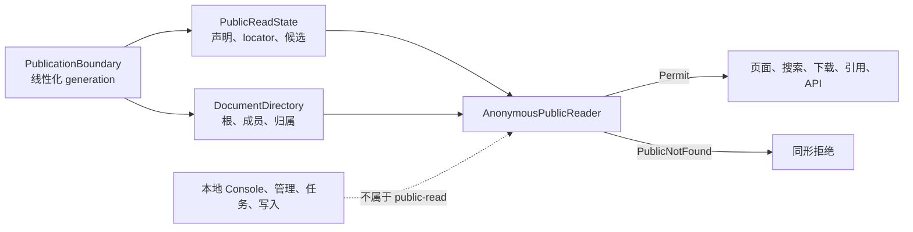

# 【文档权限】显式 public 文档的匿名只读面

- Issue: [#118](https://github.com/xforce-io/kairo/issues/118)
- 状态: Draft
- 最后更新: 2026-08-12
- 关联: [#120](https://github.com/xforce-io/kairo/issues/120)

## 1. 背景

本地 Console 可按 workspace、target、reference、form 和文件位置读取内容。文件存在、路径校验通过、曾在本地页面出现或持有旧 URL 都不能构成匿名公开授权。公开 locator 仅是定位符，不是持续授权能力。

本期只建立最小匿名只读面：**对象仅在当前唯一归属到具有当前、显式 `public` 声明的文档根，且属于该根受控内容闭包时可读。**每一请求依据当前公开事实和当前归属重判；其他情况一律拒绝。

## 2. 名词解释

| 术语 | 定义 |
| --- | --- |
| 公共部署面 | 专门暴露匿名 `public-read` HTTP 面的运行形态；不混挂本地 Console。 |
| 文档根 | 可独立持有 public 声明的受控单元；本期仅 `TargetRoot`、`ReferenceRoot`，workspace 不是根。 |
| RootKey | 服务端根身份，不得进入公共 URL、响应、日志或度量；它只表示内容归属，不表示用户 owner。 |
| canonical public locator | 不透明、全局唯一、规范化的 `p-` 前缀 URL-safe 随机标识，随机部分至少 128 bit；非路径、slug、文件名、target 路径或 reference id 的编码/哈希。 |
| 显式 public 声明 | `PublicReadState` 在已发布 generation 中将 locator 唯一绑定 RootKey，且状态精确为 `public` 的事实。缺失、空、未知、损坏、重复或不可验证均不是声明。 |
| 内容闭包 | 明确归属根的正文、form、附件、digest、prose、登记派生产物、下载字节及安全展示对象；不是目录树。 |
| 成员 | 闭包内根局部规范化的 `MemberKey`，如 `body`、`digest`、`form-0`；不是客户端路径、文件名或 reference id。 |
| 根 presentation | 固定虚拟闭包成员 `presentation`；只含逐类白名单根字段及逐成员 Permit 后的可见成员列举。 |
| 唯一归属 | generation 目录快照中对象恰好映射一个 RootKey；无根、多根、断链、重复认领和不安全解析均不满足。 |
| generation | 同时覆盖声明、locator 双向映射、根、成员和归属的单调线性化发布版本；只能完整一致地被观察。 |
| 同形拒绝 | 不能从状态、体、字段、头、长度、重定向、计数、聚合、排序、应用层查询轨迹或应用层完成类别区分非法、未公开、未归属、多义、损坏和不存在。绝对网络恒时不作不可证承诺。 |

## 3. 设计目标与非目标

### 3.1 目标

1. 只允许当前显式 `public` 根及其闭包匿名只读。
2. 缺失、异常、未归属、多义、不存在全部 fail-closed。
3. 页面、搜索、下载、引用、API 五入口共用 Reader、generation 和拒绝边界。
4. 全部 locator/member 输入（含非法）完成固定、有界、观察等价的解析与授权查询，禁止快速可区分拒绝。
5. 声明与归属以同一 generation 线性化；撤回或归属改变后下一请求使用新 generation。
6. 旧链接、路径、文件名、slug、reference id、缓存和入口差异不得扩权。
7. 无写入、运行、本机打开、SSE、workspace 总览或 glossary 读取。

### 3.2 非目标

- 身份、用户、成员、管理员、owner、团队/私有可见性、三档矩阵、接管、审批、审计、身份控制面或数据库方案；均属于 #120。
- 通过 HTTP、UI、CLI 或其他公共接口创建、撤回、编辑或管理 public 声明。
- workspace 级公开、继承公开、搜索引擎收录、逐成员 ACL，以及任何 mutation。

## 4. 能力与功能设计

### 4.1 根、闭包与根 presentation

`DocumentDirectory` 是不可枚举的只读目录职责：只回答已知根的有效性、成员、安全描述符、成员列举和唯一归属；不生成 locator、不反推 public、不生成搜索根候选。

| 根 | 有效条件 | 允许实物闭包成员 | `presentation` 安全字段 | 排除 |
| --- | --- | --- | --- | --- |
| `TargetRoot` | 受控 target 清单存在该 target；正文是 workspace 内普通 Markdown。 | `body`。 | 固定 kind `target`、声明可选 public `display_label`；仅在 `body` 获 Permit 后列出/呈现 body。 | constitution、状态/诊断、其他 target、workspace slug/topic、任意路径 Markdown、正文推导元数据。 |
| `ReferenceRoot` | manifest 可安全解析，且目录身份与受控 reference 身份一致。 | 受验证 manifest 精确列出的 form、`digest`、`prose`、明确登记产物。 | 固定 kind `reference`、声明可选 public `display_label`；仅为 Permit 成员列出固定类别及允许的 public label、媒体类型、下载名；digest/prose 使用固定 label。 | manifest 原文、location、hash、origin、source class、内部 id、绝对路径、未登记文件、其他 reference、state/诊断。 |

`presentation` 始终唯一归属其根，但不读取物理文件。字段只能来自固定值、声明 display_label 和已独立 Permit 的成员安全字段；不得从隐藏/失败成员、目录扫描、正文首行、manifest 非允许字段或 workspace 元数据推导标题、数目、排序、大小、时间、关系或存在性。

根页先判定 `presentation`，再对目录报告的每个候选 MemberKey 分别判定。列表、计数、排序、摘要、链接和关系仅从成功 Permit 形成。隐藏、失败、缺失或多义成员不影响任何可见结果；空闭包只显示允许根字段，不显示“缺少”原因或隐含数量。

form 必须精确属于 manifest、为 workspace 边界内普通对象、无符号链接逃逸且未被其他根认领。绝对 location、workspace 外路径、目录、非普通对象、多根挂载和未登记产物均拒绝；digest、prose、产物同样须受控位置、普通对象与唯一归属。

### 4.2 最小逻辑契约

| 职责 | 契约 |
| --- | --- |
| `PublicationBoundary` | 发布并读取线性化 generation；同一 generation 同时标识 `PublicReadState` 与 `DocumentDirectory` 完整快照，禁止混合观察。 |
| `PublicReadState` | generation 内权威拥有 locator→RootKey、RootKey→locator 一一映射、public 声明和公共根候选枚举。重复、逆向不一致、非规范或枚举失败均 fail-closed。 |
| `DocumentDirectory` | generation 内只负责根、presentation、闭包成员、安全描述符、成员列举和唯一归属；不保存/推导 locator。 |
| `AnonymousPublicReader` | 五入口唯一授权门，返回绑定 generation 安全描述符的 `Permit`，或原因折叠的 `PublicNotFound`。入口不得自行读内容、展开目录、查全量对象或绕过结论。 |

Permit 同时要求：canonical locator 当前唯一、声明精确 `public`、双向映射一致、根有效、目标是 presentation 或闭包成员、成员唯一归属声明根、描述符符合 representation 安全字段；其他一律 `PublicNotFound`。

每次读取：取得当前 generation 的两类快照；两者须显式为同 generation；完成输入、声明、根、成员/presentation、归属判定；Permit 前复核 generation 仍当前。改变、失配或不完整则丢弃并重试；重试次数固定有界，耗尽即 PublicNotFound。不得使用旧快照、混合结果、部分枚举或最近可得数据。Permit 绑定 generation 内安全描述符/内容版本；下一新请求必须重走此协议。

声明、映射、根有效性、成员归属及安全描述符变化都作为同一 PublicationBoundary 新 generation 发布，不能分别成为可观察授权状态。因此撤回或归属改变后的下一请求只能观察新 generation。

### 4.3 统一输入与同形拒绝

所有入口 URL 解码后将 locator/member 交同一规范化器。它对每一输入执行同一固定上限的解码、长度、字符和语法处理，且不在格式失败时返回。每个 slot 形成固定宽度 token 与内部有效性位：有效输入保留规范 token；无效、超长、截断、重复编码、空和不可解码输入替换为永远不能声明 public 的保留 decoy token。

无论输入、声明、根、成员、归属是否有效，Reader 都在当前 generation 做同一有界拒绝查询 envelope：locator state 查询、一个根查询、一个 presentation/成员查询、一个归属查询、generation 复核。缺少实体时，以固定 decoy root/member/descriptor 继续；不读正文、附件字节或对象专属元数据。仅在 envelope 完成后，以有效性位及 Permit 条件共同决定结果。不得以不同查询类别/数量、重试上限、重定向、对象读取或应用层慢路径区分非法、缺失、未公开、未归属或不存在。

同 representation 的 PublicNotFound 使用固定状态、错误格式、错误文本、安全头、无对象字段：HTML/关系为固定 404，JSON 为固定 `{"error":"not_found"}`，文件 GET/HEAD 为固定 404 空体且无对象下载名、Content-Type、长度、ETag、Last-Modified。成功与拒绝均 `Cache-Control: no-store`；响应及客户端可见日志/度量不得有 RootKey、路径、文件名、原因或对象特征。Cookie、Authorization、IP、Referer 等不构成授权输入，也不得改变结果集合或拒绝形态。

## 5. 设计思路与折衷

### 5.1 显式根声明，不从路径或 workspace 推断

选择随机 locator 绑定当前声明，放弃 workspace 公开和 slug/path/reference id 推导 URL，防止文件位置、目录和旧 URL 成为隐式授权。

### 5.2 闭包、presentation 与唯一归属

选择每个实物对象唯一映射根，根页为固定安全字段的虚拟成员；放弃递归公开目录、状态前缀匹配、任意 Markdown 路径读取及从隐藏成员汇总页面。

### 5.3 单一匿名读取门

公共路由与本地 Console 隔离，所有入口只消费 Reader Permit；引用不转授读取权。

### 5.4 generation 与同形输入优先于性能

共同 generation、Permit 前复核和固定 decoy envelope 优先于缓存与早期格式拒绝，使无效输入不成为时序/存在性/后端路径探针，撤回和归属改变不沿用旧授权。

## 6. 架构设计

### 6.1 逻辑分层

### 6.2 核心读取流程

入口将 locator/member/representation 交 Reader；Reader 取得 generation、查询该 generation 的 state 与目录、复核 generation；仅全部 Permit 条件成立时返回 `Permit(generation, safe descriptor)`，否则固定 PublicNotFound。入口只序列化该结果。

搜索根候选只能来自当前 generation 的 PublicReadState。每候选及成员先经 Reader Permit，才进入命中、摘要、筛选、计数、排序、聚合、高亮或链接。目录扫描、未声明根、失败候选不得影响结果；重复、逆向不一致、截断、异常或无法证明完整性的枚举使整个搜索 fail-closed，禁止部分结果。

### 6.3 一致性、撤回、缓存与时序

线性化点是 Permit 前 generation 复核成功。此前已发布撤回、归属/映射改变影响当前请求；其后改变影响下一请求。读取中 generation 改变必定有界重试，不能沿用状态、成员清单、索引或描述符。

页面、引用、搜索、下载数据均绑定 Permit generation；缓存仅能在请求先复核当前 generation 后使用同 generation 数据，不得跨 generation 授权。`no-store` 禁止浏览器和共享缓存服务旧响应。测试比较固定解析、固定 envelope、固定重试、零内容读取、响应观察面和应用层完成类别，不承诺控制网络物理时延。

## 7. 模块设计

本节仅定义技术无关职责，不指定源码、文件、框架或装配。

| 逻辑组件 | 职责 | 不得承担 |
| --- | --- | --- |
| Generation 发布边界 | 共同、线性化、可复核 generation；失配/耗尽即拒绝。 | 身份、owner/团队授权、声明写入。 |
| PublicReadState | locator 双向映射、声明、唯一公共候选枚举。 | 从路径/目录/旧 URL 推导 public；读取字节。 |
| DocumentDirectory | 根、presentation、成员、安全描述符、归属。 | 生成 locator、枚举可能公开根、宽松路径。 |
| Reader | 规范化、固定 envelope、generation 复核、Permit/NotFound。 | 公开内部键/原因或渲染未许可内容。 |
| 入口适配器 | 序列化 Permit 或固定拒绝。 | 直接开对象、读状态/manifest、自行授权。 |
| 呈现/关系解析 | 仅由 Permit 安全字段生成页面、搜索、链接。 | 转化本地路径、内部 id、未许可目标或隐藏成员。 |

公共只读面只含 GET/HEAD 和无数据健康检查；不含本地导航、路径读取、reference 原始读取、glossary、任务/流、管理或 mutation。

## 8. API / CLI 设计

### 8.1 运行边界

公共部署必须显式为 `public-read`，只消费既有只读 PublicReadState；无有效 state 即无可读文档。本设计不定义声明供应、创建、撤回、编辑、管理或写入接口，且不得借此引入身份、团队、owner 或审批模型。本地使用不因此获得公开能力，公共面不解释 workspace、路径、reference id、form key、本地 URL 或历史页面为输入。

### 8.2 公共路由契约

| 类别 | 方法与路径 | 契约 |
| --- | --- | --- |
| 页面 | `GET /` | 最小入口；不列 workspace、根、计数、状态、运行信息。 |
| 页面搜索 | `GET /p/search?q=...` | 静态保留路由；只用 PublicReadState 当前候选。 |
| 页面 | `GET /p/{locator}` | 读取 presentation 与逐成员 Permit 列举。 |
| 页面成员 | `GET /p/{locator}/content/{member}` | 仅呈现许可文本/图片成员。 |
| 附件 | `GET` / `HEAD /p/{locator}/file/{member}` | 每次重新判定；成功后才设置对象字段。 |
| 引用 | `GET /p/{locator}/references` | 仅独立 Permit 的目标；不转授。 |
| API | `GET /api/public/v1/documents/{locator}` | 仅 locator、允许 label、已许可成员、canonical URL；无内部 id/路径/hash/state。 |
| API 成员 | `GET /api/public/v1/documents/{locator}/members/{member}` | 仅许可文本/结构化成员安全 JSON。 |
| API 搜索 | `GET /api/public/v1/search?q=...` | 与页面搜索同 generation/候选/Permit。 |
| 健康 | `GET /healthz` | 无 workspace、任务、目录、state 细节。 |

`/p/search` 是静态保留命名空间，必须在所有 `/p/{locator}` 动态匹配前确定；动态路由不可吞掉它，亦不可依赖动态校验失败回退。`p-` locator 语法不替代此优先级。E2E 必须证明搜索与合法 locator 都可达，且搜索从不按 locator 处理。

搜索不接受 client-supplied locator/member selector、内部键、路径、slug、reference id 或物理文件名。试图提交 locator/member selector 时仍进入统一 envelope，返回固定搜索级 PublicNotFound；不得忽略、宽松解释或转为全量搜索。

### 8.3 响应与只读约束

成功入口只序列化 Permit 描述符。下载成功前不得设置对象下载名、媒体类型、长度、校验、修改时间或缓存验证头；拒绝绝不设置。搜索、引用、API 仅从成功 Permit 构造结果。

公共面不注册 POST、PUT、PATCH、DELETE、任务、流、本机打开或其他副作用请求。旧 workspace、路径、reference/form、glossary、管理、任务、本地读取 URL 无兼容别名或重定向，统一固定拒绝。

## 9. 边界考虑

| 表面 | 公共处理 | 原因 |
| --- | --- | --- |
| workspace 总览/发现 | 不公开、不搜索、不聚合。 | workspace 不是授权对象。 |
| workspace/路径读取 | 不接受、不重定向；只用 locator/member。 | 路径/文件存在不是授权。 |
| target | 仅 TargetRoot body/presentation。 | 阻断路径、状态、诊断、相邻 target。 |
| reference/form/file | 仅受控成员/file representation。 | 阻断 manifest、绝对 location、未登记文件。 |
| 引用 | 目标独立 Permit，否则无目标信息。 | 引用不转授。 |
| glossary、状态、任务、流、本机打开 | 不读、不渲染、不搜索。 | 不属唯一归属根闭包。 |
| 旧 URL、历史、下载/API 链接、缓存 | 不能授权；新请求重判。 | 撤回/归属改变下一请求生效。 |

state/目录不完整、解析失败、映射重复、根/成员多义、候选枚举异常、generation 失配/耗尽均拒绝；不得猜测、择优、返回部分搜索或沿用旧 generation。#120 只为后续关联，本 L2 不含其数据、接口、角色或迁移。

## 10. 迁移 / 兼容 / 回滚

### 10.1 启用与旧数据

public-read 不从既有 workspace、target、reference、manifest、文件存在、历史访问、slug、目录名或本地 URL 自动生成声明。新旧根须先有有效唯一 state、双向映射、共同 generation 与唯一归属，否则拒绝。不可安全解析 manifest、workspace 外 form、未知 state、不在受控清单 target、未登记产物不可公开；state 演进只有完整新 generation、唯一映射和目录验证通过时才能发布，失败/部分写入等价缺失。

### 10.2 兼容

本地行为不变。公共面不兼容旧路径 URL，且不重定向。物理承载可演进，但显式性、映射唯一性、共同 generation、固定 envelope、缺失拒绝和同形响应不得变。

### 10.3 回滚

停用后不得继续公开读取。已有事实可保留为惰性数据，但本地面不得解释为 workspace 公开，也不得靠 alias、默认 public、历史映射或重定向维持访问。generation/目录协议不兼容时拒绝全部公共读取。

## 11. 测试计划

夹具包括有效 public target/reference、同 workspace 未公开根、其他 workspace 根、文本 form、图片附件、digest、prose、下载字节、登记产物、指向未公开根引用、非法/超长/重复编码/不存在 locator/member、无归属/多重归属/重复映射。

### 11.1 S1 / 验收 S1

| 层级 | 场景与断言 |
| --- | --- |
| E2E | `/p/{locator}` 读取 public target/reference 和允许 body/form/附件/digest/prose/产物；均 GET/HEAD，无 action、上传、运行、编辑、删除、glossary、流、本机打开；经页面、搜索、下载、引用、API 五入口读取同根。 |
| E2E | `/p/search` 静态先于动态 locator；搜索与合法 `p-…` locator 都可达，搜索绝不按 locator 处理。 |
| E2E | 用 slug/path/reference id/form key、旧 URL、搜索、引用/API 旁路读未公开根；均拒绝且无状态/文件改变。 |
| Integration | 五适配器只消费 Permit；无 Permit 不读内容/元数据。absolute form、逃逸、目录、未登记文件、路径直读不入闭包。 |
| Unit | Target/Reference presentation 字段、空闭包、逐成员 Permit、隐藏成员不影响展示/计数/排序；locator、闭包、归属、引用、公共链接。 |

### 11.2 S2 / 验收 S2

| 层级 | 场景与断言 |
| --- | --- |
| E2E | 对未公开、未归属、不存在、非法、超长、重复编码 locator/member，在页面、搜索、下载、引用、API 五入口请求。搜索拒绝 client locator/member selector，非法/损坏候选不影响输出。比较状态、体、头、下载头、重定向、计数、聚合、筛选、排序、完成类别；零标题、文件名、路径、稳定 id、大小、时间、hash、角色、关系、诊断泄露。 |
| E2E | 撤回、根失效、归属改变、locator 重绑后下一次五入口均读取新 generation 并 deny；搜索无旧候选/计数。 |
| Integration | 记录所有拒绝原因/非法输入的解析、state/根/成员/归属查询、generation 复核、内容读取；envelope 类别/数量/重试上限一致且拒绝前零正文/附件读取；HTML、JSON、文件、搜索均固定序列化。 |
| Integration | 在判定前、判定中、Permit 前改变 generation；仅完整同 generation，变化则有界重试，失配/耗尽拒绝；下一请求不能观察旧/新混合、旧索引或旧 Permit。 |
| Integration | 重复 locator、重复根 locator、逆向不一致、多重归属、枚举截断/异常/不完整时，单根读取和搜索 fail-closed，搜索无部分结果。 |
| Unit | state 缺失/空/未知/损坏/非 public/重复；无根/多根/逃逸/无效 form/member；decoy；拒绝无 descriptor/metadata；搜索先 Permit 过滤再计数/聚合。 |

### 11.3 追踪矩阵

| Story | 不变量 | E2E | Integration | Unit |
| --- | --- | --- | --- | --- |
| S1 | 显式 public 根/闭包、安全 presentation、五入口、只读 | 闭环、静态搜索、旁路 | 仅 Reader、对象映射 | 闭包/presentation/引用/路由 |
| S2 | 同形拒绝、非法 envelope、共同 generation、唯一映射/归属、无缓存旁路 | 五入口矩阵；变化后下一请求 deny | 查询轨迹、generation、缓存、枚举、serializer | deny、decoy、冲突、搜索预过滤 |

测试不得只看按钮或内部调用；必须验证响应观察面、查询轨迹、generation 线性化以及拒绝时零读/零写。

## 12. 开放问题 / 决策记录

- **决策：根只限 target/reference。** workspace、glossary、状态、dashboard、任务无单根归属。
- **决策：locator 随机不透明，非 capability。** 每请求仍查当前 state/目录 generation。
- **决策：共同 generation 是安全边界。** 声明、映射、归属仅能完整同 generation 观察；失配/耗尽拒绝。
- **决策：PublicReadState 独占 locator 双向映射和公共候选。** Directory 仅根/成员/归属；映射/枚举失败不部分放行。
- **决策：presentation 是虚拟闭包成员。** 仅白名单根字段和 Permit 输出。
- **决策：静态 `/p/search` 优先。** 是公共协议，并 E2E 验证。
- **决策：固定 envelope 与 no-store。** 非法输入同样受控查询；撤回安全优先缓存性能。
- **开放问题：public 事实供应。** 非 #118 范围，且不得引入身份、团队、owner、审批或写入系统。
- **开放问题：新增产物。** 必须先定义 MemberKey、归属、允许字段、generation 关系和 S1/S2 测试，不能自动目录公开。

## 13. 关联

- Issue [#118](https://github.com/xforce-io/kairo/issues/118)：显式 public 文档根与内容闭包匿名只读。
- Issue [#120](https://github.com/xforce-io/kairo/issues/120)：后续身份与团队权限；本 L2 不含其设计或实现。
- 批准 L1 的“文档与内容闭包边界”“拒绝与无泄露边界”及五入口测试意图，由本 L2 在严格 anonymous public-only 范围内落实。
