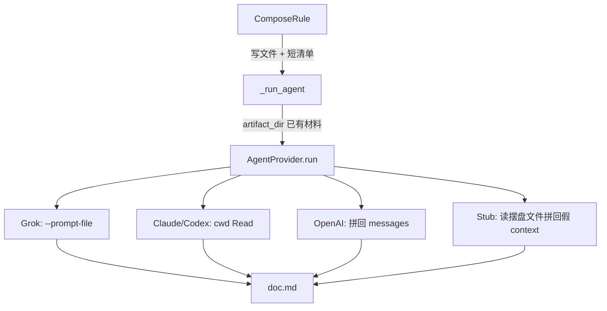

# 【compose】把当前文档与 digest 按文件交给 agent，停止全文内联进 prompt

- Issue: #126
- 状态: Draft
- 最后更新: 2026-08-21

## 1. 背景

成熟 workspace 再 fold 一条短会议时，`kairo run` 卡在 compose 而非 ASR。ComposeRule 把旧 `understanding.md`、上游全文、本轮 Δ digest **全部内联进 `AgentConfig.context`**；GrokProvider 再把整份 prompt 塞进 `grok -p` 的 argv。能源梳理实测：30 分钟音频转写+digest 约数分钟完成；compose 在约 180KB 旧文 + 85KB Δ 上 600s 必挂，1800s 仍挂。残留 `_prompt.md` 339KB 实为 assessment：旧评估 + 整份 understanding + 同样 3 条 digest。

五家 backend 收到的是同一坨字符串。Claude/Codex 能 Read，但 `--add-dir` 只给 corpus；Grok 已有 `--prompt-file` 仍走 argv；OpenAI 无工具，长文已空响应。Issue #126。

## 2. 名词解释

| 术语 | 含义 |
|---|---|
| **摆盘** | 外壳把 compose 主材料写成 `artifact_dir` 内的固定相对路径，不把正文塞进 prompt 字符串 |
| **清单 / inventory** | 交给 agent 的短 `context`：任务说明 + 文件路径 + 来源目录表，不含旧文/digest 正文 |
| **主材料** | 当前 target 文档、`depends_on` 上游文档、本轮 Δ digest。不含 corpus（仍走 #13 `read_dirs`） |

## 3. 设计目标与非目标

- **目标**：
  - compose 主材料按文件出现在 `artifact_dir`；prompt/context 不含其正文。
  - Grok 用 `--prompt-file`，文档正文不进 argv。
  - Claude/Codex 对摆盘文件预授 Read；不授权整个 workspace。
  - OpenAI 在 provider 内把摆盘文件拼回 messages，不假装 Read。
  - stub 仍能从摆盘文件把 digest 关键句写入产物，既有 compose 测绿。
- **非目标**：
  - 不改「必须输出完整全文」验收、骤缩护栏、溯源校验。
  - assessment 不再 fold Δ digest（另开）。
  - 章节级生成/拼接（另开）。
  - 超时可配（另开）；不把默认 600s 改成 1 小时。
  - digest 阶段 transcript 指针化。
  - 让 agent 自己搜 workspace 根目录。

## 4. 能力与功能设计

N/A — 无新用户可见页面。`kairo step` / `run` 行为不变，只改交给 LLM 的装货方式。成功时两层文档仍是完整全文。

### 4.1 UI / UX

N/A — 无页面。失败形态沿用既有 `provider-failed` / 空响应，不新增 reason。

## 5. 设计思路与折衷

候选：

1. **只改 Grok `--prompt-file`**，规则层继续内联。放弃：Claude/Codex 下次同样慢；OpenAI 仍吃 300KB。
2. **让 agent 自己找 `understanding.md`**。放弃：cwd 是临时目录，找不到或读到 stale/手改。
3. **assessment 不再 fold digest + 章节生成**。放弃：产品决策另开；本 issue 只修装货。
4. **规则层统一摆盘，provider 只运货**（选择）。与 #13 corpus「列文件 + 按需 Read」同构，覆盖当前文档与 Δ。

为何不选更简单：只加长超时掩盖问题；只改 grok argv 仍把 300KB 交给所有 backend。

## 6. 架构设计

### 6.1 逻辑分层

ComposeRule 负责「摆什么」；provider 负责「怎么读」。禁止各 provider 自己发明路径。

### 6.2 核心业务流程

主路径：discover Δ → 写 `current.md` / `upstream/<name>` / `delta/<digest 相对路径>` → `context` = 清单 + 来源目录 → provider 读文件 → 写 `doc.md` → 既有骤缩/溯源校验 → 记账 folded。

失败路径：provider 抛错 → 不覆盖旧文，`provider-failed`（同 #98）。OpenAI 空响应仍抛错，不把「请 Read current.md」交给无工具 endpoint。

## 7. 模块设计

| 模块 | 契约 |
|---|---|
| `ComposeRule` | 主材料写入 `artifact_dir`；`context` 只含清单与 `[来源目录]` 表；`·观测` 标在清单行 |
| `_run_agent` | 可选 `materials: relpath → text`，写入后再 `provider.run`；拒绝 `..` 逃出目录 |
| `GrokProvider` | `--prompt-file _prompt.md`；有材料时 `--tools Read --always-approve`；不把正文放 `-p`；`read_dirs` 仍不伪造 `--add-dir` |
| `ClaudeCodeProvider` | stdin 仍是短 persona+context；cwd 有材料或 `read_dirs` 时预授 Read；`--add-dir` 仍只给 corpus |
| `CodexProvider` | 短 prompt + 已有 cwd `workspace-write` |
| `OpenAICompatibleProvider` | 无材料：行为不变；有材料：user message 附加文件正文 |
| `StubProvider` | compose 时扫描摆盘文件，拼进既有 stub 解析，保持幂等（产物仍只依赖 persona+材料内容+清单，不依赖绝对路径） |

## 8. API / CLI 设计

无新用户 CLI 子命令。内部：

`_run_agent(..., materials: dict[str, str] | None = None)`

摆盘相对路径（写死，测试可断言）：

| 文件 | 内容 |
|---|---|
| `current.md` | 当前 target 正文；从空文档写则不建此文件 |
| `upstream/<filename>` | `depends_on` 文档全文 |
| `delta/references/<id>/digest.md` | 该条 Δ digest，首行保留 `[S-… \| path ·观测?]` 头 |

成功：agent 产出完整 `doc.md`。失败：不写 target、记诊断。兼容：digest/normalize 不传 `materials`，仍内联正文。

## 9. 边界考虑

- 假设：CLI agent 能 Read cwd；Grok `--prompt-file` / `--tools` 可用（本机已验证有这些旗标）。
- 错误：路径逃逸拒绝；OpenAI 空响应仍 `RuntimeError`。
- 并发：沿用既有单 workspace step，不新增锁。
- 权限：材料不出 `artifact_dir`；corpus 仍只经 `read_dirs`。
- 性能：argv/启动成本下降；模型仍须读完旧文才能吐全文。
- 安全：不把 workspace 根交给 grok/claude。

## 10. 迁移 / 兼容 / 回滚

N/A — 无数据格式变更。旧 workspace 下次 compose 即走新装货。回滚代码即可；已生成文档不改写。

## 11. 测试计划

- **E2E**：对上 S1–S5（见 issue #126 验收）。环境不够跑真 grok 长文时，用 fake runner + 摆盘文件断言 args/messages；能源梳理量级作为手工限制写在 issue 复现，不假装 CI 跑通 1800s compose。
- **Integration**：ComposeRule 后 `config.context` 无 digest/旧文正文；`artifact_dir` 有对应文件；有 corpus 时清单含 `·观测`、corpus 原文仍不进 context。
- **Unit**：Grok `--prompt-file` 且正文不在 argv；无材料时 Claude 仍不预授工具；有材料时 Claude 预授 Read 且无 workspace 根；OpenAI 无材料 messages 不变、有材料则 user 含文件正文；Stub 从 `delta/…` 得到纪要句。

## 12. 开放问题 / 决策记录

- **决策**：不把 `materials` 做成 provider 协议新类型；`_run_agent` 写盘 + 目录扫描即可。OpenAI/Grok 认 cwd 文件，避免五家签名分叉。
- **决策**：Δ 文件保留 `[S-… \| path]` 头，stub 沿用 `_digest_bodies_from_context`。
- **开放**：Grok 内置工具正式名若不是 `Read`，以 fake 测旗标存在为准；真 CLI 用 `--always-approve` 兜住。

## 13. 关联

- Issue #126 · L1 comment · #61 · #13 · #4 · #105
- 模块：`src/kairo/rules.py`、`src/kairo/provider.py`
