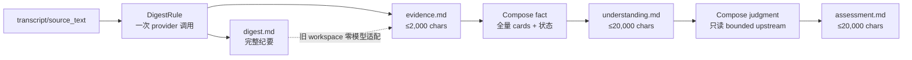

# 【compose】Digest 同次产出定长证据卡并重建有界主题文档

- Issue: #128
- 状态: Approved
- 最后更新: 2026-08-22

## 1. 背景

#126 解决了 compose 大材料进入 argv 的传输问题，但能源梳理在 10 条 reference 时仍需读取 265–343KB、输出 91–188KB，单层 compose 约 13–16 分钟。第一版 #128 曾尝试在 digest 之后逐条调用模型生成 evidence card；真实 Grok 对单篇 10,107 字符 digest 生成一张卡耗时 272.5 秒，证明“每条 reference 再加一次模型调用”同样不可持续。最终方案把证据卡并入原有 Digest provider 调用：一次回答同时给出完整 digest 与定长 evidence，Compose 只读取已经存在的 evidence。

## 2. 名词解释

- **digest**：从 transcript / source_text 生成的完整高密度纪要，保留细节并作为可回看的事实源。
- **evidence**：与 digest 同一次模型调用产生的定长元信息，存于 `references/<id>/evidence.md`，包含稳定来源 ID、标题、日期、摘要、关键事实、决策、开放问题、digest 路径和哈希。
- **legacy-derived evidence**：旧 workspace 只有 digest、没有 evidence 时，由外壳零模型生成的兼容摘录；明确标记 `legacy-derived`，完整 digest 保持不动。
- **卡片状态**：相对某个 target 从 folded 账本与当前 evidence hash 推导的 `NEW` / `CHANGED` / `FOLDED`，不写回 evidence 文件。
- **有界目标**：不超过 20,000 Unicode 字符的 understanding / assessment 当前综合视图。

## 3. 设计目标与非目标

- **目标**：每条新 reference 仍只有原有的一次 Digest 模型调用，同时产出 digest 和 ≤2,000 字符 evidence。
- **目标**：Compose 不读取完整 digest、raw source 或旧目标全文，只消费 evidence；assessment 只消费有界 understanding。
- **目标**：失败不写半套 digest/evidence，也不覆盖成功目标或推进 folded。
- **目标**：旧 workspace 无需模型调用即可补齐带明确降级标记的 evidence。
- **非目标**：目标文档无损保留历史百科；向量库/RAG；agent 搜索 workspace；章节级并行；为旧 digest 做高质量 LLM 批量回填。

## 4. 能力与功能设计

Digest provider 必须按固定分隔协议返回两个块：`KAIRO_EVIDENCE` 块严格含摘要、关键事实、决策、开放问题，`KAIRO_DIGEST` 块保留完整高密度纪要。DigestRule 解析并校验整套响应，外壳补齐稳定 ID、标题、日期、来源路径、digest hash 与生成方式后写 `evidence.md`。任一块缺失、evidence 缺节或超预算时，两份产物都不更新。

Compose 事实层摆盘全部 `evidence.md`，按 target 账本加状态标记；标记只引导注意力，不改变证据内容。判断层只摆盘最新 understanding，不授予 cards、digest 或 corpus 读取权限。两层输出均执行 20,000 字符预算、全来源覆盖与现有 provenance 校验。

### 4.1 UI / UX

不新增命令。`kairo run` / `step` 仍推进整条链；文件系统中新增 `evidence.md`，完整细节继续看 `digest.md`。status 的 folded 数量仍表示目标覆盖的 stream reference 数量。

## 5. 设计思路与折衷

选择“一次 Digest 双产物”，而不是额外 EvidenceCardRule provider 调用。它让新材料在进入 Compose 前已经是元信息，且稳态模型调用数不增加。

选择把 evidence 单独写文件，而不是让 Compose 每次从 digest 动态摘要。这样 Compose 的输入、预算、哈希和状态都可直接检查，且元信息生成责任明确归 Digest 阶段。

旧 digest 的兼容 adapter 只取既有纪要的有界开头摘录，其余结构写 N/A 并标记 `legacy-derived`。这比逐条或批量调用模型更快、更简单，但有损；完整 digest 保留，用户可 `retry-ref` 通过新 Digest 契约重产高质量 evidence。

## 6. 架构设计

### 6.1 逻辑分层

规则顺序为 Transform → Normalize → Digest → LegacyEvidence → Compose。LegacyEvidence 不调用 provider，只为缺失或与 digest hash 不一致的 evidence 提供兼容产物。

### 6.2 核心业务流程

新材料主路径：DigestRule 读取正文和附件，单次调用 provider，解析双块，校验 evidence 结构与预算，然后写 digest/evidence 及两个 ProductState。ComposeRule 只有在全部 fold digest 都有当前成功 evidence 时才开放事实 target；事实 target 成功覆盖当前 cards 后，判断 target 才开放。

旧材料路径：已有 digest 没有当前 evidence 时，LegacyEvidenceRule 从 digest 生成 `legacy-derived` evidence，不运行模型；随后进入同一 Compose 路径。

失败路径：Digest provider 失败或双块无效时保留上一对产物；legacy adapter 无法满足预算时阻塞该 evidence；Compose provider 失败、超预算、来源不全或 provenance 无效时保留上一目标和 folded。

## 7. 模块设计

- `models.py`：保留完整 digest 方法论，并声明 evidence 四节内容协议。
- `rules.py`：DigestRule 负责一次调用双产物；LegacyEvidenceRule 只做零模型兼容；ComposeRule 只摆盘 evidence / bounded upstream。
- `engine.py`：在 Digest 与 Compose 间插入无 provider 的 LegacyEvidenceRule；删除 reference 时清理 evidence 与 folded。
- `provider.py`：compose 扫描 `cards/`；StubProvider 支持 Digest 双块协议。
- `provenance.py`：来源身份仍由 digest path 派生，evidence 不建立第二套 S-id。

## 8. API / CLI 设计

不新增 CLI：

- `kairo run` / `step`：新 Digest 同次写 `digest.md` 与 `evidence.md`；随后 bounded compose。
- `kairo retry-ref <id>`：清理派生产物后，以新双产物协议重建高质量 digest/evidence。
- `kairo re-step [target]`：复用 evidence 重建有界目标，不重跑未变化 Digest。
- `kairo rm-ref`：删除 digest/evidence 产品和 target 对应 evidence folded 键。

## 9. 边界考虑

- 预算按 Python `len(str)` 计 Unicode code point；evidence 预算包含外壳生成的 header。
- evidence 四节缺一不可，无内容写 N/A。
- ID、标题、日期、来源、hash、生成方式由外壳写入，不信任模型填写。
- 所有 digest 的当前 evidence 未齐时，Compose 不允许用部分集合运行。
- corpus 仍仅供事实层按现有协议校正；判断层只读 bounded understanding。
- 手改目标仍先进入 `manual-edit`，不静默覆盖。
- card 数量仍线性增长；本轮验收几十篇，数百篇后的归档另议。
- legacy adapter 是明确的有损兼容，不能伪装成 LLM 高质量 evidence。

## 10. 迁移 / 兼容 / 回滚

旧 state 没有 evidence ProductState 时，LegacyEvidenceRule 根据现有 digest 即时写 `evidence.md`；digest 文件、manifest 与旧目标在新目标成功前都不改。首次 bounded compose 成功后，TargetState.folded 从旧 digest path→hash 替换为 evidence path→hash，并刷新 major baseline。

回滚旧版本时，新增 evidence 是可删派生产物；digest 和 raw source 未改变。旧版本可按原语义继续使用 digest 重建目标。

## 11. 测试计划

- **E2E**：新 reference 使用可控 provider，断言只调用一次 Digest 且同时写出完整 digest 与 ≤2,000 字符 evidence；随后两层目标 ≤20,000 字符并收敛。
- **E2E**：50 条已有 digest 通过 legacy adapter 零 provider 调用补 evidence，Compose 不读取完整 digest/旧目标，最终无 stale/blocked。
- **E2E**：真实能源梳理副本迁移，记录 legacy evidence 数量、Compose 材料大小、目标大小与耗时；正式 workspace 不自动覆盖。
- **Integration**：双块解析失败/超预算不覆盖旧产物；digest hash 变化使 evidence/target 标记 CHANGED；判断层只获得 bounded upstream。
- **Unit**：header、日期、hash、四节、预算、legacy 标记、门禁、来源全集、删除和失败回滚。

## 12. 开放问题 / 决策记录

- 决策：Evidence 在 Digest 同一次 provider 调用产生，不新增模型调用。
- 决策：旧 digest 使用零模型 `legacy-derived` adapter；高质量回填通过显式 `retry-ref`。
- 决策：第一版预算固定为 evidence 2,000 / target 20,000 字符，不提前公开配置。

## 13. 关联

- Issue #128
- 设计修订：https://github.com/xforce-io/kairo/issues/128#issuecomment-5378336819
- 前置 Issue #126
- 前置 PR #127
- `src/kairo/rules.py`
- `src/kairo/engine.py`
- `src/kairo/provider.py`
