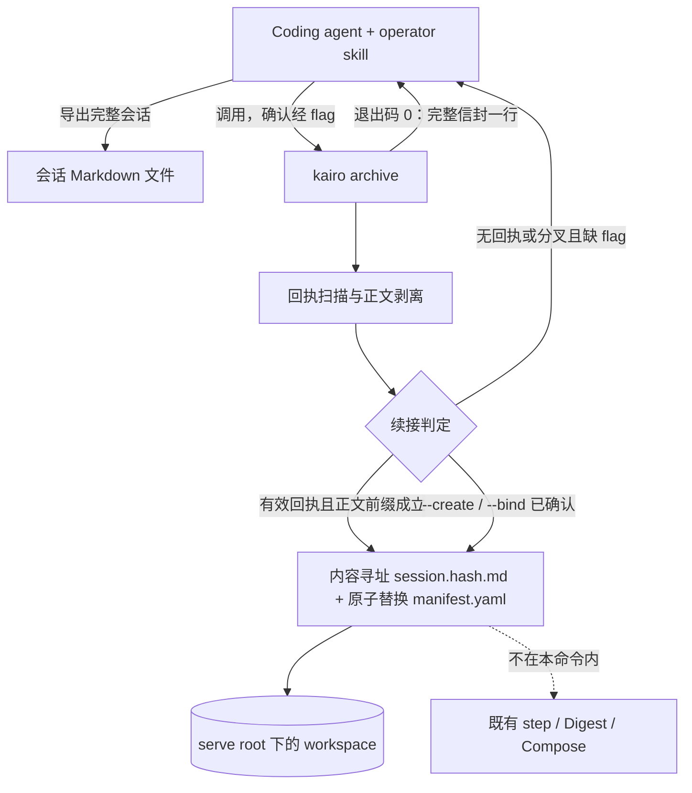

# 【归档】将 coding agent 会话归档到 Kairo 并持续更新

- Issue: [#136](https://github.com/xforce-io/kairo/issues/136)
- 状态: Implemented
- 最后更新: 2026-08-25（吸收评审：manifest 单点提交；顶层唯一信封；compaction 不自动续接）

## 1. 背景

Coding agent 会话里的澄清、取舍、排障与验证结果，今天只留在 Codex / Claude / Grok 等宿主线程里。会话结束或换宿主后，这些成果无法作为 Kairo workspace 中可治理的 reference 被后续人或 agent 续用。

[#136](https://github.com/xforce-io/kairo/issues/136) 要求：用户说「archive 到 Kairo」时，把**完整会话 Markdown**沉淀到指定 workspace；同一会话后续归档必须更新同一份知识载体，而不是堆出一串重复 reference。跨宿主 MVP 不能依赖各家线程 ID 或原生桥接，因此绑定关系必须写进会话正文，随 Markdown 一起被导出。

本 L2 把 L1 的回执协议、首次确认和分叉停手落实为 CLI / 存储 / skill 契约。归档走既有 stream reference + 单一 `source_text` form，不另建知识库，也不在归档时调用 LLM。

## 2. 名词解释

| 术语 | 定义 |
| --- | --- |
| **会话 Markdown** | 宿主持久化的原始会话导出（或与之逐字等价的 Markdown）。是本能力的唯一输入。不得用 compaction / 摘要重建冒充完整会话。不含宿主线程 ID。 |
| **回执** | 一次**成功**归档后，stdout 中那条固定信封行（见 §8.2）。agent 必须在本轮最终回复里原样保留。 |
| **回执信封** | 顶层独占一行的 canonical envelope。只有这一种包装；见 §8.2。 |
| **会话正文** | 会话 Markdown 换行规范为 `\n` 后，去掉全部**顶层、语法完整**的回执信封，得到的文本。这是写入 canonical form 的内容。 |
| **归档绑定** | 写在 reference manifest 上的稳定身份：`archive.key` / `version` / `form_index` / `body_sha256`。 |
| **canonical form** | 该归档 reference 中唯一承载会话正文的 `source_text` form。正文文件按 `body_sha256` 内容寻址；`forms` 长度恒为 1，`form_index` 恒为 0。可见版本以 `manifest.yaml` 为唯一提交点。 |
| **续接** | 找到最后一个有效回执，且当前会话正文以磁盘上 **manifest 所指向** 的 canonical 正文为前缀；此时提交新的正文文件并切换 manifest。 |
| **分叉** | 存在可解析且 ID 完整匹配的最后回执，但当前会话正文**不是**已存正文的前缀。包括回执前被改写、会话被嫁接、以及历史被 compaction 截断/改写。 |

## 3. 设计目标与非目标

- **目标**：
  - 提供 `kairo archive`：从会话 Markdown 写入或更新指定 workspace 中的一份 canonical form。
  - 首次写入与无法可靠续接时，必须先有用户确认的 workspace / 新建或既有归档选择；CLI 不得猜测。
  - 成功时恰好输出 1 条固定回执信封；仅在 `manifest.yaml` 原子提交成功后才输出。
  - 同一会话连续成功归档后，对应 reference 的 canonical form 数量保持为 1。
  - 仓库内 operator skill 规定：如何调用 CLI、如何把信封原样写回、如何对待 compaction、何时必须停下来问人。
- **非目标**：
  - 读取或依赖 Codex / Claude / Grok 等宿主线程 ID、会话 URL 或原生桥接。
  - 自动推断 workspace，或在分叉 / 无回执 / compaction 后静默绑定到某条既有归档。
  - 归档过程中调用 LLM、改写结论、或自动 `step` / `run` / `re-step`。digest 与 understanding/assessment 仍走既有调和循环。
  - 强制宿主尊重 `preserve="verbatim"`；该属性只是 skill 侧 best-effort 提示，不是运行时保证。
  - Web Console 归档入口、把任意既有非归档 reference 就地改成归档、跨 workspace 搬迁归档。
  - 增量 digest、会话正文压缩、或把回执做成密码学能力令牌。

## 4. 能力与功能设计

用户对 coding agent 说「archive 到 Kairo」。agent 导出当前完整会话 Markdown 到本地文件，调用 `kairo archive`。Kairo 只根据该文件与显式 flag 决定：续接更新、新建、或停手待选。

### 4.1 UI / UX

N/A。本 issue 不改 Web 页面。交互面是 CLI 与已安装的 operator skill。

人与 agent 看到的三种结果：

| 结果 | 何时 | 观察面 |
| --- | --- | --- |
| 成功 | 续接成立并写盘，或用户已用 flag 明确新建 / 绑定且写盘成功 | 退出码 0；stdout 恰好 1 条回执（`--json` 时见 §8.3） |
| 待选择 | 无有效回执、分叉、或缺少 `--workspace` / `--create` / `--bind` | 退出码 2；**不写盘**；stdout 为机器可读选择清单 |
| 错误 | 文件不可读、workspace 不存在、绑定目标不合法、写盘失败 | 退出码 1；**不输出回执**；不把半成品绑定当成成功 |

skill 必须：

1. 把「archive 到 Kairo」映射为导出完整 Markdown + 调用 `kairo archive`，而不是 `kairo add`。
2. 输入必须是**宿主保存的原始 transcript**（或其逐字导出）。上下文已被 compaction 时，不得用模型回忆/摘要冒充完整会话去自动续接。
3. 退出码 0：把 stdout（或 `--json` 的 `receipt`）整行信封原样写入本轮最终回复，且独占一行、位于顶层，不得包进代码围栏或引用块。
4. 在宿主的 context compaction / 记忆压缩中，逐字保留整个信封（`preserve="verbatim"` 即此意图）。这只是 best-effort：宿主仍可能改写或丢掉信封。
5. 退出码 2：把清单转述给人，问清 workspace 以及新建还是绑定哪条既有归档，再用 flag 重试。**禁止**自行挑选。回执丢失或历史被压缩导致前缀失败时，同样停手，走 `--bind` / `--create`。
6. 退出码 1：转述 stderr 要点，不编造已归档。
7. 归档成功后**不**自动 `step`。若用户要求把该会话折进 understanding/assessment，须按既有铁律单独确认后再 `step`。
8. 用户确认写入前，可列出 `kairo list --json` 的 workspace 作为建议；建议不是选择。

## 5. 设计思路与折衷

### 5.1 选择完整 Markdown + 文内回执，放弃宿主元数据

选择：跨 agent 的唯一输入是完整会话 Markdown；绑定写在成功回执里，随对话被下一次导出带走。

放弃：宿主线程 ID / 插件桥。跨 Codex、Claude、Grok 的 MVP 不能假设这些标识可导出或可移植；把身份放进正文，换宿主只要能导出 Markdown 就能续接。

### 5.2 选择一条 stream reference 的单一 form，放弃每次 `add` 新 form

选择：一个归档会话 = 一条 `class: stream` 的 reference + 恰好一个 canonical `source_text` form。正文落在内容寻址文件 `session.<body_sha256>.md`；再次归档时 **forms 长度仍为 1**，只把该 form 的 `location` / `hash` 切到新文件。

放弃：`kairo add --to` 追加新 form。既有 `add` 按 location 去重追加，不能表达「同一份会话的新版本」；多 form 会破坏 S2「form 数保持为 1」，也会让 Digest 把历史版本当多源拼接。

放弃：新建平行「归档对象」存储。会话是观测，应进入既有 stream → digest → compose 链路；归档只负责把正文登记为可 fold 的原料。

放弃：固定覆盖同一个 `session.md`。同一路径无法与 `manifest.yaml` 一起原子提交，见 §5.6。

### 5.3 选择「去信封后的正文前缀」检测分叉，放弃对活文档做精确前缀哈希

L1 要求识别「回执前历史分叉」。若把回执在导出文件中的字节前缀直接哈希，只要 agent 在回执前多写一句「已归档到 foo」，或宿主给消息加上 `Assistant:` 标题，第二次归档就会被误判为分叉。

选择：

1. 只识别顶层独占一行、语法完整的 canonical 信封；**绑定身份**用信封内字段与磁盘 manifest 精确比对。
2. **分叉**用会话正文（只去掉顶层完整信封）是否以 **manifest 当前指向的** canonical 正文为前缀来判定。
3. 回执仍携带本次写入后的 `body_sha256`，作为与该正文文件对照的精确 ID。

这样「回执后的增量」是当前正文相对已存正文多出来的后缀；回执前被改写、或 compaction 改了旧段落，前缀失败。agent 的归档附言若出现在信封之后，算增量，不破坏续接。

放弃：归档时用 LLM「归纳」增量写成另一份结论稿。那会绕过 digest、把「原料」和「记忆」混在 form 里，且无法与既有 Compose 增量语义对齐。本 issue 的「截至当前的完整结论」是指 canonical 正文覆盖到当前会话，真正的纪要/判断仍由后续 `step` 产生。

### 5.4 选择显式 flag 确认，放弃 TTY confirm

coding agent 调 CLI 通常没有可靠的交互式 TTY。L1 的「用户确认」发生在**对话里**：人选定后，agent 带 `--workspace` / `--create` / `--bind` 再调用。

选择：缺确认就退出码 2 并给出清单；绝不 `typer.confirm`。cwd 若本身是某个 workspace，只作为清单里的 `cwd: true` 提示，仍不能省略 `--workspace`。

放弃：无回执时默认写入最近用过的 workspace，或按 topic 语义匹配。这正是 L1 禁止的猜测。

### 5.5 选择归档与 `step` 解耦

选择：`archive` 等价于「登记/覆盖一份 stream 原料」，不跑 ASR/Digest/Compose，不烧综合 token。form hash 变化后，下一次用户确认的 `step` 会按既有规则重产 digest 并 fold。

放弃：归档成功即自动 `step`。这与 operator skill「写/算必须显式确认」冲突，也会让一次 archive 的副作用无法预估。

### 5.6 选择不可变正文 + manifest 单点提交，放弃双文件原地覆盖

POSIX 不能把「改正文」和「改 manifest」变成一次原子操作。若先替换 `session.md` 再写 manifest，进程在两步之间退出，磁盘会留下「新正文 + 旧 version/hash」。此时：

- 重试可能按旧绑定发出与实际正文不符的旧回执；
- `step` 会经 `forms[].location` 读到已报告失败的那次更新。

选择（提交顺序固定）：

1. 把新正文写入 `references/<id>/session.<body_sha256>.md`（已存在且字节相同则可跳过）。此文件不可变，不以同一路径覆盖旧正文。
2. 在临时文件中写好完整 `manifest.yaml`：`forms` 仍恰好一项，`form_index` 仍为 0，`location` 指向新正文，`archive.version` / `body_sha256` / `forms[0].hash` 与之一致。
3. 用 `os.replace()` 把临时文件替换为 `manifest.yaml`。**这一步是唯一提交点。**
4. 仅在第 3 步成功后打印回执。
5. 旧 `session.<旧 sha>.md` 与未提交的临时 manifest 只做 best-effort 删除；清理失败不撤销已提交归档，也不构成失败。

崩溃或异常发生在第 3 步之前：旧 manifest 仍指向旧正文，归档完整可读；新正文文件至多是未引用孤儿。不把半成品当成成功，也不发出新回执。

放弃：先 `os.replace` 正文再写 manifest，或依赖「manifest 没改就重试安全」——在共享同一 `session.md` 路径时该命题不成立。

### 5.7 选择唯一顶层信封，放弃宽包装与从代码块中剥离

L1 允许「Markdown 包装、空白和换行」。宽容忍（围栏、行内代码、HTML 注释，以及删除所有形似 `KAIRO_ARCHIVE/1` 的行）会把会话里的回执示例、损坏行和引用块当成协议吃掉，正文失真。

选择只定义一种顶层、单行 canonical envelope（§8.2）。fenced code、inline code、引用块、缩进行、属性不一致或字段不合法的行，全部当普通正文保留。

LLM context compaction 可能改写或丢掉信封，也可能压缩回执前的历史。skill 要求逐字保留信封，但这是 best-effort，不是宿主保证。自动续接只接受原始 transcript 上的严格前缀；回执丢失或历史被压缩 → 退出码 2，由人 `--bind` / `--create`，不静默续接。

放弃：在围栏/注释里「尽量识别」回执。那会扩大误删面，且对 compaction 没有额外帮助。

## 6. 架构设计

### 6.1 逻辑分层



依赖方向：CLI → 归档服务（解析、判定、写 form）→ `Workspace` / `Manifest`。不修改 `step` 调度，不新增 pipeline 规则。Digest 仍按 `body_roles` 读取 `source_text`；canonical form 一旦 hash 变化，即成为后续 `step` 的 Δ。

### 6.2 核心业务流程

**主路径 A — 首次归档（S1）**

1. 输入无有效回执。
2. 若缺少 `--workspace`：退出码 2，`reason=need-workspace`，列出 serve root 下一层 workspace（含可选 `cwd` 标记）。不写盘。
3. 若有 `--workspace` 但既无 `--create` 也无 `--bind`：退出码 2，`reason=need-bind`，列出该 workspace 中已有归档（`manifest.archive` 非空者）。不写盘。
4. `--workspace SLUG --create`：在该 workspace 新建 stream reference，写入 `session.<body_sha256>.md`，再原子提交 `manifest.yaml`（`version=1`，forms 长度 1）。stdout 为完整信封。
5. agent 把该信封作为最终回复的顶层独占行原样保留。

**主路径 B — 同会话续接（S2）**

1. 从文件末尾向前找到最后一个**有效**回执（§8.2）。
2. 回执中的 key / workspace / reference / form_index / version / body_sha256 与磁盘精确一致。
3. 当前会话正文以磁盘 canonical 正文为前缀（换行规范化后）。
4. 若正文与磁盘完全相同：不改 manifest、不升 version，仍退出码 0，stdout 为**当前**信封（幂等重试）。
5. 若正文更长：按 §5.6 写入新的 `session.<new sha>.md`，再 `os.replace` 提交 manifest；`forms` 长度不变，`form_index` 仍为 0；stdout 为新信封。
6. manifest 提交前任何失败：退出码 1，不输出新回执；对外可见的仍是旧归档。

**失败路径 C — 无法可靠续接（S3）**

| 条件 | 行为 |
| --- | --- |
| 没有任何可解析回执 | 同首次：需 `--workspace` 且 `--create` 或 `--bind` |
| 有回执外形但 ID 与磁盘不一致 | 该条**无效**，继续向前找；全部无效则同首次 |
| 最后一条有效，但正文不是已存正文的前缀（含 compaction 截断/改写旧文） | `reason=fork`，退出码 2，不写盘；需 `--create` 或 `--bind` |
| 回执信封丢失、只剩 compaction 摘要、或无法取得原始 transcript | 同无有效回执：不得自动续接 |
| `--create` 与 `--bind` 同时出现 | 退出码 1，不写盘 |
| `--bind REF` 指向不存在、非本 workspace、或非归档 reference | 退出码 1，不写盘 |
| `--workspace` 与有效回执中的 workspace 不一致且未显式 `--create`/`--bind` | 退出码 1，不写盘（防止把续接打到错误 topic） |

`--create` 在分叉或无回执时**总是新建**一条归档，忽略文中旧回执的绑定。`--bind` 表示人确认「就是这条既有归档」：覆盖其 canonical form，按成功更新升 version，发出新回执；旧回执不必再与前缀成立。

## 7. 模块设计

| 模块 | 职责 | 不做什么 |
| --- | --- | --- |
| 回执编解码 | 序列化唯一顶层信封；从后向前找有效回执；只剥离顶层完整信封；换行规范化 | 从围栏/引用/非法行里「抢救」回执；模糊匹配 ID |
| 归档判定 | 续接 / 待选择 / 错误 三态；组装退出码 2 的清单 | 在 compaction 或前缀失败时自动续接 |
| 归档写入 | 写不可变 `session.<sha>.md`；`os.replace` 提交 manifest；best-effort 清理旧正文 | 调用 provider；改 targets；自动 step；把未提交正文当成已归档 |
| `kairo archive` CLI | 解析参数、读文件或 stdin、按 §8 打印 | TTY 确认；在任意 cwd 当 workspace 误写入 |
| operator skill | 触发词、原始 transcript 导出、flag 确认、信封原样回写、compaction 逐字保留（best-effort）、禁止自动 step | 宿主插件、私有 API、依赖宿主保证 compaction 存活 |

`kairo add` / Web attach **不**实现本协议。往归档 reference 用 `add --to` 追加其它 form 不在本期禁止于引擎层，但归档命令自身永不追加 form；S2 定量只约束归档命令维护的 canonical form 计数为 1。

Manifest 兼容：旧 reference 无 `archive` 键视为非归档。Pydantic 缺省 `None`，不迁移历史数据。

建议的绑定形态（语义契约，非实现说明书）：

```yaml
id: 2026-08-25-session
title: "20260825-14"
class: stream
archive:
  key: "a1b2c3d4e5f6789012345678abcdef01"
  version: 2
  form_index: 0
  body_sha256: "<64 hex>"
forms:
  - role: source_text
    location: references/2026-08-25-session/session.<body_sha256>.md
    hash: "<现有 12 hex 约定，取自该正文文件>"
    origin: added
```

- `archive.key`：128 bit 小写 hex，首次成功新建时生成，之后不变。
- `form_index`：canonical form 在 `forms` 中的下标；新建与续接均为 0，不得改下标、不得换 role、不得追加 form。
- `body_sha256`：规范化会话正文的 SHA-256（64 hex），与信封内最后一字段、正文文件名中的 hash 同一值。
- 读者（含 Digest）只通过 manifest 的 `forms[0].location` 打开正文。未被 manifest 引用的 `session.*.md` 不是归档版本。
- 正文必须物化进 reference 目录；禁止把归档做成指向 `/tmp` 导出文件的指针。

## 8. API / CLI 设计

### 8.1 入口

```text
kairo archive SESSION.md
  [--root PATH]
  [--workspace SLUG]
  [--create | --bind REF_ID]
  [--title TEXT]
  [--json]
```

| 参数 | 语义 |
| --- | --- |
| `SESSION.md` | 会话 Markdown 路径；`-` 表示 stdin。空输入为错误（退出码 1）。 |
| `--root` | serve root；缺省与 `kairo list` 相同：`KAIRO_SERVE_ROOT` 或 cwd。只扫下一层 workspace。 |
| `--workspace` | 目标 workspace 的目录名（slug）。续接时若省略，则采用有效回执中的 workspace。 |
| `--create` | 在 `--workspace` 下新建归档。首次或分叉时的「新建」确认。 |
| `--bind REF_ID` | 覆盖该 workspace 中已存在的归档 reference。首次或分叉时的「选择已有归档」确认。 |
| `--title` | 仅新建时的展示名；缺省沿用现有 reference 默认 title（`YYYYMMDD-HH`）。不参与身份。 |
| `--json` | 成功时 stdout 为 JSON 对象，其中 `receipt` 为同一单行回执字符串。 |

`--create` 需要 `--workspace`。`--bind` 需要 `--workspace`。续接成功路径不需要这两类 flag。

补充约定：

- 本命令与 `list` / `new` 一样作用于 serve root，**不**要求 cwd 是 workspace。
- 新建时 `ref_id` 由现有 `_alloc_ref_id("session")` 派生（`YYYY-MM-DD-session`，冲突则加后缀）；`forms[0].role` 固定为 `source_text`。
- 续接已成立时：不得 `--create`（退出码 1，防止复制活会话）；`--bind` 指向同一 `reference` 视为显式续接；指向其它 ref 退出码 1。`--create` / `--bind` 只在无有效回执或分叉时作为确认。

### 8.2 回执格式

成功时 stdout（及 `--json` 的 `receipt`）是**恰好一行** canonical envelope。载荷字段空格分隔、顺序固定：

```text
<KAIRO_ARCHIVE_RECEIPT preserve="verbatim">KAIRO_ARCHIVE/1 <key> <workspace> <reference> <form_index> <version> <body_sha256></KAIRO_ARCHIVE_RECEIPT>
```

例：

```text
<KAIRO_ARCHIVE_RECEIPT preserve="verbatim">KAIRO_ARCHIVE/1 a1b2c3d4e5f6789012345678abcdef01 my-topic 2026-08-25-session 0 2 0123456789abcdef0123456789abcdef0123456789abcdef0123456789abcdef</KAIRO_ARCHIVE_RECEIPT>
```

这是唯一允许的包装。`preserve="verbatim"` 字面量固定，属性不可缺、不可换序、不可改引号。skill 把它抄进最终回复时必须仍是这一整行。

载荷约束：

- 版本前缀字面量 `KAIRO_ARCHIVE/1`。未知主版本不是 v1 信封。
- `key`：32 位小写 hex。
- `workspace` / `reference`：不含空白；与磁盘 slug、`manifest.id` 字节级一致。
- `form_index` / `version`：非负十进制整数。
- `body_sha256`：64 位小写 hex。
- 字段不得重排、不得改名、不得省略。

**识别规则**（全文先去 BOM，换行统一为 `\n`）：

1. 只认**顶层独占一行**：整行与上式完全一致，无前导缩进、无 `>` 引用前缀、行首行尾无额外空白。
2. 扫描时跟踪 fenced code 开关（以 ` ``` ` 起始的行）。围栏内的行即使字面相同，也不是信封。
3. inline code、引用块、列表项、缩进行、缺标签、错属性、字段不合法或拆成多行的，都不是信封，**原样留在会话正文**。
4. 语法完整的顶层信封（载荷字段均合法）无论 ID 是否与磁盘匹配，从会话正文中剥掉；digest 只看正文。
5. **有效回执**还要求六字段与当前 manifest 绑定全等。从文件末尾向前找最后一条有效回执；无效完整信封跳过继续向前。找到有效回执即停止，不因分叉再回退到更旧回执。

**不识别**：Markdown 围栏包装、行内反引号、HTML 注释、把 `KAIRO_ARCHIVE/1` 单独放一行但没有完整 envelope 标签。

会话正文 = 去掉全部顶层完整信封后的文本，再去掉因此产生的首尾多余空行。归档写入的是该正文。

### 8.3 成功与失败输出

**退出码 0（默认 stdout）**：恰好完整信封一行 + 结尾换行。stderr 可有一行人读摘要，skill 不得把 stderr 当回执。

**退出码 0（`--json`）**：

```json
{
  "ok": true,
  "receipt": "<KAIRO_ARCHIVE_RECEIPT preserve=\"verbatim\">KAIRO_ARCHIVE/1 ...</KAIRO_ARCHIVE_RECEIPT>",
  "workspace": "my-topic",
  "reference": "2026-08-25-session",
  "form_index": 0,
  "version": 2
}
```

agent 只把 `receipt` 写回对话。

**退出码 2**：stdout 始终为 JSON（无论是否 `--json`），避免与回执行混淆：

```json
{
  "ok": false,
  "reason": "need-workspace | need-bind | fork",
  "workspaces": [
    {"slug": "my-topic", "topic": "…", "cwd": false}
  ],
  "archives": [
    {"workspace": "my-topic", "reference": "2026-08-25-session", "title": "…", "version": 2}
  ]
}
```

- `need-workspace`：填 `workspaces`，`archives` 可空。
- `need-bind` / `fork`：必须已能确定一个 workspace（flag 或有效回执）；填该 workspace 的 `archives`。无归档时 `archives` 为空数组，调用方只能 `--create`。

**退出码 1**：stderr 短中文原因；stdout 不出现 `KAIRO_ARCHIVE_RECEIPT` 或 `KAIRO_ARCHIVE/` 行。

### 8.4 兼容

- 新命令，不影响 `add` / `step` / `list` 现有参数。
- 旧 workspace、旧 skill 在未升级前没有 `archive` 子命令，行为与今日相同。
- 回执主版本 `/1` 写死在本 issue；将来不兼容变更必须换 `/2`，v1 解析器不得吞掉。

## 9. 边界考虑

- **假设**：serve root 下一层目录名即 workspace 身份；改目录名会使旧回执的 workspace 字段失效，需走 S3 显式选择。自动续接的输入是宿主原始 transcript，不是 compaction 后的窗口。
- **错误**：缺文件、空 stdin、非法 slug、目标不是 workspace、`--bind` 非归档，一律退出码 1 且零写入（不得把未提交正文文件当成已归档）。
- **并发**：同一 reference 的归档覆盖不提供分布式锁；与现有单进程 CLI 写入同一量级。不承诺双 agent 同时 archive 同一 key。后提交的 `os.replace(manifest)` 胜出。
- **幂等**：同一正文重复归档不升 version，重复输出当前信封；已存在且字节相同的 `session.<sha>.md` 不必重写。
- **权限**：只写用户通过 `--root`/`--workspace` 指向的本地 workspace；不上传会话内容。
- **性能**：正文前缀比较与整文件写入；不在 archive 内跑 LLM。超大会受磁盘与后续 digest token 影响，本期不设单独上限。孤儿正文文件允许残留，直到某次成功归档的 best-effort 清理。
- **安全**：回执不是能力令牌；持有信封只能标识绑定，真正写入仍要能在本机写该 workspace。清单不输出绝对路径以外的额外秘密；`--json` 成功对象不含会话正文。
- **凭证**：N/A。
- **更新失败 / 崩溃**：正文文件先写、manifest 后提交。manifest 替换前崩溃或异常 → 旧归档完整可读（旧 `location` 仍指向旧正文），无新回执。替换成功后、旧正文删除失败 → 新归档已提交，旧文件只是未引用残留。
- **compaction**：信封被改写/省略，或回执仍在但历史正文不再是已存正文的前缀 → 按 S3 退出码 2，不静默续接。

## 10. 迁移 / 兼容 / 回滚

- 无历史归档数据要迁。未带 `archive` 的 manifest 保持原义。
- 回滚：把 `manifest.yaml` 恢复到上一成功版本（它指向当时的 `session.<sha>.md`）；不改其它 reference，不改 targets。未被指向的正文文件可删可留。因不自动 step，未确认的 fold 不会出现。
- 卸载 / 停用 `kairo archive` 不影响既有 add/step；已提交的 `session.<sha>.md` 仍是普通 `source_text`。

## 11. 测试计划

### 11.1 E2E（对 S1 / S2 / S3）

| Story | 步骤 | 可判定结果 |
| --- | --- | --- |
| **S1** | 无回执的会话文件 → 不带 `--workspace` 调用 | 退出码 2，`reason=need-workspace`，磁盘无新 reference |
| **S1** | 同一文件 → `--workspace SLUG --create` | 该 ws 新增 1 条 stream ref、恰好 1 个 `source_text` form、`location` 为 `session.<sha>.md`、stdout 1 条完整 canonical 信封 |
| **S2** | 把 S1 信封作为顶层独占行追加到原始 transcript 尾部，再追加新对话后 archive（不带 create/bind） | 同一 `reference` / `form_index`，form 数仍为 1，`version` + 1，manifest 改指新的 `session.<new sha>.md`，旧正文文件可残留；仅 manifest 提交后出现新信封 |
| **S2** | 不改会话正文，立刻再 archive | 退出码 0，version 不变，信封与上次相同，manifest 未改 |
| **S3** | 删除或改坏最后信封中的 key/ref/version/hash 之一 | 退出码 2，无写入（manifest 与旧正文不变） |
| **S3** | 保留有效最后信封，但改写或压缩回执之前的会话正文 | `reason=fork`，退出码 2，无写入 |
| **S3** | fork 后 `--create` | 新 reference，旧 reference 内容不变 |
| **S3** | fork 后 `--bind` 旧 reference | 旧 reference 被覆盖为当前正文，form 数仍 1，新回执 version + 1 |

环境：本地临时 serve root + 真实 CLI 入口即可，不依赖外网或真实 LLM。

### 11.2 Integration

- 顶层完整信封可被识别；放进 fenced code、inline code、引用块、或改坏标签/属性/字段后，不得被当成回执，且这些行必须留在写入的会话正文里。
- 从后向前：文中有旧有效信封 + 更新的有效信封 → 使用后者；最新一条无效、更早一条有效 → 不把更早一条当成续接成功（因 version/body 与磁盘当前值不等，整段落入待选择）。
- `--json` 成功对象的 `receipt` 与默认 stdout 是同一条完整信封字符串。
- 正文文件已写入、`os.replace(manifest)` 之前注入异常或模拟进程退出：退出无新回执；旧 `manifest.yaml` 仍指向旧 `session.<old sha>.md`；旧正文完整可读；新 `session.<new sha>.md` 至多作为未引用文件存在。
- 归档不创建 digest、不改 `understanding.md`；随后手动 `step`（stub provider）才产生 digest，且 digest 输入为 manifest 当前指向的正文文件。

### 11.3 Unit

- 信封序列化 / 严格正则解析（含 `preserve="verbatim"` 字面量）。
- 换行规范化；只剥离顶层完整信封。
- 正文前缀：相等、真扩展、中间插入、仅头部被改、compaction 式截断。
- 负例矩阵：围栏、行内代码、引用、缩进、截断 hash、错属性。
- `--create` 与 `--bind` 互斥。

## 12. 开放问题 / 决策记录

- **决策：不自动 step。** 归档只登记原料；折进事实/判断层仍是用户确认后的 `step`。否则违反 skill 铁律，且无法预估 token。
- **决策：canonical 载体是去信封的完整会话正文，不是 LLM 摘要。** 「归纳回执后的增量」落实为正文前缀检测 + 整份覆盖；结论层仍是 digest/compose。
- **决策：确认只经 CLI flag，不经 TTY。** 与 coding agent 调用方式一致。
- **决策：分叉看去信封正文是否扩展已存正文，而不是活文档字节前缀哈希。** 避免宿主标题和回执前附言造成假分叉。
- **决策：回执六字段均为精确 ID。** `body_sha256` 把「这次成功写入的正文」钉进回执，损坏或错贴的回执不能续接。
- **决策：不可变正文 + `os.replace(manifest.yaml)` 为唯一提交点。** 先写 `session.<sha>.md`，提交前崩溃则旧归档仍完整；成功后才吐信封。旧正文 best-effort 清理。
- **决策：只认一种顶层单行 envelope。** L1 的「Markdown 包装」收窄为本信封；围栏/注释/非法行当正文。这收窄了 L1 的宽容面，换取正文不被示例回执误删。
- **决策：compaction 不自动续接。** skill 要求原始 transcript 与逐字保留信封，皆为 best-effort；前缀失败或信封丢失 → 退出码 2 + `--bind`/`--create`。
- **决策：skill 在范围内，宿主原生集成不在。** S1 要求 agent 原样写回执，必须改仓库内 `SKILL.md`；不接各家会话 API，也不把 `preserve="verbatim"` 当成宿主保证。
- **决策：`kairo archive` 走 serve root。** 与 `list`/`new` 同级，不依赖 cwd workspace。
- **决策：可续接时拒绝 `--create`。** 显式 flag 只用于无回执/分叉确认，避免把活会话再复制一份。
- **开放问题：无。** 若评审认为归档必须当场 fold 进 understanding，或必须把 form 写成摘要而非原文，需要改 L1 非目标后再改本文件。

## 13. 关联

- Issue [#136](https://github.com/xforce-io/kairo/issues/136) · L1 评论（Markdown 入口、确认、回执、确定性续接）
- 本文：`docs/design/136-coding-agent-session-archive.md`（本能力 SSOT）
- [#1](https://github.com/xforce-io/kairo/issues/1) MVP：reference / form / digest / compose 分层
- [#13](https://github.com/xforce-io/kairo/issues/13) stream vs corpus：归档默认 stream
- [#44](https://github.com/xforce-io/kairo/issues/44) 多形态与 digest 全量重算：本 issue 不追加 form，覆盖后走既有指纹
- [#64](https://github.com/xforce-io/kairo/issues/64) copy-in：归档正文必须物化进 reference 目录
- operator skill：`src/kairo/data/SKILL.md`（#91 / #124）
