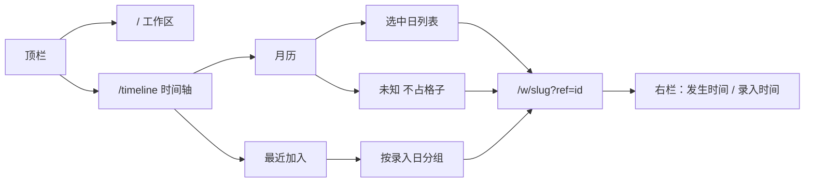
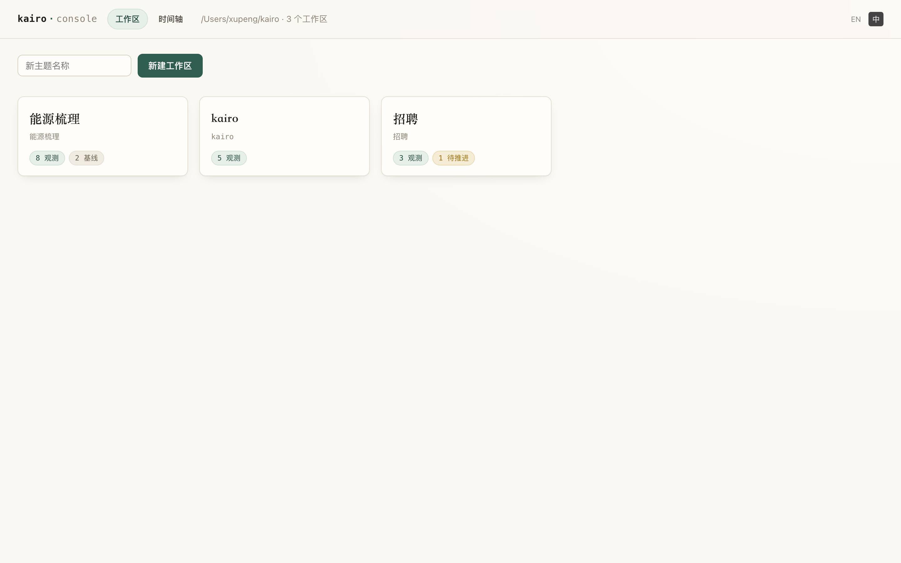
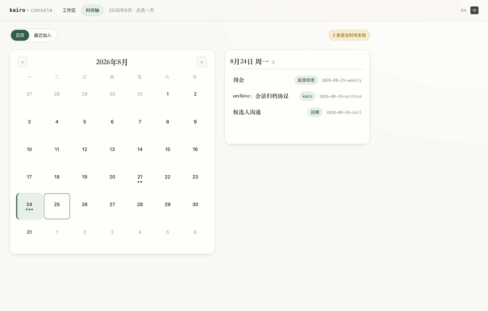
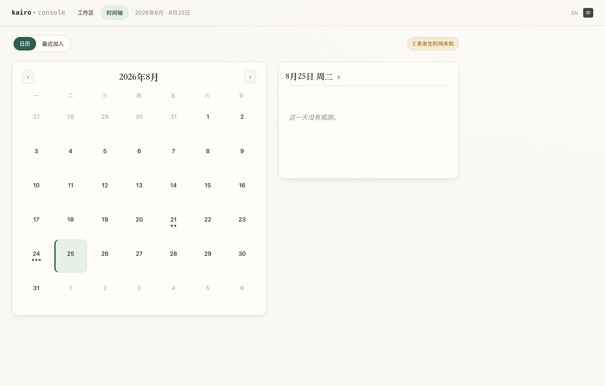
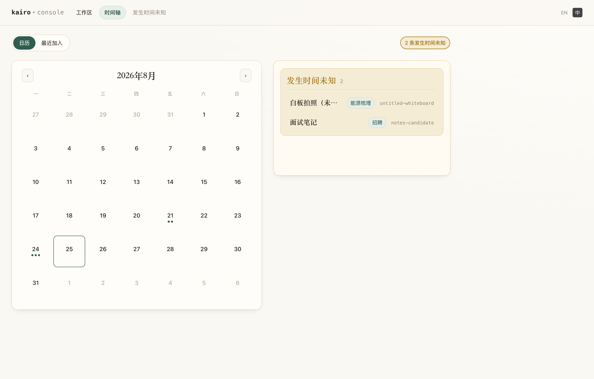
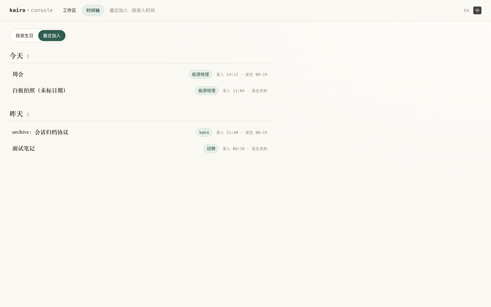
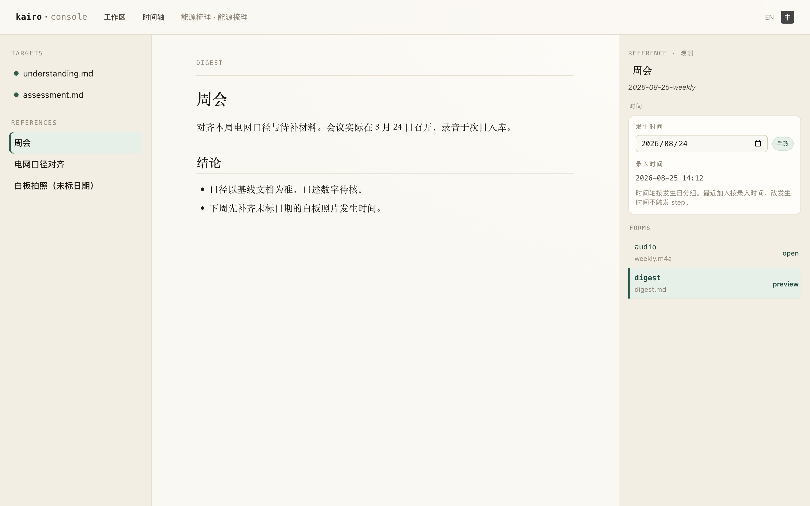
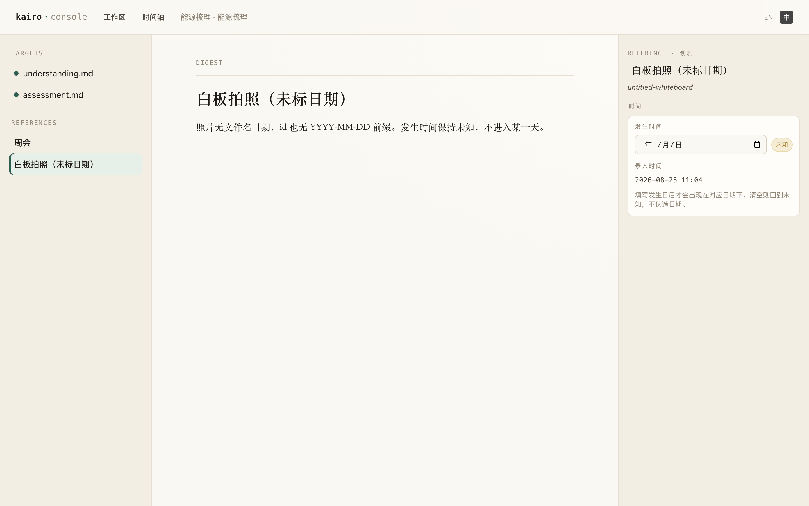
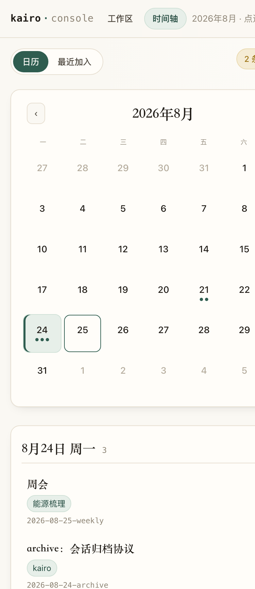
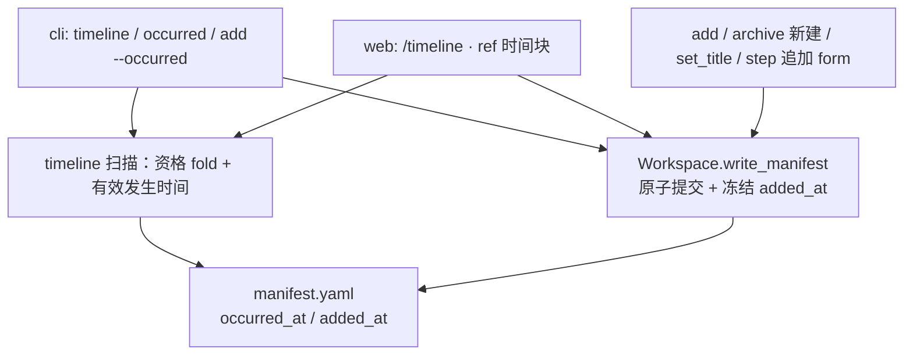

# 【时间轴】按发生时间跨 workspace 找回材料

- Issue: [#138](https://github.com/xforce-io/kairo/issues/138)
- 状态: Implemented
- 最后更新: 2026-08-25（读取前规范化 yaml 日期对象；本期月历不画周次）
- 分支: `feat/138-occurred-at-timeline`
- 页面稿: [`docs/design/138-occurred-at-timeline/`](138-occurred-at-timeline/)

## 1. 背景

Kairo 按 workspace（topic）组织材料。reference id 的日期默认是 `add` 当天（D-id），补录只能改主键。用户需要跨 workspace 按真实发生日找回某天的观测；会后补传会把材料错置到上传日。

Dashboard 仍是 workspace 卡片；`MEETINGS.md` 只是单 workspace 导航表。本 L2 把 [#138](https://github.com/xforce-io/kairo/issues/138) L1 收口为：`fold=true` 的 reference 补独立发生时间；Web 用月历按发生日找回，CLI 用按日列表；另有最近加入。点进既有 workspace / digest。不引入工作事件，不做周视图或摘要。

## 2. 名词解释

| 术语 | 定义 |
| --- | --- |
| **发生时间** | 观测实际发生的日历日 `YYYY-MM-DD`。必须是公历上存在的一天，无时区。时间轴「按发生日」的分组键。 |
| **录入时间** | reference **首次创建**的时刻（`added_at`）。创建后 attach、改标题、改发生时间、archive 续接、step 追加 form **永不更新**。「最近加入」的排序键。 |
| **有效发生时间** | 读取时算出的发生日与来源，见 §5.3。不把来源写回磁盘。 |
| **未知** | 有效发生时间为空。Web 走未知芯片，不占月历格子；CLI 置顶「发生时间未知」分组。不落入任何臆造日期。 |
| **时间轴资格** | `constitution.source_classes[class].fold is True`（缺 class 定义时与现网一致：当作 fold）。`fold=false`（默认即 corpus）不进入、不可用本能力改发生时间。 |
| **时间轴** | serve root 上的跨 workspace 入口 `/timeline`：Web 为月历，CLI 为按日列表。 |
| **最近加入** | 时间轴的第二种排序：按录入时间倒序。补传材料仍能按加入顺序找到。 |

## 3. 设计目标与非目标

- **目标**：
  - `fold=true` 的 reference 具备独立、可手改的发生时间，与 id、录入时间分离。
  - serve root 提供按发生日找回：Web 月历点选一天，CLI 按日列表；点进既有 workspace，选中该 reference 并预览 digest（若有）。
  - 录入时间支撑「最近加入」，且不因后续写 manifest 漂移。
  - 无可靠发生时间时显式未知，不伪造日期。
  - CLI 与 Web 能力对等。
- **非目标**：
  - 工作事件实体，或 Event → Material 多对多。
  - 周视图、日时间线。
  - 按日切片 understanding / assessment。
  - 日摘要、周摘要、周报；月历上不画周次、不留「写回顾」入口。
  - 从录音、文件元数据、外部日历或 ASR 自动推断发生时间。
  - `fold=false` 进入时间轴或被 `occurred` 修改。
  - 改发生时间触发 `step` / fold。
  - 改写 `MEETINGS.md` 的语义（它仍是单 workspace 导航）。

## 4. 能力与功能设计

用户在 Console 顶栏「时间轴」按发生日找回观测，或切到「最近加入」找刚入库的补传。点一行进入该 workspace 的既有三栏页。在右侧元信息改发生时间后，时间轴按新发生日分组，录入时间不变。

### 4.1 UI / UX

信息架构：Dashboard 仍管 workspace；时间轴是并列的 root 入口。不把「最近加入」再堆到 Dashboard。时间轴只列出有时间轴资格的 reference。

Web 默认是**月历**：用格子看哪天有观测，点一天看当天列表。不是周视图，也不是按日流水账首页。CLI 没有格子，仍按发生日分组输出。



视觉沿用 Console 现有「墨与纸」：暖纸底、松绿强调、标题衬线、id 等宽。

#### 顶栏与工作区

所有 Console 页在 brand 右侧增加 `工作区` / `时间轴`。当前页高亮为松绿胶囊。品牌仍回 `/`。workspace 页不再单独依赖「返回」作为唯一出口。



#### 时间轴：月历（Web 默认）

`GET /timeline`。查询参数契约见 §8.2：日历 / 最近加入 / 未知 三态互斥；有 `day` 则月份由 `day` 决定。

桌面两栏：左月历、右当天列表。窄屏上月历在上、列表在下。

- 工具条：`日历 | 最近加入`。有未知条时右侧琥珀芯片「N 条发生时间未知」；点芯片看未知列表，**不**把未知画进任何一天的格子。
- 月历：周一为周首。普通日期格子，**不画周次、不提供写回顾**。`‹ ›` 换月。有观测的日子用松绿点标密度，最多 3 点。今天描松绿框。选中日铺松绿底。点一天看当天。
- 默认打开（无查询）：当前月、选中今天（可空）。日历态下只带 `month`：选中今天的日号（钳到该月最后一天）。
- 右侧列表只展示选中日：标题 · workspace 芯片 · id。点行 → `GET /w/{slug}?ref={id}`，打开既有三栏；有 digest 则预览。
- 空日允许选中，右侧「这一天没有观测」。







空态：

| 状态 | 文案（中） | 文案（英） |
| --- | --- | --- |
| 全 root 无时间轴资格条目 | 还没有观测。 | No observations yet. |
| 单日无材料 | 这一天没有观测。 | Nothing on this day. |
| 无未知条 | 不渲染未知芯片 | — |

#### 时间轴：最近加入

`GET /timeline?mode=recent`。录入时间不适合铺进发生日月历，故仍用列表。按录入时间倒序，用「今天 / 昨天 / YYYY-MM-DD」分组；「今天 / 昨天」按 **Console 本机本地日历** 切割，`added_at` 本身是带偏移的绝对时刻。行右侧同时标录入钟点和有效发生日（或「发生未知」）。无日期筛选。补传出现在加入日，不出现在发生日的格子里。



#### 右栏改发生时间

在既有 reference 元信息、Forms 表之上加「时间」块。仅时间轴资格条目可改发生时间；`fold=false` 不展示该编辑块。

- **发生时间**：`date` 输入。旁标**计算**来源芯片：`id前缀` / `手改` / `未知`（不读磁盘 `occurred_source`）。
- **录入时间**：只读。
- 改日期即提交（与标题就地改名同节奏），**不**跑 step。提交只写 `occurred_at`。
- 清空日期：删除 `occurred_at`；若 id 仍有合法日历日前缀则回到 `id前缀`，否则回到未知。
- 浏览器或用户提交不存在的日期（如 2026-02-31）：拒绝，不写盘。





#### 窄屏

月历铺满宽度，选中日列表落到月历下方。标题换行，不截断。顶栏入口允许换行。workspace 三栏仍按现有 Console 行为横向滚动，本 issue 不重做三栏。



可交互稿：[`dashboard.html`](138-occurred-at-timeline/dashboard.html) · [`timeline-cal.html`](138-occurred-at-timeline/timeline-cal.html) · [`timeline-cal-empty.html`](138-occurred-at-timeline/timeline-cal-empty.html) · [`timeline-cal-unknown.html`](138-occurred-at-timeline/timeline-cal-unknown.html) · [`timeline-recent.html`](138-occurred-at-timeline/timeline-recent.html) · [`workspace-time.html`](138-occurred-at-timeline/workspace-time.html) · [`workspace-unknown.html`](138-occurred-at-timeline/workspace-unknown.html)。

## 5. 设计思路与折衷

### 5.1 选择 reference 即事件，放弃工作事件

选择：记忆原子仍是 reference。默认 `class: stream` 且 `fold=true` 就是观测流。只补发生时间。

放弃：Event 实体与材料多对多。L1 已否决平行本体；一份会议材料就是一条 fold 观测。

### 5.2 选择月历定位 + 当日列表，放弃周视图和三视图日历产品

选择：Web 时间轴是一个月历。格子回答「哪天有东西」，点一天看当天材料。这就是「按时间找回」的形态。

放弃：打开就是按日流水账。密度看不见，也不是用户说的日历效果。

放弃：周视图、日时间线、自动周报，以及在本期月历上预埋周次/「写回顾」。周回顾另开 issue 再设计入口。

CLI 没有格子：`kairo timeline` 仍按发生日分组列表（可 `--day`）。人和 agent 在终端读列表，不在 ASCII 月历里点选。

### 5.3 选择发生时间与 id 解耦；日历日必须存在

选择：id 继续按 D-id（add 当天或 `--id`）。磁盘 `occurred_at` / `added_at` 在模型里是**可选字符串**（`str | None`）。PyYAML 对无引号 `2026-08-24` 会给出 `datetime.date`，对无引号时间戳会给出 `datetime`；Pydantic v2 不会把它们自动收成 `str`。因此 **`read_manifest` 在 `model_validate` 之前**（或字段 `mode="before"` 校验器）必须规范化：

| 读到的值 | 写入模型字段 |
| --- | --- |
| `datetime.date` | `isoformat()` → `YYYY-MM-DD` |
| `datetime.datetime` | `isoformat()`（保留偏移） |
| `str` | 原样 |
| 缺省 / 其它类型 | `None` |

规范化之后才是 `str | None`。日历/时刻是否合法不在模型层判定。

有效发生时间与来源**读取时计算**，不落盘 `occurred_source`：

1. 对规范化后的 `occurred_at` 文本用标准库解析。成功 → 该日，来源 `user`。
2. 否则（缺失、空、`2026-02-31`、乱码）从 id 取前缀：先匹配 `^(\d{4}-\d{2}-\d{2})(?:-|$)`，再解析为真实日历日。成功 → 该日，来源 `id`，**不写回** manifest。
3. 否则未知。非法磁盘值不当成发生日；无引号合法日期必须能读，不能让整份 Manifest 失败。

用户输入（`occurred`、`add --occurred`、`--day`、Web POST / 日期框）：格式匹配后再解析；非法日期**拒绝写盘 / 拒绝筛选**，退出码 1 或 400。与读取分流：输入是人的意图，坏输入不能静默当未知。写入成功后磁盘上只出现合法 `YYYY-MM-DD`。

放弃：Manifest 字段用 `date`，或只用 `str | None` 却不做读取前规范化。前者脏值毁掉整份 manifest；后者无引号 YAML 日期对象同样校验失败。

放弃：只靠正则当日历日。会接受不存在的日期，与「日历日」「非法日期拒绝」矛盾。

放弃：扫描时间轴时把派生发生日写进所有旧 manifest。会弄脏磁盘，也让「未手改」与「已钉死」无法区分。

放弃：本轮从录音 / 文件 mtime / 日历推断发生时间。

放弃：落盘 `occurred_source`。有 `occurred_at` 即用户指定；再存只允许 `user` 的字段只会制造非法组合。展示与 `--json` 仍输出**计算**来源。

### 5.4 选择 `added_at` 表示首次创建，放弃每次读取 mtime

选择：`added_at` 是 reference 首次创建时间，创建后永不更新。

唯一写入入口是 `Workspace.write_manifest`（见 §7）。**以磁盘旧值为准**，不信任调用方传入的 `added_at`：

- 目标文件存在，且旧 manifest 已有可解析的 `added_at` → **强制保留旧值**（调用方改了也改回去）。
- 目标文件存在，但旧值缺失或无法解析 → 用**写入前**的 mtime（本地偏移 ISO）写入，再原子提交。这次写入不把排序键推到「现在」。
- 目标文件不存在（新建）→ 接受调用方预填的合法值，否则 `now()`。

因此改标题、改发生时间、attach、archive 续接、step 追加 form 都不会刷新已冻结的录入时间。`add` / archive 新建走第三支。

放弃：读取时反复用 mtime。改标题 / 发生时间 / 续接都会重写 manifest，最近加入会漂，与 S2「录入时间不变」矛盾。

放弃：只在 `Workspace.add` 里写 `added_at`。`src/kairo/archive.py` 新建不走 `add`；`rules.py` / `engine.py` 也会写 manifest。漏掉任一条创建或续接路径都会再漂。

诚实限制：上线前已经被改过标题的旧材料，钉住的是当时 mtime，不是真正第一次 `add`。无字段可恢复。只读扫描未写过的旧文件，展示仍用当前 mtime，不因扫描落盘。

### 5.5 选择现扫，放弃独立索引库

选择：与 Dashboard 相同，扫 serve root 下一层 workspace，读各 reference 的 manifest，按时间轴资格过滤。量级是「一层目录 × 每区几十条」，与现有 `scan_workspaces` 同类。

放弃：root 级时间数据库或增量索引。没有新进程、没有新失败模式。若日后 workspace 上百再另开。

### 5.6 选择时间轴上的「最近加入」，放弃改 Dashboard

选择：两种时间轴共用一页、一个顶栏入口。Dashboard 继续只回答「有哪些 topic」。

放弃：Dashboard 再做一条最近上传。会让 root 首页既管主题又管时间，和「工作区 / 时间轴」两个问题分开冲突。

### 5.7 选择资格看 `fold`，放弃按类名 `stream` / `corpus` 分流

选择：与 `discovery.py` / `stream_index._is_fold_class` 同一规则：`source_classes[class].fold`；缺定义当作 fold。自定义 `fold=true` 类进入时间轴；自定义 `fold=false` 排除。

放弃：用 `class == stream` 或 `!= corpus` 做门。会把自定义来源类行为弄乱，也和 L1「`fold=true` 才进」不一致。

### 5.8 选择 `write_manifest` 原子提交，放弃「失败了 forms 大概没改」

选择：所有 manifest 提交（含发生时间）走 `Workspace.write_manifest`：写到同目录临时文件，`os.replace` 到 `manifest.yaml`（与 archive 现有 `_commit_manifest` 同构，并让 archive 改走这一入口）。失败后磁盘上仍是完整旧文件，可被 `read_manifest` 读出。

放弃：`path.write_text` 原地覆盖。中途失败可以留下截断 yaml，下一轮被当成损坏跳过，无法兑现「写失败不改 id / forms」。

## 6. 架构设计

### 6.1 逻辑分层



Web 只调度与呈现。有效发生时间是纯计算（id + 可选 `occurred_at`）。录入时间读字段；缺字段的旧文件在扫描时用路径 mtime 仅供展示。不改 `step` 规则。

### 6.2 核心业务流程

**找回（S1）**

1. 打开 `/timeline`（月历）或 `kairo timeline`（列表）。
2. 只收入时间轴资格条目。Web：月历点选一天看右侧列表；未知走芯片不占格子。CLI：按发生日分组，未知置顶。
3. 点一行，进入 `/w/{slug}?ref={id}`。
4. 中栏预览 digest（若有）；右栏可改发生时间。

**校正（S2）**

1. 打开材料时间块，看到发生时间、录入时间、计算来源。
2. 提交新发生日 → 原子写 manifest：只增加或覆盖 `occurred_at`；`added_at` 按 §5.4 以磁盘旧值为准。
3. 时间轴按新发生日出现；最近加入位置不变。

**未知（S3）**

1. 无合法日历日前缀且未手填 → 未知芯片；不出现在任何格子里。
2. 补填合法发生日后出现在该日格子与右侧列表；录入时间不变。

**失败**

- 非法日历日、无时间轴资格：4xx / 退出码 1，**不写盘**；旧 manifest 仍完整可读。
- 原子提交失败（含故障注入）：旧 `manifest.yaml` 仍完整可读；不把临时文件当成正式文件。
- 某 workspace 已损坏、不可解析的 manifest：跳过该条，其余继续；Web 不因单条失败空白整页。

## 7. 模块设计

| 模块 | 契约 |
| --- | --- |
| `models.Manifest` | 可选 `occurred_at: str \| None`、`added_at: str \| None`。无 `occurred_source`。**读取前**把 yaml 的 `date`/`datetime` 收成 isoformat 字符串，其它脏类型收成 `None`，然后才 `model_validate`。模型层不做日历强校验。 |
| 日历日解析 | 输入字符串 → 合法 `date` 或失败。正则不够；须标准库日历解析。写入口用此函数，失败则拒写。 |
| 有效发生时间 | 纯函数 `(ref_id, occurred_at_text) → (date \| None, user \| id \| unknown)`。非法/空文本当缺失，再试 id 前缀。不读磁盘、不看 mtime。 |
| 录入时间读取 | 有可解析 `added_at` 用字段。否则扫描侧用 `manifest.yaml` 的 mtime 展示，不在只读路径写盘。 |
| `Workspace.write_manifest` | **唯一** manifest 提交点。§5.4 以磁盘旧值冻结 `added_at`；tmp + `os.replace`。`add` / `set_title` / archive / `rules` / `engine` / occurred 都走这里。 |
| `workspace.add` | 新建时预填 `added_at=now()`；可选 `occurred_at`。attach 已有 ref 不得改 `added_at`。 |
| `archive.py` | 新建与续接都改走 `write_manifest`。新建不得漏 `added_at`（即使漏了，无文件分支也会写成 now）。续接不得刷新已有 `added_at`。 |
| 时间轴扫描 | 输入 serve root → 资格为 fold 的条目（slug、topic、id、title、有效时间、录入时间）。跳过 `fold=false` 与损坏条目。 |
| `cli.py` | `timeline` / `occurred`；`add --occurred`。 |
| `web/views.py` | `GET /timeline`（`month` / `day` / `mode=recent` / 未知芯片）；`POST .../occurred`；`GET /w/{slug}?ref=` 选中参考。 |
| 模板 / i18n | 顶栏、时间轴、右栏时间块；中英。 |
| `MEETINGS.md` | **不动**。 |

## 8. API / CLI 设计

### 8.1 CLI

```
kairo timeline [root] [--day YYYY-MM-DD] [--recent] [--json]
```

- 默认：未知区 + 按发生日（新→旧），仅时间轴资格条目。
- `--day`：只该发生日；与 `--recent` 互斥。值必须是合法日历日，否则退出码 1。
- `--recent`：按录入时间倒序。
- 人读：分组标题 + `workspace  title  id`。
- `--json`：条目数组，字段 `workspace, topic, id, title, occurred_at, occurred_source, added_at`。`occurred_at` 为 `null` 表示未知。`occurred_source` 是计算值 `user` / `id` / `unknown`，不是磁盘字段。`added_at` 是有效录入时间（已冻结字段，或尚未写入时的展示用 mtime）。

```
kairo occurred <id> YYYY-MM-DD
kairo occurred <id> --clear
```

须在 workspace 内。日期必须是合法日历日。`--clear` 删除 `occurred_at`（回到派生或未知）。无时间轴资格拒绝。成功只改 `occurred_at`（及必要时按 §5.4 补 `added_at`）。

```
kairo add <file> [--occurred YYYY-MM-DD] ...
```

`--occurred` 只钉发生时间，不改 id。可与 `--id` 同时用：id 仍是身份，发生日走字段。非法日历日退出码 1。与 `--corpus`（以及任何 `fold=false` 的创建）互斥。

成功：退出码 0。参数互斥 / 非法日期 / 非 workspace / 无资格：退出码 1，不写盘。

### 8.2 Web

| 方法 | 路径 | 行为 |
| --- | --- | --- |
| `GET` | `/timeline` | HTML。查询见下表。非法月/日或互斥组合 → 400。 |
| `POST` | `/w/{slug}/ref/{id}/occurred` | form：`occurred_at` 为空即 clear。返回右栏 HTML 片段。无资格或非法日期 → 400。 |
| `GET` | `/w/{slug}?ref={id}` | 打开 workspace 并选中该参考；有 digest 则预览。 |

`GET /timeline` 三种视图**互斥**（日历 / 最近加入 / 未知）。`mode` 缺省为日历。

| 视图 | 合法查询 | 月份怎么来 | 400 |
| --- | --- | --- | --- |
| 日历 | 无参；或 `month`；或 `day`；或同月的 `month`+`day` | 有 `day` → 月份取 `day` 的年-月（此时若也传了 `month` 必须相同）。只有 `month` → 用它，选中日=今天的日号钳到该月月末。都没有 → 当前月、今天 | `month` 与 `day` 不同月；`day`/`month` 非法 |
| 最近加入 | **仅** `mode=recent`（可加与视图无关的已有全局参数，如语言） | 不用月历选日 | 同时带 `day`、`month` 或 `unknown=1` |
| 未知 | **仅** `unknown=1`，可另带 `month`（左侧月历停留） | `month` 缺省当前月 | 同时带 `day` 或 `mode=recent` |

点月历某一天应变成 `?day=YYYY-MM-DD`（不必再写 `month`）。`‹ ›` 换月写成该月对应日号的 `?day=`（钳到月末），不要同时带跨月的 `month`+`day`。点「最近加入」变成 `?mode=recent`。点未知芯片变成 `?unknown=1`，可保留 `month`。

与现有 htmx 错误回显一致。

### 8.3 存数（manifest）

```yaml
id: 2026-08-25-weekly
title: 周会
class: stream
occurred_at: "2026-08-24"          # 可选字符串 YYYY-MM-DD；模型不校验日历
added_at: "2026-08-25T14:12:03+08:00"  # 可选 ISO 时刻字符串；创建后只由 write_manifest 按磁盘规则写
forms: [...]
```

无 `occurred_source`。旧文件无这些键：发生日按 §5.3 从 id 派生；录入时间按 §5.4 在**下一次** `write_manifest` 时冻结，此前只读扫描用 mtime 展示。

兼容：只增字段；不改 id、不改 fold 语义、不改 class。读到未知的 `occurred_source` 键则忽略。

## 9. 边界考虑

- **假设**：serve root 下一层 workspace 数量与每区 fold 条数保持本地 Console 量级（数十 × 数十）。超出后另开索引，不在本期预做。
- **错误**：不可解析的 manifest 跳过。发生时间更新经原子 `write_manifest`；失败后旧文件完整可读，id / forms / 既有 `added_at` 均不变。
- **并发**：与现有「单用户本地 Console」相同，无新锁。后写覆盖整份 manifest 可接受，但 `added_at` 提交时以当时磁盘旧值为准，调用方改值无效。
- **权限**：沿用本地 Console，无新鉴权面。
- **性能**：列表不读 digest / understanding 正文，只读 manifest。
- **安全**：日期须为真实日历日；slug / id 仍走现有路径约束。
- **凭证**：N/A。
- **mtime 上限**：见 §5.4 诚实限制。

## 10. 迁移 / 兼容 / 回滚

- 旧 workspace 零批量改写：第一次打开时间轴即按 §5.3 分组；无合法前缀进未知。
- 新创建立刻有 `added_at`。旧条在下一次任何 manifest 提交时冻结写入前 mtime；只读不强制写盘。
- 回滚代码后：多余 yaml 键被忽略；`occurred_at` 仍留在磁盘但不再展示，可用 `--id` 时代的方式工作。
- 不改 constitution，不改 history 快照范围（发生时间在 reference 侧，rollback 本来就不碰 `references/`）。

## 11. 测试计划

- **E2E**：workspace A/B。次日 `add --id 2026-08-24-weekly`（或不改 id、事后 `occurred`）。Web 月历 24 日有点，点开右侧列表可见该条；最近加入在录入日；点击进入 digest。CLI `timeline --day 2026-08-24` 列出同一条。
- **E2E**：无日期前缀、未手填 → Web 未知芯片有、该日格子与 `?day=` 看不到它。补填后出现在该日，录入时间不变。清空手改：有合法前缀的回到 id 日，无前缀回到未知。
- **E2E**：空日筛选显示「这一天没有观测」；`fold=false` 不出现。
- **Integration**：有效发生时间（手改 > 合法 id 前缀 > 未知）；`add --occurred` 不改 id；损坏 manifest 不拖垮扫描。
- **Integration**：`added_at` 在 `add`、archive 新建时存在；`set_title` / `occurred` / archive 续接 / attach / step 追加 form **不**刷新磁盘已有值。调用方把 `added_at` 改成别的再 `write_manifest`，提交后仍是旧值。缺字段的旧文件经 `write_manifest` 后 `added_at` 等于写入前 mtime，而不是写入后的 now。
- **Integration**：`write_manifest` 故障注入（临时文件写到一半抛错、replace 前崩溃）：旧 `manifest.yaml` 仍可 `read_manifest`，forms 完整。
- **Integration**：磁盘 `occurred_at: "2026-02-31"` 时 `read_manifest` 成功，有效发生时间回退到合法 id 前缀或未知，该条仍出现在时间轴。
- **Integration**：无引号 YAML `occurred_at: 2026-08-24`（加载为 `datetime.date`）与无引号 `added_at` 时间戳（加载为 `datetime`）时 `read_manifest` 成功，字段为对应 isoformat 字符串。非日期类型（如整数）收成 `None`，整份仍可读。
- **Unit**：`2026-02-31` 作用户输入 / `--day` / `--occurred` 拒绝；作为 id 前缀 → 未知。闰日：`2024-02-29` 合法，`2025-02-29` 非法。`--day` 与 `--recent` 互斥。无时间轴资格拒绝 `occurred`。自定义 `fold=true` 类进入扫描，自定义 `fold=false` 排除。
- **Unit / Web**：`?month=2026-07&day=2026-08-24`、`?mode=recent&day=`、`?unknown=1&day=`、`?mode=recent&unknown=1` → 400。`?day=2026-08-24` 视为 2026-08 月历选中 24 日。

## 12. 开放问题 / 决策记录

- Web 时间轴是月历 + 选中日列表，不是按日流水账首页。无周视图。CLI 仍是列表。已拍板，见 §4.1 / §5.2。
- 月历 `‹ ›` 换月；格子可点空日。未知不占格子，走芯片。已拍板，见 §4.1。
- 清空手改后若 id 仍有**合法**日期前缀：回到派生，而不是强制未知。已拍板，见 §4.1 / §5.3。
- `added_at` = 首次创建，之后永不更新。`write_manifest` 以磁盘旧值为准，调用方篡改无效；旧文件缺值时用写入前 mtime 冻结。已拍板，见 §5.4。
- `occurred_at` / `added_at` 存 `str \| None`；读取前把 yaml `date`/`datetime` 收成 isoformat，其它脏类型收成 `None`。非法日历文本当缺失并回退 id/未知。非法用户输入仍拒写。已拍板，见 §5.3。
- 本期月历不画周次、不留写回顾入口。已拍板，见 §4.1 / §5.2。
- Web `/timeline`：日历 / `mode=recent` / `unknown=1` 互斥；有 `day` 则月份取自 `day`，与 `month` 不同月则 400。已拍板，见 §8.2。
- 时间轴资格 = `fold=true`（与 discovery 同规则）。已拍板，见 §5.7。
- 不落盘 `occurred_source`。已拍板，见 §5.3。
- `write_manifest` 原子提交，失败后旧文件完整可读。已拍板，见 §5.8。
- 其余 N/A。

## 13. 关联

- Issue [#138](https://github.com/xforce-io/kairo/issues/138) · L1 comment
- [#13](https://github.com/xforce-io/kairo/issues/13) stream / corpus（资格以 fold 为准，不硬编码类名）
- [#16](https://github.com/xforce-io/kairo/issues/16) `MEETINGS.md`
- [#136](https://github.com/xforce-io/kairo/issues/136) archive 创建/续接必须走同一 `write_manifest`
- [D-id](1-kairo-mvp.md) id 日期 = add 当天
- [#128](https://github.com/xforce-io/kairo/issues/128) topic 内有界综合；本 issue 不做跨主题周报
- [#35](35-kairo-web-console.md) Console 视觉与路由习惯
