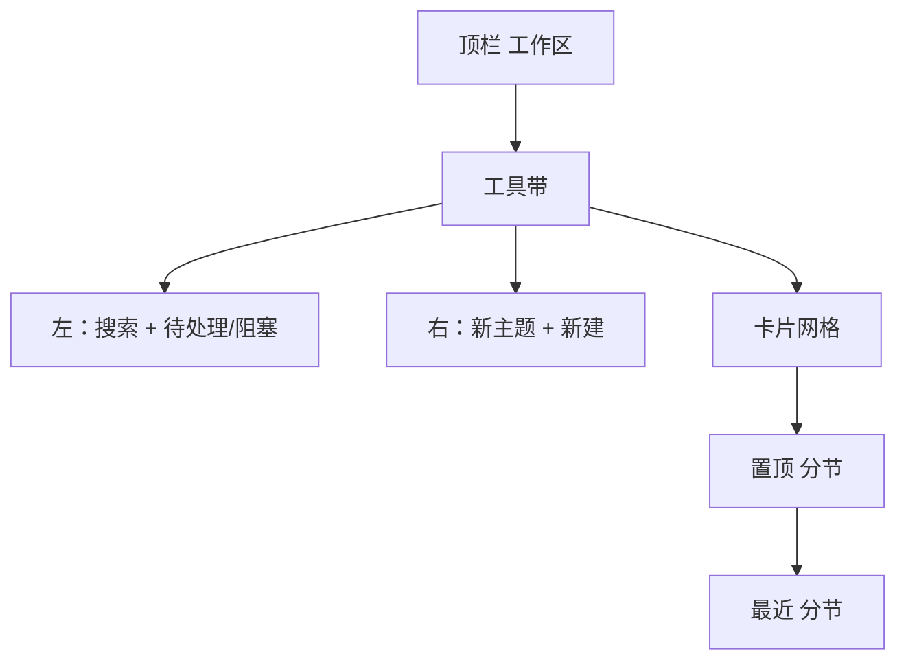
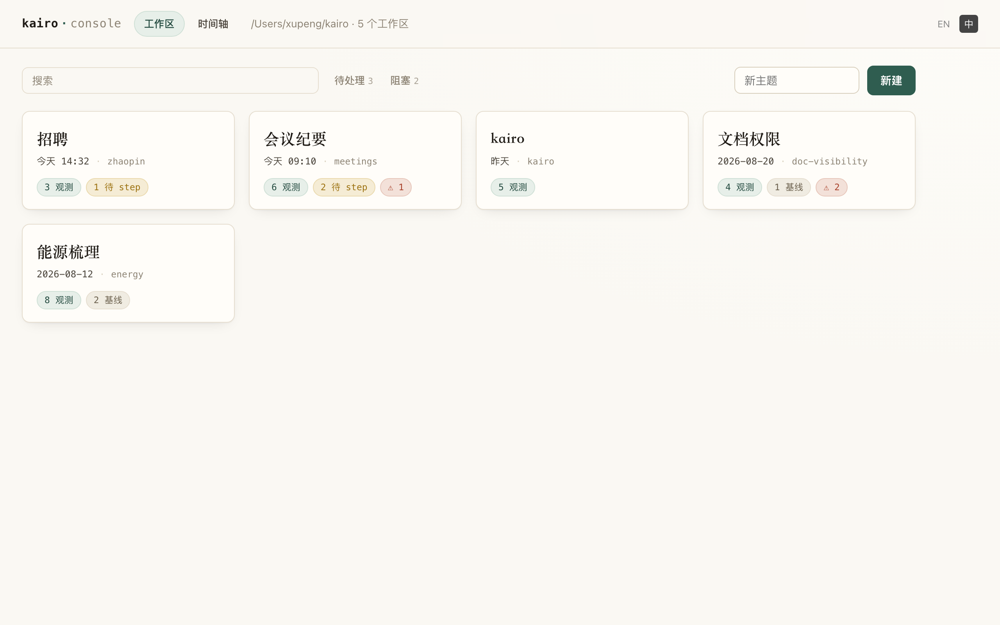
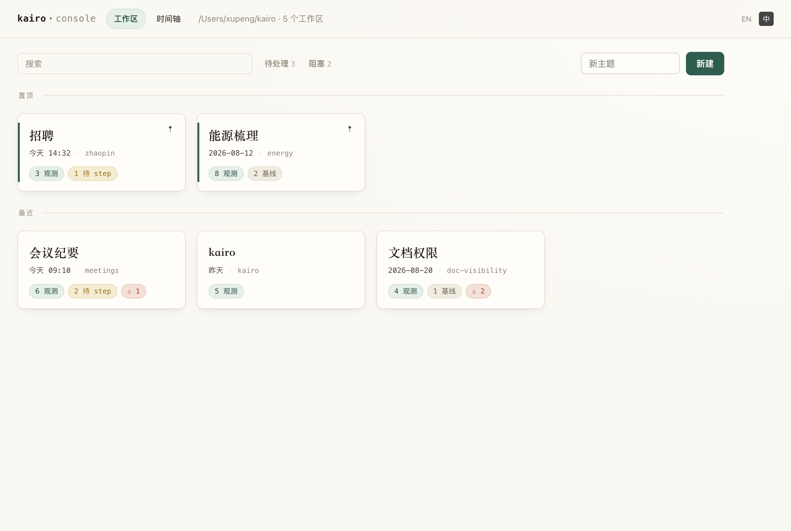
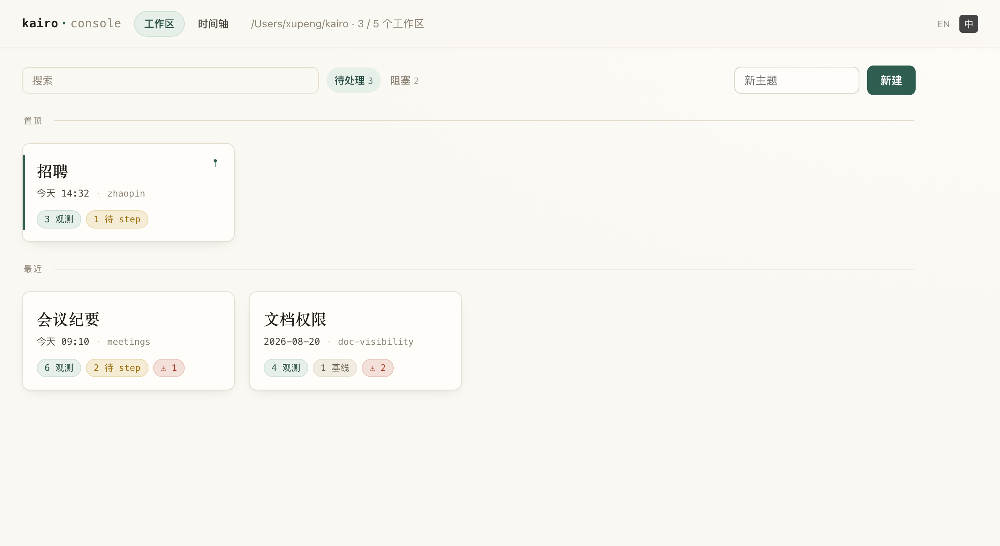
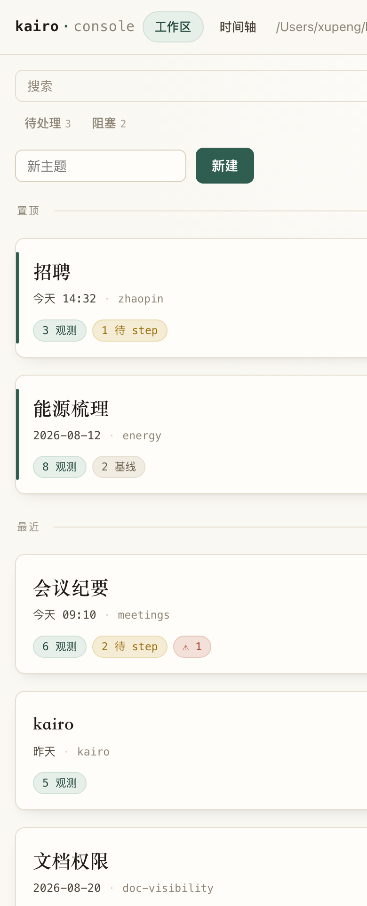
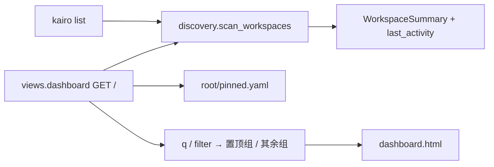

# 【web】工作区总览按最近操作排列、筛选与置顶

- Issue: [#140](https://github.com/xforce-io/kairo/issues/140)
- 状态: Implemented
- 最后更新: 2026-08-26
- 分支: `feat/140-dashboard-sort-filter`
- 页面稿: [`docs/design/140-dashboard-sort-filter/`](140-dashboard-sort-filter/)

## 1. 背景

Web Console 工作区总览（`GET /`）用卡片列出 serve root 下一层全部 workspace。发现层 `scan_workspaces` 按 `sorted(iterdir)` 即 **slug 字母序** 返回；卡片展示 topic、观测/基线计数、stale / blocked 徽标，**没有最近操作时间，也不能筛，也不能手工固定顺序**。

工作区变多后，用户打开总览是为了接上「最近在做的主题」，字母序会把刚 step / add 过的区埋进网格。长期主题（招聘、能源梳理）又希望不被近期琐碎操作挤下去。#35 摘要里的 `last_step` 从未落地。#138 把「最近加入」放在时间轴，且写明 **不把材料录入序再堆到 Dashboard**。

[#140](https://github.com/xforce-io/kairo/issues/140) 原要求顶部排序 + 筛选、默认 `recent`。评审后收口：去掉名称序；用置顶做手工固定；压低工具条层次。

## 2. 名词解释

| 术语 | 定义 |
| --- | --- |
| **最近操作时间** `last_activity` | 该 workspace 内一组 **kairo 自有路径** 的文件系统 mtime 最大值。只读扫描算出，不落盘、不因打开页面而更新。 |
| **操作** | 会改上述自有路径的写：`init` / `add` / `archive` / `rm-ref` / `title` / `occurred` / `step` / `run` / `re-step` / `accept` / `rollback` / 手改 target 正文 / 改 constitution。 |
| **非操作** | 打开总览或 workspace 页、预览文档、复制路径、只读 `status` / `list`、置顶/取消置顶。置顶只改 root 的 pin 表，不刷新该区 `last_activity`。 |
| **置顶** | serve root 上一份有序 slug 名单。名单中的工作区固定在网格顶部，顺序 = 名单顺序。 |
| **筛选** | 查询 `q` 与状态 `filter` 的合取。先滤，再按「置顶组 / 其余组」切开。 |
| **待处理** `attention` | `stale_count > 0` 或 `blocked_count > 0`。 |

## 3. 设计目标与非目标

- **目标**：
  - 未置顶的工作区按 `last_activity` 降序（默认、也是唯一自动序）。
  - 可按 topic/slug 搜索，可按待处理 / 阻塞过滤；默认不过滤。
  - 可把若干工作区置顶；置顶组在上，其余在下，中间一条分割线。
  - 卡片展示相对最近操作时间；只读浏览不改变未置顶顺序。
- **非目标**：
  - 按名称 / slug 字母序作为用户可选项（搜索已覆盖「按名字找」）。
  - 拖拽排序、置顶组内上移下移按钮。
  - 改时间轴「最近加入」语义；按 `occurred_at` / `added_at` 排工作区。
  - 把「打开 / 阅读」记为操作，或写入 `last_activity` 字段。
  - 改 `kairo list` 默认字母序；CLI 置顶命令。
  - 分页、多字段组合筛选、cookie / localStorage。
  - 扫整个 workspace 目录树或 corpus 源文件来猜活跃度。

## 4. 能力与功能设计

用户打开总览：置顶的长期主题在上，其余按最近操作排。搜索用来找名字；待处理 / 阻塞用来缩小集合。没有第三种排序。

### 4.1 UI / UX

信息架构不变：顶栏仍是「工作区 / 时间轴」。只改 `GET /`。



视觉沿用「墨与纸」。这一页的签名是 **两叠有标题的档案**（置顶 / 最近），不是工具条表演。

#### 工具带

两个角色，不要挤成一排同形控件：

- **左：找** — 搜索空框（placeholder「搜索」，可拉宽）+ 弱字 `待处理 n` / `阻塞 n`。数字是当前 root 上符合该谓词的总数，不随搜索变。默认都是弱灰；点一项变松绿底；再点取消。没有「全部」芯片。
- **右：建** — 短输入（placeholder「新主题」）+ 条带上 **唯一的松绿实心按钮「新建」**。偶发动作，不跟「找」抢主位。

窄屏：搜索满宽 → 筛选字 → 新建。

无 cookie / localStorage。无查询参数 = 不过滤、`q` 空。**没有 `sort` 参数。**







#### 卡片

扫读顺序：衬线标题 → 一行账本元数据（时间 · slug）→ 徽标。时间是最近序的键，比 slug 略重；slug 不再独占一行。

| 相对本机日历 | 中文 | 英文 |
| --- | --- | --- |
| 当天 | `今天 HH:MM` | `today HH:MM` |
| 昨天 | `昨天` | `yesterday` |
| 更早 | `YYYY-MM-DD` | `YYYY-MM-DD` |

右上角图钉、右下角垃圾桶。未置顶：图钉 **hover 才出现**（静止时 opacity 0）。已置顶：图钉常亮 + 左侧松绿条常亮。点图钉切换，不进入 workspace。

#### 分节

仅当筛选/搜索之后 **置顶组与其余组都至少有一张可见卡片** 时，用与左栏 `.nav-section` 同族的标题 + 账本细线：

- `置顶`
- `最近`

只剩一组（无置顶，或过滤后只剩一边）则 **不出现分节标题**，避免给唯一的一叠贴标签。

#### 计数与空态

有筛选或搜索时 crumb 为「匹配数 / 总数」；否则只显示总数。

| 状态 | 文案（中） | 文案（英） |
| --- | --- | --- |
| root 下无 workspace | 沿用现网 `dash.empty` | 沿用现网 |
| 有 workspace 但筛选/搜索无匹配 | 没有符合条件的工作区。清除条件 | No workspaces match. Clear filters |

无匹配时工具带仍在（搜索框保留 `q`），不伪装成空 root。




#### 非法查询

未知 `filter`、空白 `q`：当默认，**不 400**。忽略遗留的 `sort` 参数。

## 5. 设计思路与折衷

### 5.1 最近操作时间（不变）

候选 A：`state.json` 埋 `last_activity` —— 每个写路径都要更新，放弃。

候选 B：用 `added_at` / `occurred_at` 当工作区时间 —— 与 #138 轴混淆，放弃。

候选 C（选择）：只读派生有界路径 max mtime。诚实限制同前：rsync / 只改 digest 正文可能不准。

### 5.2 去掉名称序

名称序是「别丢掉旧字母序」的遗留。有搜索就能按名字找；有置顶就能固定长期主题。第三种排序只多一组和「最近」同形的胶囊，正是工具条没有层次的原因。放弃。

### 5.3 置顶而不是拖拽

选择：serve root 一份 **有序 slug 名单**。Pin = 插入名单头部（刚钉的在置顶组最前）；再点 = 取消。不提供拖拽、不提供上移下移。

放弃：写进每个 workspace 的 constitution —— 置顶是这个 root 的桌面排列，不是主题的属性。

放弃：localStorage —— 换浏览器/清站点数据就丢，且和「本地文件是事实源」不一致。

### 5.4 工具条层次

放弃并排两套分段器（最近|名称 + 全部|待处理|阻塞）和叠放两个同形输入框。

选择：工具带按角色分组——左找右建。筛选带总数；无置顶时不贴「最近」标签；两组都在时用「置顶 / 最近」分节线，而不是一条悬空的 hr。筛选没有「全部」芯片。

`kairo list` 仍 slug 序。

## 6. 架构设计

### 6.1 逻辑分层



- **discovery**：扫描仍按 slug 字母序返回（CLI 稳定）。摘要增 `last_activity`。
- **pin 表**：只被 Web 读写；不进入 `kairo list`。
- **web views**：滤 → 按 pin 名单切开 → 置顶组保持名单序，其余按 `last_activity` 降序。
- 不改 engine / timeline / manifest。

### 6.2 核心业务流程

主路径（读）：

1. `GET /` 或 `GET /?filter=&q=`。
2. 扫描摘要；读 pin 名单（缺文件 = 空名单）；丢掉已经不存在的 slug（读路径不写回）。
3. 规范化查询。
4. `q`：topic / slug trim + casefold 子串（OR）。
5. `filter`：缺省全过；`attention` = stale 或 blocked；`blocked` = `blocked_count > 0`。
6. 仍匹配的条目：在 pin 名单里的按名单序进置顶组，其余按 `last_activity` 降序、`slug` 升序打平。
7. 两组都非空则渲染分割线。

主路径（置顶）：

1. 点卡片图钉 → `POST /workspaces/{slug}/pin`（toggle）。
2. 未在名单：插入 **头部**。已在名单：删除。
3. 写回 `pinned.yaml`。刷新总览（可整页，保留当前 `q`/`filter`）。

失败 / 边界：

- 打不开的子目录仍跳过。
- pin 了已删除的 slug：展示时忽略；下次成功的 pin 写入会顺带丢掉幽灵项。
- 只读打开 workspace：不改 `last_activity`，也不改 pin 表。
- 对未置顶区 `add` / 改标题：该区在其余组内提前；若已置顶则仍留在置顶组原位。

## 7. 模块设计

| 模块 | 契约 |
| --- | --- |
| `web.discovery.WorkspaceSummary` | 新增 `last_activity`。扫描仍 slug 序。 |
| `web.discovery.last_activity(ws)` | 有界路径 max mtime。 |
| `web.pins`（或 views 旁小模块） | 读/写 serve root `pinned.yaml`：有序 slug 列表。 |
| `web.views.dashboard` | 查询、滤、切组、注入模板。 |
| `POST /workspaces/{slug}/pin` | toggle；404 若 workspace 不存在。 |
| `templates/dashboard.html` + `app.css` | 一条工具带、图钉、分割线、相对时间。 |
| `web.i18n` | 中英新键。 |
| `cli list` | **不改**顺序与 JSON 字段。 |

`last_activity` 计入的已存在路径（有界闭集）：

1. `constitution.yaml`
2. `.kairo/state.json`
3. constitution 声明的各 target 正文
4. `MEETINGS.md`（若存在）
5. 每个 reference 的 `manifest.yaml`

不计入：`.DS_Store`、目录 mtime、源副本 / digest / transcript / prose、`.kairo/history/`、`glossary.yaml`、`pinned.yaml`。

## 8. API / CLI 设计

### 8.1 Dashboard 查询

`GET /`

| 参数 | 缺省 | 合法值 | 非法时 |
| --- | --- | --- | --- |
| `filter` | 空 / `all` | `attention` \| `blocked` | 当作不过滤 |
| `q` | 空 | 任意字符串；trim | 空白当作空 |

无 `sort`。遗留 `?sort=` 忽略。默认视图链接是 `/`。

### 8.2 置顶

`POST /workspaces/{slug}/pin`

成功：写 pin 表，回到当前总览（或 204 + HTMX 刷新网格）。slug 必须是现有 workspace。

### 8.3 `pinned.yaml`

路径：`<serve-root>/pinned.yaml`（与 `glossary.yaml` 同级，同属这个 root 的桌面事实）。

```yaml
- zhaopin
- energy
```

顶层就是字符串列表。第一项 = 置顶组最前。其它键忽略。文件缺失、空文件、非列表 → 当作无置顶。非字符串项跳过。

### 8.4 CLI

`kairo list` / `--json`：顺序与字段不变。无 `kairo pin`。

## 9. 边界考虑

- **假设**：单用户本地 Console；mtime 为本机时钟。
- **错误**：非法查询不报错。pin 未知 slug → 404。
- **并发**：两个标签同时 pin 以后写覆盖先写；本地可接受。step 写 `state.json` 与 pin 写不同文件。
- **权限**：无新权限面。
- **性能**：扫描量级不变；pin 表通常数行。
- **安全**：`q` 子串匹配 + Jinja 转义。slug 路径穿越按现网 workspace 打开规则拒绝。yaml 只当 slug 列表读，不执行。
- **诚实限制**：`last_activity` 见 §5.1。pin 不跨机器同步，文件在这个 root 里。

## 10. 迁移 / 兼容 / 回滚

- 无 manifest / state schema 变更。
- 新文件 `pinned.yaml`；缺省不存在。回滚代码后该文件留在磁盘无害，与 `glossary.yaml` 同类。
- 无查询的 `GET /` 从 slug 序变为「置顶组 + 最近操作」。需要按名字找时用搜索。
- `kairo list` 不变。删除 workspace 不强制立刻改 pin 表；下次写入或展示时忽略幽灵 slug。

## 11. 测试计划

- **E2E**（TestClient，对 S1–S4）：
  1. 两区先后写入后打开 `/`：后写的未置顶卡片在前，且含相对时间。→ S1
  2. `q` 只留匹配 topic/slug 的卡片；`filter=blocked` 只留 blocked；无匹配时工具带在、文案为筛选空态。无 `sort=name` 控件。→ S2
  3. 只读 `GET /w/{slug}` 后总览未置顶序不变；随后对该区写入，它在未置顶组提前；已置顶的区写入后仍在置顶组原位。→ S3
  4. pin 一个区：它出现在分割线之上、图钉亮起；再 pin 另一个：新 pin 在置顶组最前；取消后回到其余组并按 `last_activity` 归位；两组都在时有分割线，只剩一组时无线。→ S4
- **Integration**：`last_activity` 闭集 mtime；digest 正文单独变新不抬高；`pinned.yaml` 缺文件 / 幽灵 slug / 脏类型可容忍。
- **Unit**：查询规范化；`q` casefold；filter 谓词；pin 插入头部与删除。
- **CLI 回归**：`kairo list` slug 序、JSON 键不变。

## 12. 开放问题 / 决策记录

- `last_activity` 派生自有界 mtime，不落盘。已拍板。
- **去掉名称序**。搜索覆盖按名查找。修订拍板（待确认）。
- 筛选两项弱字：`attention` / `blocked`，默认不过滤，无「全部」芯片。修订拍板（待确认）。
- 置顶 = root `pinned.yaml` 有序名单；pin 插入头部；无拖拽。修订拍板（待确认）。
- `kairo list` 默认序不动。已拍板。
- 不把「最近加入」堆进 Dashboard。与 #138 一致。已拍板。

## 13. 关联

- Issue [#140](https://github.com/xforce-io/kairo/issues/140)
- L1：issue comments（含本轮修订）
- [#35](https://github.com/xforce-io/kairo/issues/35) dashboard
- [#138](https://github.com/xforce-io/kairo/issues/138) 时间轴最近加入
- 模块：`src/kairo/web/discovery.py`、`views.py`、`templates/dashboard.html`、`i18n.py`；新增 root `pinned.yaml`
