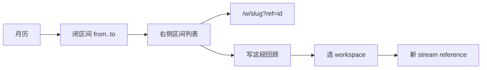
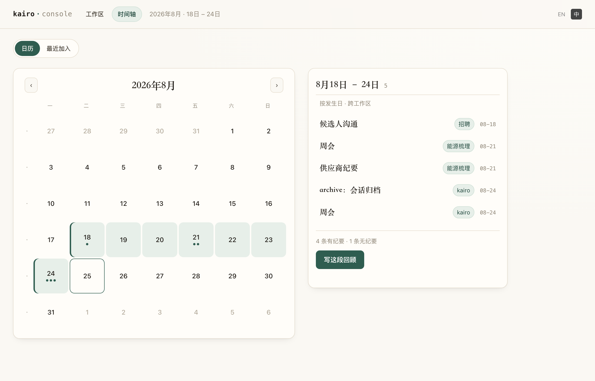
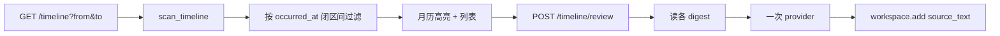

# 【时间轴】选一段发生日后写出跨主题回顾

- Issue: [#144](https://github.com/xforce-io/kairo/issues/144)
- 状态: Implemented
- 最后更新: 2026-08-26
- 分支: `feat/144-timeline-range-review`
- 页面稿: [`docs/design/144-timeline-range-review/`](144-timeline-range-review/)

## 1. 背景

时间轴（#138）解决「哪一天有哪些观测」。用户下一步是圈一段日子，看这段跨主题发生了什么，并写成一份回顾。现网只能点一天；#138 把周报列为非目标。#128 是 **一个主题内部** 的有界综合，不能当跨 workspace 时段报告。

本 L2 把 #144 收口为：月历闭区间 + 区间材料列表 + 一次确认后的回顾生成，回顾落成指定 workspace 里的普通 stream reference。

## 2. 名词解释

| 术语 | 定义 |
| --- | --- |
| **闭区间** | 两个合法发生日 `from`、`to`（`from ≤ to`），含两端。键是材料的 **有效发生日**，不是录入日。 |
| **区间材料** | 时间轴资格（fold=true）且有效发生日落在闭区间内的 reference。未知发生日不进入。 |
| **回顾** | 根据区间材料的 digest 生成的一篇中文（或当前 UI 语言）综述。不是各主题 understanding 的切片。 |
| **回顾参考** | 回顾落盘后的那条 stream reference：`source_text` 正文 + `occurred_at = to` + 标题标明区间。 |

## 3. 设计目标与非目标

- **目标**：
  - 月历可选发生日闭区间；右侧列出区间材料，点行进入既有 workspace。
  - 确认后根据区间 digest 生成回顾，保存为指定 workspace 的一条 stream reference。
  - 空区间、超 31 个日历日、无目标 workspace：拒绝且不调用 LLM。
  - CLI 能列出区间材料，并能写出回顾。
- **非目标**：
  - 拖拽、非连续多选、按住修饰键加选。
  - 自动每周跑、定时周报。
  - 把回顾写进各主题的 understanding / assessment，或按日切片 living document。
  - 未知发生日进入区间；corpus 进入。
  - 从录音 / 日历推断发生日。
  - 生成后自动 `step` / `run`。
  - #128 证据卡。

## 4. 能力与功能设计

用户在时间轴月历点两次（起、止），右侧变成这段的材料列表。确认目标 workspace 后写回顾；写完打开该条 reference。

### 4.1 UI / UX

仍是顶栏「工作区 / 时间轴」。只扩展日历态。最近加入、未知芯片不变，不带区间。



视觉沿用墨与纸。区间格子铺连续松绿底；起止两天用现网选中条（左 inset）。

#### 怎么选

- **两下点**：第一下与现网相同，选中一天（`day=`）。第二下点另一天，变成闭区间（`from` & `to`，自动排先后）。再点第三天：以该天为新的起日，区间取消。再点已是起日的那一天：回到单日。
- **选这一周**：月历每行左侧一条窄热区（不画周次数字）。点中 → 该行周一至周日（与现网周首一致）。跨月的 mute 格也算进闭区间。
- 不做拖拽。手机与桌面同一套两下点。
- 查询：单日仍 `?day=`；区间 `?from=YYYY-MM-DD&to=YYYY-MM-DD`。只带一个、非法日、`from>to`、互斥参数 → 400 或回退单日（见 §8）。非法跨度（>31 日）日历可显示但不启用写回顾。

#### 右侧

标题：`8月18日 – 8月24日` + 条数。列表按发生日分组，日内按 workspace、id。行与现网相同：标题 · workspace 芯片 · id。点行进入 `/w/{slug}?ref={id}`。

底部主按钮「写这段回顾」，旁注「N 条有纪要 / M 条无纪要」。空区间无按钮。超 31 日按钮禁用，文案说明上限。

点按钮弹出与现网同款对话框：选择已有 workspace，或填 topic 新建。默认高亮 topic/slug 为「回顾」的那个（若有）。确认后发请求、按钮进 Running，完成则跳到新 reference。

#### 空态

| 状态 | 中 | 英 |
| --- | --- | --- |
| 区间内无材料 | 这段时间没有观测。 | Nothing in this range. |
| 有材料但都无 digest | 还没有纪要，写不出回顾。 | No digests yet — cannot write a review. |
| 超 31 日 | 一次最多 31 天。 | At most 31 days. |



## 5. 设计思路与折衷

候选 A：在月历上「写回顾」直接改各主题 understanding。

- 放弃。时段回顾是跨主题的「这段日子发生了什么」，不是某个 topic 的 living document。会和 #128 / 现网 Run 抢语义。

候选 B：回顾只展示在时间轴上，不落盘。

- 放弃。一刷新或换机器就没了；也无法日后 fold。

候选 C（选择）：回顾 = 指定 workspace 里一条普通 stream reference。

- 零新文档类型。发生日用区间止日，时间轴以后能按写回顾那天（止日）找回这份回顾本身。标题写明 from～to。用户稍后可在该 workspace `Run` 把多篇回顾折进 understanding——那是既有能力，本 issue 不自动做。
- 放弃自动新建「回顾」workspace 且不询问：可能写错地方。有同名则预填，没有则对话框里填 topic 新建。

选区：两下点 + 一周热区。放弃拖拽（触控差、与点进一天冲突）。放弃周次数字（#138 已否，本 issue 只加热区不画 W12）。

生成：一次 LLM，只读 digest（无则跳过并在回顾里列「无纪要」）。不跑 ASR，不改原材料。上限 31 日，避免一次吞整月。

## 6. 架构设计

### 6.1 逻辑分层



- 过滤纯函数，Web/CLI 共用。
- 写回顾只新增 reference，不写各主题 state，不 step。
- 时间轴扫描仍跳过 fold=false 与损坏 manifest。

### 6.2 核心业务流程

读：

1. 解析 `from`/`to` 或 `day`。
2. `scan_timeline`；留下 `from ≤ occurred_at ≤ to`。
3. 渲染。跨度天数 = `(to - from).days + 1`。

写：

1. 校验区间、跨度 ≤ 31、目标 workspace 存在或按 topic 新建成功。
2. 收集区间材料；至少 1 条 digest，否则 400。
3. 调 provider 生成正文；失败不写盘。
4. `add` 一条 stream：正文文件在 references 下，`occurred_at=to`，`added_at=now`。
5. 303 到 `/w/{slug}?ref={id}`。

## 7. 模块设计

| 模块 | 契约 |
| --- | --- |
| `timeline.filter_range(items, from, to)` | 闭区间过滤；未知发生日排除。 |
| `timeline.range_days(from, to)` | 日历日数；>31 为超限。 |
| `review.build_prompt(items, digests)` | 只拼有 digest 的正文；列出无纪要标题。 |
| `review.write(ws, from, to, body)` | add stream reference。 |
| `views.timeline_view` | 扩展查询；格子 `in_range`。 |
| `POST /timeline/review` | form：`from`,`to`,`workspace` 或 `topic`（新建）。 |
| CLI `timeline --from --to` | 列表。 |
| CLI `review --from --to --workspace` | 写出。 |

## 8. API / CLI 设计

### 8.1 查询

`GET /timeline`

| 参数 | 含义 |
| --- | --- |
| `day` | 单日（现网） |
| `from`,`to` | 闭区间；两者都必须是合法日历日且 `from ≤ to` |
| `mode=recent` / `unknown` | 与区间互斥 |

`from`/`to` 与 `day` 同时出现：以 `from`/`to` 为准。缺一个：400。跨度 >31：页面仍列出（若用户硬拼 URL），但写回顾禁用。

格子：`in` = 落在开区间内部；`on` = 起或止（单日则仅 `on`）。

### 8.2 写回顾

`POST /timeline/review`

form：`from`, `to`；`workspace`（已有 slug）或 `topic`（新建，与 dashboard 新建同一套校验）。

成功：303 `/w/{slug}?ref={id}`。失败：400（空/超限/无 digest/非法日）、404（workspace 不存在）、provider 失败沿用现网 Run 失败呈现，不落盘。

### 8.3 CLI

```
kairo timeline --from YYYY-MM-DD --to YYYY-MM-DD
kairo review --from YYYY-MM-DD --to YYYY-MM-DD --workspace SLUG
```

`--from`/`--to` 与 `--day`/`--recent` 互斥。`review` 无 `--workspace` 时退出码 2，列出 workspace（与 archive 的 need-workspace 同类，不擅自挑）。

### 8.4 回顾 reference

新建 stream，class 默认 fold。`occurred_at = to`。title：`{from}～{to} 回顾`（ISO 日）。manifest 不另造 report 类型。

## 9. 边界考虑

- 未知发生日不进区间。
- 无 digest：可出现在列表，不进 LLM 正文，回顾末列清单。
- 并发：两次写回顾 = 两条 reference。
- 权限：无新面。
- 性能：扫描量级同 #138；LLM 输入按 digest 条数线性，用 31 日封顶。
- 安全：prompt 只含用户自己的 digest；workspace/topic 校验同新建。
- 假设：单用户本地；写回顾烧 token，按钮上写清条数。

## 10. 迁移 / 兼容 / 回滚

- 无 `day` 的旧链不变。
- 无新必填字段。回顾就是普通 stream，回滚代码后仍当观测出现在止日。
- 不改各主题已有 understanding。

## 11. 测试计划

- **E2E**：三天、两个 workspace 的材料；选 from–to 后列表恰为这三天；写回顾后目标区多一条 title 含区间、`occurred_at=to` 的 reference，打开可见综述；原材料 digest 未改。→ S1/S2
- **E2E**：空区间无写按钮；32 日跨度按钮禁用且 CLI 非零、不调 provider。→ S3
- **Integration**：未知发生日不进区间；无 digest 的条目出现在列表但不进 prompt 正文。
- **Unit**：from>to 规范化或拒绝；过滤函数；查询互斥。

## 12. 开放问题 / 决策记录

- 两下点 + 一周热区，不拖拽。待确认。
- 回顾落成指定 workspace 的 stream，不自动 fold。待确认。
- 上限 31 个日历日。待确认。
- 一周热区不画周次数字（延续 #138）。已拍板。

## 13. 关联

- Issue [#144](https://github.com/xforce-io/kairo/issues/144)
- [#138](https://github.com/xforce-io/kairo/issues/138) 时间轴找回
- [#128](https://github.com/xforce-io/kairo/issues/128) 主题内有界综合（不是本能力）
