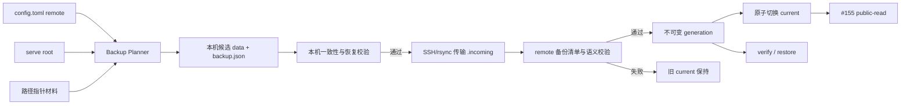

# 【备份】将 Kairo 数据完整备份到可信 remote 并可恢复

- Issue: [#154](https://github.com/xforce-io/kairo/issues/154)
- 分支: `feat/154-remote-full-backup`
- 状态: Draft
- 最后更新: 2026-08-28
- L1: [Approved](https://github.com/xforce-io/kairo/issues/154#issuecomment-5448359922)

## 1. 背景

Kairo 目前只消费本机 serve root。workspace 内既有自包含文件，也允许 manifest form 通过绝对或越界相对 location 保留[路径指针](../glossary.md)；因此只复制 serve root 可能得到一份“命令成功、恢复后材料缺失”的假完整备份。

Issue #154 要把指定源环境的数据保存到可信 [remote](../glossary.md)，供灾备恢复，并作为 #155 匿名只读部署的数据源。源环境仍是唯一写入方；remote 上的 private 数据对主机管理员可见，但不能因备份而扩大匿名 HTTP 可见性。

## 2. 名词解释

本设计新增或易混的词均已登记到 [docs/glossary.md](../glossary.md)：

| 术语 | 本设计中的精确含义 |
|---|---|
| 恢复闭包 | serve root 全部目录内容，加上 manifest 登记但位于 workspace 外、恢复后仍需可读的路径指针材料。 |
| 备份 generation | remote 上一份不可变、带完整[备份清单](../glossary.md)且校验通过的恢复版本；以 `backup_id` 标识。 |
| current | remote 根下唯一指向当前可消费备份 generation 的原子符号链接。 |

#118 `public-read.json` 内的 publication `generation` 与本设计的备份 generation 是两套版本：前者约束匿名授权快照，后者约束整份恢复数据。备份原样携带前者，不解释、重编号或修复它。

## 3. 目标与非目标

### 3.1 目标

1. 从机器级配置解析具名 remote，并通过一次性命令备份指定 serve root。
2. 备份覆盖 serve root 全部普通文件及路径指针材料；恢复后不依赖源机器原绝对路径。
3. 每份备份 generation 不可变；仅在传输及逐文件校验全部成功后原子切换 current。
4. 源数据变化、传输中断、校验失败或并发提交均不得破坏旧 current。
5. 支持校验 current/指定 generation，并恢复到不存在或空目标目录；成功后 workspace、manifest form 与备份清单 100% 可验证。
6. 不把机器凭据或本机 Kairo 配置放进备份。

### 3.2 非目标

- 双向同步、远端编辑、冲突合并、多主写入。
- 自动保留策略、旧 generation 删除、压缩、增量去重或云对象存储。
- 备份 XDG/home 下的 machine config、machine glossary、Provider/ASR 配置、SSH 私钥或环境变量。
- 创建、撤回、修复或解释 public 声明；匿名读取仍只认 #118。
- 常驻同步 daemon、周期调度与最近周期结果；由 #156 承接。
- 加密 remote 主机管理员不可见的数据；remote 是受信任基础设施。

## 4. 能力

### 4.1 UI/UX

N/A：本期没有页面。CLI 是唯一用户界面，须呈现以下状态：

- `push`：扫描 → 采集 → 传输 → 校验 → `pushed`；内容未变化为 `unchanged`。
- 错误：配置、源数据变化、路径指针缺失、连接、传输、校验、并发提交分别给出安全摘要；任何错误均不得声称 current 已切换。
- `verify`：明确输出目标 backup_id、文件数、字节数与 `ok`/失败终态。
- `restore`：明确输出恢复 backup_id 与验证结果；目标非空、备份清单非法或校验失败时不留下一个被宣告成功的目标。
- 空 serve root 是合法空备份；无法解析为一致恢复闭包不是空态，而是失败。

### 4.2 一致备份采集

采集采用乐观一致性，不要求 Kairo 全局停写。内容指纹不是 mtime/size，而是按逻辑对象身份排序的普通文件 SHA-256、目录集合和对象类型：

1. 扫描 serve root 与全部 manifest 路径指针，形成第一次源闭包指纹。
2. 在 serve root 外的本机临时目录构建候选 `data/`，并按 §4.3 的确定性映射从候选反算同一组逻辑对象指纹。
3. 再次扫描源恢复闭包，形成第二次源闭包指纹。
4. 只有“第一次源指纹 = 候选逻辑指纹 = 第二次源指纹”才继续；任一对象集合、类型、目录或 SHA-256 不等即放弃候选，current 不变。
5. 对候选执行 §4.5 的恢复闭包语义校验和备份清单校验，才允许传输。

逻辑指纹的规范化固定为：未改写普通文件按恢复闭包逻辑 key、类型与字节 SHA-256；manifest 按完整 YAML mapping（含未知字段）规范序列化，但把需物化的 location 在源/候选两侧都替换为 `workspace/ref-id/form-index/kind` 逻辑 token；路径指针目录按相对 payload 路径、目录集合、类型和文件 SHA-256。候选通过备份清单 materialized 记录反向得到同一逻辑 key。除 location 的这一处确定性替换外，manifest 任意字段差异都会翻转指纹。

三方相等保证候选内容与两次稳定源观测在上述恢复语义下相同；文件在复制中产生混合内容、对象被替换后恢复、增删空目录或类型变化都不能仅靠候选自校验蒙混通过。该选择放弃跨文件系统快照依赖，代价是全量读三次以及活跃写入期间可能需要重试。

serve root 内只接受普通文件与普通目录；符号链接、socket、device、FIFO 及无法读取对象使候选失败，不跟随、不静默跳过。

### 4.3 路径指针物化

manifest 的每个 form location 先按现有规则解析：相对路径相对 workspace，绝对路径保持绝对。只有“不含 `..` 且解析后仍在该 workspace 内”的相对 location 可原样保留；绝对 location 或解析到 workspace 外的 location 都必须物化。

每个被物化 form 使用唯一目录：

```text
<workspace>/.kairo/backup-external/
└── r-<sha256(ref-id-utf8)>/<form-index>/
    ├── payload/<原 basename>   # file form；location 精确指向该普通文件
    └── payload/                # directory form；location 精确指向该普通目录
```

- `r-` 后为完整 64 位小写十六进制 SHA-256，避免 ref id 的分隔符、控制字符或 Unicode 直接成为目录段；备份清单中的物化记录仍保留原 workspace、reference id 和 form index 用于语义校验。
- file form 的 `payload/<原 basename>` 必须是普通文件；directory form 的 `payload/` 必须是普通目录。源 basename 含 `/` 不可能作为 basename，含 NUL、CR/LF 或反斜杠则拒绝。
- 候选 manifest 的 `forms[index].location` 精确改为上述 payload 对象的 workspace 相对路径；其他已知和未知字段保持。
- 源 workspace 与源 manifest 永不改写；目录递归执行普通对象/无符号链接约束。
- 备份清单记录 `kind=file|directory` 和精确 payload path；目录记录独立于文件记录，因此空目录及嵌套空目录可验证、可恢复。
- 缺失、逃逸、对象类型不符合 role（`corpus_tree` 为目录，其他 form 为文件）或采集时变化，使整份候选失败。

同一外部源被多个 form 登记时，本期按 form 各自物化，不做内容去重。换取的是恢复关系直接、无需新增共享对象索引。

### 4.4 备份清单与远端布局

remote 根的稳定布局：

```text
<remote.path>/
├── generations/
│   └── <backup_id>/
│       ├── backup.json
│       └── data/                 # 可直接作为恢复后的 serve root
├── current -> generations/<backup_id>
└── .incoming/                    # 未提交候选；永不作为 current
```

`backup.json` schema version 1 构成[备份清单](../glossary.md)，固定包含：

| 字段 | 契约 |
|---|---|
| `schema_version` | 精确为 `1`；未知版本拒绝。 |
| `backup_id` | 精确匹配 `^b-[0-9]{8}T[0-9]{6}Z-[0-9a-f]{12}$`，其中后 12 位来自 `content_sha256` 前缀；同时匹配目录名。 |
| `created_at` | 与 backup_id 时间段一致的 UTC ISO-8601。 |
| `content_sha256` | 排序后的目录、文件与物化记录规范 JSON 的 SHA-256。 |
| `directories` | `data/` 下全部普通目录的唯一相对 POSIX path，按 path 排序；包含空目录。 |
| `files` | `data/` 下全部普通文件的唯一相对 POSIX path、字节数、SHA-256，按 path 排序。 |
| `materialized` | workspace、reference id、form index、`kind=file|directory` 与精确 payload path；不保存源机器绝对路径。 |

`backup.json` 不把自身列入 `files`。目录/文件/payload 相对路径必须非空、无绝对前缀、`.`/`..`、反斜杠、NUL、CR/LF 或重复/跨类型冲突。`backup_id` 在 push 生成、verify/restore 参数、backup.json、generation 目录名和 current 解析处共用同一完整匹配验证器。

current 只接受符号链接且目标精确为 `generations/<valid-backup-id>`；绝对目标、多级/归一化后不同目标、普通文件或任何其他链接目标一律 fail-closed。相同 `content_sha256` 已是 current 时，`push` 成功返回 `unchanged`，不创建新 generation。旧 generation 本期不自动删除；空间不足导致新备份失败，但旧 current 保持。

### 4.5 提交、校验与恢复

候选、remote `verify` 与 `restore` 共用两层验证：先按备份清单验证目录/文件全集、类型、大小和 SHA-256；再执行恢复闭包语义校验，逐个识别 workspace、解析 constitution/manifest，并对每个 form 验证 location 是 workspace 内安全相对路径、精确对象存在、类型符合 role，且该对象及目录/文件树全部被备份清单覆盖。任一 workspace 候选（含 constitution 或 `.kairo/state.json` 的 root 直属目录）不完整、任一 manifest/form 不可解析或逃逸，均不得宣布成功。

候选上传到独立 `.incoming` 目录。remote 完成上述两层验证后才将候选改名为最终 generation，并在 remote 提交锁内比较开始时观察到的 current：

- current 未变化：以临时符号链接原子替换 current；
- current 已变化：本次按并发冲突失败，不回退或覆盖较新的 current；
- backup_id 已存在且内容完全一致：幂等成功；同 id 不同内容：失败。

`verify` 对 current 或指定 backup_id 重做同一备份清单与恢复闭包语义校验；额外/缺失目录或文件、类型错误、hash 漂移、manifest form 缺失/逃逸均失败。

`restore` 下载到目标同级临时目录，完成同一两层验证，并以 `kairo list` 可枚举且每个 manifest form 精确对象可读取作为提交前置。目标只允许不存在或为空目录；失败时原目标保持不存在/空，临时候选不被宣告为恢复结果。已物化 generation 不再依赖原外部源：源删除后旧 generation 仍须 verify/restore 成功。

## 5. 思路与折衷

### 5.1 选择完整备份，放弃 public-only 同步

remote 保存完整恢复闭包，public/private 只决定 #118 HTTP 可见性。这样一份数据同时满足灾备与读取，不维护两套内容同步；代价是 remote 主机管理员能读 private 数据，因此 remote 必须可信。

### 5.2 选择不可变 generation，放弃原地 rsync

原地更新会在断网或进程退出时产生新旧混合。候选目录、逐文件校验和 current 原子切换让失败退回旧版本，代价是提交前需要额外磁盘空间。

### 5.3 选择成熟 SSH/rsync，放弃自研协议

本机依赖 OpenSSH 与 rsync；remote 为 Linux，并需提供 POSIX 文件系统、OpenSSH、rsync、SHA-256 校验工具与原子 rename/symlink。Kairo 不保存 SSH 密钥、不关闭 host key 校验、不实现网络重传协议。

### 5.4 选择物化路径指针，放弃“复制成功即完整”

恢复不能依赖源机器绝对路径。候选内改写副本 manifest、源数据不动；外部目录可能扩大备份体积，但不会静默丢失。

### 5.5 选择乐观双扫描，放弃全局写锁

现有 Kairo 没有 serve-root 级事务锁。双扫描加候选校验能以较小跨模块改动检测并拒绝活跃变化；高频写入导致重试时，再评估文件系统快照或全局写锁，不在本期预建。

## 6. 架构



主路径：解析 remote → 形成稳定恢复闭包 → 构建并校验候选 → 上传 → remote 校验 → 并发比较 → 原子切 current。

失败路径统一遵守“未校验候选永不成为 current”：源变化在本机终止；连接/传输失败停在 `.incoming`；remote 校验失败不生成最终 generation；并发冲突不覆盖新 current；恢复失败不提交目标目录。

匿名公开状态只是 `data/public-read.json` 中的一份普通、受 #118 验证的文件。#154 不从 manifest 推导 public，也不让备份 backup_id 替代 publication generation。

## 7. 模块

| 模块 | 职责变化 |
|---|---|
| `machine` | 从既有 machine config 读取并严格校验具名 remote；不读取/保存凭据。 |
| `backup`（新） | 恢复闭包扫描、路径指针物化、候选/备份清单、三方指纹一致性、remote push/verify/restore。保持单一实现，不增加 transport 抽象层。 |
| `cli` | 挂载 `backup push/verify/restore` 薄壳，统一 root 解析、输出与退出码。 |
| `models` | 仅在需要时承载严格的 backup manifest/remote 值对象；不改变 workspace manifest schema。 |
| 测试 | 临时本机 remote 夹具覆盖备份清单/恢复；具备 SSH 环境时验证真实 remote 提交，不以 test-only bypass 替代核心校验。 |

## 8. API/CLI

### 8.1 machine config

沿用现有 machine config 定位：优先 `$XDG_CONFIG_HOME/kairo/config.toml`；未设置 `XDG_CONFIG_HOME` 时回退 `~/.config/kairo/config.toml`：

```toml
[remote.reader-prod]
ssh = "kairo-reader"
path = "/srv/kairo/backups"
```

- remote 名：`[A-Za-z0-9][A-Za-z0-9._-]{0,63}`。
- `ssh`：OpenSSH host alias 或 `user@host`，不得为空、以 `-` 开头或含空白/控制字符；端口、密钥、ProxyJump 和 host key policy 均走 `~/.ssh/config`。
- `path`：remote 上绝对 POSIX 路径，不得含 NUL、CR/LF；它必须专用于 Kairo backup layout。
- 缺节、脏类型或非法字段使该 remote 配置失败；不得回退默认主机或目录。

### 8.2 命令

| 命令 | 成功终态 | 失败终态 |
|---|---|---|
| `kairo backup push REMOTE [ROOT]` | `pushed` 或 `unchanged`；输出 remote、backup_id、文件数、字节数。ROOT 默认 `KAIRO_SERVE_ROOT` 或 cwd。 | 非零退出；输出失败阶段与安全摘要；current 未切换。 |
| `kairo backup verify REMOTE [--backup-id ID]` | 默认校验 current；输出 `ok`、backup_id、文件数、字节数。 | 非零退出；不修复、不切换。 |
| `kairo backup restore REMOTE DEST [--backup-id ID]` | 默认恢复 current；校验后输出 `restored`、backup_id 与目标。 | 非零退出；DEST 保持不存在或空。 |

退出码：`0` 表示成功（含 unchanged）；`2` 表示参数/remote/目标前置错误；`1` 表示采集、连接、传输、并发、校验或恢复失败。命令不得把 SSH 命令、环境变量、源绝对路径或敏感 stderr 原样写入稳定输出；诊断可保留 remote 名、阶段和脱敏摘要。

不新增 remote 写配置 CLI：本项目已有 machine config 编辑模式，标准库 `tomllib` 只读即可满足本期；为三个字段引入 TOML 写库和 round-trip 编辑器没有必要。

## 9. 边界

- **信任**：remote 主机及其管理员受信任；匿名调用者只由 #118/#155 隔离。SSH 主机认证不得降级。
- **数据**：完整 serve root 会原样进入 remote，包括用户自行放入其中的 private 文件；machine config 不因“完整”进入备份。
- **路径**：serve root 与外部目录内符号链接/特殊文件拒绝；备份清单与 restore 路径不得逃逸 data/DEST。
- **一致性**：源扫描前后不一致即失败；候选、generation、current 三态不可混用。
- **并发**：源环境应是唯一写入者；remote 提交仍须 compare-and-swap current，防止误配置或重叠覆盖。
- **容量**：无自动 prune；remote 空间不足只影响新候选，不能删除旧 current。
- **public**：损坏或缺失 `public-read.json` 可以作为完整数据事实被备份，但 #155 必须 fail-closed；#154 不替它修复授权。
- **日志**：不得记录 SSH 私钥、token、完整命令环境或源绝对路径；路径指针错误以 workspace/ref/form 定位。

## 10. 迁移/兼容/回滚

- **启用**：现有 workspace 零迁移、零改写；第一次 push 只生成 remote layout v1。路径指针仅在候选 manifest 中物化。
- **兼容**：restore 后 manifest location 可能由源机器绝对路径变为 workspace 内相对路径，这是恢复副本的预期兼容形态；role、hash、origin、时间和未知字段保持。
- **remote schema**：只接受精确 schema version 1。未知版本 fail-closed，不猜测、不部分恢复。
- **public-read**：原样保存其文件和 publication generation；恢复/切换不重编号。
- **回滚代码**：旧 Kairo 不认识 backup 命令，但 generation 的 `data/` 仍是普通 serve root，可人工校验后使用；remote current 不自动改变。
- **回滚数据**：指定旧 backup_id 执行 verify/restore；本期不提供把 remote current 回拨到旧 generation 的写命令，避免扩大 mutation。

## 11. 测试计划

### E2E

- **S1**：构造两个 workspace、root 文件、workspace 内 form、外部文件路径指针和外部 corpus 目录；push 到真实/等价 SSH remote，观察扫描至 pushed，断言 current 唯一指向逐文件校验通过的 generation。传输中断、源文件变化和并发 current 变化分别产生非零退出，旧 current 不变。
- **S2**：verify current 后删除原外部源，再 restore 旧 generation 到空目录；运行 `kairo list` 并逐项读取 workspace、普通 form、物化文件和 corpus 树，断言备份清单与 manifest form 覆盖率 100%、静默遗漏 0。删除源后的再次 push 明确失败且旧 current 不变；篡改 remote 文件或注入备份清单逃逸路径时 verify/restore 失败，目标不被提交。

### Integration

- 第一次源指纹、候选逻辑指纹、第二次源指纹三方比较覆盖新增、删除、改写、复制中混合后恢复原字节、类型变化与空目录变化；任一不等即失败。候选 manifest 只改需物化 form location，源 manifest 与未知字段不变。
- `.incoming` 上传、remote 全量校验、同内容幂等、backup_id 冲突、current compare-and-swap 与原子替换。
- verify/restore 对缺文件、多文件、大小/hash 漂移、非法 schema/path、非空 DEST 的闭合拒绝。
- `public-read.json` 原样携带；backup_id 与 publication generation 各自独立。

### Unit

- remote 名/ssh/path 配置矩阵与退出码。
- 恢复闭包枚举、路径指针解析、普通文件/目录、符号链接/特殊文件拒绝。
- backup.json 规范序列化、排序、content hash、backup_id、重复/逃逸路径拒绝。
- 状态机：candidate → verified → generation → current；任何失败分支不切换。

## 12. 开放问题

无。旧 generation retention/prune、备份压缩/去重、remote 加密、云对象存储与 current 回拨均明确留待后续需求，不阻塞本期。

## 13. 关联

- [#154](https://github.com/xforce-io/kairo/issues/154)
- [#155](https://github.com/xforce-io/kairo/issues/155)：Docker `public-read` 消费 `<remote.path>/current/data`。
- [#156](https://github.com/xforce-io/kairo/issues/156)：周期调用本设计的一次性 `backup push`。
- [#118](https://github.com/xforce-io/kairo/issues/118) / [docs/design/118-document-visibility.md](118-document-visibility.md)：显式 public 匿名只读；其 publication generation 与备份 generation 独立。
