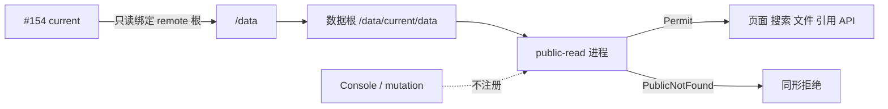

# 【部署】在 Linux 上通过 Docker 提供匿名只读访问

- Issue: [#155](https://github.com/xforce-io/kairo/issues/155)
- 分支: `feat/155-docker-public-read`
- 状态: Approved
- 最后更新: 2026-08-28
- L1: [Approved](https://github.com/xforce-io/kairo/issues/155#issuecomment-5448360334)

## 1. 背景

Kairo 已有隔离的 `public-read` 匿名读取面（#118），但 `kairo serve` 默认绑定本机回环，仓库也没有 Linux 容器交付。把 Console 直接放到公网会暴露 mutation 和 private 数据。

Issue #155 只把 #118 的读取面交付为 Docker 运行形态，消费 #154 的完整备份 [current](../glossary.md)，不改变 public/private 判定。

## 2. 名词解释

本设计新增：

| 术语 | 定义 |
|---|---|
| 数据根 | 见 [docs/glossary.md](../glossary.md)：容器内 public-read 打开的 serve root，必须经 current 跟随到该备份 generation 的 `data/`。 |

已有术语 [remote](../glossary.md)、[current](../glossary.md)、[备份 generation](../glossary.md)、public-read / 显式 public 声明见 [#118 L2](118-document-visibility.md) 与 [#154 L2](https://github.com/xforce-io/kairo/blob/feat/154-remote-full-backup/docs/design/154-remote-full-backup.md)，不抄。

## 3. 目标与非目标

### 3.1 目标

1. 交付可重复构建的 Linux 镜像与最小 Compose 示例。
2. 容器只启动 `public-read`；Console、任务、上传、step 等 mutation 路由不注册。
3. 以非 root、只读容器根文件系统、只读数据挂载运行；不注入 Provider/ASR/SSH 凭据。
4. 匿名用户经既有六类入口（健康检查、页面、搜索、文件、引用、API）读取当前显式 public 内容。
5. current 切换后无需重建镜像、无需写容器；下一请求跟随新 generation。
6. 缺失或损坏的公开状态 fail-closed；空 public 集合是可判定空态。

### 3.2 非目标

- 远程 Console、登录/团队权限、公开状态 mutation、远端写入。
- TLS、域名、反向代理产品化、Kubernetes、镜像仓库发布流水线。
- 对 remote 主机管理员隐藏磁盘上的 private 数据。
- 重写 #118 Reader 或另做一套只读 Web。
- 把数据打进镜像。

## 4. 能力

### 4.1 UI/UX

无管理页面。管理员只通过 Docker 启动/日志/健康检查观察：

- 挂载或数据根不存在：进程拒绝启动，可与“已监听”区分。
- 进程存活：`GET /healthz` 返回既有 `{"ok": true}`。
- 数据就绪：`GET /readyz` 仅在数据根可用且 `public-read.json` 为合法 snapshot（含零 public 根）时 200；current 无效、文件缺失、损坏或非法时 503。响应不含路径、locator、计数或对象字段。
- 空 public 集合：首页/搜索可判定为空，不回退 Console 或 workspace 列表。
- 成功态：页面、搜索、文件、引用、API 可读 public；private、不存在、Console、写入口不可用。
- current 切换后无需重启即可读新 generation。

不提供登录页、远端编辑或公开状态管理界面。

### 4.2 镜像与进程

镜像只包含 Kairo 与 `[web]` 运行依赖。入口固定：

```text
kairo serve <数据根> --mode public-read --host 0.0.0.0 --port 8787
```

- `public-read` 允许绑定非回环，否则容器端口映射无意义。
- `console` 仍只允许 `127.0.0.1` / `::1`；其它 `--host` 拒绝，不得在容器里兜底启动 Console。
- 未知 mode 继续 fail-closed，不得回退 Console。
- 容器用户非 root；Compose 以 `read_only: true` 运行，只为进程需要的临时目录提供 tmpfs。
- 镜像与环境不含 SSH 私钥、Provider/ASR 配置或 backup remote 配置。

### 4.3 挂载与 current 跟随

Compose 把 #154 remote 根只读绑定到容器内稳定路径（例如 `/data`）：

```text
/data/
├── generations/<backup_id>/data/   # 真正的 serve root 内容
└── current -> generations/<backup_id>
```

数据根是 `/data/current/data`。进程必须把该路径当作每次 I/O 都经 current 跟随的词汇路径，不得在启动时 `resolve()` 成某个 `generations/<id>/data` 后钉死。#118 每次请求重读 `public-read.json`；current 原子替换后，下一请求使用新 generation。

只挂载某一个 generation 的 `data/` 不能满足“切换无需重建/重启”。`.incoming/` 即使被挂载也不得被选为数据根。

### 4.4 授权与只读

HTTP 判定只来自数据根内当前有效的 public-read 状态。路径存在、同 workspace、旧 URL、文件名或备份 generation 编号不构成公开授权。缺失、损坏或非法公开状态使全部内容入口同形拒绝；进程可继续存活，以便 current 修复后下一请求恢复。

数据挂载只读。匿名请求前后不得改变备份文件、current 或公开状态。容器内不注册 POST/PUT/PATCH/DELETE、任务、SSE、本机打开或 glossary 管理。

## 5. 思路与折衷

### 5.1 复用 public-read，放弃改造 Console

隐藏写按钮或反向代理过滤不能删除 Console 路由。隔离 app 已存在，容器只启动它。

### 5.2 挂载 remote 根并跟随 current，放弃把数据打进镜像

镜像与备份 generation 独立。代价是容器能读到完整 private 文件；匿名 HTTP 仍只经 #118。remote 必须可信。

### 5.3 启动时不 resolve current，放弃重启换版

resolve 一次会把服务钉在旧 generation。词汇路径跟随让 #154 原子切换对下一请求生效。

### 5.4 `/healthz` 保活、`/readyz` 给编排器，放弃把状态细节塞进健康检查

#118 的 `/healthz` 无数据细节。管理员/编排需要区分“进程在”和“current/公开状态不可用”，故增加无对象字段的 `/readyz`。Docker HEALTHCHECK 使用 `/healthz`，避免公开状态损坏导致容器被杀、无法等到下一次 current 切换。

## 6. 架构



主路径：合法挂载 → 进程监听 0.0.0.0 → `/healthz` 成功 → 匿名六类入口读取当前 public。

失败路径：数据根缺失则拒绝启动；current 或公开状态异常则 `/readyz` 503、内容入口 fail-closed；private/Console/写入口固定拒绝且不写盘。

## 7. 模块

| 模块 | 变化 |
|---|---|
| `cli` / `web.server` | `serve --host`；console 拒绝非回环；public-read 不把数据根 resolve 钉死。 |
| `web.public` | 增加 `/readyz`；不改变 Reader、locator、拒绝形态。 |
| Docker 交付 | Dockerfile 与最小 Compose 示例；非 root、只读根、只读挂载、无凭据。 |
| 测试 | 镜像/Compose 契约、host 绑定、current 跟随、六入口与只读矩阵。 |

不新增 Reader、不新增授权模型。

## 8. API/CLI

### 8.1 CLI

```text
kairo serve ROOT --mode public-read --host 0.0.0.0 --port 8787
```

| 项 | 契约 |
|---|---|
| `--mode public-read` | 只创建 public-read app。 |
| `--host` | public-read 可 `0.0.0.0`；console 仅回环。缺省保持 `127.0.0.1`。 |
| ROOT | 数据根；必须是目录。Docker 中为 `/data/current/data`。 |

### 8.2 HTTP

沿用 #118 公共路由。新增：

| 方法与路径 | 契约 |
|---|---|
| `GET /readyz` | 数据根为目录且 `public-read.json` 合法（含零根）→ 200 `{"ok": true}`；缺失/损坏/非法或 current 无效 → 503 `{"ok": false}`。`Cache-Control: no-store`。无对象字段、不区分原因。 |

`/healthz` 不变。Compose 示例映射宿主端口；TLS 由外部代理负责。

### 8.3 Compose 最小形状

必须表达：镜像、非 root、`read_only`、remote 根只读绑定到 `/data`、命令使用 `/data/current/data`、`public-read`、`0.0.0.0`、健康检查打 `/healthz`。不把具体 UID 实现或基础镜像 pin 写进本契约。

## 9. 边界

- 公共容器不得注册 Console 或 mutation。
- 匿名 HTTP 不扩大到磁盘上可见的 private 文件。
- 数据根必须经 current 跟随；不得把 `.incoming` 或任意 generation 目录当默认数据根。
- 镜像与数据 generation 独立；不兼容时内容 fail-closed，不回退 Console。
- 不在容器内执行 backup push/restore。
- 日志不得输出路径、locator、backup_id 以外的对象标识；`/readyz` 不区分损坏原因。

## 10. 迁移/兼容/回滚

- 本地 `kairo serve` 默认仍是 console + 127.0.0.1。
- 新增 `--host` 与 `/readyz`；旧客户端忽略未知路由以外的行为不变。
- 无 Docker 时 CLI public-read 仍可用。
- 回滚：停容器即停止公开读取；磁盘备份与 #118 状态文件保留。不自动公开任何根。

## 11. 测试计划

### E2E

- **S1**：构建镜像并用 Compose 挂载含显式 public 根的 #154 布局；`/healthz` 与 `/readyz` 成功；页面、搜索、文件、引用、API 读取 public。替换 current 到新 generation，不重建镜像、不重启容器，下一请求读到新 public 内容。
- **S2**：同一备份含 private。匿名遍历页面直链、搜索、文件、引用、API；Console 与创建/修改/删除/运行入口。断言 private 与不存在同形拒绝、五类旁路泄露为 0、可调用写入口为 0、挂载内容不变。

### Integration

- public-read `--host 0.0.0.0` 可绑定；console 非回环拒绝。
- 启动时 resolve 钉死被禁止：current 替换后 Reader 读新 `public-read.json`。
- `/readyz`：缺失 current/data → 503；合法 `public-read.json` 且零根 → 200；缺失或损坏 `public-read.json` → 503 且内容入口 fail-closed。
- 只读挂载下任意 mutation 路由 404/405，文件 mtime/hash 不变。

### Unit

- mode/host 校验矩阵。
- `/readyz` 归一化，无对象字段。
- public-read 路由集合不含 Console/mutation。

## 12. 开放问题

无。镜像仓库发布、TLS 终止、多实例负载均衡留待后续。

## 13. 关联

- [#155](https://github.com/xforce-io/kairo/issues/155)
- [#118](https://github.com/xforce-io/kairo/issues/118) / [docs/design/118-document-visibility.md](118-document-visibility.md)
- [#154](https://github.com/xforce-io/kairo/issues/154) / [docs/design/154-remote-full-backup.md](https://github.com/xforce-io/kairo/blob/feat/154-remote-full-backup/docs/design/154-remote-full-backup.md)
- [#156](https://github.com/xforce-io/kairo/issues/156)
