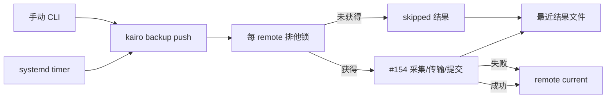

# 【备份】按固定周期更新远端备份并保留可用版本

- Issue: [#156](https://github.com/xforce-io/kairo/issues/156)
- 分支: `feat/156-periodic-remote-backup`
- 状态: Approved
- 最后更新: 2026-08-28
- L1: [Approved](https://github.com/xforce-io/kairo/issues/156#issuecomment-5448360744)

## 1. 背景

#154 提供一次性 `backup push/verify/restore`、恢复闭包校验和 current 原子切换。workspace 会持续变化，需要按计划重复同一入口，并让管理员看见最近一次是否成功。

若周期能力再实现传输或版本语义，就会与 #154 分叉。操作系统已有定时器，本 Issue 只补齐单运行约束、最近结果与 Linux 调度示例。

## 2. 名词解释

本设计新增或易混：

| 术语 | 定义 |
|---|---|
| 最近结果 | 见 [docs/glossary.md](../glossary.md)：源环境为某个 remote 保留的最近一次备份尝试记录。 |
| 重叠跳过 | 见 [docs/glossary.md](../glossary.md)：同一 remote 上一轮仍在运行时，本轮不启动第二次备份。 |

[remote](../glossary.md)、[current](../glossary.md)、[备份 generation](../glossary.md)、[备份清单](../glossary.md) 以 #154 为准，不抄。

## 3. 目标与非目标

### 3.1 目标

1. 按固定周期调用 #154 同一个一次性备份实现，不第二套传输。
2. 同一 remote 同时最多一个运行；重叠周期记录为重叠跳过，不争抢 current。
3. 源环境持久化最近结果：最近尝试时间、最近成功时间、当前 backup_id、成功/失败/跳过状态。
4. 失败不切换、不删除远端 current；前置恢复后下一周期自行收敛。
5. 提供 Linux systemd oneshot + timer 示例，管理员可直接启用。

### 3.2 非目标

- 常驻同步 daemon、实时文件监听、分布式队列、复杂退避重试、告警平台。
- 双向同步、远端写入、current 回拨。
- 在 Kairo 配置里发明第二套调度语言；周期落在操作系统定时器。
- 跨平台安装器（launchd/Windows）。其它系统可手动调同一命令。
- 改变 #154 的恢复闭包、备份清单或 remote 提交协议。

## 4. 能力

### 4.1 UI/UX

无页面。管理员观察：

1. 手动 `backup push` 已成功后，启用固定周期定时器。
2. 到期进入运行；无重叠则执行同一 push。
3. 有变化且成功：current 更新；最近结果四项同步更新。
4. 无变化：状态为成功无变更，current 与 backup_id 保持。
5. 连接/校验失败：状态为失败，最近成功时间与 backup_id 保持，远端 current 仍可 verify。
6. 上一轮未结束：本轮重叠跳过，不启动第二次传输。
7. `kairo backup status REMOTE` 可读取上述四项；无记录时明确为空，不得显示成功。

### 4.2 单运行与结果存数

源环境为每个 remote 名准备一把排他锁。锁的持有范围覆盖整个 push（扫描到提交或失败）。未能立即获得锁 → 重叠跳过：写最近尝试时间与 `skipped`，不改最近成功时间、backup_id，不接触 remote。

最近结果是源机器状态，不进入 serve root，不跟随备份到 remote。路径沿用 XDG：优先 `$XDG_STATE_HOME/kairo/backup/<remote>.json`，未设置则 `~/.local/state/kairo/backup/<remote>.json`。remote 名必须通过 #154 的同一名称校验，方可成为文件名。

schema version 1：

| 字段 | 契约 |
|---|---|
| `schema_version` | 精确 `1`。 |
| `remote` | 配置中的 remote 名。 |
| `last_attempt_at` | 本次尝试开始的 UTC ISO-8601。 |
| `last_success_at` | 最近一次 `pushed` 或 `unchanged` 的 UTC ISO-8601；从未成功则为空。 |
| `backup_id` | 源环境已知的远端 current 备份 generation；从未成功则为空。 |
| `status` | `pushed` / `unchanged` / `failed` / `skipped`。 |
| `summary` | 失败或跳过的脱敏短句；成功可空。不得含私钥、token、源绝对路径或完整 SSH 命令。 |

非法/损坏结果文件时，`status` 命令失败并提示记录不可读，不得把损坏当成功。写结果用临时文件 + `os.replace`。

### 4.3 与 #154 push 的关系

每一次 `kairo backup push`（手动或定时器）都走同一锁与同一结果写入。这样不会出现“人手 push 与 timer 并发上传”。`verify`/`restore` 不占该锁、不改最近结果。

定时器只执行：

```text
kairo backup push REMOTE [ROOT]
```

成功退出码 0（含 unchanged）或跳过/失败的非零退出由 systemd 记入 journal；Kairo 结果文件仍是产品可见状态。重叠跳过使用退出码 `0` 还是非零：记为 **非零 3**，以便 journal 显示本轮未执行备份，同时结果文件 `status=skipped` 可判定。不得把 skipped 伪装成 `pushed`。

### 4.4 Linux 调度示例

仓库提供 systemd 模板（路径归实现 PR，契约如下）：

- `kairo-backup@.service`：Type=oneshot，`ExecStart=kairo backup push %i`，User 为运行源环境的普通用户。
- `kairo-backup@.timer`：`OnCalendar` 由管理员设置（示例每日）；`Persistent=true` 以补上停机期间最近一次；`Unit` 指向对应 service。
- 不启用 `Restart=always`。不并行 `%i` 以外的锁；Kairo 锁是权威单运行约束。

周期不写入 `config.toml`。换周期只改 timer。

## 5. 思路与折衷

### 5.1 一次性命令 + 操作系统定时器，放弃 Kairo daemon

systemd/cron 已解决重启、日志和日历。Kairo 保持可退出、可手动复现。

### 5.2 锁与结果挂在 push 上，放弃第二套 `tick` 命令

否则手动 push 与 timer 仍会并发。代价是 #154 的 push 增加源侧锁和结果文件；这是周期安全所需的最小闭合，不是新传输协议。

### 5.3 失败不重试风暴，放弃内置退避

固定周期提供下一次收敛。内置多轮重试会造成重叠和远端压力。

### 5.4 周期留在 systemd，放弃 Kairo 调度 DSL

三个字段的 remote 配置不应再长出 cron 表达式解析器。

## 6. 架构



主路径：timer/手动 → 获锁 → #154 push → 写结果。

失败路径：未获锁 → skipped；push 失败 → 结果 `failed`，current 保持；损坏结果文件 → status 命令失败，不改变 remote。

## 7. 模块

| 模块 | 变化 |
|---|---|
| `backup`（#154） | push 外包源侧锁与最近结果写入；verify/restore 不动。 |
| `cli` | `kairo backup status REMOTE`；push 退出码含 skipped=3。 |
| systemd 示例 | oneshot + timer 模板与最短 README 片段。 |
| 测试 | 锁、四字段、失败保留、skipped、损坏记录。 |

不新增 transport，不改 backup.json。

## 8. API/CLI

| 命令 | 成功 | 失败 |
|---|---|---|
| `kairo backup push REMOTE [ROOT]` | 同 #154，并更新最近结果；重叠时 `status=skipped`、退出码 3。 | 同 #154；写 `failed` 结果，current 不变。 |
| `kairo backup status REMOTE` | 打印四项：`last_attempt_at`、`last_success_at`、`backup_id`、`status`。 | 配置非法退出 2；无记录时退出 0 并明示 empty；记录损坏退出 1。 |

无 HTTP。无 `backup schedule` 写配置命令。

## 9. 边界

- 仅已配置 remote 可运行；非法名不得写结果文件。
- 同一 remote 同时最多一个 push。
- 失败/跳过不得删除或切换 current。
- 结果文件不含密钥与源绝对路径。
- 定时器停用后，Kairo 不再自发 push。
- #155 不是本 Issue 验收前置；S2 以 `backup verify` 证明旧 generation 仍可读。

## 10. 迁移/兼容/回滚

- 启用：无历史结果文件视为 empty，不补造成功。
- 兼容：#154 schema 不变；旧 Kairo 无 status 命令、无结果文件。
- 回滚代码：停止 timer 即停止周期；已有 current 与结果文件保留为惰性数据。
- 结果 schema 只接受 version 1；未知版本 status 失败。

## 11. 测试计划

### E2E

- **S1**：已验证 remote 上用短周期测试 timer（或等价调用同一 `push`）修改 workspace 后自动运行；断言远端 current 更新，`backup status` 含尝试时间、成功时间、backup_id、`pushed`。再次无变更运行，状态为 `unchanged`。
- **S2**：保留可校验 current，阻断网络触发失败；断言 current 未切换且 `verify` 仍通过，status 为 `failed`、`last_success_at`/`backup_id` 保持。恢复网络后下一周期 `pushed` 或 `unchanged`，无需手工删锁或修结果文件。重叠：一次长 push 期间第二次 push 为 skipped、退出码 3、远端只有一个新 generation。

### Integration

- 锁文件互斥、崩溃后锁释放可再运行。
- 结果原子替换；损坏文件 status 失败。
- push 失败不改 `last_success_at`。
- timer 单元只调用 `kairo backup push %i`。

### Unit

- 四字段与状态转换：empty → pushed → unchanged → failed → skipped。
- remote 名到结果路径的安全映射。
- summary 清洗。

## 12. 开放问题

无。保留策略、告警 webhook、非 Linux 调度器另开需求。

## 13. 关联

- [#156](https://github.com/xforce-io/kairo/issues/156)
- [#154](https://github.com/xforce-io/kairo/issues/154) / [docs/design/154-remote-full-backup.md](https://github.com/xforce-io/kairo/blob/feat/154-remote-full-backup/docs/design/154-remote-full-backup.md)
- [#155](https://github.com/xforce-io/kairo/issues/155)（下游消费者，非本验收前置）
