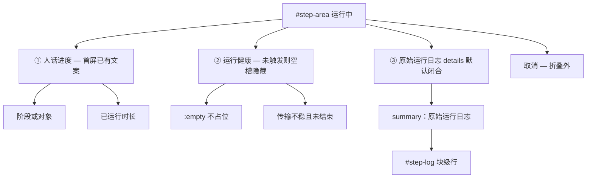
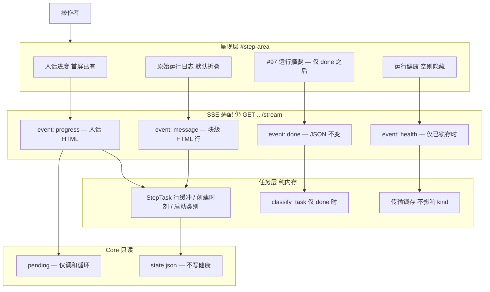
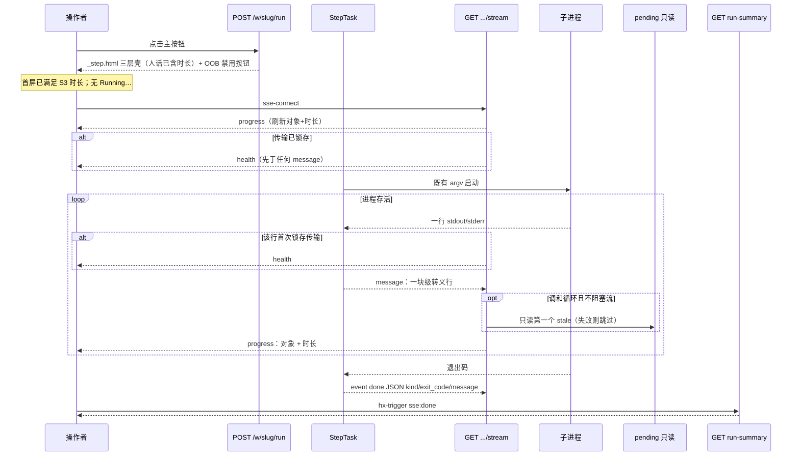
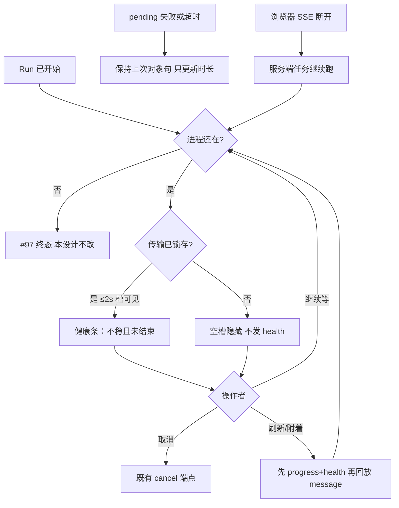

# 【Web】运行中能看懂进度且不把 agent 日志当状态

- Issue: https://github.com/xforce-io/kairo/issues/157
- 分支: `feat/157-run-panel-progress`
- 状态: Draft
- 日期: 2026-08-28
- 关联 L1: https://github.com/xforce-io/kairo/issues/157#issuecomment-5449943814

## 1. 背景

Web 工作区右侧 ACTIONS 把一次 `kairo run`（及附着的 `step` / `retry-ref` / `prose`）子进程的合并 stdout/stderr 当作进度面。`TaskRegistry._pump` 对每一行 `rstrip("\n")`，`stream_events` 再 `yield f"data: {line}\n\n"`，SSE `message` 载荷里没有换行；`templates/_step.html` 的 `#step-log` 以 `sse-swap="message"` + `hx-swap="beforeend"` 追加。结果是材料目录表、Codex `hook: SessionStart`、`ERROR: Reconnecting… 2/5…5/5`、`Falling back from WebSockets to HTTPS`、`request timed out` 与 kairo digest 目录粘成一段。`app.css` 虽给 `#step-log` 设了 `white-space: pre-wrap`，事件之间没有 `\n`，粘墙无法靠 CSS 补救。

同时 `.step-status` 在 `sse:done` 之前只渲染 `step.running`（Running… / 运行中…），绿点脉冲。`is_fatal_agent_line` 只覆盖 Grok 代理致命句与 `cli agent timeout` / `provider-failed`，不含 reconnect / HTTPS fallback / `request timed out`。进程未退出时 `classify_task` 固定为 `running`。操作者无法判断：还在消化某条参考、传输已不稳但仍在等、还是该取消。CLI agent 默认超时约 600s（`DEFAULT_CLI_TIMEOUT_S`），本机可配到数分钟～更长，空等代价高。

[#75](https://github.com/xforce-io/kairo/issues/75) 只收敛单一主按钮；[#97](https://github.com/xforce-io/kairo/issues/97) 只定义子进程结束后的成功 / 失败 / 取消。二者都不覆盖**运行中**。本期只改本次 Run 在 `#step-area` 的进行时呈现，结束后仍整区换成 #97 运行摘要。

## 2. 名词解释

`workspace` 与 `digest` 见 [`docs/glossary.md`](../glossary.md)，不另造别称。本设计新增三个规范名已写入该表；此处只列易混划界，不抄长表。

| 规范名 | 一句话定义 | 禁止别称 |
|---|---|---|
| 人话进度 | 运行中默认可见的一行状态：当前步骤或对象（能判则判）加上已运行时长；不是 agent 原文，也不是 #97 终态。 | 进度条、ETA、控制台状态、Running… |
| 运行健康 | 本次 Web 任务会话内的传输稳定性提示；出现指定传输类事件且进程未退出时，明示「不稳但仍在跑」。 | 失败、Run failed、provider-failed、任务终态 |
| 原始运行日志 | 子进程合并 stdout/stderr 的按行原文，默认折叠，展开后才可见。 | 进度面、状态区、运行摘要 |

易混（不新造，只划界）：

- **任务终态**（#97）：子进程结束后的 `succeeded` / `failed` / `cancelled`。运行健康不是终态。
- **安全错误摘要**（#97）：结束后从缓冲提炼的失败说明。原始运行日志不是摘要。
- **调和循环任务**：子进程最终走 `engine.step` 的入口（`run` / `step` / `re-step` / `retry-ref`）。`prose` 走 `generate_prose`，不是调和循环任务。

## 3. 目标与非目标

### 3.1 目标

1. 一次 Run 中，子进程连续输出的每一行在展开后的原始运行日志里独占一条视觉行；材料目录表（markdown `| … |` 行，含表头与分隔）至少 5 行可分行阅读，不粘成一段（对上 S1）。
2. 出现 `Reconnecting…` / HTTPS fallback / `request timed out` 任一传输类事件后 **2 秒内**，进程未退出时，状态区不再只显示无修饰的 Running…，并明示传输不稳且任务未结束（对上 S2）。刷新/附着后，若本次任务已见过传输类事件，健康槽同样在连接后 2 秒内可见，且不依赖日志是否灌完。
3. 默认视图给人话进度（含已运行时长，秒或分，允许整分粒度），原始运行日志默认不展开、不占满操作区；用户主动展开后才看到 hook / 目录表 / 重连原文（对上 S3）。人话槽在 `_step.html` **首屏**即有内容，不等第一条 SSE `progress`。
4. 进程退出后仍只由既有 `event: done` + `GET /w/{slug}/run-summary?task_id=` 渲染 #97 终态；运行中的提示不写入 `.kairo/state.json`，不改变 `classify_task`。

### 3.2 非目标

- 不改 CLI `kairo run` / `step` / `re-step` / `retry-ref` / `prose` 的语义、退出码或对外输出协议。
- 不修 Codex / Grok / Claude 传输层，不改 `[agent] timeout_s`（含 `DEFAULT_CLI_TIMEOUT_S`）。
- 不把原始运行日志或运行健康持久化进 workspace / `state.json`。
- 不改 #97 结束态分类（退出码 + 取消意图 + `is_fatal_agent_line`）；不把传输类事件补进致命行。
- 不做跨 Run 的历史时间线，不做百分比 / ETA / 多 job 队列。
- 不把 stdout 与 stderr 拆成两路（`Popen(stderr=STDOUT)` 保持）。
- 运行中不用红字宣称 provider-failed；不把未退出任务标成 Run failed。
- 不让人话进度表示「操作者点了哪条参考」，只表示进程此刻在跑什么（见 §5.2）。
- 本设计文档本身不是实现。

## 4. 能力

用户点击 #75 主按钮（或附着中的 step / retry / prose）后，`#step-area` 在进程存活期间固定为三层，而不是一块黑盒终端。取消按钮始终在折叠区之外。`sse:done` 触发后，整区仍替换为既有 run-summary HTML，三层全部消失。

### 4.1 UI/UX

#### 信息架构

面板仍只出现在工作区右栏 ACTIONS 的 `#step-area`（`workspace.html`），不新增页面、不进阅读区。

自上而下唯一顺序：**人话进度 → 运行健康 → 原始运行日志 → 取消**。#75 主按钮仍在 `#step-area` 上方，运行中 OOB disabled（#114），不进本面板。

#### 布局与交互

右栏窄。人话进度 1～2 行，短句，可带既有脉冲点表示「仍在跑」；传输不稳时点改为警告色（琥珀），**禁止错误红**。运行健康槽始终在折叠区外、人话进度之下；**未触发时槽内为空**，用 `:empty { display: none }` 不占垂直空间，**未触发不发 `health` 事件**。出现后 1～2 行警告文案，可弱提示「可等待或取消」，不盖住取消按钮。原始运行日志用 `
`：闭合时只露 summary；展开后沿用深色等宽 `#step-log`（`max-height: 340px` 滚动）。行是块级元素，不依赖事件之间的 `\n`。取消仍为 `btn-ghost`，`hx-post .../cancel`，`hx-target="#step-area"`（取消后的文案与 #97 关系不在本期改）。

展开/闭合只存在于本次 DOM：刷新或 #114 附着重新挂上 `_step.html` 时**回到默认闭合**。不写 cookie / localStorage。

窄屏（既有 `@media (max-width: 880px)` 单栏）：三层顺序不变；不把日志改为默认展开。

无障碍：人话进度与运行健康为 `role="status"` / `aria-live="polite"`；`
/
` 可键盘打开；原始运行日志不是默认读屏焦点。

#### 全状态

| 状态 | 人话进度 | 运行健康 | 原始运行日志 | 主按钮 | 取消 | 判定一句 |
|---|---|---|---|---|---|---|
| 未开始 | 不渲染本面板 | — | — | 可点 | — | `#step-area` 空，或仅上次 #97 摘要 |
| 启动中 | 首屏即「启动中」（或已能判的对象句）+ 已运行时长 | 空槽隐藏 | 折叠，可为空 | disabled | 可见 | HTML 已出、SSE 可尚未连上；**不是**成功；**禁止**无修饰 Running… |
| 运行正常 | 阶段/对象 + 时长，可持续刷新 | 空槽隐藏 | 默认折叠 | disabled | 可见 | 仍在跑，无传输类事件 |
| 传输不稳 | 仍刷新阶段/时长 | **必须**明示不稳且任务未结束；与纯 Running… 互斥 | 默认折叠；展开可见原文 | disabled | 可见 | 进程未退出；**不是** Run failed |
| 用户展开日志 | 同上 | 同上（若已触发则保持） | 展开，每行独占视觉行 | disabled | 可见 | hook/目录/重连只在这里 |
| 进程已退出 | 整区被 #97 摘要替换 | 不得残留「仍在跑」 | 随面板消失，不持久 | OOB 按 plan 恢复 | 无 | 终态只认 `done` + run-summary |

关键状态（对上 L1）：

- **空**：尚未开始，或已开始但尚不能判对象 → 首屏「启动中」+ 时长，不是假成功。
- **错（运行中）**：三类传输事件任一出现且进程仍在 → 健康条改口；禁止红字 provider-failed / Run failed。
- **成功（运行中的「成」）**：人话进度能随时间或对象变化刷新；展开后 ≥10 行各自一行、目录表 ≥5 行可分行。任务是否成功仍以 #97 为准。
- **不做的界面**：默认展开的 Codex/Grok 控制台；进程未退出时红字宣称 provider-failed；运行中状态区再写 `step.running` / `run.running`。

#### 人话进度文案契约

一行主句，语言走既有 `i18n.py` 中英表。时长从 **本次任务创建时刻**（内存，不落盘）起算，刷新/附着不归零；`< 60s` 用秒，`≥ 60s` 允许整分（「3 分」即可，不强制秒）。

**首屏即人话，SSE 只刷新。** `_step.html`（`_step_response` 与整页 ``）在浏览器发起 `sse-connect` 之前就必须画出人话槽：新任务为「启动中」+ 已运行时长（可为 0 秒）；附着/整页预填按创建时刻计算时长，能判对象则用对象句。`progress` 事件只替换该槽，不是人话的唯一来源。运行中默认视图**禁止**再出现无修饰的 `step.running` / `run.running`（S2/S3 的互斥对象）。

对象句的数据源按任务类别分轨，**禁止**把 `pending()` 第一个 stale 写成全任务事实：

| 任务类别 | 对象句数据源 | 禁止 |
|---|---|---|
| 调和循环（`run` / `step` / `re-step` / `retry-ref`，最终 `engine.step`） | 只读 `pending()` 规则顺序下**第一个仍 stale** 的 `WorkItem` | 用点击的 ref 覆盖引擎实际在跑的项 |
| `prose`（`generate_prose` / `NormalizeRule(force_enabled=True)`） | 启动时已知的该 `ref_id` 标题 →「正在整理文稿「{title}」」；标题不可得则「运行中」+ 时长 | 调用 `pending()` 把其它 digest/compose 冒充成当前对象 |
| 其它非调和 argv | 「运行中」+ 时长 | 同上 |

主句映射（仅在已有合法对象句数据源时使用）：

| 条件 | 主句意图（中文语义） |
|---|---|
| 尚无合法对象（新任务首屏、pending 尚未可读、清 blocked 尚未出现 stale） | 启动中 |
| key 指向 `transcript`（含 `transcript.md` 与 keyed `transcript.*.md`） | 正在转写「{title}」 |
| key 指向 `source_text` | 正在提取正文「{title}」 |
| `…/digest.md` | 正在消化「{title}」 |
| `…/prose.md`，或本任务即为 `prose` | 正在整理文稿「{title}」 |
| `understanding.md` / `assessment.md` | 正在综合该产物 |
| **调和循环**且本任务**曾经**读到过非空 pending、此刻 pending 已空、进程未退出 | 正在收尾 |
| 推断失败，或非调和循环且无启动标题 | 运行中 |

「正在收尾」不得用于：`prose`、从未出现过 pending 的调和循环（例如刚开始清 blocked、`pending_n==0`）、读 pending 失败。这些走「启动中」或「运行中」，避免把「文稿才开始」说成收尾。

人话反映**调和循环真正在跑的项**，不是触发按钮的 reference。对 B 点「重新处理」而引擎先跑仍 stale 的 A 时，人话是 A。纠正引擎顺序不在本期。

禁止：百分比、预计剩余、把 hook / `ERROR:` / 目录表原文放进这一行。标题等可变文本进 HTML 前必须转义（§8.1 / §9）。

#### 运行健康文案契约

触发（大小写不敏感，行内匹配即可）：

1. `Reconnecting`（含 `Reconnecting… 2/5` / `5/5`）
2. `Falling back from WebSockets to HTTPS`（或等价 HTTPS fallback 句）
3. `request timed out`

任一命中且 `task.done is False`：从该行进入任务缓冲（或新 SSE 连接发现**内存已锁存**「见过传输类行」）起 **2 秒内**，健康槽可见，语义固定为 **传输不稳，任务尚未结束**。可附「可继续等待，或取消」。一旦锁存，本次任务结束前**保持**（不因后续正常行自动藏回去）。结束后面板被 #97 替换，健康条不得活过 `done`。

未触发：**不发** `health` 事件；模板健康槽保持空，靠 `:empty` 隐藏。不发空字符串去 `innerHTML`（避免与 `:empty` 分叉）。

不触发健康条：`hook:`、目录表、普通 INFO、`is_fatal_agent_line` 命中的代理致命句（那些仍只进原始运行日志；是否失败等退出后再由 #97 判）。

#### 原始运行日志

- 默认：`
` 闭合；summary 不含日志正文。默认视图不得出现 `hook:`、`| 标题 |`、`Reconnecting` 原文。
- 展开：每个子进程输出行一个块级节点（转义后的纯文本，不渲染 markdown）。目录表的表头、`|---|`、数据行各是独立视觉行。
- **空行**：对应的块级元素最小高度等于一行（与 `#step-log` 的 `line-height` 一致，现为 1.55）。空盒子不得塌成 0 高度。
- 缓冲上限仍为每任务最近 2000 行（既有 `TaskRegistry(max_lines=2000)`）。
- 不提供搜索、过滤、复制全部、下载。

## 5. 思路与折衷

核心选择：**三层面板**，而不是把黑盒终端修美观。人话进度回答「在干什么、已经多久」；运行健康回答「还要不要等」；原始运行日志回答「原文到底说了什么」，且默认不抢主位。

### 5.1 放弃项

- **放弃把完整 agent 控制台当默认进度。** Codex hook、材料目录与重连噪声会淹没判断；S3 明确默认不看原文。
- **放弃只靠加长 `timeout_s` 或修 provider「看起来不失败」。** 传输不稳必须显式告知；修传输与改超时都在非目标之外。
- **放弃运行中用日志关键字猜成功/失败。** 那是 #97 在进程退出后用退出码 + 取消意图 + 致命行做的事。把 `Reconnecting` 或 `request timed out` 写进 `is_fatal_agent_line` 会在进程仍活时制造假失败，并与 S2「任务未结束」冲突。
- **放弃把运行健康写入 `state.json`。** 健康是本次浏览器会话对「这条 SSE 流」的提示；写盘会与 #98 持久化诊断、#97 即时终态三套事实缠在一起，刷新/CLI 也无法解释「哪一次 Web 点击的传输抖动」。
- **放弃拆分 stdout/stderr 或改子进程启动。** 合并发生在 `TaskRegistry.start` 的 `stderr=STDOUT`；拆流要动进程模型，超出「只动呈现与 SSE 行包装」。
- **放弃新增进度 HTTP 资源。** 仍只走既有 `POST /w/{slug}/run` 与 `GET .../stream`。人话/健康用 **SSE 命名事件** 推 HTML 片段，避免第三套 URL 与 run-summary 抢语义。
- **放弃用 SSE `data:` 空行补 `\n` 当唯一分行手段。** 能过 pre-wrap，但不转义、仍是同一文本节点粘接风险，且 HTMX `beforeend` 对 HTML 注入不友好。改为**一行一块级元素**。
- **放弃把 Web 面板当成 TTY。** Codex 若用 `\r` 在同一终端行刷新重连计数，泵出的每一行仍各追加一个块级行，不覆盖上一行。覆盖会丢掉 `2/5…5/5` 的可读历史，也不是 S1 要的「分行阅读」。
- **放弃用 `pending()[0]` 描述所有 Web 任务。** 它只对最终 `engine.step` 的调和循环成立；`generate_prose` 的 Normalize 默认关闭，`pending()` 枚举不到正在写的 `prose.md`，会把别人的 digest 说成当前对象。
- **放弃人话跟随「点了哪条」。** 与引擎实际顺序不一致时，跟点击是错对象，跟 `pending()` 才是「此刻在跑什么」。

### 5.2 人话对象从何而来

kairo CLI 在跑的过程中几乎不打「正在 digest X」。人话进度若只靠扫 agent 原文，会把目录表再当状态。

**调和循环任务**（`run` / `step` / `re-step` / `retry-ref`）：Web 层对当前 workspace **只读** `pending()` / `WorkItem.key`（`engine.pending` 已存在，discover/is_stale 不碰 provider）。`engine.step` 按 `_build_rules` 顺序执行，当前项在 `item.run` 返回前仍 stale（#105 在该项结束后才 `write_state`），故「当前对象 ≈ 规则顺序下第一个仍 stale 的 WorkItem」。标题来自既有 manifest，缺则用 id。`retry_reference` 清完指定 ref 后仍调用完整 `step()`：人话跟循环真正在跑的第一项，即使操作者点的是另一条。

**`prose` 任务**：不走 `step()`，只对目标 `prose.md` 跑 `NormalizeRule(..., force_enabled=True)`。默认 `NormalizeConfig.enabled` 为关，`pending()` **不会**列出该 prose。人话只用启动时记下的类别与 `ref_id` 标题（`POST .../prose` 已知），固定「正在整理文稿」；禁止用工作区里其它 stale digest/compose 冒充。标题读失败则「运行中」+ 时长。

读 pending 失败、超时或跳过：保持**上一次已成功的对象句**（没有则「启动中」/「运行中」），**仍更新时长**；不得中断 SSE，不得改 `kind`。

时长不依赖日志：任务内存记录创建时刻。首屏 HTML 已带时长；SSE `progress` 周期刷新，避免长静默 digest 时时长冻结。刷新/附着按同一创建时刻计算，不归零。

代价：对象粒度是工作项而非 agent 内部 token；`retry-ref` 可能先显示别人的 pending 项。可接受：用户要判的是进程此刻在做什么，不是按钮标签。

### 5.3 传输不稳与致命行分轨

| 信号 | 运行中 | 进程已退出 |
|---|---|---|
| 三类传输事件 | 运行健康；`classify_task` 仍 `running` | 不单独构成 failed；跟退出码走 |
| `is_fatal_agent_line` | 只进原始运行日志，不红字终态 | #105：即使 exit 0 也可 failed |
| 退出码 / 取消 | 尚未发生 | #97 唯一终态源 |

2 秒预算以**健康槽可见**为准，不以 `#step-log` 是否灌完、是否展开为准。

- 活流：传输类行写入缓冲时锁存；本轮一旦命中，**立即**发 `health`（不得排在本轮剩余 `message` 或一次 `pending()` 之后）。
- 新连接（刷新/附着/回放）：若锁存已立，在**任何** `message` 回放之前先发 `progress` 与 `health`。禁止先同步灌最多 2000 个块级行再发健康——HTMX 对每条 `message` 一次 `beforeend`，会打穿 2 秒 SLA。
- `pending()` 不得与 `message`/`health`/`done` 同拍阻塞：对象句可节流、复用上次，时长仍走 1Hz 心跳。

### Key Decisions

见文末「Key Decisions」压缩表；与本节一致。

## 6. 架构

### 6.1 分层

- **呈现层**：只消费命名 SSE 与既有 run-summary；不在浏览器里用日志猜成功失败。首屏人话由服务端渲染 HTML 填入，不空等 SSE。
- **SSE 适配**：连接后先 `progress`（及若已锁存则 `health`），再回放 `message`；活流包装块级行；周期发人话；结束仍 `result_payload`。
- **任务层**：生命周期、串行锁、取消、2000 行缓冲不变。内存增加：创建时刻、启动类别（调和循环 vs `prose`）及 prose 的 ref 标题、传输锁存。均不落盘。
- **Core**：仅调和循环只读 pending；`prose` 不读 pending 当对象；禁止 Web 为健康/进度写 state。

### 6.2 主路径

默认视图：操作者只看到人话进度（及必要时健康条）和「原始运行日志」summary、取消。不展开则看不到 hook 墙。`prose` 路径不进入 `pending()` 分支，人话保持启动时的文稿句。

### 6.3 失败路径

- 传输不稳：**不是**失败路径的终点；只改变健康层。
- 读 pending 失败或慢：跳过本拍对象刷新，保持上次对象句并更新时长；**不得**阻塞 `message` / `health` / `done`，不得标 failed。
- 浏览器断连：与现状相同，生成器仍跑到 `task.done`；重连按 §8.1 顺序回放。断连本身不改变任务终态（#97 已约定）。
- 任务缺失：`GET .../stream` 仍 404；run-summary 仍 `missing`。不在本期发明第三种空态。

## 7. 模块

单模块：Web 运行面板（`src/kairo/web` 内任务流 + `_step.html` + 文案/样式）。不拆新包，不改 `engine` / `provider` / CLI。

| 块 | 职责 | 不做什么 |
|---|---|---|
| SSE 任务流 | 行 → 块级 HTML；传输锁存并按 §8.1 顺序推健康；按任务类别推人话；`done` JSON 保持 `kind` / `exit_code` / `message` | 不改 `classify_task`；不把传输写入致命行；不落盘；不让 pending 堵住流 |
| 运行面板模板 | 三层 DOM：首屏已填的人话槽、空的健康槽、默认闭合的日志 + 取消；`sse:done` 仍只打 run-summary | 不把 `done` 灌进 `#step-log`；不默认展开；首屏不写 `step.running` |
| 文案与样式 | 中英人话/健康/summary；健康琥珀而非错误红；空行一行高；空健康槽 `:empty` 隐藏 | 不新增页面皮肤体系 |
| 视图入口 | `_step_response` / 整页预填仍渲染同一 `_step.html`，用人话已填时长；路径不变 | 不新增公开路由 |

`pending()` 仅调和循环只读；`prose` 用人话启动意图。失败/超时降级见 §5.2。#75 按钮、#114 附着、#97 摘要仍是面板的上下游，本模块不重新定义它们。

## 8. API/CLI

无对外新 CLI，无新公开 HTTP 资源。写操作与结束摘要保持：

| 入口 | 本期契约 |
|---|---|
| `POST /w/{slug}/run` | 启动或附着，返回三层壳 HTML + OOB 主按钮。**人话槽在响应 HTML 内已有主句与时长**，不空等 SSE。 |
| `POST /w/{slug}/step` 等（含 `retry-ref` / `prose`） | 同左，仍共用 `_step_response`。`prose` 的人话按启动 ref，不读 pending。 |
| `GET /w/{slug}/step/{task_id}/stream` | 仍 `text/event-stream`。`message` / **新** `progress` / **新** `health`（仅已触发）/ 既有 `done`。连接后事件顺序见 §8.1。 |
| `POST /w/{slug}/step/{task_id}/cancel` | 不变。 |
| `GET /w/{slug}/run-summary?task_id=` | 不变：只在结束后被 `sse:done` 拉取；终态优先于 plan。 |

### 8.1 SSE 事件契约

每个事件的 `data` 若为 HTML，必须是**单行**片段（片段内无原始 LF），以免拆坏 SSE。凡进入 `progress` / `health` / `message` 的**可变文本**（日志原文、manifest 标题、ref id、产物路径）必须做 HTML 转义（至少 `& < > "`）。禁止把未转义标题当 HTML。`health` 正文为固定句，不含日志原文。时长数字由服务端格式化进已转义模板，不把原始标题与 HTML 标签拼接。

**连接后事件顺序（刷新/附着/首次，硬顺序）**

1. `progress`（当前对象句 + 自创建时刻起的时长）
2. 若传输锁存已立：`health`
3. 再回放缓冲中的 `message` 行
4. 进入活流；`done` 仍在进程结束后最后一条

SLA：步骤 1–2 不得等待步骤 3 完成。健康槽可见的 2 秒从「行入缓冲」或「新连接已锁存」起算，不从「2000 行 DOM 灌完」起算。

**`message`（默认事件）**

- 何时：子进程每一行，含回放（回放不得早于上述 1–2）。
- 载荷：恰好一个块级元素，文本为 HTML 转义后的该行。剥掉行尾 `\n` / `\r` / `\r\n`；行内残留 CR/LF 压成空格。空行仍产出一个块级元素，且该元素最小高度为一行。
- 消费：`#step-log` `sse-swap="message"` `hx-swap="beforeend"`。
- 破坏性：相对今日「裸文本 `data: {line}`」是有意破坏；唯一消费者是本面板。禁止再把未转义原文当 HTML 插入。

**`progress`**

- 何时：连接后按顺序第一条；之后至少每 1 秒一条（即使没有新日志、即使本拍跳过 pending）；对象变化时可提前。进程 `done` 后不再发。
- 载荷：人话进度的单行 HTML 片段（替换人话槽），含已转义的主句与已运行时长。
- 消费：人话槽 `sse-swap="progress"` `hx-swap="innerHTML"`。
- 不含 `kind`、退出码、成功/失败词。不是人话的首屏来源。

**`health`**

- 何时：仅当传输锁存已立且 `done` 为假。连接时若已锁存，按上面顺序第 2 条发出；活流中**第一次**命中时立即发出，可在本轮后续 `message` 之前。之后可选重复，不可撤回。
- 载荷：固定句的健康 HTML 片段（可变部分若有，仍须转义；本期无可变部分）。
- 未触发：**不发送**该事件。
- 消费：健康槽 `sse-swap="health"` `hx-swap="innerHTML"`。槽初始为空。
- **不得**把 `kind` 改成 `failed`；不得出现 Run failed / provider-failed 红字。

**`done`**

- 何时：`task.done` 之后恰好一次，然后生成器结束。
- 载荷：与今日相同，`json.dumps(result_payload(classify_task(task)))`，字段仍为 `kind`、`exit_code`、`message`。`kind` 取值仍为 `succeeded` / `failed` / `cancelled`（运行中的生成器在 done 时 task 已结束；`running` / `missing` 只出现在 run-summary 查询）。
- 消费：`.step-status`（或等价隐藏触发器）`hx-trigger="sse:done"` → `GET /w/{slug}/run-summary?task_id=` → 替换 `#step-area`。**禁止** `sse-swap="done"`。

`classify_task` / `is_fatal_agent_line` / `result_payload` 的判别规则本期为零变更。传输识别是独立谓词，只驱动锁存与 `health`。

## 9. 边界

- **并发**：每 workspace 一个运行任务不变；第二下主按钮仍附着同一 `task_id`（#114），接到同一三层壳；人话时长按原任务创建时刻。
- **取消**：本期不改 cancel 与 #97 cancelled 的时序；取消键必须在默认视图可见。
- **安全**：`message` / `progress` / `health` 中的可变文本必须转义后再进 HTML。人话数据源仅限 WorkItem 路径、manifest 标题、prose 启动 ref 标题。健康文案是固定句，不回显整行 ERROR。脱敏模式仍只用于 #97 摘要。
- **错误**：stream 404、run-summary missing/running、SSE 浏览器断连，行为与 #97 一致，不解释成成功。
- **性能**：不新增子进程、provider 调用或持久化。`pending()` 失败或耗时过长必须跳过本拍对象刷新，保持上次对象句并更新时长；**禁止**一次 discover 异常或阻塞中断 SSE，也禁止把 `health`/`message`/`done` 排在这次读取后面以致打穿 2 秒 SLA。允许节流与复用上次对象句。进度心跳 1Hz。日志 DOM 仍受 2000 行与 340px 高度约束。
- **兼容**：唯一消费者是 HTMX 面板；无第三方 SSE 客户承诺。`done` JSON 保持字段名。
- **范围**：只动 Console 模式 `create_app(..., mode="console")` 的运行面板；`public-read` 无 Run。

## 10. 迁移/兼容/回滚

- **迁移**：无 workspace 数据迁移；无 `state.json` 字段。
- **兼容**：`message` 从裸文本改为块级 HTML，旧测试若断言 `data: line1\n\n` 字面相等会失败，这是预期的契约收口，不是双轨兼容。`done` 与 run-summary 对旧前端仍有效。服务重启仍丢失运行中任务（既有内存模型）。
- **回滚**：回退 Web 模板 / SSE 包装 / 文案即可回到「Running… + 粘墙日志」；不留盘上残缺字段。回滚后 #75 / #97 / #114 仍独立可用。

## 11. 测试计划

层级仅 E2E / Integration / Unit。E2E 对上 #157 的 S1/S2/S3（路径 + 可判定结果；定量与 issue 一致）。不要求真实 Codex；可用注册表启动受控 argv 或等价注入打出目录表与传输句。

对象句的保证范围：E2E S3 **必须**断言时长与默认折叠；「当前步骤或对象」的正确标题以 **调和循环**（`run`/`step`）为准。`prose` 的对象句在 Integration 负例中验收，不把「显示别人的 digest 标题」算进 S3 通过条件。

### E2E

- **S1 日志按行可读**  
  - 路径：工作区可推进（或注入打印进程）→ 点主按钮 `POST /w/{slug}/run` → 子进程至少打出 10 行，其中含材料目录表（`| 标题 | 类型 | digest |`、分隔行、至少 3 行数据，合计 ≥5 表行）→ 观察运行面板原始运行日志（展开后的 `#step-log`）。  
  - 可判定：连续 ≥10 行各自独占一个块级视觉行；目录表至少 5 行可分行阅读；表头/分隔/数据不落在同一文本节点、不粘成一段。

- **S2 运行中能区分仍在跑与传输不稳**  
  - 路径：Run 已开始且进程未退出（例如 sleep）→ 日志出现 `Reconnecting…` / HTTPS fallback / `request timed out` 三者任一 → 不点取消、不刷新 → 只看状态区（人话进度 + 运行健康，不是原始日志墙）。  
  - 可判定：上述事件出现后 **2 秒内**，状态区文案与纯 Running…（`step.running` / `run.running` 无修饰）互斥；明示传输不稳且任务未结束；`classify_task` 仍为 `running`；run-summary 尚未以 failed 替换面板。  
  - 附着补充：缓冲已含传输类行再 `GET .../stream`（或整页预填后重连），健康槽在连接后 2 秒内可见，即使 `#step-log` 尚未灌完。

- **S3 人话状态默认可见，原始日志默认折叠**  
  - 路径：点主按钮 → **不待 SSE** 先看返回的 `#step-area` / 不展开「原始运行日志」→ 再展开。  
  - 可判定：默认视图人话进度至少 1 行且含已运行时长（秒或分）；响应 HTML 首屏即有此时长，不是只靠之后的 `progress`；默认视图不渲染原始 agent 日志正文（不见 hook / 目录表 / 重连原文）；展开后才出现这些原文。时长在刷新/附着后不从零开始（若测附着）。调和循环下对象句若出现，须符合第一个 stale 项（见 Integration）。

### Integration

- `stream_events`：多行 `message` 追加后行分隔仍在（块级元素个数 = 行数）；随后恰好一条 `event: done`，JSON 仍含 `kind` / `exit_code` / `message`；done 仍只驱动 #97 摘要，不 `sse-swap="done"`。
- 连接顺序：缓冲已有传输类行时，`health`（及先发的 `progress`）出现在任何回放 `message` 之前。
- 传输类行不把未结束任务变成 `failed`；`is_fatal_agent_line` 样本仍只在 **done 之后**按 #105 生效。
- **第一个 stale = 当前在跑（调和循环）**：workspace 中 digest A 与 digest B 均 stale，子进程仍停在第一项（只跑/卡住 A）→ 人话含 A 的标题、不含 B。
- **`prose` 负例**：normalize 默认关闭、工作区另有 stale digest C 时启动 `prose` → 人话为整理文稿（该 ref 标题）或「运行中」+ 时长，**不得**出现 C 的消化/综合句。
- **retry 清 blocked**：`pending` 暂为空且进程未退出时，人话不是「正在收尾」。
- pending 读取失败：流仍继续到 `done`；人话仍有时长。

### Unit

- 行包装：转义 `<script>`；去掉行尾换行；一行输入对应一个块级片段且片段内无 LF；空行元素声明为一行最小高度。
- 传输识别：三类句为真；`INFO: step progressed`、空串、`hook: SessionStart` 为假；识别结果不改变 `classify_task` 对未 `done` 任务返回 `running`。
- 人话映射：已知 `WorkItem.key` → 约定阶段句（`transcript` ≠ `source_text`）；调和循环「曾经非空 pending 现已空」→ 收尾；从未有 pending → 不得收尾。
- 人话 HTML：标题含 `<` 时输出为转义，片段内无原始 LF。

## 12. 开放问题

- 人话进度是否附加「剩余 n 项」：倾向**不显示**，避免被当成 ETA；若评审认为「还要消化几条」比对象名更有用，可只加整数、仍禁止时间估计。
- 健康条是否展示截断后的末次传输句：倾向**不展示**，默认视图保持人话；原文只在折叠日志里。若操作者需要「5/5」计数入健康条，再单列一条弱提示，仍不得变红、不得改 kind。

## 13. 关联

- Issue: [#157](https://github.com/xforce-io/kairo/issues/157)
- L1 评论: https://github.com/xforce-io/kairo/issues/157#issuecomment-5449943814
- [#75](https://github.com/xforce-io/kairo/issues/75) 单一主按钮 / [75-unified-run-button.md](75-unified-run-button.md)
- [#97](https://github.com/xforce-io/kairo/issues/97) 结束态 / [97-run-failure-result.md](97-run-failure-result.md)
- [#114](https://github.com/xforce-io/kairo/issues/114) 运行中附着与整页预填
- [#105](https://github.com/xforce-io/kairo/issues/105) 致命 agent 行与超时（本期不扩展其词表）
- [#60](https://github.com/xforce-io/kairo/issues/60) 按需 prose（人话不走 `pending()`）
- [#98](https://github.com/xforce-io/kairo/issues/98) 持久化诊断（健康不写盘）
- 代码依据: `src/kairo/web/tasks.py`（`stream_events` / `classify_task` / `is_fatal_agent_line` / `StepTask`）、`src/kairo/web/templates/_step.html`、`src/kairo/web/static/app.css`（`#step-log` / `.step-status`）、`src/kairo/web/views.py`（`_step_response` / `start_run` / `start_prose` / `run_summary` / `step_stream`）、`src/kairo/engine.py`（`pending` / `step` / `generate_prose` / `retry_reference`）
- 新术语三词已写入 [`docs/glossary.md`](../glossary.md)（不进 issue 正文）

## Key Decisions

- **三层默认视图，而不是美化后的全高控制台。** 默认要能判「在干什么 / 还要不要等」，原文只在展开后出现。
- **`message` 改为转义块级行，而不是只补 SSE 换行。** 才能稳定满足 S1，并堵住未转义 HTML。
- **传输类事件只驱动运行健康，不进入 `is_fatal_agent_line` / `classify_task`。** 进程未退出时「不稳」≠ failed，才能满足 S2 且不破坏 #97。
- **`pending()` 首个 stale 仅用于调和循环；`prose` 用启动 ref 标题。** 默认关闭的 Normalize 枚举不到正在写的文稿，不能拿别人的 digest 冒充。
- **人话跟引擎正在跑的项，不跟点击的 ref。** 跟点击会在 `retry-ref` / 全量 `step` 上说错话。
- **人话首屏由 `_step.html` 填好，SSE `progress` 只刷新。** 否则 S3 在 `sse-connect` 前不成立，S2 还会再露出 Running…。
- **新连接先 `progress`（及已锁存则 `health`），再回放 `message`。** 2000 行 `beforeend` 不能挡 2 秒健康 SLA。
- **未触发不发 `health`，空槽 `:empty` 隐藏。** 不发空载荷，避免与 `:empty` 分叉。
- **时长与健康走现有 stream 的命名事件，不新增 URL，不写 `state.json`。** 进度与终态、持久化诊断分轨。
- **`pending()` 失败/过慢则跳过并保持上次对象句，不得堵住流。** 健康与日志优先于对象刷新。
- **不做 TTY `\r` 覆盖。** 每一泵出行追加一行，保留重连计数的可读历史。
- **`event: done` JSON 零变更。** 结束后仍整区换成 run-summary。

## PR Plan

可独立评审的交付增量（产品语言）。禁止把「改 stream_events 第 N 行」当批次。

1. **第一批：行可读（S1）**  
   展开后的原始运行日志里，一次 Run 的连续输出（含材料目录表）按行分开，不再粘墙；空行也占一行高。依赖：无。可单独验收 S1。

2. **第二批：运行健康（S2）**  
   运行中出现重连 / HTTPS 回落 / request timed out 后，状态区在 2 秒内改为「传输不稳且未结束」，并与纯 Running… 互斥；进程未退、不宣布 Run failed。刷新/附着时健康先于日志回放出现。依赖：状态区已从「单行 Running… 撑到 done」拆出可独立更新的槽（可与第一批同壳，但本批才认健康语义）。

3. **第三批：默认折叠 + 人话进度（S3）**  
   默认只给人话进度（含已运行时长，且响应 HTML 首屏即有），原始日志闭合；展开后仍能看到第一批的分行原文与第二批对应的 hook/重连句。调和循环显示第一个 stale 对象；`prose` 不冒充其它 pending。依赖：第一批的行结构必须还在折叠容器里；健康槽在默认视图可见、不藏进 `
`。

建议合并顺序 1 → 2 → 3。2 与 3 不要拆成互斥的两套面板壳。回滚任一批都不动 #97 终态与 CLI。
