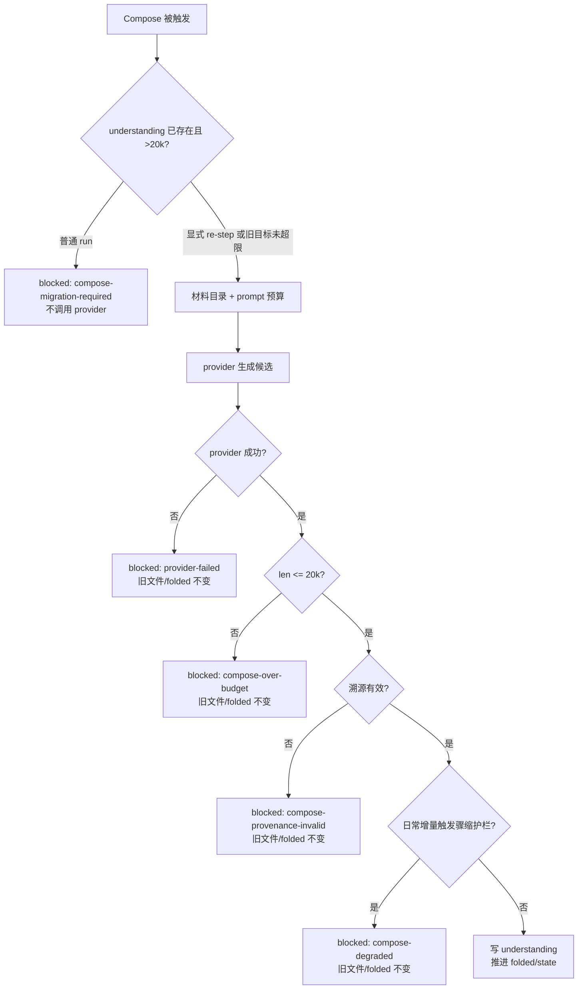

# #161 将 understanding.md 收敛到有界篇幅

状态：Approved

## 1. 背景

Issue [#161](https://github.com/xforce-io/kairo/issues/161) 承接 #153：Digest/Compose 已通过材料目录停止正文内联，判断层也已停更，但活 target `understanding.md` 仍会随历史正文增长。旧实测在 10 条 reference 时已出现 91–188KB 目标和 13–16 分钟单层耗时。当前日常 Compose 的核心输入是现有 `understanding.md` 与本轮 Δdigest，因此先限制活 target 即可同时限制后续常规输入，无需恢复 #128 的 evidence 状态机。

## 2. 名词解释

沿用 [`docs/glossary.md`](../glossary.md) 中的 workspace、digest、fold、活 target、材料目录。`compose-migration-required` 与 `compose-over-budget` 是状态原因码，不是领域名词。

## 3. 目标与非目标

### 目标

- `understanding.md` 完整文件不超过 20,000 Unicode code point。
- 日常增量 Compose 在写盘前同时校验篇幅与溯源，成功才更新正文和 folded。
- 超长旧文档不被普通 run 静默压缩；用户确认 `re-step understanding.md` 后才能迁移。
- 显式迁移期间保留旧文件和 TargetState；provider 或校验失败时文件 hash 与 folded 不变。
- CLI、Web 与 skill 对预算阻塞给出一致、可行动的状态。

### 非目标

- 恢复或更新 `assessment.md`。
- 新增 `evidence.md`、LegacyEvidenceRule、向量库/RAG、章节路由或并行生成。
- 无损保留全部历史细节；细节继续通过来源标识回看 digest。
- 配置化 20,000 上限，或解决数百条 reference 的全量重综合规模。
- provider 调用失败后的跨 provider failover。

## 4. 能力

### 4.1 UI/UX

#### 正常增量

用户执行 Run 后看到 Compose 运行；成功时 `understanding.md` 含新事实和有效来源，完整文件不超过 20,000 字符，待处理 digest 被 fold，状态为 `clean`。

#### 超长旧文档门禁

当普通 run 将要 Compose 且现有 `understanding.md` 已超过 20,000 字符时：

- provider 调用前停止；
- 旧正文与 folded 不变；
- target 进入 `blocked:compose-migration-required`；
- CLI 非零退出并提示 `kairo re-step understanding.md`；
- Web target 显示原因与“重新生成”入口，主按钮显示“需要处理”而非“已是最新”。

CLI 的门禁提示与 Web 的确认框必须明确说明：“将全量重综合并压缩历史正文；失败保留旧版”。用户取消时保持 blocked，且不调用 provider。用户确认重新生成后，Web/CLI 显示运行中；成功才替换 `understanding.md`。旧 `assessment.md` 若存在，内容和 hash 均不变。

#### 候选超预算

provider 返回 20,001 字符或更多时，target 进入 `blocked:compose-over-budget`；旧文件与 folded 不变，CLI/Web 显示失败及 `re-step understanding.md` 恢复入口。

#### 其它错误与空状态

- provider 失败、溯源无效：沿用既有 reason，但显式迁移同样保留旧文件与 folded。
- 无 Δ 且未显式 re-step：不调用 Compose，正文不变。
- target 尚未生成：首次 Compose 直接受 20,000 字符预算约束。
- 不新增页面，不展示或更新判断层。

### 4.2 预算契约

- 计数使用 Python `len(content)`，即 Unicode code point 数。
- 预算覆盖标题、空白、正文和来源索引；20,000 合法，20,001 非法。
- prompt 明示上限，外壳在写盘前确定性复核。
- 外壳禁止截断模型输出；超限整体拒绝。
- 预算只施加于路径恰为 `understanding.md` 的活 target；其它自定义 fact target 保持既有契约。

### 4.3 状态契约

| 原因码 | 触发 | provider 调用 | 文件/folded | 自动重试 | 恢复 |
|---|---|---:|---|---|---|
| `compose-migration-required` | 普通 Compose 前发现旧 understanding >20,000 | 0 | 不变 | 否 | `re-step understanding.md` |
| `compose-over-budget` | 候选 >20,000 | 已发生 | 不变 | 否 | `re-step understanding.md` |
| `compose-degraded` | 日常增量出现既有灾难性骤缩（`materials-changed` 与显式 re-step 沿用既有例外） | 已发生 | 不变 | 否 | 既有 re-step |
| `provider-failed` | provider 失败 | 已发生/门禁失败 | 不变 | Run 可重试 | 既有 Run/re-step |
| `compose-provenance-invalid` | 溯源校验失败 | 已发生 | 不变 | 否 | 既有 re-step |

所有活 target 的 blocked 都计入 `blocked_count`；Run 可清除的 reference blocked 与 target `provider-failed` 另计入 `retryable_blocked_count`。按钮重试数字只使用后者，Run 的自动清理也只处理后者。计划真值表：

| pending | retryable blocked | non-retryable blocked | mode | 行为 |
|---:|---:|---:|---|---|
| 0 | 0 | 0 | `clean` | 主按钮禁用，显示已是最新 |
| >0 | 0 | 任意 | `run` | 处理 pending；若仍有终态 blocked，命令最终非零 |
| 0 | >0 | 任意 | `retry` | 只重试 retryable；若仍有终态 blocked，命令最终非零 |
| >0 | >0 | 任意 | `run_and_retry` | 重试 retryable 并处理 pending；若仍有终态 blocked，命令最终非零 |
| 0 | 0 | >0 | `attention` | 主按钮禁用，指向目标级 re-step |

Web 同时展示总 blocked 数；CLI/Web 不把仍有 non-retryable blocked 的混合结果报告为成功。

## 5. 思路与折衷

- 选择“有界当前文档 + Δdigest”：当前增量路径已具备该结构；迁移成功后常规输入自然受控，代码和存储变化最少。
- 选择显式迁移门禁：避免普通 run 在用户不知情时把历史百科压为当前综合，也避免先花一次长 provider 调用再由 `compose-degraded` 拒绝。
- 选择保旧重综合：`re-step` 不再预删目标和 TargetState，而是标记一次显式全量重综合；候选通过预算与溯源后才替换。
- 放弃 #129 的全量 evidence cards：它引入双产物、legacy adapter 和新账本，且总输入仍为 O(N)。当前没有证据证明有界当前文档仍不够。
- 放弃外壳截断：截断会破坏结构、来源索引和事实语义。
- 放弃配置化预算：先以已有实测支持的 20,000 作为单一产品契约；出现真实分层需求后再设计。

## 6. 架构

分层职责：

- ComposeRule：迁移门禁、prompt 预算、候选预算/溯源/骤缩校验及 TargetState 推进。
- engine：保旧 re-step 标记、blocked/retryable blocked 计划分类与恢复入口。
- CLI/Web：失败退出、attention 状态和可行动文案。
- history：继续在 step 有推进后快照；不是失败保留的唯一手段。

## 7. 模块

- `src/kairo/rules.py`：预算常量、两个 reason、Compose 前置门禁与写盘前校验、显式全量重综合分流。
- `src/kairo/engine.py`：`re_step` 保留目标/状态；workspace plan 分开总 blocked 与 retryable blocked，并区分 `attention`。
- `src/kairo/cli.py`：budget blocked 非零退出与恢复提示；re-step 不再假报成功。
- `src/kairo/web/`：attention 按钮状态、目标恢复提示及中英文文案。
- `src/kairo/data/SKILL.md`：reason 闭集和恢复操作。
- README 中英文：20,000 契约与迁移说明。

## 8. API/CLI

不新增 CLI 命令。

- `kairo run`：遇超长旧目标时以 `compose-migration-required` 非零结束，不调用 Compose provider；混合状态按 §4.3 真值表处理。
- `kairo re-step understanding.md`：显式全量重综合；调用前不删除旧目标；门禁/确认文案说明会压缩历史正文且失败保留旧版；失败非零，成功才输出 `re-stepped understanding.md`。
- `kairo status`：顶部 `blocked_count` 包含预算原因；target 行追加 `kairo re-step understanding.md` 提示。
- Web 继续复用 `re-step` 命令；确认框说明压缩代价和失败保留；仅有非重试 blocked 时主按钮状态为 `attention`。

## 9. 边界

- 材料删除触发的 `materials-changed` 仍是全量重综合，但不等于用户批准把超长目标迁移；若旧目标超预算，仍须显式 re-step。
- 对 ≤20,000 的旧目标，`materials-changed` 保留既有骤缩例外；对超长目标只有用户显式 target/all re-step 可同时绕过迁移门禁，显式 re-step 也绕过骤缩护栏。
- 手改检测优先于普通增量覆盖；本设计不改变 `accept` 契约。
- corpus 漂移仍是 advisory，不自动触发迁移。
- 进程被强杀或底层文件系统损坏不承诺跨文件系统事务；本设计保证 provider/预算/溯源等可判定失败发生时旧文件与 folded 不变。

## 10. 迁移 / 兼容 / 回滚

- 不自动扫描或重写现有 workspace；只有 Compose 被新 Δ 触发时才建立超长门禁。
- 超长 workspace 由用户确认 `re-step understanding.md` 后迁移；成功前旧文件与 TargetState 保留。
- 旧 constitution 中的 judgment target 继续停更；`assessment.md` 留盘不动。
- 新 reason 对旧 state 向后兼容，均使用既有字符串字段。
- 失败可直接再次 re-step；成功后如不接受压缩结果，可使用既有 history/rollback 回到迁移前快照。
- 回滚代码后，已生成的 ≤20,000 文档仍是合法旧 target，无数据格式迁移。

## 11. 测试计划

### E2E

1. 当前 main 的真实 workspace 副本：加入一条确定 stream，运行后断言新事实与 S-ID 可见、`len(understanding) <= 20_000`、状态 clean。
2. 超长 fixture：预置 >20,000 的 understanding、TargetState、未 fold digest 和 assessment 哨兵。普通 run 断言 Compose provider 调用 0、`compose-migration-required`、文件 hash/folded/assessment hash 不变；re-step 成功后断言 understanding ≤20,000、来源有效、assessment hash 不变。
3. 失败 fixture：候选 20,001、provider 失败、溯源无效三路分别断言 CLI 非零、Web/status blocked、旧文件 hash 与 folded 不变；恢复 provider 后 re-step 收敛。

### Integration

- ComposeRule 的普通增量、显式全量、materials-changed、manual-edit、budget/provenance/degraded 校验顺序。
- engine re-step 保旧、workspace plan 真值表中的 `clean/run/retry/run_and_retry/attention` 与混合状态退出。
- Web target 重新生成失败与成功的任务终态。
- Web 确认框包含“压缩历史正文、失败保留旧版”；用户取消时不创建任务、不调用 provider，状态保持 blocked。

### Unit

- Unicode `len` 的 20,000/20,001 边界。
- 两个 reason 的 terminal staleness、blocked 计数和恢复提示。
- prompt 含预算且输出不被外壳截断。

## 12. 开放问题

N/A — 20,000 预算、迁移入口、失败保留和 attention 状态均已拍板；数百篇归档明确不在本设计范围。

## 13. 关联

- Issue [#161](https://github.com/xforce-io/kairo/issues/161)
- #153 / PR #159
- #128 / PR #129
- #126 / PR #127
- [`docs/design/153-catalog-read-no-assessment.md`](153-catalog-read-no-assessment.md)
- [`docs/glossary.md`](../glossary.md)
