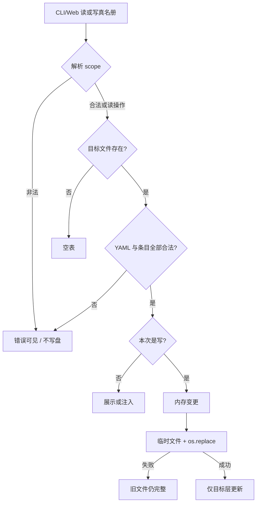

# #162 损坏配置与非法请求不再造成真名册误写

状态：Approved

## 1. 背景

Issue [#162](https://github.com/xforce-io/kairo/issues/162)。当前 `load_glossary_file` 把错误顶层结构当空表、把坏条目静默跳过；随后 `add`/`rm` 会把这份残缺结果写回，覆盖原文件。Web 对未知 `scope` 落入 `else` 写入 workspace。`write_constitution` 走 pydantic round-trip，可能丢掉 constitution 中 glossary 之外的字段。真名册是后续产物的权威输入，读写失败不能以静默丢数据或写错层结束。

## 2. 名词解释

沿用 [`docs/glossary.md`](../glossary.md) 中的 workspace、constitution、真名册。本设计补充：

| 词 | 含义 |
|---|---|
| scope | 一次真名册写操作明确选择的层。合法值只有 `workspace` 与 `shared`。未提供时按公开默认值 `workspace` 解析。 |
| 安全保存 | 目标路径在调用前后要么仍是旧完整文件，要么已是新完整文件；不暴露截断中间态。进程被强杀或跨文件系统损坏不承诺事务。 |

## 3. 目标与非目标

### 目标

- 已存在但结构/条目非法的真名册文件被整体拒绝；任何写操作都不改变原字节。
- CLI/Web 只向用户明确选择的一层写入；未知 scope 失败且两层均不变。
- workspace 真名册变更只改 `glossary` 键，constitution 其他字段语义保留。
- 解析、scope、保存错误可观察：CLI 非零；Web 在当前表单内显示错误并保留输入。

### 非目标

- 不调整 root/workspace 权威关系，不退出 machine 层。
- 不改变 Agent 注入格式或规范化行为。
- 不引入候选提取、权限、版本管理。
- 不承诺保留 YAML 注释或键序美化。
- 不新增独立页面。

## 4. 能力

### 4.1 UI/UX

不新增页面，仍用 workspace 右栏真名册面板。

| 状态 | 用户看到 |
|---|---|
| 空表 | 正常空状态，不是错误。 |
| 合法列表 | 现有公共/本区列表。 |
| 保存中 | 沿用 HTMX 请求中的按钮态；无独立进度页。 |
| 成功 | 列表刷新，错误条消失，表单清空。 |
| 配置损坏 | 面板顶部错误，说明文件路径与原因；列表不假装为空成功；表单输入保留。 |
| 非法 scope / 校验失败 / 保存失败 | 错误出现在**被提交的那张表单内**；两层文件不变；输入仍在。 |
| 修正后重试 | 同一表单再次提交即可，不必离开面板。 |

Web 这些失败返回 **200 HTML 片段**（让 HTMX 换入 `#meta`），不返回 4xx。4xx 不会被当前 `hx-swap="innerHTML"` 换入表单。

### 4.2 读取契约

| 输入 | 结果 |
|---|---|
| 文件不存在 | 空表，不是错误。 |
| 空文件 / YAML `null` | 空表。 |
| YAML 列表，每项合法 | 该列表。 |
| `{entries: [...]}` 或 `{glossary: [...]}` 且值为列表 | 解析该列表。 |
| YAML 语法错误 | 拒绝。 |
| 顶层为标量、非包装 mapping、或包装键值不是列表 | 拒绝。 |
| 列表中任一项非 mapping、缺 `name`、`name` 空白、字段类型非法 | **整文件拒绝**，不跳过坏项。 |

workspace 层读 `constitution.yaml` 的 `glossary` 键：缺键视为空表；键存在则用同一套条目规则。constitution 顶层必须是 mapping，否则拒绝（不把整份 constitution 当空真名册）。

拒绝时异常携带路径与原因，供 CLI/Web 原样展示。

### 4.3 写入契约

1. 先完整读入并校验目标层；失败则不写。
2. 解析 scope：省略 → `workspace`；显式非法 → 拒绝，两层都不写。
3. 在内存中得到新条目表后再保存。
4. 保存用同目录临时文件 + `os.replace`。失败或异常时：目标路径仍是调用前内容；尽力删除残留 `.tmp`。
5. 一次成功请求只改选定的一层。

workspace 保存：读取 constitution 的 YAML mapping，**只替换 `glossary` 键**，其余键原样写回。不经 `Constitution.model_dump()` 整表覆盖。

shared 保存：继续写成 YAML 列表（与现网一致），不把包装 mapping 的其它键当作契约。

### 4.4 错误传播

- CLI：`glossary list|add|rm` 遇配置/scope/保存错误时 stderr 打印可定位信息（含路径），退出码 1。
- Web：见 §4.1；成功与失败都渲染同一面板。
- 读路径（list / 打开面板 / 合并注入前的 load）同样拒绝损坏文件，禁止再当空表继续写。

## 5. 思路与折衷

- 选择“整文件拒绝”而不是“尽量加载合法条目”：只读看似友好，下一次写入会不可逆丢失。
- 选择拒绝未知 scope，而不是默认 workspace：静默选层比拒绝请求风险更高。
- 选择 YAML mapping 补丁写 constitution，而不是 pydantic round-trip：后者会丢掉未知字段。
- 选择临时文件 + `os.replace`，与现有 `write_manifest` 同构；不引入新依赖。
- 放弃把注释保留写成产品承诺：PyYAML round-trip 做不到，L1 已放弃。
- 放弃 4xx JSON：当前面板是 HTMX HTML 片段，行内错误必须能被 swap。

## 6. 架构

分层：

- `kairo.glossary`：严格解析、scope、原子保存、workspace glossary 补丁写。
- `Workspace.add/remove_glossary_entry`：改走补丁写，不再 `write_constitution` 整表覆盖。
- CLI/Web：把 `GlossaryError` 变成可观察错误；Web 未知 scope 不再落入 workspace 分支。

## 7. 模块

- `src/kairo/glossary.py`：`GlossaryError`、严格 parse/load、`parse_scope`、原子 `save_glossary_file`、`write_workspace_glossary`。
- `src/kairo/workspace.py`：glossary 增删改用补丁写。
- `src/kairo/cli.py`：捕获配置错误，list 遇损坏文件非零退出。
- `src/kairo/web/views.py` + `_glossary.html` + `i18n.py`：行内错误与输入保留。
- 测试：`tests/test_glossary.py`、`tests/test_glossary_write.py`、`tests/test_shared_glossary.py`，新增损坏/scope/保存中断用例。

## 8. API/CLI

不新增命令。既有：

- `kairo glossary list [--root]`
- `kairo glossary add NAME [--scope workspace|shared] [--root]`
- `kairo glossary rm INDEX [--scope workspace|shared] [--root]`

`--scope` 合法值：`workspace`、`shared`。缺省 `workspace`。

Web：

- `GET /w/{slug}/glossary`
- `POST /w/{slug}/glossary` form: `name`, `note?`, `aka?`, `tags?`, `scope?`
- `POST /w/{slug}/glossary/{index}/delete` form: `scope?`

`scope` 契约与 CLI 相同。非法 scope、损坏文件、保存失败：200 + 面板内错误，磁盘不变。

## 9. 边界

- machine 层本 Issue 只读；损坏的 machine 文件在 list/注入时同样拒绝，但不提供 Web 写入。
- 不存在 ≠ 损坏。
- 合法空表可以 add。
- 同名拒绝、空 name 拒绝：沿用现有 `ValueError`，Web 也改为表单内错误（不再 400 丢片段）。
- 本 Issue 不改变覆盖、alias、tags 语义。
- 强杀进程或磁盘满导致 `.tmp` 残留：不把 `.tmp` 当作权威文件；下次成功保存会覆盖或清理。

## 10. 迁移 / 兼容 / 回滚

- 合法现网文件（列表或 `{entries|glossary: list}`）行为不变。
- 过去被静默跳过的坏条目，升级后会开始报错，直到用户修好文件。这是有意的破坏性修复。
- 回滚代码后，本 Issue 写出的列表格式仍是旧读取器可识别的。
- 无数据格式迁移脚本。

## 11. 测试计划

### E2E

- **S1**：shared `glossary.yaml` 写成非法顶层或夹坏条目 → `glossary list`/`add` 非零、文件逐字节不变 → 改成合法列表后同一 `add` 成功。
- **S2**：Web `scope=typo` → 200 片段含行内错误，root/workspace 文件不变，表单值仍在 → `scope=shared` 只改 root，`scope=workspace` 只改 constitution。
- **S3**：constitution 含未知键与非 glossary 字段 → workspace add/rm → 重读后这些键语义仍在；`os.replace` 抛错时旧 constitution 完整可读。

### Integration

- CLI 与 Web 对同一损坏文件给出同一类错误（含路径）。
- 非法 scope 在 CLI 非零、Web 行内错误，且都不写盘。
- GET 面板遇到损坏 shared 文件时显示错误，不渲染“公共册暂无条目”的成功空态。

### Unit

- 不存在 / 空 / `null` → 空表。
- 非法顶层、坏条目、字段类型错误 → `GlossaryError`。
- `parse_scope`：省略默认 workspace；`shared`/`workspace` 通过；其它拒绝。
- 原子保存失败不改目标文件。

## 12. 开放问题

N/A — 拒绝策略、scope 闭集、安全保存与 constitution 字段保留均已由 L1 拍板。

## 13. 关联

- Issue [#162](https://github.com/xforce-io/kairo/issues/162)
- 后续：#163
- 历史：#20、#69、#71
- [`docs/design/71-shared-glossary.md`](71-shared-glossary.md)
- [`docs/glossary.md`](../glossary.md)
