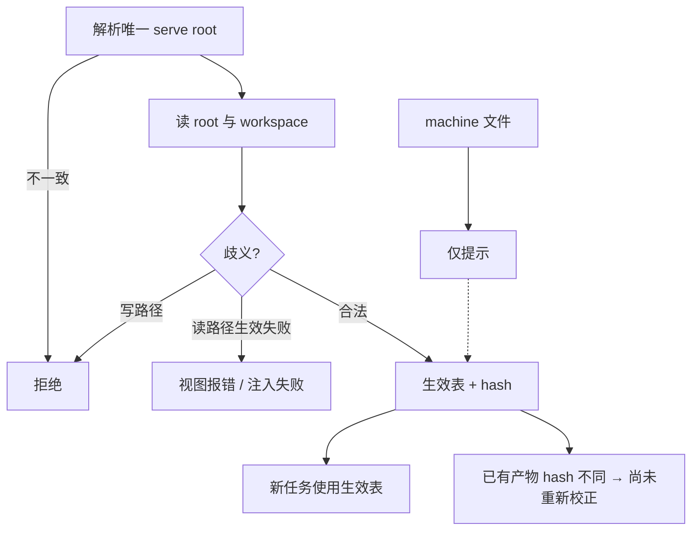

# #163 root 与 workspace 两级权威真名册

状态：Approved

## 1. 背景

Issue [#163](https://github.com/xforce-io/kairo/issues/163)。#162 已让损坏配置无法静默误写。当前仍是 machine → root → workspace 三层都进入正式产物；CLI `--root` 与运行时 `workspace.parent` 可能不是同一文件；Workspace 面板可直接改公共册且不展示最终生效值。

## 2. 名词解释

沿用 [`docs/glossary.md`](../glossary.md) 的 workspace、constitution、真名册。本设计补充：

| 词 | 含义 |
|---|---|
| serve root | 一次操作解析出的唯一公共根目录，其 `glossary.yaml` 是公共真名册。 |
| 生效真名册 | 同一 workspace 上 root 与 workspace 按覆盖规则合并、通过歧义校验后的最终条目集。 |
| 覆盖 | workspace 与 root 同名时，workspace 条目整体替换 root 条目（不做字段级合并）。 |
| 尚未重新校正 | 已有产物记录的 glossary hash 与当前生效 hash 不同；只提示，不自动 re-step。 |

## 3. 目标与非目标

### 目标

- 权威层只有 root/shared 与 workspace；同一 root/workspace 在 CLI、Web、不同机器上生效 hash 相同。
- 公共条目只从 Root 首页维护；workspace 维护本地条目，只读展示继承/覆盖/生效。
- 规范名唯一最终值；一个 alias 最多对应一个规范名；歧义不落盘。
- machine 文件不进入生效结果；存在时给迁移提示。
- glossary 变化立即用于新任务；已有产物只标尚未重新校正，自动 re-step 数为 0。

### 非目标

- 候选提取、Agent 材料格式（#164/#165）。
- 多级组织树、多用户权限、自动重算。
- 字段级继承。
- 把 glossary 打进 Digest/Compose `input_hash`（那会自动重跑）。

## 4. 能力

### 4.1 UI/UX

#### Root 首页公共真名册

Dashboard 增加「公共真名册」入口。面板状态：空、列表、保存中、成功、冲突/保存失败。写前展示：受影响 workspace 数、其中有本地覆盖的条目/工作区。一次成功只改 1 份 root `glossary.yaml`。

#### Workspace 真名册

两块：

- **生效中**：每个规范名 1 行最终值，标记 `继承` / `本地` / `覆盖`。
- **本 workspace**：只维护本地条目。可新增同名覆盖；歧义在本表单报错且不落盘。

不再提供从 workspace 增删公共条目的控件。存在 machine 文件且含条目时显示迁移提示（迁到 root 或本 workspace），产物不受 machine 影响。

#### 尚未重新校正

glossary 写入成功后，受影响 workspace 中已有 digest / 活 target 若 `glossary_hash ≠` 当前生效 hash，显示待重新校正及显式 re-step 入口。主按钮不因此自动可点成静默重算；用户未确认不启动 re-step。

### 4.2 权威与合并

| 层 | 路径 | 是否进入生效 |
|---|---|---|
| root | `<serve-root>/glossary.yaml` | 是 |
| workspace | `constitution.yaml` → `glossary` | 是，同名整体覆盖 root |
| machine | `~/.config/kairo/glossary.yaml` | 否，仅发现与提示 |

合并顺序：root 然后 workspace。首次出现顺序：root 已有名保留位置，workspace 新名追加。

### 4.3 歧义规则

在**即将落盘的那一层**以及**该 workspace 的生效结果**上检查：

1. 同一表内规范名不得重复（沿用现有）。
2. alias 不得等于任一规范名。
3. 一个 alias 不得指向两个规范名。

workspace 写入还要用「root ⊕ 新 workspace 表」做生效检查；失败不写。root 写入只保证 root 表自身合法；某 workspace 若因此无法形成生效结果，该 workspace 生效视图报错，但不回滚已合法的 root 文件。

### 4.4 serve root

每次读写/合并必须解析出唯一 serve root：

- Web：`app.state.root`；workspace 必须是其子目录。
- CLI 在 workspace 内：默认 `workspace.parent`。`--root` 或 `KAIRO_SERVE_ROOT` 若与 parent 不是同一路径 → 拒绝，不静默切换。
- CLI 不在 workspace 内：`--root` / `KAIRO_SERVE_ROOT` / cwd，只操作 root 层。

### 4.5 生效 hash 与校正提示

- 语义 hash：对生效条目的 `name`、`note`、排序后的 `aka` 做稳定序列化后 SHA-256 十六进制（**不含 tags**）。空表有固定 hash。
- Digest / Compose 成功写入时在 `ProductState` / `TargetState` 记录 `glossary_hash`（缺省 `None`，旧 state 兼容）。
- **不**把该 hash 并入 `input_hash`，因此普通 `run`/`step` 不会因 glossary 变化自动重产。
- glossary 成功写入后：对受影响 workspace，把仍为 `None` 的已有产物/target 的 `glossary_hash` 写成 `""`，使其与当前 hash 不等，从而出现尚未重新校正。
- 显式 re-step 成功后写入当前 hash，提示消失。

### 4.6 CLI

- `glossary list`：分 `[shared]` / `[workspace]`；若检测到 machine 文件则另打迁移提示，不把 machine 条目当作生效层。
- `glossary add|rm --scope shared`：只写 serve root；在 workspace 内时 root 必须与归属一致。
- 生效 hash 可在 list 末行以 `effective <hex16>…` 显示，便于 S3 对照（完整 hash 用于程序，CLI 可截断展示但测试读 API）。

## 5. 思路与折衷

- 放弃 machine 权威层：破坏跨机器可复现性。
- 放弃字段级合并：用户无法判断 note/aka/tags 最终来自哪层。
- 放弃从 workspace 写公共层：隐藏跨 workspace 影响。
- 放弃把 glossary 打进 `input_hash`：那会让普通 run 自动重产，违反 S4。
- root 写入不因下游 workspace 冲突而失败：公共层应可独立维护；冲突在生效视图暴露。

## 6. 架构

- `kairo.glossary`：serve root、生效合并、歧义、hash、machine 发现。
- Workspace / CLI / Web：按层写入；Web 拆 Root 面板与 Workspace 生效视图。
- rules：产物记录 `glossary_hash`，staleness 仍只看 `input_hash`。

## 7. 模块

- `src/kairo/glossary.py`：生效模型、hash、歧义、serve root、machine 提示、脏标记辅助。
- `src/kairo/models.py`：`ProductState.glossary_hash`、`TargetState.glossary_hash`。
- `src/kairo/rules.py`：成功产物写入当前 hash；`is_stale` 不读它。
- `src/kairo/cli.py`：list/add/rm 与 root 一致性。
- `src/kairo/web/`：Root `/glossary`；workspace 面板去掉公共写入。
- `docs/glossary.md`：生效真名册、覆盖。

## 8. API/CLI

不新增 CLI 子命令。`--scope shared|workspace` 语义不变，但 shared 不得从「错误的 root」写入。

Web：

- `GET/POST /glossary`、`POST /glossary/{index}/delete`：Root 公共册。
- `GET/POST /w/{slug}/glossary`、delete：仅 workspace 层。`scope=shared` 视为非法 scope（沿用 #162 行内错误，两层不变）。

## 9. 边界

- 一次公共写只改 1 份 root glossary。
- 不跨 serve root。
- machine 损坏仍按 #162 在「发现/提示」路径报错；它不参与生效，提示层读失败则显示无法读取本机文件，不影响生效 hash。
- 旧产物无 `glossary_hash`：直到某次本 workspace（或所属 root）glossary 写入才被标脏。

## 10. 迁移 / 兼容 / 回滚

- 现网三层文件仍可读；machine 停止注入即行为变化，需迁移提示。
- workspace 面板不再能改 root：有意破坏。
- 回滚代码后，多出来的 `glossary_hash` 字段被 pydantic 忽略（若 extra ignore）或保留无害。
- 无自动搬迁 machine 条目。

## 11. 测试计划

### E2E

- **S1**：Root 首页新增公共条目 → 未覆盖 workspace 生效视图出现同一条；有本地同名覆盖的 workspace 保持本地值；只改 1 份 root 文件。
- **S2**：生效视图每名一个最终值并带继承/本地/覆盖；合法覆盖可保存；alias 歧义表单报错不落盘。
- **S3**：同一 root/workspace 在 CLI 与 Web、以及放置 machine 文件前后，生效 hash 一致；machine 有提示。
- **S4**：已有 digest 后改 glossary → 提示尚未重新校正；不触发 step；显式 re-step 后提示消失。

### Integration

- serve root 不一致拒绝。
- workspace `scope=shared` 不再写 root。
- Digest `input_hash` 不因仅 glossary 变化而 stale。

### Unit

- 覆盖矩阵、alias 冲突矩阵、空层、稳定 hash（含 tags 变化不改 hash）、machine 排除。

## 12. 开放问题

N/A

## 13. 关联

- Issue [#163](https://github.com/xforce-io/kairo/issues/163)
- 前置 [#162](https://github.com/xforce-io/kairo/issues/162) / [`162-glossary-safe-write.md`](162-glossary-safe-write.md)
- 后续 #164、#165
- [`71-shared-glossary.md`](71-shared-glossary.md)
