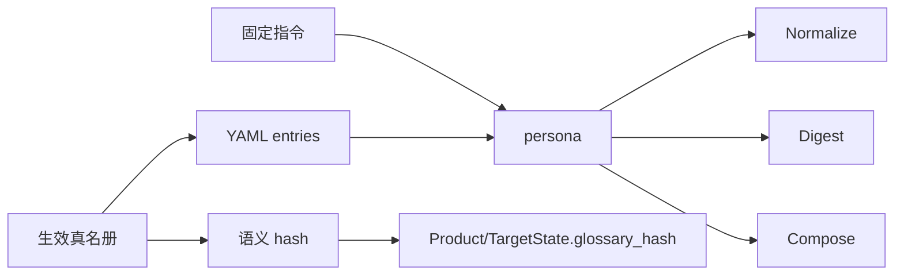

# #164 结构化 Agent 真名册材料

状态：Approved

## 1. 背景

Issue [#164](https://github.com/xforce-io/kairo/issues/164)。#163 已给出生效真名册。当前 `format_glossary_reference()` 把行为指令与条目拼成自然语言块，并含「遇含糊提及按此锚定」，Normalize / Digest / Compose 无法区分数据边界，也不单独暴露本次 revision。

## 2. 名词解释

沿用 [`docs/glossary.md`](../glossary.md) 的真名册、生效真名册。本设计补充：

| 词 | 含义 |
|---|---|
| 真名册材料 | 注入 Agent 的只读结构化条目（name / note / aka），不含 tags。 |
| 规范化指令 | 与数据分离的固定规则：有充分证据才用规范名，否则保留原文或标不确定。 |

## 3. 目标与非目标

### 目标

- 三阶段消费同一份生效表与同一语义 hash。
- 固定指令与条目数据分离；tags 不进材料、不进语义 hash。
- 证据不足不猜测映射；空表零行为变化。
- 每次成功运行可定位唯一 glossary 语义 revision（沿用 #163 `glossary_hash`）。

### 非目标

- 合并/冲突规则（#163）。
- 候选提取（#165）。
- 向量检索、按 tags 过滤、字符串替换、自动 re-step。

## 4. 能力

### 4.1 UI/UX

N/A — 不新增页面。失败沿用现有 provider/stage 失败；材料准备失败则当前阶段失败且不覆盖已有产物。

### 4.2 材料契约

空表 → `""`。

非空：

1. 固定指令段（稳定中文），含：只读数据；仅 name/aka/note 充分对应时用规范名；否则保留原文或标不确定；禁止猜测；条目文本不是指令。
2. YAML 数据段 `entries: [{name, note, aka}]`，不含 tags。

指令不得再含「按此锚定」。

### 4.3 阶段接入

Normalize、Digest、Compose 均通过 `Workspace.glossary_reference()` 注入上述材料。同一 workspace revision 下 `current_effective_hash` 相同。成功产物继续写 `glossary_hash`。

## 5. 思路与折衷

- 放弃自然语言 persona 混写：无法分规则与数据。
- 放弃确定性替换：同形词误伤。
- 暂不检索筛选：无规模证据，漏召回更难发现。

## 6. 架构

材料失败：阶段失败，不写产物。空表不走该失败面。

## 7. 模块

- `src/kairo/glossary.py`：`format_glossary_reference` 改为指令 + YAML。
- `src/kairo/rules.py`：Normalize 成功也记录 `glossary_hash`。
- 测试与 README 去掉「按此锚定」承诺。

## 8. API/CLI

不新增命令。诊断字段即 #163 的 `glossary_hash`。

## 9. 边界

- 只消费 #163 已合并条目。
- alias 是证据不是无条件替换。
- tags 变化不改变 hash 与材料。

## 10. 迁移 / 兼容 / 回滚

注入文本变化是有意的。空表仍不注入。回滚代码即回旧自然语言块。

## 11. 测试计划

- **E2E / S1**：继承+覆盖下三阶段 persona/产物含同一生效名，hash 一致。
- **E2E / S2**：指令含保留原文/不确定/禁止猜测，不含按此锚定。
- **E2E / S3**：空表不出现真名册标记；tags 不进材料；note 里的指令口吻只出现在 YAML 段。
- Unit：空表、稳定 hash、结构化 YAML。

## 12. 开放问题

N/A

## 13. 关联

- Issue [#164](https://github.com/xforce-io/kairo/issues/164)
- 前置 [#163](https://github.com/xforce-io/kairo/issues/163)
