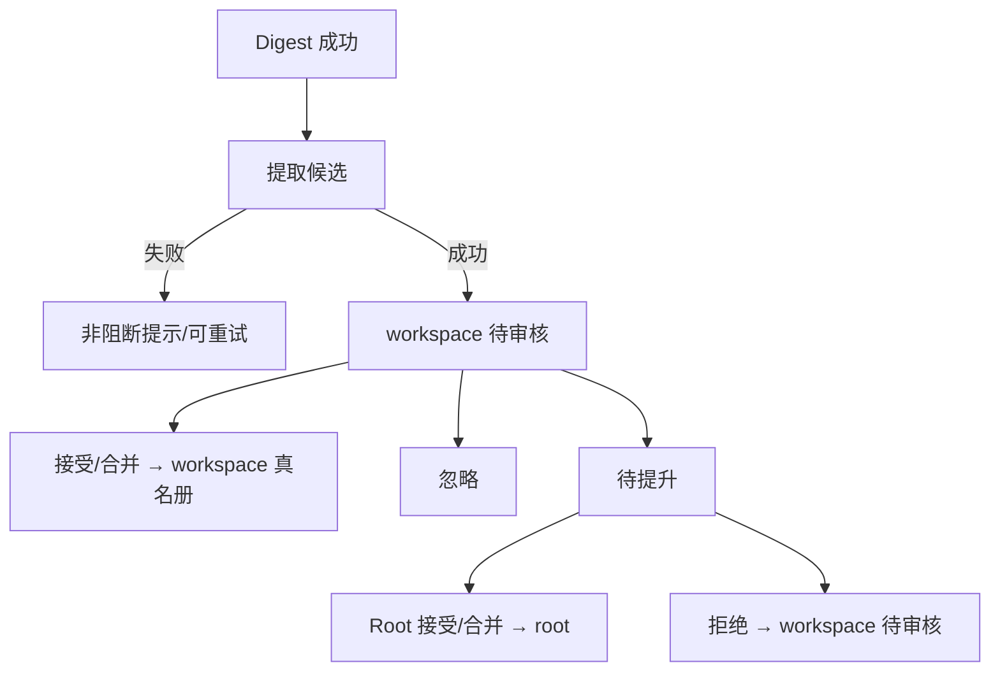

# #165 Digest 候选与两级审核

状态：Approved

## 1. 背景

Issue [#165](https://github.com/xforce-io/kairo/issues/165)。#163/#164 已建立两级权威与结构化材料。真名册仍纯人工录入；自动写入会固化 ASR/推断错误。

## 2. 名词解释

沿用真名册、生效真名册、digest。本设计补充：

| 词 | 含义 |
|---|---|
| 候选 | Digest 成功后提出、尚未进入权威真名册的建议条目，必须带可打开证据。 |
| 待审核 | workspace 内尚未终态的候选。 |
| 待提升 | 已提交 Root、等待公共接受/合并/拒绝的候选。 |

## 3. 目标与非目标

### 目标

Digest 成功后产生带证据的 workspace 候选；人可接受/合并/忽略或提交 Root；未经人工接受永不进权威表；提取异常不阻断、不重产 digest。

### 非目标

自动接受/提升、独立 corpus 挖词、多级组织树、向量检索、自动 re-step。

## 4. 能力

### 4.1 UI/UX

- Workspace 真名册增加「待审核」：证据链接、接受/合并/忽略/提交公共；提取失败非阻断提示 + 重试。
- Root 首页增加「待提升」：来源 workspace、证据、冲突、影响；接受/合并/拒绝。
- 空：无候选。拒绝后回到 workspace 待审核并显示原因。
- 接受后沿用 #163 尚未重新校正，不自动 re-step。

### 4.2 生命周期

Digest 成功 → 尝试提取（可另一次模型调用）→ 解析 YAML 列表。失败：记录 `extract_errors[ref_id]`，digest.md 不变。

候选字段：id、name、note、aka、ref_id、quote、digest_hash、status、fingerprint。

终态：`accepted` / `merged` / `ignored`。中间：`pending`、`pending_root`、`root_rejected`（视为待审核）。

忽略抑制：相同 fingerprint 且 quote/digest_hash 未变则不再出现。

来源删除或 digest 实质变化：待审核/待提升项失效（无有效证据的待审核数为 0）。

### 4.3 审核写权威

- workspace 接受：写入 workspace 真名册，走 #163 歧义规则。
- 合并：把 aka/note 并入已有 workspace 条目。
- 提交公共：status=`pending_root`，不写权威。
- Root 接受/合并：写 root；若 workspace 已有同名本地条目则删除以免重复；不自动把拒绝变成本地接受。
- Root 拒绝：status=`root_rejected`，不写 root。

## 5. 思路与折衷

不自动写入；不把所有候选送 Root；提取挂在 Digest 成功之后而非新入口；不把「是否同一次调用」写成产品契约。

## 6. 架构

持久化：`workspace/.kairo/glossary_review.yaml`。Root 扫描各 workspace 的 `pending_root`。

## 7. 模块

- `src/kairo/glossary_review.py`：存取、提取、状态机、失效。
- `src/kairo/rules.py`：Digest 成功后调用提取。
- Web：workspace 待审核 + Root 待提升。

## 8. API/CLI

不新增 CLI 命令（审核在 Web；提取随 Digest）。

Web：

- `POST /w/{slug}/ref/{ref_id}/glossary-extract`
- `POST /w/{slug}/glossary/candidates/{id}/{accept|merge|ignore|promote}`
- `POST /glossary/candidates/{slug}/{id}/{accept|merge|reject}`

## 9. 边界

仅成功 Digest 提取。每条待审核至少一条可打开证据。冲突复用 #163。

## 10. 迁移 / 兼容 / 回滚

新文件可删。无旧数据迁移。回滚代码后残留 yaml 被忽略。

## 11. 测试计划

S1–S4 E2E 用可注入的提取函数；断言 digest 字节在提取失败时不变；忽略不重复；Root 拒绝不写 root；删 ref 后待审核无无效项。

## 12. 开放问题

N/A

## 13. 关联

- [#165](https://github.com/xforce-io/kairo/issues/165) 前置 #163 #164
