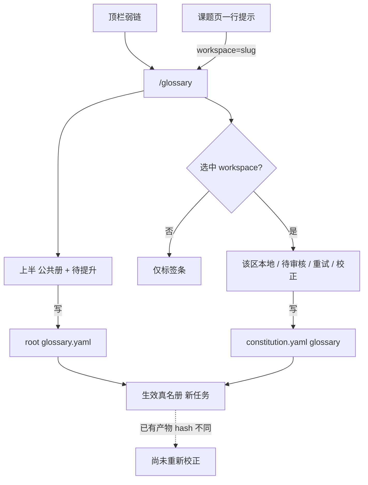

# #174 真名册统一维护页

状态：Approved

## 1. 背景

Issue [#174](https://github.com/xforce-io/kairo/issues/174)。#163 把权威收成 root ⊕ workspace，#165 把候选审核拆在课题右栏与 Root 页。维护入口仍是两套：`/glossary` 改公共册，课题页右栏改本地并审核。#172 要把公共入口放进顶栏，但其「右栏仍打开本区视图」与本设计冲突，由本 issue 取代。

## 2. 名词解释

沿用 [`docs/glossary.md`](../glossary.md) 的 workspace、constitution、真名册、生效真名册、覆盖、候选、待审核。本设计补充：

| 词 | 含义 |
|---|---|
| 统一维护页 | console 的 `/glossary`：上半公共册与待提升，下半按选中 workspace 维护本地/待审核/校正。 |
| 待办提示 | 课题页右栏最多一行链接；仅当该区有待审核、待提升、提取失败或尚未重新校正时出现。 |

## 3. 目标与非目标

### 目标

- 真名册只在 `/glossary` 维护：公共条目、各 workspace 本地覆盖、候选审核、提取重试、尚未重新校正。
- 两层数据不变；Digest/Compose 仍吃生效真名册。
- 打开 console 的人能看到全部层。本期不做账号 ACL；公共区写 root，选中 workspace 区写该 constitution。
- 课题页无维护面板；有待办时恰好一行，点进 `/glossary?workspace={slug}`。

### 非目标

- 取消 workspace 本地覆盖、字段级合并、多用户登录权限。
- 自动接受候选、自动 re-step、把 glossary 打进 `input_hash`。
- 改 CLI `glossary --scope` 契约。
- 把所有 workspace 本地表同时铺开。

## 4. 能力

### 4.1 UI/UX

信息架构（布局 B）：

- 顶栏右侧弱链「真名册」指向 `/glossary`，不进 `console-nav`。`/glossary` 上该弱链为当前项；Workspaces / Timeline 不选中。Dashboard 工具条不再单独放真名册链接。
- **上半（root）**：影响句 → 公共条目增删 → 待提升（跨 workspace 的 `pending_root`：接受/合并/拒绝）。不再单列「本地覆盖清单」；下半标签承担索引。
- **下半（workspace）**：本 root 全部 workspace 标签，有待办的带数字。未选且无合法 `?workspace=` 时不渲染任何本地表、待审核、提取重试、尚未重新校正。选中后只渲染该区：本地增删、待审核（接受/合并/忽略/提交公共；已待提升只读提示）、提取失败重试、尚未重新校正与显式 re-step。无本地条目时仍能选中并添加。
- 合法 `?workspace={slug}`：对应标签已选中。非法或不存在的 query 不当成选中、不报成写失败。
- **课题页**：去掉右栏真名册按钮与面板。原按钮位置仅在 `todo_n > 0` 时出现一行链接（文案含件数），`href` 含 `?workspace={slug}`。无待办则该行不出现。不提供增删、审核、re-step、重试、生效/继承列表。

全状态：

| 面 | 空 | 错 | 成功 |
|---|---|---|---|
| 公共册 | 空文案 + 添加表单 | 表单处失败、不落盘 | 停留本页，已保存提示；受影响产物可标尚未重新校正 |
| 未选 workspace | 只见标签条 | 非法 query 视为未选 | — |
| 选中 workspace | 空 + 添加表单，不编造继承列表 | 歧义/损坏在该区表单报错 | 本地表更新；不自动 step |
| 课题页 | 无提示行 | — | 有待办恰好 1 行 |

不做的界面：课题页生效表；`/glossary` 纵向堆叠所有本地表；账号权限灰态。

## 5. 思路与折衷

- 两层数据保留、只收口 UI。放弃压成一张公共表。
- 公共固定 + 选工作区。放弃一页堆叠所有 workspace，放弃一张总表混层。
- 课题页最多一行提示。放弃课题页 re-step/重试，放弃只读生效视图。
- 写路径继续走现有 `/glossary` 与 `/w/{slug}/glossary*`；GET `/w/{slug}/glossary` 重定向到统一页。不重写权威合并。

## 6. 架构

- 主路径：解析 serve root → 渲染公共层 → 合法 slug 才加载该 workspace 层。
- 失败：歧义/损坏在当前表单暴露，目标文件字节不变。root 写入不因下游冲突回滚；选中冲突 workspace 时该区报无法形成生效结果。
- 提取失败：digest 不变，该区显示失败 + 重试。

## 7. 模块

- `src/kairo/web/views.py`：`/glossary` 带可选 `workspace`；课题页注入 `todo_n`；workspace glossary GET 重定向。
- `src/kairo/web/templates/root_glossary.html`、`_glossary.html`、`workspace.html`、`base.html`、`dashboard.html`。
- `src/kairo/web/i18n.py`、`static/app.css`。
- `kairo.glossary` / `glossary_review`：权威与候选语义不变；新增待办计数（待审核 + 提取失败 + 尚未重新校正）。

## 8. API/CLI

不新增 CLI。`--scope shared|workspace` 语义不变。

Web：

- `GET /glossary?workspace=` 可选。非法值视为未选。
- `POST /glossary`、`POST /glossary/{index}/delete`、待提升 `POST /glossary/candidates/{slug}/{id}/…`：仍写 root / 候选 Root 动作；响应为统一页。
- `GET /w/{slug}/glossary` → `303 /glossary?workspace={slug}`。
- `POST /w/{slug}/glossary…`、候选、提取重试：仍写 workspace 层；响应为统一页且该 slug 已选中。`scope=shared` 仍拒绝。

## 9. 边界

- 一次公共写只改 1 份 root 文件。
- 不跨 serve root。
- 课题页不写真名册。
- 无账号 ACL。

## 10. 迁移 / 兼容 / 回滚

- 书签 `/w/{slug}/glossary` 重定向到统一页。
- 回滚代码后右栏面板恢复；磁盘格式不变。
- 无数据迁移。

## 11. 测试计划

### E2E

- **S1**：`GET /glossary` 含公共写入口、无预选时无本地表；`GET /glossary?workspace={slug}` 只含该区本地区。
- **S2**：`GET /w/{slug}` 无真名册按钮；无待办无提示行；有待办恰好 1 行且 `href` 含 `?workspace=`。
- **S3**：`POST /glossary` 后只多 1 份 root 文件且未覆盖 workspace 生效含该名；本地 POST 只改该 constitution；改 glossary 后无自动 step。
- **S4**：待审核在选中工作区操作；提交公共后上半待提升；Root 拒绝退回该区待审核。

### Integration

- 非法 `?workspace=` 不当选中。
- workspace `scope=shared` 仍拒绝。

### Unit

- 待办计数：待审核 + 待提升 + 提取失败 + 尚未重新校正；全无则为 0。
- 覆盖与歧义沿用 #163。

## 12. 开放问题

N/A

## 13. 关联

- Issue [#174](https://github.com/xforce-io/kairo/issues/174)
- [#163](https://github.com/xforce-io/kairo/issues/163) / [`163-glossary-authority-scopes.md`](163-glossary-authority-scopes.md)
- [#165](https://github.com/xforce-io/kairo/issues/165) / [`165-glossary-candidate-review.md`](165-glossary-candidate-review.md)
- [#172](https://github.com/xforce-io/kairo/issues/172)（顶栏弱链并入；S3 由本设计取代）
