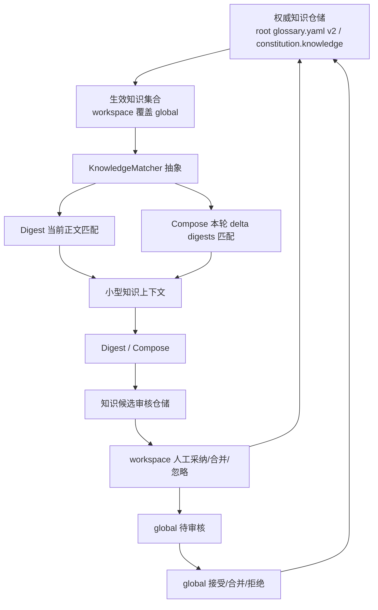

# #182 资料持续沉淀为可审核领域知识

状态：Approved（已获用户实现授权；不是 Implemented）

## 1. 背景

Issue [#182](https://github.com/xforce-io/kairo/issues/182)。Kairo 已保存 reference、digest 与 `understanding.md`，但跨材料反复出现的定义、确认状态和适用范围仍只存在于面向人阅读的正文。现有真名册以 `name`、`aka`、`note`、`tags` 解决规范命名；#165 在单份 digest 成功后提出带摘录的候选，不能承接 Compose 后的跨材料归纳。

本设计将两者收敛为唯一核心对象“知识条目”。它保持真名册的命名职责，并新增可审核状态、范围、轻量出处与按需引用；它不是概念、主张、关系、主题或独立证据的通用图谱模型。

## 2. 名词解释

“知识条目”“知识候选”“知识出处”“知识匹配器”见 [名词表](../glossary.md)。已有的 workspace、constitution、真名册、生效真名册、候选、待审核、digest、fold 与活 target 也以名词表为准。

本设计中“global”是 serve root 的公共范围，“workspace”是单个 workspace 的本地范围；二者是范围值，不新增组织层级。“本轮 delta digests”是 Compose 此次尚未 fold 的 digest 集合，不是全历史 digest 或整份 `understanding.md`。

## 3. 目标与非目标

### 目标

- 用一种知识条目完成“候选 → workspace 审核 → 少数 global 提升 → 后续按需引用”的闭环。
- 让单材料 Digest 与跨材料 Compose 都能提出知识候选；同一次运行中新产生、尚未审核的候选绝不反向进入该次 Prompt。
- 仅把已确认、非歧义、命中的知识作为小型参考上下文；当前 reference/digest 仍是产物的证据上界。
- 保持 root 与 workspace 两级权威、原子写与严格解析，并把既有 Glossary 命名能力迁入同一事实源。

### 非目标

- 不拆分概念、主张、关系、主题、证据、状态等对象，也不做知识图谱、关系编辑、主题树或自由画布。
- 不做语义/向量召回、全库扫描、全量 Prompt 注入或多套并行 matcher。
- 不让材料反向引用条目；条目变化不阻止材料修改/删除，不触发同步或级联删除。
- 不因知识变化自动 `step`/`re-step`，不以已有知识覆盖本轮材料中的冲突或不确定性。

## 4. 能力

### 4.0 数据与审核契约

知识条目是 versioned YAML 文档中的 `entries` 一员，字段如下。`id` 一经创建或提升不得因改名而变化；`title` 与每个 alias 均经统一规范化后校验唯一性。`description` 是短说明，不是长文正文；`sources` 是零到多个知识出处，条目可以没有出处但审核页必须明确显示“未附出处”。

| 字段 | 契约 |
|---|---|
| `id` | `ke-` 加 UUID/等价随机稳定标识；同一 workspace 条目提升 global 时保留该值。 |
| `title` | 非空规范标题/名称；在所在范围唯一，并参与匹配。 |
| `aliases` | 零到多个 `{value, auto_match}`；`value` 非空、规范化后不可重复；`auto_match=false` 的短词或泛词可保留展示但不自动匹配。 |
| `description` | 可为空的简短定义或限定说明。 |
| `status` | `pending`、`confirmed`、`obsolete`；只有 `confirmed` 可被 matcher 返回为 Prompt 上下文。 |
| `scope` | `workspace` 或 `global`，由文件位置与写入端二次校验，不接受调用方伪造。 |
| `tags` | 可选字符串数组，仅用于人读筛选，不决定匹配或权威。 |
| `sources` | 可选知识出处数组：`kind`（`reference`/`digest`/`understanding`）、相对 `path`、短 `quote`、`content_hash`；都只可定位本 workspace/serve root 下已有产物。 |
| `created_at` / `updated_at` | ISO-8601 审计信息；不参与语义匹配 hash。 |

全局权威文件为 `<serve-root>/glossary.yaml` 的 v2 `entries` 文档；workspace 权威为 `constitution.yaml` 的 `knowledge` 字段。文件名 `glossary.yaml` 是兼容路径，语义已是知识条目库；应用层只经统一知识仓储读写，旧 `glossary` 字段和旧列表格式只用于一次性导入。写入通过现有临时文件加 `os.replace` 的原子策略，先以严格模型和生效集合校验，再替换原文件。

候选单独保存在 `workspace/.kairo/knowledge_review.yaml`，因为它是可丢弃的审核工作状态而不是权威知识。每个候选有稳定 `kc-` id、拟议条目、`source_kind`（`digest` 或 `compose`）、来源 `path`、`quote`、`content_hash`、提取 fingerprint、状态和可选 `merged_into`/拒绝原因。状态为 `pending`、`pending_global`、`accepted`、`merged`、`ignored`、`rejected_global` 或 `stale`；只有前两者显示为待办。原始来源缺失、hash 不同且短摘录不再出现时转为 `stale`，保留审计记录但不再计入队列。

### 4.1 UI/UX

#### 信息架构与入口

顶栏现有弱链接 “Glossary/公共真名册” 演进为“知识”，仍不挤入 Workspaces/Timeline 主导航。`/knowledge` 是新的统一维护页；已迁移为 v2 的 `/glossary` 以 303 到 `/knowledge` 并保留合法 `?workspace=`，未迁移的旧册继续以兼容页只读/维护，避免书签与旧自动化突然失效。旧 `/w/{slug}/glossary` 同样保留兼容入口，迁移后导向统一知识页。

workspace 三栏页不恢复第二套维护后台。右侧 ACTIONS 在待审核候选、待全局审核、提取失败、知识 hash 漂移中任一存在时仅显示一行“知识有 N 项待处理”，链接到已选 workspace 的知识页；无待办则不显示。Run 成功摘要旁显示本次“知识候选 N / 知识变化 N”，点击进入同一筛选视图，不把审核动作塞进运行面板。

`/knowledge` 上半部始终为 global 知识与待全局审核，下半部先选 workspace 再显示本地知识、该 workspace 的有效知识和审核队列。全局与 workspace 是两个明确写入面；workspace 只能管理本地，提升后只能由全局面审核。`/glossary` 兼容路由不会形成第二事实源或第二套表单。

#### 主路径、布局与交互

在桌面宽度下，知识页采用既有 console 的“公共固定 + workspace 选择”结构：左/上为范围选择和筛选，主区为条目列表，右/下为候选或编辑详情；窄屏退化为单列，筛选、列表、详情依次展开。条目行显示标题、状态、范围、标签、短说明和出处数；确认、待核、已失效使用文字加颜色，不能只靠颜色。

候选默认以卡片/列表呈现：来源类型（“来自 Digest”或“来自本轮 understanding”）、短摘录、来源链接、hash 是否仍有效、与现有标题/别名的精确命中建议。用户可展开编辑拟议标题、别名、说明、标签和出处，然后选择“采纳到此 workspace”“合并到… ”或“忽略”。合并先选择一个当前有效条目，再预览会增加的别名/说明/出处；冲突校验失败时不保存。第一期不提供批量接受、批量合并或批量提升，避免一次确认混入多条独立知识。

已确认 workspace 条目可编辑、标为已失效或提交提升；已失效条目保留在列表与出处回链中但不再自动匹配。提升进入全局待审核区，显示原 workspace、全部出处和冲突建议；全局审核者可接受、合并或拒绝。接受/合并后展示“已写入 global；本地条目不再作为独立权威”，拒绝后候选回到本地可编辑队列并带原因。每个出处都是到 reference、digest 或 `understanding.md` 的只读回链；来源不存在时显示“出处已不可用”，不删除条目。

#### 全状态与可判定文案

| 状态 | 用户可见结果 |
|---|---|
| 首次空态 | “还没有知识条目。运行资料后可在这里审核候选。”；global/workspace 范围均明确。 |
| 无候选 | “本次没有待审核知识候选”，不是“运行失败”。 |
| 匹配为零 / 无可注入上下文 | Run 摘要显示“未命中已确认知识，未注入知识上下文”；Digest/Compose 仍可成功。 |
| 候选成功 / 知识变化 | Run 摘要显示来自 Digest/Compose 的各自数量，并可跳到已筛选队列。 |
| 部分抽取失败 | “Digest/Compose 已完成；知识候选提取失败，可重试”，提供来源与重试，不重产成功产物。 |
| Provider 失败但 Digest/Compose 成功 | 同上；候选提取为旁路错误，绝不把整次 Run 标为失败。 |
| 歧义 / 重复 | “名称 ‘X’ 指向多个已确认条目，未自动注入”；候选显示“建议合并/已有名称”，不静默覆盖。 |
| 出处消失 / 已失效 | “出处已不可用”或“此条目已失效，未参与自动匹配”；历史信息仍可查看。 |
| 全局审核被拒 | “未提升到 global：{原因}；已退回 workspace 待处理”，global 未写入。 |
| 加载或保存失败 | `role=alert` 显示“未保存：{严格解析或冲突原因}”，保留表单输入；成功后显示“已保存到 workspace/global”。 |
| Prompt 预算截断 | “命中 N 条，仅注入前 M 条（知识预算已满）”；可查看被省略数，不把它称为错误。 |
| 移动端/窄屏 | 单列保留范围、状态、出处和所有单条审核动作；不隐藏确认语义。 |
| 无障碍 | 状态与保存结果使用 `role=status`/`aria-live=polite`，错误使用 `role=alert`；卡片动作有可见文字，键盘可到达，颜色外有文字状态。 |

第一期明确不做图状展示、自由画布、关系编辑、主题树、复杂本体或“知识地图”。这些视觉不应掩盖候选可审、来源可回看和范围可判定的主闭环。

### 4.2 运行时知识闭环

1. Digest 前读取该 reference 当前可用的 `transcript`/`source_text` 正文（与既有 `body_roles` 一致），对其匹配已确认有效知识；仅将预算内结果写进本次 Digest 的知识上下文。
2. Digest 成功后从 digest 提取单材料知识候选，保存来源 path、短摘录与 digest hash；提取失败仅记旁路错误。
3. Compose 前只读取此次 `delta` 中的 digest 文本，匹配已确认有效知识；不扫历史 digest、全库或完整 `understanding.md`。命中上下文只作为参考，不替代 Compose 对 delta digest 的来源约束。
4. Compose 成功后，从新 `understanding.md` 与本轮 delta digests 的可定位内容提出跨材料候选/知识变化，来源类型为 `compose`。候选不能参加本次 Compose 或同一次 Run 后续 Prompt。
5. 人工采纳为 workspace 条目；少数已确认条目可提交 global；以后运行按相同规则按需引用。

材料内容若与已确认知识冲突，Digest/Compose 必须保留材料说法、标为待核或呈现冲突，不能仅因为知识上下文存在就改写为条目结论。

## 5. 思路与折衷

选择“知识条目 + 轻量出处”而非独立证据对象，获得可审核和可追溯的最小闭环，同时避免材料与知识之间的双向更新、删除传播和复杂状态机。出处 hash 是判断候选是否过期的依据，不是材料的外键；删除材料只令候选/出处显示不可用。

选择在现有 root/workspace 两级权威上演进，而非数据库或第三层 machine 存储。YAML 易审阅、可随 workspace 搬迁，现有严格解析与原子写可复用；代价是第一期不支持跨根查询或多人并发协作。

选择独立 `KnowledgeMatcher` 契约和首版 Aho-Corasick，而非将匹配拼在 Prompt 组装中。AC 对多名称一次扫描、结果可解释；代价是它只做精确规范化匹配。语义/向量召回被明确放弃，直到有可评审的误命中、权限和成本模型。

选择 global/public 文件沿用 `glossary.yaml` 的兼容路径、workspace 改为 `constitution.knowledge`，避免同时维护新旧两份内容。代价是文件名在迁移期保留历史含义；UI 与领域术语统一称“知识”。

## 6. 架构

### 6.1 分层

- **权威与审核层**：严格解析、scope、命名冲突、原子写、候选 staleness、promotion 状态机；只它能改变条目。
- **匹配层**：仅接收当前生效且 `confirmed` 的只读条目，输出命中、歧义、预算和 matcher version；业务层不依赖 AC 节点或库 API。
- **规则层**：Digest/Compose 选择允许扫描的文本，调用 matcher 组装小型参考上下文；产物来源与候选提取仍受现有 provider/失败纪律约束。
- **呈现层**：`/knowledge` 统一维护、workspace 待办弱链接和 Run 摘要，只展示仓储与运行时的可观察结果。

### 6.2 KnowledgeMatcher 契约与首版实现

业务依赖以下稳定语义，而不依赖 Aho-Corasick：`refresh(effective_entries, semantic_hash)` 在生效已确认条目变化时发布一个 immutable matcher version；`match(text, scope, budget)` 返回去重后的 `matches`、`ambiguities`、`skipped_terms`、`truncated_count` 和该 version；`suggest(terms)` 对候选的标题/别名做同一规范化和歧义规则，返回“已知/可合并/歧义/未知”。`budget` 至少包含最大条数和最大字符数；调用方记录 version、命中数、歧义数与截断数，但不记录完整 Prompt 正文。

首版 Aho-Corasick 从 `confirmed` 有效集合的 title 与 `auto_match=true` aliases 构建自动机。条目保存后重建/替换缓存索引，读取中的 matcher 继续使用旧 immutable version，下一次运行使用新版本；不会在一次匹配中混用两代。每次 `match` 对归一化后的输入单次扫描，再映射到原条目。

规范化是 Unicode NFKC、首尾/连续空白收敛，并对 ASCII 做大小写无关比较；展示仍保留原写法。规范化词指向多个不同条目即为歧义，哪怕其中一个来自 global、另一个来自 workspace；它只进入可观察结果，不注入。相同规范化 title 时 workspace 覆盖 global；不同 title 的 alias 冲突按歧义处理，不靠“先读到者”决定。

自动匹配的最小规则是：CJK 词少于 2 个字符、ASCII/数字词少于 3 个字母数字字符时不入自动机；title/alias 被标为 `auto_match=false` 时不入；配置的泛词清单不入。ASCII 或数字命中两侧若仍是 ASCII 字母数字或下划线则无效，避免在更长 token 内误命中；CJK 不使用该边界。候选的 `suggest` 不因短词过滤而放弃精确重复提示，但仍报告歧义。

同一条目多次命中只保留一次。稳定排序为 workspace、global；规范标题命中、别名命中；更长规范化词；标题 Unicode 码点序；`id`。排序后按条数和最终序列化片段（含固定上下文头）的字符预算取前缀；第一个放不下即截断，不跳过 workspace 项去选后续 global 项。输出 title、description、scope、命中的展示词和轻量出处概览。超预算只省略额外上下文，不改变候选或条目状态。

未来替换算法只须保留上述 refresh/match/suggest、归一化、歧义、范围、预算和可观察性语义；例如语义检索若未来获批，也不能绕开状态/边界/预算。第一期不设计或启用第二 matcher。

### 6.3 主路径与失败路径

主路径是“可用正文/本轮 delta → matcher 命中 → 小型上下文 → 成功产物 → 旁路候选 → 人工审核 → 权威条目”。知识 hash 覆盖已确认的生效条目及其可注入字段；它记录在 `ProductState`/`TargetState` 的新 `knowledge_hash` 中，但**不**并入 `input_hash`。变更后旧产物显示“知识已更新，尚未重新校正”，不自动重跑；显式 re-step 成功才刷新 hash。

失败路径中，知识仓储解析/生效冲突使 matcher 不可用：本次不注入知识并在 UI 显示可行动错误，不能以不完整集合继续匹配。Matcher 构建失败同样不注入、记录诊断并保留最近一次可用持久化权威文件，不写产物。候选抽取/provider 失败发生在 Digest/Compose 成功之后，只写审核错误；主产物与 folded/state 不回滚。候选来源失效只转候选为 `stale`；已确认条目的出处失效只告警，由人决定标为 `obsolete`，不级联删除。

## 7. 模块

| 模块 | 契约职责 |
|---|---|
| `kairo.glossary` 演进为知识仓储边界 | 兼容 v1 真名册、读写 v2 知识文档、生效覆盖、严格校验、hash 与原子写。 |
| `kairo.glossary_review` 演进为知识审核边界 | 统一两种候选来源、staleness、采纳/合并/忽略/提升/拒绝状态机。 |
| 新的 `kairo.knowledge_matcher` | 对业务暴露 `KnowledgeMatcher`，封装 AC 及 immutable index version。 |
| `rules` 与 state 模型 | Digest/Compose 的限定扫描、参考上下文、候选旁路提取、`knowledge_hash` advisory 漂移。 |
| Web views/templates/i18n | `/knowledge`、兼容重定向、运行摘要、候选/条目/出处状态与可访问文案。 |
| CLI | 保持既有 glossary 子命令兼容，并新增等价 `knowledge` 别名/列表与明确 scope；不新增批量审核命令。 |

## 8. API/CLI

Web 路由以 `/knowledge` 为规范入口；`/glossary` 与 workspace 旧 glossary 路由只重定向。规范的写入端点分别为 workspace 条目、候选决策与 global 审核：

- `GET /knowledge?workspace={slug}&filter={…}`：展示 global、选择的 workspace 和其审核状态。
- `POST /w/{slug}/knowledge`、`POST /w/{slug}/knowledge/{id}`：创建或更新 workspace 条目；`POST .../{id}/obsolete` 标记失效。
- `POST /w/{slug}/knowledge/candidates/{id}/{accept|merge|ignore|promote}`：单条候选动作；`merge` 必须携带既有 `id`。
- `POST /knowledge/candidates/{slug}/{id}/{accept|merge|reject}`：global 单条审核；拒绝须保存可见原因。
- `POST /w/{slug}/ref/{ref_id}/knowledge-extract` 与 Compose 对应的重试动作：仅重试候选提取，不重跑已成功主产物。

CLI 的 `glossary list/add/rm` 继续可用但输出“知识”语义，并映射到同一仓储；新增 `knowledge` 作为等价入口。`--scope shared|workspace` 保持 #163 的 serve-root 约束。第一期不新增自动采纳、提升、批量或图谱 CLI，审核主路径在 Web。

## 9. 边界

- 仅 `confirmed` 条目可进 matcher；`pending`、`obsolete`、候选、歧义及短/泛词都不可自动注入。
- Digest 只读本 reference 可用正文；Compose 只读本轮 delta digests；不得扫描全库、旧 digest、完整历史 understanding 或候选库。
- 出处不构成删除外键：reference、digest、understanding 可独立修改/删除；知识层只在下次读取标记不可用。
- 每个写操作只修改其 scope 的单一权威文件或本 workspace 审核文件；global 不因某 workspace 冲突而回滚，冲突在该 workspace 生效视图中拒绝注入并显示。
- 不引入数据库、后台同步任务、向量索引、跨 serve-root 查询、多用户权限或自动 re-step。

## 10. 迁移/兼容/回滚

首次启用时，根 `glossary.yaml` 的 list/`entries` 和 workspace `constitution.glossary` 严格读入，逐项变为保持原 `name`/`aka`/`note`/`tags` 的 `confirmed` 知识条目，并生成稳定 id；根文件升级为 v2，workspace 在**同一次原子 constitution 写入**中写入 `knowledge` 并移除 `glossary`。纯读 CLI/API/投影视图绝不迁移或写盘；仅显式写操作或明确迁移入口可触发上述转换。迁移后的旧字段不再参与读取，因而不存在两个权威来源；遇到非法旧 YAML 或归一化冲突时停止迁移、原文件不变并要求用户修正。

现有 `.kairo/glossary_review.yaml` 候选迁入新审核文件，标为 `source_kind=digest`，保留 ref、quote、digest hash、fingerprint 和原终态。候选无法定位来源时迁为 `stale`，不自动丢弃。已有 `glossary_hash` 读取为 legacy advisory；新 `knowledge_hash` 缺失即显示尚未重新校正，但不触发 stale。`/glossary`、旧 CLI 和书签保持兼容重定向/别名。

发布失败时，原子写保证单文件不留半写状态。代码回滚可继续读取 v1；若已迁到 v2，回滚版本须提供只读 v2 兼容或由明确的回滚命令导出 v1，禁止静默丢弃字段。审核文件在旧版本中被忽略，不能影响 Digest/Compose。没有自动降级或删除知识条目的回滚动作。

## 11. 测试计划

### E2E

- **S1**：从一份含新领域信息的 reference 运行到 Digest 成功；知识页出现带 digest 出处、hash 和来源类型的候选，候选不进 confirmed 集合；Digest 提取失败时 digest 字节不变且页面显示“可重试”。
- **S2**：在已选 workspace 编辑并采纳、合并、修改或忽略一条候选；每个动作形成唯一终态，采纳条目带范围/状态/出处，global 文件不变。
- **S3**：将已确认本地条目提交并在 global 面接受或合并；其他 workspace 可读 global；本地同规范标题优先，alias 歧义不静默写入；拒绝带原因退回本地队列。
- **S4**：运行含命中与歧义/短词的 Digest，再运行只含 delta digests 的 Compose；断言各自只注入预算内 confirmed 命中、Compose 未扫描旧库且未以知识取代 delta 来源；摘要显示零命中或预算截断的可判定状态。

### Integration

- Digest/Compose 成功后的两类候选均写入同一队列，来源 hash 变化/消失后正确 stale。
- AC refresh、单次扫描、workspace/global 优先级、归一化冲突、字符/条数预算和 matcher version 贯穿规则层。
- 严格 YAML、原子写、v1→v2 迁移、候选迁移、非法输入不写盘、回滚兼容读取。
- Web 旧路由重定向、`/knowledge` 单一维护面、Run 摘要和 CLI `glossary`/`knowledge` 等价入口。
- `knowledge_hash` 漂移只产生 advisory，不改变现有 `input_hash`、不自动 step；显式 re-step 成功后更新。

### Unit

- Unicode/ASCII 规范化、CJK/ASCII 最小长度、ASCII/数字边界、`auto_match=false` 与泛词排除。
- 同名覆盖、同 alias 多 owner 歧义、稳定排序、同条目去重、预算前缀、可观察性计数。
- 条目/candidate 严格模型、stable id 保持、scope 校验、候选状态迁移、出处 hash/摘录 staleness。

## 12. 开放问题

- “泛词清单”由产品在每次设计变更中确认，默认只保留仓库内显式列出的最小中文泛词；新增或删除必须更新本节并补匹配回归测试，不能由模型在运行时猜测。
- 是否在 Run 摘要展示具体被注入的标题，还是仅展示数量与范围，需要在隐私/噪声取舍上确认；本设计要求至少可观察数量、范围、歧义和截断数。

## 13. 关联

- Issue [#182](https://github.com/xforce-io/kairo/issues/182)
- L1 历史评论：[Draft L1](https://github.com/xforce-io/kairo/issues/182#issuecomment-5461374589)
- Draft PR [#183](https://github.com/xforce-io/kairo/pull/183)
- [#163](https://github.com/xforce-io/kairo/issues/163) / [#164](https://github.com/xforce-io/kairo/issues/164) / [#165](https://github.com/xforce-io/kairo/issues/165) / [#174](https://github.com/xforce-io/kairo/issues/174)
- [163-glossary-authority-scopes.md](163-glossary-authority-scopes.md)、[165-glossary-candidate-review.md](165-glossary-candidate-review.md)、[161-bounded-understanding.md](161-bounded-understanding.md)、[157-run-panel-progress.md](157-run-panel-progress.md)
