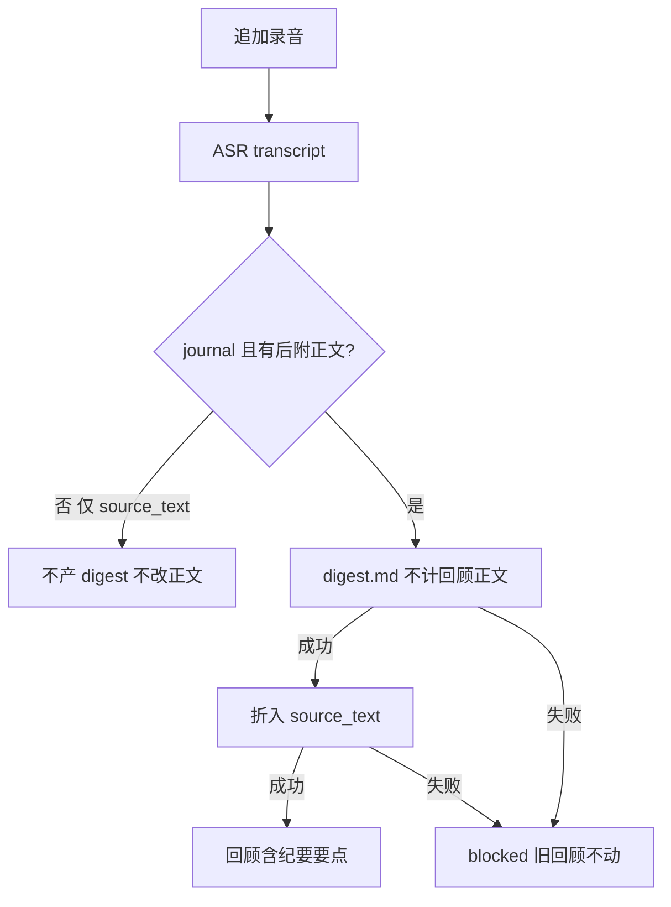

# 【总结】回顾追加材料后产纪要并折入正文

- Issue: [#193](https://github.com/xforce-io/kairo/issues/193)
- 分支: `feat/193-journal-review-fold`
- 状态: Approved
- 最后更新: 2026-08-30

## 1. 背景

时段回顾落在 `总结`（journal）后，往该条追加录音再 Run，只会 ASR。#146 为避免回顾被 fold 进 `understanding.md`、再被下一轮区间回顾当原料，把 journal 的 digest 与 compose 一并关掉。后附材料因此既没有纪要，也进不了这篇回顾正文。

链 [#193](https://github.com/xforce-io/kairo/issues/193)。L1 见该 issue comment。

## 2. 名词解释

本设计新增或易混：

| 术语 | 定义 |
|---|---|
| **后附材料** | 时段回顾落盘之后，追加到同一条 reference 上的正文形态（典型是录音转成的 `transcript`）。不是写回顾时的课题 digest。 |
| **回顾折入** | 把该条后附材料的 digest 写进**这一条**回顾的 `source_text`。不是 workspace 活 target 上的 fold。 |

已有术语（journal、digest、fold、source_text、transcript）见 [docs/glossary.md](../glossary.md)，不抄。

## 3. 目标与非目标

- **目标**：
  - journal 对后附正文跑 digest。
  - digest 成功后把纪要折入该条回顾 `source_text`。
  - 仅有回顾正文、无后附材料时不产 digest、不改正文。
  - 折入不因回顾正文更新而把 digest 打 stale（无循环）。
  - journal 仍无 `understanding.md`；仍不进下一轮区间回顾原料。
- **非目标**：
  - 恢复 journal 的 compose / 活 target。
  - 把 journal 条目送进 `produce_review` 摆盘。
  - 给 Grok 做 digest 全文倾倒回退。
  - 用誊录替换回顾正文，或只在文末加「录音附录」。
  - Agent 手写纪要或改正文。
  - 改课题仓 digest/compose、听读 UI、区间回顾生成算法。

## 4. 能力

1. journal 运行时 digest 阶段开启（含 leftover yaml `digest.enabled: false`）；compose 仍关。
2. journal 的 digest 输入排除该条 `source_text`（回顾正文本身不是观测）。
3. digest 成功且该条有 `source_text` 时，跑回顾折入，覆盖该条回顾文件并更新 form hash。
4. 折入失败（`provider-failed`）不写半成品，旧回顾保留。
5. dashboard 总结卡按真实 pending / blocked 计数，不再一律清零。

### 4.1 UI/UX

无新页面。打开该条 reference：有 `digest.md` 则仍置顶为目的产物；回顾 `source_text` 为折入后的全文。

| 状态 | 可见 |
|---|---|
| 纯回顾，无后附 | 无 digest；正文即当时写出的回顾 |
| 已追加录音，Run 中 | 人话进度；先誊录后纪要再折入 |
| 成功 | 有 digest；回顾正文含纪要要点 |
| 失败 | blocked；旧回顾仍可打开 |
| dashboard | 有待办时总结卡显示待 step / blocked，不再因 journal 藏计数 |

不做：独立「系统」区、回顾仓改名、折入确认对话框。

## 5. 思路与折衷

核心：journal 仍不是课题仓；只补「后附观测 → 纪要 → 写回这篇回顾」。

| 选择 | 放弃 |
|---|---|
| digest 开、compose 关 | 放弃继续整段关掉 digest（#146 S2） |
| digest 输入排除 `source_text` | 放弃把回顾正文与誊录一锅 digest（改正文会 stale digest，死循环） |
| 独立折入规则，digest 成功后跑 | 放弃一次 agent 同时写两份产物（失败缠在一起、难单侧重试） |
| 折入只打该条 `source_text` | 放弃 workspace `understanding.md` |
| digest 仍走授读 provider | 放弃本 issue 给 Grok 倾倒回退 |

建仓 yaml：新 journal 写 `digest.enabled: true`（与运行时一致）。leftover 仍可能是 `false`，运行时以 kind=journal 为准打开 digest，不改用户磁盘上的 yaml。

## 6. 架构

分层：Transform（ASR）→ Digest（journal 不计 `source_text`）→ 回顾折入 → Compose（journal 上 discover 空）。

主路径：`add --to` 音频 → Run → transcript → digest.md → 覆盖该条回顾 `source_text`。

失败路径：digest 或折入 `provider-failed` → 对应 product blocked、终态；回顾文件保持失败前内容。hash 变（誊录变）才重试。

不进 ComposeRule：`stage_enabled(compose)` 对 journal 仍为假；`live_targets()` 仍为空。

不进下一轮回顾：`is_journal_item` / `review_input: false` 不变。

折入记账：`state.products[references/{id}/review_fold]`，`input_hash` = 该条 digest 的 `input_hash`。digest 指纹不含 `source_text`，故折入改正文不会让 digest 变 stale。

## 7. 模块

| 模块 | 改动 |
|---|---|
| `kind` | journal 预设 `digest_enabled: true`；`stage_enabled(digest)` 对 journal 恒真，compose 恒假 |
| `DigestRule` | journal 下 catalog / 指纹正文排除 `source_text` |
| `ReviewFoldRule` | 新规则；journal + 有 `source_text` + digest 成功 → 折入 |
| `engine._build_rules` | Digest 之后、Compose 之前插入折入 |
| `web.discovery.summarize` | journal 不再把 stale/blocked 计成 0 |

## 8. API/CLI

N/A。无新命令、无新 HTTP 资源。仍走既有 `kairo run` / 工作区 Run。`retry-ref` 清该条派生产物后可重跑 digest 与折入。

## 9. 边界

- journal 的 corpus 仍不 digest（既有 `fold: false` 跳过）。
- 无 `source_text` 的 journal 条（例如只有誊录）：只产 digest，不折入。
- 课题仓行为不变。
- 折入 persona 固定在规则内，不新增 constitution 字段。

## 10. 迁移 / 兼容 / 回滚

- 不改用户 yaml。leftover `digest.enabled: false` 运行时忽略。
- 新 `kairo new 总结` 写出 `digest.enabled: true`。
- 磁盘上已有 `digest.md` 的 journal 条：若 fingerprint 与现规则一致则收敛，否则下次 Run 重产并折入。
- 回滚：还原本变更后 journal 再次跳过 digest/折入；已写出的 `digest.md` 与回顾正文留在磁盘，不自动删除。

## 11. 测试计划

- **E2E / Integration**：journal 一篇 `source_text` 回顾 + `--to` transcript fixture → `step` → 存在 `digest.md`，且回顾正文含 fixture 中一句可判定事实；digest catalog/指纹不含回顾正文；再 `pending` 为空（不循环）。折入时 provider 抛错 → 回顾原文不变、product `provider-failed`。
- **Integration**：仅 `source_text` 时 pending 无 digest、无 understanding；`produce_review` 摆盘不含 journal digest。leftover 无 `kind` 的 `总结`：`stage_enabled(digest)` 真、compose 假、`live_targets()==[]`。
- **Unit**：`fill_at_create` journal `digest.enabled is True`；dashboard 总结卡在纯回顾时无「待 step」，在有后附 pending 时显示。

## 12. 开放问题

N/A。Grok 无授读不在本 issue 解决。

## 13. 关联

- [#193](https://github.com/xforce-io/kairo/issues/193)
- [#146](https://github.com/xforce-io/kairo/issues/146) journal 契约（本设计修订 digest 段）
- [#144](https://github.com/xforce-io/kairo/issues/144) / [#145](https://github.com/xforce-io/kairo/issues/145) 时段回顾
- [#153](https://github.com/xforce-io/kairo/issues/153) digest 授读
