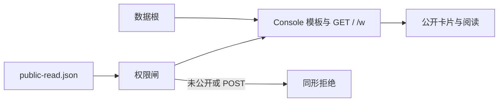

# 【部署】匿名只读复用 Console 壳，仅权限不同

- Issue: [#200](https://github.com/xforce-io/kairo/issues/200)
- 分支: `feat/200-console-public-read`
- 状态: Approved
- 最后更新: 2026-08-31
- L1: [Approved](https://github.com/xforce-io/kairo/issues/200#issuecomment-5475724501)

## 1. 背景

#155 把 public-read 做成独立极简 HTML，避免 Console 路由泄漏。对照本机 Console 仪表盘与 115 首页，匿名面没有工作区卡片和阅读壳，无法当产品用。#200 推翻 #155 §5.1：同一套 Console 壳，权限闸只放行 public-read 快照内的根。

## 2. 名词解释

N/A：沿用 [docs/glossary.md](../glossary.md) 的 Console / public-read / current / 数据根，以及 [#118](118-document-visibility.md) 的显式 public 声明与同形拒绝。

## 3. 目标与非目标

### 3.1 目标

1. `mode=public-read` 使用 Console 的模板、静态资源和仪表盘/工作区阅读路径。
2. 列表与文档仅含当前 `public-read.json` 声明的 workspace / target / reference。
3. 写方法不可用；页面无新建、删除、Run、添加参考等写入口。
4. 未公开 slug 与不存在同形拒绝。
5. `/healthz`、`/readyz`、`/p/{locator}`、`/api/public/v1` 仍按 #118/#155。

### 3.2 非目标

- 登录、远程写入、公开状态 mutation。
- 改变 Permit/locator 算法。
- 匿名面开放时间轴、知识册、glossary 管理（会扩权或泄露）。
- TLS。

## 4. 能力

### 4.1 UI/UX

信息架构：顶栏 `kairo · read`；主导航仅「工作区」。首页为 Console 仪表盘网格。工作区页为 Console 三栏阅读壳（targets / 正文 / 元数据），无 Actions 写按钮。

| 状态 | 表现 |
|---|---|
| 合法快照且有 public 根 | `/` 列出这些 workspace 卡片，可进 `/w/{slug}` 读公开 target/ref |
| 合法空快照（零根） | `/` 为 Console 空仪表盘，不列 private、不回退英文壳 |
| 快照缺失/损坏 | `/readyz` 503；内容入口 fail-closed |
| 未公开或写请求 | 同形拒绝；磁盘不变 |

不做：新建主题、置顶、删除、Run、添加参考/corpus、知识写入。

## 5. 思路与折衷

选择 **Console app + `public_read` 闸**，放弃第二套 HTML。

放弃：只藏按钮；反向代理过滤；115 上跑带 POST 的完整 Console。

`/p/{locator}` 保留给 locator 契约与旧链接；人读主路径改走 `/` 与 `/w/{slug}`。

## 6. 架构

主路径：加载快照 → 过滤 workspace → 渲染仪表盘 → 进入工作区 → 只渲染快照内 target/ref。

失败路径：快照非法则就绪失败；未公开 GET/任意写 → 404，不改磁盘。

## 7. 模块

| 模块 | 变化 |
|---|---|
| `web.server` | public-read 创建 Console app 并挂闸与 `/p` API |
| `web.views` | GET 列表/文档按快照过滤；模板注入 `public_read` |
| `web.templates` | 匿名面隐藏写入口与时间轴/知识导航 |
| `web.public` | 去掉作为唯一首页的英文壳；保留 readyz 与 locator 路由 |
| 测试 | S1/S2；console mode 回归 |

## 8. API/CLI

`kairo serve --mode public-read` 不变。HTML 主入口改为 Console `/`。写 HTTP 方法在该 mode 下 404。`/p/*` 与 `/api/public/v1/*` 保持 #118。

## 9. 边界

磁盘含 private；HTTP 只暴露快照内对象。匿名面不提供时间轴/知识/glossary 页。Console mode 路由与按钮不变。

## 10. 迁移/兼容/回滚

旧 `/p/{locator}` 链接仍可读。首页不再是英文 Public documents。回滚代码即回到 #155 空壳。

## 11. 测试计划

### E2E

- S1：合法快照 → `/` 含 Console 壳与恰好那些公开 workspace → `/w/{slug}` 可读公开正文。
- S2：未公开 `/w/{slug}` 与 POST 写 404，磁盘不变，HTML 无写入口。

### Integration

console mode 仪表盘/工作区/Run 不变。readyz 仍随快照。

### Unit

快照过滤；public_read 模板旗标。

## 12. 开放问题

无。

## 13. 关联

- [#200](https://github.com/xforce-io/kairo/issues/200)
- [#155](https://github.com/xforce-io/kairo/issues/155) §5.1 由本设计 supersede
- [#118](118-document-visibility.md)
