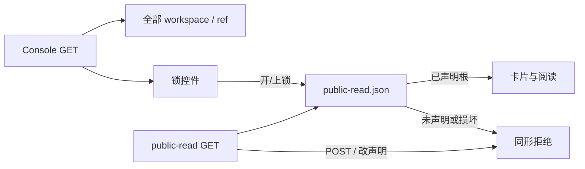

# 【文档权限】本机锁声明公开，115 匿名面看不到未开锁参考

- Issue: [#218](https://github.com/xforce-io/kairo/issues/218)
- 分支: `feat/218-ref-lock-public`
- 状态: Approved
- 最后更新: 2026-09-01
- L1: [Approved](https://github.com/xforce-io/kairo/issues/218#issuecomment-5491140893)

## 1. 背景

#118 规定匿名只读只放行当前显式 `public` 根；#200 要求 public-read 的 `/` 与 `/w/{slug}` 按同一快照过滤。现行 main 把备份内全部 workspace / reference 列给 115，只禁写；#118/#200 都不提供改公开声明的入口。#218 要让本机看见、115 匿名读者看不见，并在 reference 上用锁改声明。

## 2. 名词解释

N/A：沿用 [docs/glossary.md](../glossary.md) 的 workspace / public-read / 数据根，以及 [#118](118-document-visibility.md) 的显式 public 声明、文档根、同形拒绝。本设计的「锁」是 Console 上对该 reference 根显式 public 声明的控件，不是新授权对象。

## 3. 目标与非目标

### 3.1 目标

1. 本机 Console 列出并打开未公开 workspace 与其中全部 reference；未公开 reference 右栏有锁，未声明默认上锁。
2. `mode=public-read` 首页只出现至少有一个已公开根的 workspace；零公开根的不出现；未公开 `/w/{slug}`、未公开 reference GET 与不存在同形 404。
3. 本机切换锁立刻改变该 reference 的显式 public 声明：开锁后同一 serve root 上 public-read 可打开；上锁后下一次 GET 拒绝。
4. public-read 无改声明控件；写方法（含改声明）404 且不改磁盘。

### 3.2 非目标

- workspace 级总开关；target 锁。
- OIDC / #120 三档权限；对 115 磁盘管理员隐藏备份文件。
- 改 locator / Permit 算法；把分享 URL 当成授权（#119）。

## 4. 能力

### 4.1 UI/UX

信息架构：锁只出现在 Console 工作区右栏 **参考元数据**，标题/分享控件附近。侧栏、仪表盘、public-read 右栏都不放锁。

| 状态 | 表现 |
|---|---|
| 未声明 / 快照中无该 reference | 闭锁；点击即开锁 |
| 快照中已有该 reference 根 | 开锁；点击即上锁 |
| 快照缺失 | Console 视为零根（全上锁）；第一次开锁创建合法快照。public-read 首页空仪表盘，`/w` 同形 404 |
| 快照损坏 | Console 锁切换失败、文件不变。public-read 首页空仪表盘，`/w` 同形 404；`/readyz` 仍 503 |
| public-read 已公开 reference | 可读；无锁、无改声明入口 |
| public-read 未公开或缺失 | 与不存在同形 404 |

不做：workspace 总开关、target 锁、public-read 上的锁、登录墙。

开锁成功后：若该 workspace 因此有公开根，public-read 首页出现其卡片，侧栏只列已公开 reference。上锁后若再无公开根，卡片消失。

## 5. 思路与折衷

**选择：公开事实仍只来自 serve root 的显式 public 快照；public-read 只读快照，Console 锁只改快照。** 授权单位是 reference 根。

放弃：workspace 总开关；分享链接当授权；115 上提供锁；把锁做成「本机也藏起来」。

代价：能打开本机 Console 的人都能改声明。与现行 Console 无鉴权、只绑回环一致。

快照必须保持合法 generation：损坏不覆盖；写入失败整面不留下半份公开集。再开锁发新 locator，旧链接继续 404。

## 6. 架构

主路径：Console 打开未公开 reference → 闭锁 → 开锁写入合法新 generation → 同一 serve root 的 public-read GET 该 reference 200。上锁移除该根 → 下一次 GET 404。

失败路径：public-read 未公开/缺失/非法 GET → 固定 404；POST 写/改声明 → 404 且磁盘不变。快照损坏时 Console 切换失败、文件不变。无法冻结合法闭包则开锁失败、快照不变。

## 7. 模块

| 模块 | 变化 |
|---|---|
| `web.public` | 在合法快照（或缺文件当空集）上增删 reference 根并原子替换；损坏拒绝写 |
| `web.views` | public-read 列表/打开按快照过滤；Console 锁读写；console 不过滤 |
| `web.templates` / i18n | Console 参考元数据锁；public-read 不渲染 |
| 测试 | S1–S4；既有 public-read / 分享 / Permit 回归 |

## 8. API/CLI

无新 CLI。

| 方法与路径 | 契约 |
|---|---|
| `GET /` public-read | 合法快照：只列至少有一个已公开根的 workspace。合法空快照、或缺失/损坏：空仪表盘，不列 private。`/readyz` 仍按 #155 区分损坏。 |
| `GET /w/{slug}` public-read | 仅快照含该 slug 时 200；侧栏/target 只含已公开根。否则与不存在同形 404。 |
| `GET /w/{slug}/ref/{id}` public-read | 仅该 reference 为快照根时 200；否则同形 404。无锁。 |
| `POST /w/{slug}/ref/{id}/public` Console | `public=1` 开锁，`public=0` 上锁。幂等：已是目标态则快照不变。成功后元数据反映新锁态。损坏或无法冻结合法闭包 → 失败、磁盘不变。 |
| 同上 POST public-read | 与其他写方法一样 404，磁盘与声明不变。 |

Console 的 `GET /`、`GET /w/{slug}`、`GET /w/{slug}/ref/{id}` 不过滤。`/p/{locator}` 与 Permit 不变。

开锁冻结该 reference 当前受控闭包：manifest 列出且位于该 reference 目录内的普通文件 form，以及已存在的 `digest.md` / `prose.md`。路径相对 reference 目录。无合法成员则拒绝开锁。上锁只移除该 identity。已有 target 根不动。

## 9. 边界

- 本机可见全部；115 HTTP 只见快照内根。
- 开锁不公开同 workspace 其他 target/reference。
- 上锁后下一次 public-read GET 拒绝，无宽限窗口。
- Cookie、分享 URL、文件存在不是授权。
- 备份磁盘仍含 private 文件。

## 10. 迁移/兼容/回滚

缺失 `public-read.json`：public-read 仍按 #155 fail-closed；Console 视为零根，第一次成功开锁创建 version=3 合法快照。已有合法快照保留其他根，只增删被切换的 reference。回滚代码即回到「115 列出全部、无锁」。回滚数据：上锁或恢复上一份快照文件。

## 11. 测试计划

### E2E

- S1：console `/` 含未公开 workspace；打开未公开 reference，元数据含锁且默认上锁。
- S2：public-read `/` 不含零公开根 workspace；其 `/w/{slug}` 与未公开 reference GET 与不存在 404 同形；POST 404 且磁盘不变。
- S3：同一 serve root 先后挂 console 与 public-read；开锁后 public-read GET 200；上锁后再 GET 404。
- S4：public-read 已公开 reference 元数据无改声明控件。

### Integration

console 写入口与分享链接仍在；public-read 仍无写入口。`/p/{locator}` Permit 仍只认快照。

### Unit

未声明默认不公开；合法空快照不列 private；损坏快照拒绝写入。

禁止 mock `create_app`、禁止另写一套闸。

## 12. 开放问题

无。

## 13. 关联

- [#218](https://github.com/xforce-io/kairo/issues/218)
- [#118](118-document-visibility.md)
- [#200](200-console-public-read.md)
- [#119](https://github.com/xforce-io/kairo/issues/119)
