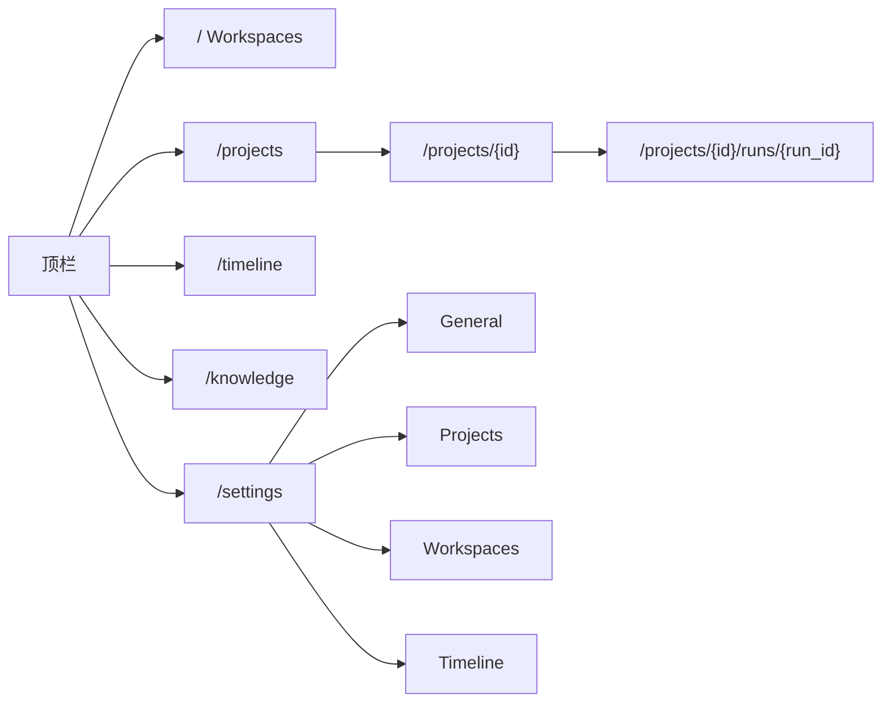
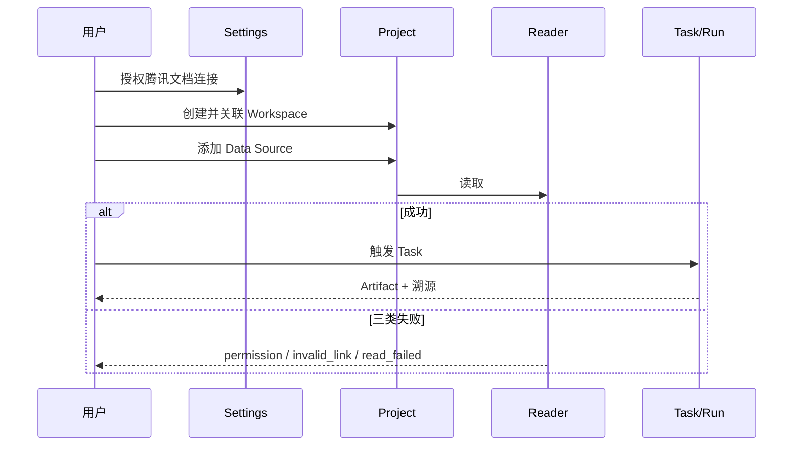

# #232 本阶段 Project 闭环（#233 → #237 → #235 → #236）

- Issue: [#232](https://github.com/xforce-io/kairo/issues/232)
- L1: [Approved](https://github.com/xforce-io/kairo/issues/232#issuecomment-5520081048)（人工「LGTM 设计通过」）
- 分支: `feat/232-project-loop`
- 状态: Approved
- 日期: 2026-09-03

本文件是详细设计唯一事实源。Issue 只保留摘要与本链接。

## 1. 背景

链 [#232](https://github.com/xforce-io/kairo/issues/232)。Workspace 仍是主题资料与知识单元。用户需要按业务边界聚合多个 Workspace、读取已授权腾讯文档表格，并留下可追溯的 Task / Run / Artifact。本阶段不把 Timeline 扩成 Project/Artifact 事件流（[#234](https://github.com/xforce-io/kairo/issues/234) 后续）。

## 2. 名词解释

已有 workspace、Timeline、digest、fold 见 [名词表](../glossary.md)。本设计新增：

| 规范名 | 一句话定义 | 禁止别称 |
|---|---|---|
| Project | serve root 上的业务聚合对象，多对多关联 Workspace，不拥有其内容。 | 课题、工作区组 |
| Settings | 本机全局控制台，分区为 General / Projects / Workspaces / Timeline，存放规则、默认值与连接健康。 | 项目设置、系统偏好 |
| 连接 | Settings 中一条外部授权记录；凭据只在本机，Project 只引用其 id。 | 账号、token 对象 |
| Data Source | Project 内对外部资料的配置：连接引用、链接、类型、业务用途与 Reader。 | 数据连接、表格源 |
| Reader | 按类型读取 Data Source 的可替换能力；本期仅腾讯文档表格/智能表格。 | 爬虫、导入器 |
| Task | Project 内可编辑的工作定义，一次性或按规则触发。 | 作业、流水线 |
| Run | 一次 Task 触发的不可变记录，冻结当时 Task 版本与输入。 | 执行、job |
| Artifact | 成功 Run 产生的可阅读正文，追溯到该 Run、当时 Task 版本与输入 Data Source。 | 报告、产物文档 |

## 3. 目标与非目标

### 3.1 目标

API、CLI、Web Console 同一结果：已有 Workspace + Settings 已授权腾讯文档 → 创建「综合能源」Project 并关联 → 配置表格或智能表格 Data Source 并读取 → 创建 Task 并触发 → 成功则打开 Artifact，追溯 Run / Task 版本 / 数据源。解除关联不删 Workspace。凭据不进 Project 或 serve root。既有 Workspace 与 Timeline 导航可用。

### 3.2 非目标

- #234 把 Timeline 扩成 Project/Artifact 事件流；把 Timeline 当排期/看板。
- 复制、迁移或删除 Workspace 内容。
- 凭据写入 Project / serve root；Project 上的凭据表单。
- public-read 增加 Project / Settings / Task 面。
- 自建腾讯文档 OAuth；扩展未指定平台。
- 改写历史 Run；失败 Run 伪造 Artifact。
- 用 LLM 生成 Artifact（本期 Artifact 是冻结输入的可阅读正文）。

## 4. 能力

### 4.1 UI/UX

顶栏（仅 Console）：Workspaces · Projects · Timeline · Knowledge · Settings。public-read 不出现 Projects / Settings。既有 `/` 与 `/timeline` 保持。

| 页面 | 空 | 成 | 错 | 不做 |
|---|---|---|---|---|
| `/projects` | 「还没有 Project」+ 创建表单 | 列表可点开 | 重名/空名提示 | 凭据表单 |
| `/projects/{id}` | 无数据源/无 Run 各为空句 | 关联 Workspace、数据源、Task、Run 链路 | 关联未知 slug、读取三类失败、失败 Run 原因 | Timeline 事件 |
| Artifact | 失败 Run 无正文、不假装成功 | 可阅读并含 Run / Task 版本 / 数据源 | 未知 run 404 | public-read 打开 |
| `/settings` | 连接未授权可判定 | 四分区；改 locale 或连接授权后三入口一致 | 非法分区忽略 | 某一 Project 的 Task/Artifact |

窄屏单列，顺序不变。

## 5. 思路与折衷

Project 落在 serve root `.kairo/projects/`，只存关联与业务对象。Settings 落在本机 `settings.json`（XDG），token 只来自环境变量名引用，永不写值。Reader 只在外部命令边界可替换（`cmd`），分类逻辑不可分叉。放弃：Workspace 内嵌 Project、凭据进备份、Timeline 调度、LLM Artifact。

## 6. 架构

分层：domain（`projects` / `settings` / `readers`）→ CLI / HTTP JSON / HTML 薄适配。

主路径：Settings 授权 → 建 Project → 关联 Workspace → 配 Data Source → Reader 成功 → 建 Task → 触发 Run → 写 Artifact。

失败路径：未授权或 401/403 → `permission`；链接非法或 404 → `invalid_link`；其它读失败 → `read_failed`。失败 Run 写原因，不写 Artifact 文件。public-read 访问上述面 404。

## 7. 模块

| 模块 | 职责 |
|---|---|
| `kairo.settings` | 本机 Settings 四分区 + 连接健康；不读 serve root |
| `kairo.projects` | Project / Data Source / Task / Run / Artifact 存数与操作 |
| `kairo.readers` | 腾讯文档 Reader：先查连接，再跑 `cmd`，映射三类失败 |
| `kairo.cli` | `project` / `settings` / `datasource` / `task` 命令组 |
| `kairo.web` | `/projects` `/settings` `/api/*`；public-read 拒绝 |

## 8. API/CLI

Serve root 与 `kairo list` 相同：`--root` / `KAIRO_SERVE_ROOT` / cwd。

CLI（`--json` 可机读）：

- `kairo project list|create|show|edit|link|unlink`
- `kairo settings show|set`
- `kairo datasource add|read|rm`
- `kairo task create|edit|enable|disable|run`
- `kairo artifact show`

HTTP JSON（Console，非 public-read）：

- `GET/POST /api/projects`；`GET/PATCH /api/projects/{id}`
- `POST /api/projects/{id}/workspaces`；`DELETE .../workspaces/{slug}`
- `GET/PATCH /api/settings`
- `POST /api/projects/{id}/datasources`；`POST .../datasources/{ds}/read`；`DELETE ...`
- `POST /api/projects/{id}/tasks`；`PATCH .../tasks/{tid}`；`POST .../tasks/{tid}/run`
- `GET /api/projects/{id}/runs/{rid}`

HTML：`/projects`、`/projects/{id}`、`/projects/{id}/runs/{rid}`、`/settings`。

Project JSON **禁止**字段：`token`、`api_key`、`password`、凭据原文。只存 `connection_id`。

## 9. 边界

- 解除关联不删 Workspace / reference / 产物；同一 slug 可挂多个 Project。
- 未知 Workspace slug 拒绝关联，不创建目录。
- Settings 页面不渲染某一 Project 的数据源/Task/Artifact。
- 既有 Timeline 扫描逻辑不变；不写入 Project 事件。
- 移除 Data Source 不删外部文档、不改 Settings 连接。
- Task 编辑递增 `version`；历史 Run 保留当时 `task_version` 与输入快照。
- 例行规则：`once` 或 `interval`（小时）；手动 `run` 始终可触发。不引入常驻 cron 进程。

## 10. 迁移/兼容/回滚

无既有 Project 存数。新目录 `.kairo/projects/` 缺省即空。回滚：删除该目录与本机 `settings.json` 不影响 Workspace。CLI 旧命令不变。

## 11. 测试计划

- **E2E #232 S1**：pytest 调 `CliRunner(app)` 与 `TestClient(create_app)`，tmp serve root：两 Workspace → Settings 授权 → 建「综合能源」→ 关联 → 配 Data Source（stub `cmd` 成功）→ Task run → Artifact 含 Run id、task version、数据源；Project 文件无凭据。
- **E2E #233**：link 两个 slug，unlink 一个，Workspace 目录与 `/timeline` 仍 200。
- **E2E #237**：Settings 四分区可访问；改连接授权后 API/CLI/HTML 一致；Settings HTML 无 Task/Artifact。
- **E2E #235**：成功读；`permission` / `invalid_link` / `read_failed` 可区分；rm 数据源后连接仍在。
- **E2E #236**：改 Task 后再 run，旧 Run 版本不变；失败 Run 有 `reason`、无 artifact 文件。
- **Integration**：三入口走同一 domain 函数；public-read `/projects` 404。
- **Unit**：链接分类；未授权短路径；Run 不可变。

无 live `TENCENT_DOCS_TOKEN` 时不打 docs.qq.com，只打 shipped Reader + stub `cmd`。

## 12. 开放问题

无。#234 明确后续。例行触发不做常驻调度器，由手动 `run` 覆盖 S1。

## 13. 关联

- #232 父；本阶段 #233 #237 #235 #236；后续 #234
- #138 Timeline 不回归；本机 `config.toml` / XDG；腾讯文档 CLI/MCP
