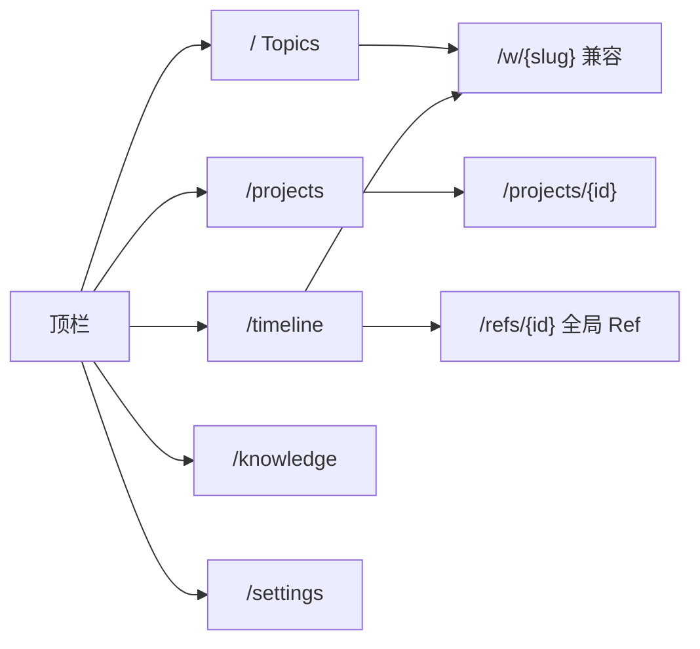
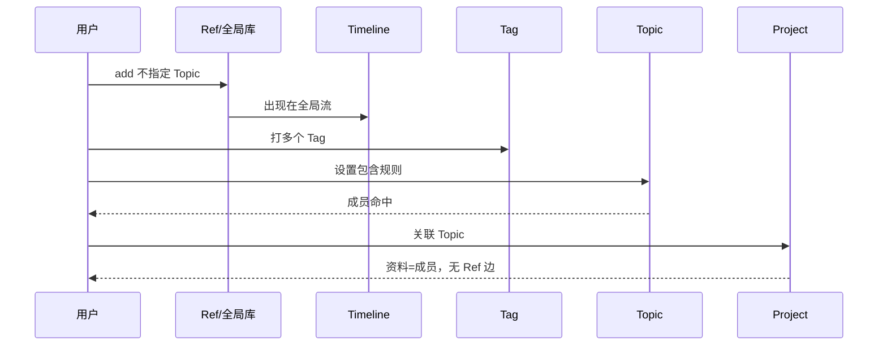

# #242 全局 Ref 与 Topic 模型

- Issue: [#242](https://github.com/xforce-io/kairo/issues/242)
- L1: [修订 Draft](https://github.com/xforce-io/kairo/issues/242#issuecomment-5524111562)（人工确认折衷：digest 一份且不搬家、无 Topic 入库、单一 Timeline、Ref 不直连 Project、Tag 包含规则、用户词改为 Topic）
- 分支: `feat/242-global-ref-topic`
- 状态: Draft
- 日期: 2026-09-03
- 子 Issue: [#243](https://github.com/xforce-io/kairo/issues/243) [#244](https://github.com/xforce-io/kairo/issues/244) [#245](https://github.com/xforce-io/kairo/issues/245) [#246](https://github.com/xforce-io/kairo/issues/246) [#247](https://github.com/xforce-io/kairo/issues/247)

本文件是详细设计唯一事实源。Issue 只保留摘要与本链接。

## 1. 背景

链 [#242](https://github.com/xforce-io/kairo/issues/242)。现网 reference 落在单一 Workspace 目录，Timeline 只收 fold 资格材料，Project 通过 `workspace_slugs` 关联目录。资料无法先入库再分类，也无法被多个议题使用而不复制。Workspace 与 Project 的用户词重叠。

## 2. 名词解释

已有 digest、fold、stream、corpus、Data Source、Task、Run、Artifact 见 [名词表](../glossary.md)。本设计新增或改写：

| 规范名 | 一句话定义 | 禁止别称 |
|---|---|---|
| Ref | 一份资料的全局身份：稳定 id、来源、发生时间与至多一份 digest；不因出现在多个 Topic 而复制。 | 资料副本、reference 对象（用户词） |
| Tag | 打在 Ref 上的分类标签；可多选；不拥有资料。 | 文件夹、Inbox |
| Timeline | serve root 上唯一的全局资料时间流，按发生日浏览全部可访问 Ref，并可按 Tag 筛选。 | Inbox、排期 |
| Topic | 知识加工对象：研究问题、constitution、结论与 agent 上下文；资料成员由包含规则计算。 | Workspace（用户词）、课题、保存的筛选器 |
| 包含规则 | Topic 声明的 Tag 列表；Ref 命中其中任一 Tag 即成为成员。空列表表示无成员。 | 智能合集、AND 规则 |
| home | Ref 源文件与 digest 所在目录（某 Topic 目录或全局库）；搬家不在本期。 | 归属 Workspace、主副本 |

磁盘目录仍叫实现名 workspace，仅出现在代码与兼容字段，不出现在新的用户文案。

## 3. 目标与非目标

### 3.1 目标

- 不指定 Topic 即可登记 Ref；源文件不搬家；全库一份 digest。
- Timeline 展示全部可访问 Ref（含未打 Tag、corpus、全局库）；多 Tag 筛选可清除。
- Topic 为用户可见名；成员 = 包含规则（任一 Tag）；规则未配置的历史 Topic 仍展示其 home 资料。
- Project 只关联 Topic；页面资料来自关联 Topic 的成员；历史 `workspace_slugs` 原样可读。
- API、CLI、Web Console 同一状态；旧 `/w/{slug}`、`workspace_slugs`、`kairo list` 作兼容别名。
- 知识 Run / `step` 只在 Topic 上；Project Task Run 仍在 Project。

### 3.2 非目标

- 把源文件迁到全局目录；按 Topic 各生成 digest；Ref 直连 Project。
- 另开 Inbox；替代 #234 的 Project/Artifact 事件；把 Timeline 当排期。
- 强制为历史资料补 Tag；排除规则、AND、手工钉住、手工 Ref↔Topic。
- 把 Data Source / Task / Run / Artifact 放入 Topic。
- 改 public-read 的鉴权模型；新增外部平台。

## 4. 能力

### 4.1 UI/UX

顶栏（Console）：**Topics** · Projects · Timeline · Knowledge · Settings。public-read 顶栏同为 Topics（不出现 Projects / Settings）。

| 页面 | 空 | 成 | 错 | 不做 |
|---|---|---|---|---|
| `/` Topics | 「还没有 Topic」 | 卡片列表，文案为 Topic | 非法名提示 | Project 运营配置 |
| `/w/{slug}` | 无成员时上下文仍在 | 成员列表（规则或历史 home） | 未知 slug 404 | Data Source / Task |
| `/timeline` | 无资料 / 当天无资料 / 无匹配 Tag 分句 | 全部可访问 Ref；Tag 筛选可清除 | 非法查询 400 | 排期；#234 事件 |
| `/refs/{id}` | — | 打开全局 Ref，无副本 | 未知 404 | 当成 Topic 容器 |
| `/projects/{id}` | 无 Topic 仍可跑任务 | 关联 Topic；资料=成员并集 | 未知 slug 拒绝 | Ref 直连勾选 |

窄屏单列，顺序不变。

## 5. 思路与折衷

全局身份用 **overlay**：历史文件留在原 Topic 目录；无 Topic 的新 Ref 写入 serve root 下 `.kairo/global-home/`（不是 root 下一层，dashboard 扫不到）。身份键 ` {slug}/{id}` 或 `global/{id}`。

包含规则：`constitution.include_tags`。缺省 `null` = 兼容，成员 = 该目录 home Ref。显式 `[]` = 无成员。非空 = 命中任一 Tag 的全局成员（含其他 home）。放弃 home∪规则并用，避免 S2 清空后仍看见旧文件。

知识 Run 只在 Topic：对本 Topic 成员，digest 已有则 fold；digest 未有且 home 是本 Topic 或全局库则在 home 生成；home 在其他 Topic 时不重算 digest。Project Task Run 不变。

放弃：每 Topic 一份 digest、搬家、Inbox、Ref↔Project、入库必须选 Topic、继续把 Workspace 当用户词。

## 6. 架构

分层：domain（`kairo.refs` + 既有 `workspace` / `projects` / `timeline`）→ CLI / HTTP JSON / HTML 薄适配。

主路径：登记 Ref（可无 Topic）→ Timeline 可见 → 打 Tag → Topic 设包含规则 → 成员出现 → Project 关联该 Topic → 三入口打开同一 Ref。

失败路径：未知 Tag/Topic/Project 拒绝写入且无半成关系；非法 Timeline 查询 400；解除关联不删 Ref/Topic。

## 7. 模块

| 模块 | 职责 |
|---|---|
| `kairo.refs` | 全局库、catalog（Tag 与赋值）、成员计算、Ref 解析 |
| `kairo.models.Constitution` | `include_tags: list[str] \| None` |
| `kairo.timeline` | 扫描 Topic home + 全局库；不再按 fold 资格排除；Tag 筛选 |
| `kairo.workspace` | 仍是目录实现；`add` 不搬家 |
| `kairo.projects` | `workspace_slugs` 存数不变；对外增加 `topic_slugs` 别名 |
| `kairo.cli` / `kairo.web` | Topic 用词、Tag/包含规则/全局 add、兼容路由 |

## 8. API/CLI

Serve root 与 `kairo list` 相同。

CLI：

- `kairo add`：cwd 是 Topic 目录则 home 在该 Topic；否则写入全局库（`--root` / `KAIRO_SERVE_ROOT` / cwd）
- `kairo tag add|rm|list [--home SLUG] REF TAG`
- `kairo include set|clear`（cwd 为 Topic）
- `kairo timeline [--tag TAG ...]`
- `kairo project link` 仍接受 slug；JSON 同时给 `workspace_slugs` 与 `topic_slugs`
- `kairo list` 仍列出目录；用户文案称 Topic

HTTP JSON（Console）：

- `GET /api/refs`、`POST /api/refs`（全局登记）
- `POST /api/refs/{key}/tags`、`DELETE .../tags/{tag}`
- `GET/PUT /api/topics/{slug}/include`
- `POST /api/projects/{id}/topics`（与 `/workspaces` 同实现）
- 既有 `/api/projects/{id}/workspaces` 保留

HTML：`/`、`/w/{slug}`、`/timeline?tag=`、`/refs/{id}`、`/projects/{id}`。`/topics/{slug}` 303 到 `/w/{slug}`。

## 9. 边界

- 解除 Tag / 包含规则 / Project 关联不删除 Ref 或 digest。
- 同一物理 digest 路径只一份。
- 知识 Run 不出现在 Timeline / Project 详情 / Tag 管理。
- public-read 不新增 Project；Timeline 与 Topic 只读规则与现网一致。
- Inbox 禁止作为用户词。

## 10. 迁移/兼容/回滚

- 不搬文件、不改 ref id、不强制补 Tag。
- 缺 `include_tags` 的历史 constitution 按 home 成员读取。
- Project JSON 仍只写 `workspace_slugs`；读出时复制为 `topic_slugs`。
- 回滚：删除 `.kairo/global-home/` 与 `.kairo/ref-catalog.json`，忽略 `include_tags`，UI 词可还原；历史 Topic 目录不受损。

## 11. 测试计划

- **E2E #242 S1 / #247 S1**：CLI+API+HTML：无 Topic add → Timeline 可见 → 打 Tag → Topic 包含规则命中 → Project 关联后可见同一 id；无第二份 `references/` 目录；digest 路径唯一。
- **E2E #243 S2**：未打 Tag 的全局 Ref 不进入任何 Topic。
- **E2E #244**：corpus 与未分类 Ref 出现在 Timeline；多 Tag 筛选与清除；删 Tag 不删 Ref。
- **E2E #245**：历史 Topic 无 `include_tags` 仍列出 home Ref；`include_tags=[]` 后成员为空但 `understanding.md` 仍在；页面无 Data Source。
- **E2E #246**：`workspace_slugs` 历史 Project 以 Topic 展示；unlink 不删目录。
- **E2E #247 S2**：`/w/{slug}`、`/api/projects/{id}/workspaces`、`kairo project link` 仍可用。
- **Integration**：三入口走 `kairo.refs`；scan_timeline 含全局库。
- **Unit**：任一 Tag 命中、空规则、非法 Tag、身份键。

不打 live LLM。知识 Run 的 fold 路径用成员列表与 digest 路径断言，不烧 provider。

## 12. 开放问题

无。排除/AND/钉住明确后续。#234 仍后续。

## 13. 关联

- 父 #242；子 #243–#247
- 既有 #138 Timeline、#232 Project 闭环、#234 后续事件
