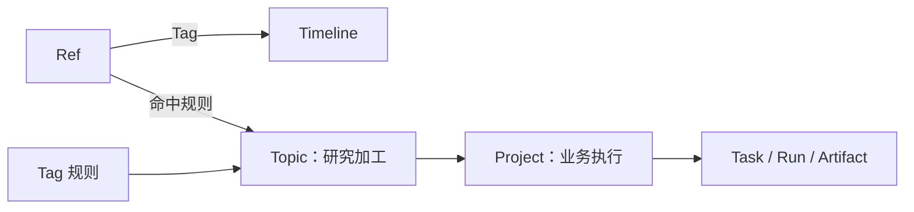

# #249 — 以 Topic 为中心的 Console 信息架构

- Issue: [#249](https://github.com/xforce-io/kairo/issues/249)
- L1: [Approved](https://github.com/xforce-io/kairo/issues/249#issuecomment-5525624606)
- 分支: `feat/249-topic-first-console-ia`
- 状态: Draft
- 日期: 2026-09-03

本文件是详细设计唯一事实源。Issue 只保留摘要与本链接。

## 1. 背景

[#242](https://github.com/xforce-io/kairo/issues/242) 与 [PR #248](https://github.com/xforce-io/kairo/pull/248) 已将资料模型升级为全局 Ref、Tag、Topic 与 Project：资料先进入全局时间流，Topic 按 Tag 包含规则形成研究上下文，Project 只关联 Topic 执行业务工作。当前 Console 已部分使用 Topic 文案，却仍以目录、兼容路由和后台表单组织首页、Timeline 与 Project；用户无法稳定区分研究加工、资料发现和业务执行。

## 2. 名词解释

N/A。本设计不引入新术语；Ref、Tag、Timeline、Topic、Project、Data Source、Task、Run、Artifact 以[名词表](../glossary.md)为准。

## 3. 目标与非目标

### 3.1 目标

- Topics 是研究加工的默认入口：可判断研究状态、资料概况和一个继续动作。
- Timeline 是全局 Ref 发现入口：按 Tag 筛选，打开的是单一资料而非 Topic 副本。
- Projects 是业务执行入口：先关联 Topic，再在其聚合资料上下文中配置 Data Source、Task 与查看 Run。
- 顶栏、面包屑、空态和行动文案只使用面向用户的规范对象名；桌面与窄屏形成同一心智模型。

### 3.2 非目标

- 改变全局 Ref、Tag、Topic、Project 的领域模型、存储、包含规则或兼容策略。
- 迁移、复制、移动 Ref，或重算 digest。
- 增加 Reader、外部平台、权限、OAuth，或将 Project/Artifact 事件加入 Timeline。
- 重做 Knowledge、Settings 的业务能力，或替换既有暖纸、松绿视觉语言。

## 4. 能力

### 4.1 UI/UX

Console 一级导航固定为 **Topics · Projects · Timeline · Knowledge · Settings**。`/` 是 Topics，`/timeline` 是 Timeline；兼容 `/w/{slug}` 与 `workspace_slugs` 只留在实现和旧链接中，新的用户界面不得显示 Workspace、slug 或「删除 workspace」等文案。public-read 同样称 Topics，但不出现 Projects、Settings。

可审阅的高保真页面示例见 [mockups.html](249-topic-first-console-ia/mockups.html)：它包含 Topics 状态总览、全局 Ref Timeline、Project 渐进式关联 Topic，以及 390px 窄屏四个可切换页面。该页面是本节的视觉验收样例；文字规格与样例冲突时，以本节对象边界和状态表为准。

#### Topics

Topics 首页的首要任务是定位或创建研究对象。顶部保留搜索、状态筛选与「新建 Topic」；列表按现有置顶/最近规则分组。每张卡片按固定顺序呈现：Topic 名、简短研究状态、资料概况、一个与状态相符的主要动作。数量是辅助信息，不以实现目录名充当第二标题。卡片打开 Topic 详情，危险操作不与进入详情竞争。

Topic 详情依次呈现：Topic 身份与研究状态、资料成员、知识加工上下文与次要管理操作。成员为空时仍保留 Topic 的问题与结论上下文，主行动为补充资料或调整包含规则；未知 Topic 显示明确错误页。成员资料只以 Ref 身份显示，跨 Topic / 全局 home 不被复制或伪装为本 Topic 文件。

#### Timeline 与 Ref

Timeline 的默认视图是全部可访问 Ref 的时间流。顶部提供 Tag 多选筛选、当前条件和单一「清除筛选」动作；条件为空、无匹配、无资料均各有可读空态。时间流条目展示 Ref 的标题、发生时间和 Tag，不以 Topic 名作为条目身份。打开条目进入 Ref 详情；Ref 详情展示其 Tag、来源时间、可见的相关 Topic 入口，并提供返回带原筛选条件的 Timeline。Timeline 不呈现排期、Task 或 Run 事件。

#### Projects

Projects 列表的卡片展示 Project 名、已关联 Topic 概况、资料概况和最近一次 Run 状态；空列表以「新建 Project」为首要行动。Project 详情以「已关联 Topic」为第一段：空 Project 只呈现说明和「关联 Topic」按钮，不在首次进入时展开全部 Topic。触发后打开可搜索的选择面，用户可多选并一次保存；保存失败时保留选择并在选择面内说明原因。

关联成功后，详情依次呈现已关联 Topic、聚合资料概览、Data Source、Task、Run。每段各有独立空态与进入该段操作；无资料不覆盖已关联 Topic 的成功状态。Topic 解除关联是次要且可恢复的局部操作，不删除 Topic 或 Ref。Project 不出现 Ref 的直接勾选。

#### 全局状态与窄屏

顶栏在桌面保持同一行并突出当前入口；窄屏允许一级导航横向滚动，当前入口始终可见且内容按单列排列。所有表单在窄屏中先显示目的和结果，再显示输入；主要按钮保持内容宽度，只有明确的全宽提交区域才占满容器。成功以局部状态更新或消息确认；错误就近于触发处显示，避免用全局 toast 代替可修复的表单错误。

| 场景 | 可判定结果 |
|---|---|
| 无 Topic | 可创建 Topic，不显示实现目录术语。 |
| Topic 无成员 | 研究上下文可读，资料区给出补充或调整规则的行动。 |
| Timeline 无匹配 | 显示当前 Tag 条件与清除动作。 |
| 空 Project | 首要动作是关联 Topic，选择器默认收起。 |
| Project 关联后无资料 | 已关联 Topic 仍可见，聚合资料单独说明为空。 |
| 未知对象或保存失败 | 保留当前上下文和可修复输入，给出具体原因。 |

## 5. 思路与折衷

采用「对象优先、渐进配置」：先让用户进入 Topic、Ref 或 Project 的明确对象，再只展示该阶段所需操作。这样把研究、资料发现与业务执行分开，同时复用 #242 的单一 Ref 与 Topic 包含规则。

放弃在 Project 首屏同时铺开全部 Topic、Data Source、Task、Run 的后台表单，因为它让空态主导界面，也让 19 个 Topic 的选择成本先于用户目标。放弃新建 Inbox、Ref↔Project 直连和按 Topic 复制资料，因为这些会破坏 #242 的资料身份边界。代价是用户需先经 Topic 建立研究上下文；收益是每个一级入口只回答一个主要问题。

## 6. 架构

分层为：领域层提供全局 Ref/Tag、Topic 成员、Project 聚合和运行状态；Console 视图层将它们组合为 Topics、Timeline/Ref、Projects 三种页面模型；交互层只负责筛选、选择、保存与局部反馈。兼容路由仍由入口适配层解析，不能反向决定用户文案或页面层级。

主路径：用户从 Topics 识别研究状态并打开 Topic，或从 Timeline 找到 Ref；需要业务执行时进入 Project，关联 Topic 后在聚合资料上下文中运行 Task 并查看 Artifact。失败路径：空集合呈现该对象仍可执行的下一步；筛选无匹配可清除；对象未知返回明确错误；关联保存失败保留本次选择且不写入半成关系。

## 7. 模块

| 模块 | 职责 |
|---|---|
| Console 壳与导航 | 一级入口、规范文案、当前上下文与窄屏导航。 |
| Topic 呈现 | Topic 卡片、研究状态、成员资料与知识上下文的层级。 |
| Timeline / Ref 呈现 | 全局资料流、Tag 条件、Ref 详情与回退上下文。 |
| Project 呈现 | 渐进式 Topic 关联、聚合资料以及 Data Source / Task / Run 的分段状态。 |
| 兼容适配 | 旧路由和字段继续可读，不泄漏到新用户界面。 |

## 8. API/CLI

N/A。本变更不增加公开 API 或 CLI 契约；页面使用既有 Topic 成员、全局 Ref、Tag 筛选与 Project 关联能力。若为呈现组合数据补充内部视图模型，不改变其领域语义或兼容端点。

## 9. 边界

- Topic 是研究加工对象，成员只来自既有包含规则或历史 home 兼容；它不是保存的筛选器或 Project 子项。
- Timeline 只展示 Ref；Project 的 Task、Run、Artifact 不进入 Timeline。
- Project 只关联 Topic，资料为关联 Topic 的成员并集；解除关联不删除任何 Topic、Ref 或 digest。
- Settings 继续是本机配置；Knowledge 继续管理知识，不承接 Project 配置。
- public-read 不新增 Project 或 Settings 页面，且不暴露本机操作。

## 10. 迁移/兼容/回滚

不迁移数据、不改 Ref 身份、不改 `workspace_slugs` 存数。旧 `/w/{slug}`、旧 API 与旧 CLI 入口保持可用；新页面及新文案只使用 Topic。回滚仅还原 Console 呈现层，不影响 Topic、Ref、Project、digest 或兼容数据。

## 11. 测试计划

- **E2E S1**：在含多个 Topic 的测试根中，于 1280 与 390 宽度访问 Topics 首页和详情；搜索/筛选可达，空成员保留上下文，用户可见文本无 Workspace 或 slug 主键输入。
- **E2E S2**：建立带多个 Tag、无 Tag 与跨 Topic 的 Ref；多 Tag 筛选、无匹配、清除条件、Ref 详情与返回相关 Topic 均有可判定结果，Ref 身份不随入口改变。
- **E2E S3**：空 Project 首屏只给关联 Topic 的行动；打开选择面、搜索、多选、保存后依次可见关联 Topic、聚合资料、Data Source、Task、Run；失败保存保留选择。
- **E2E S4**：五个一级入口在桌面与窄屏均可访问，当前态、对象文案、空态和面包屑一致；public-read 不出现 Projects、Settings。
- **Integration**：Topic、Timeline/Ref、Project 页面读取同一份领域结果；旧 `/w/{slug}` 与 Project 兼容字段仍可读。
- **Unit**：对象文案映射、筛选条件展示与清除、Project 选择器的默认折叠及各段空/成功/失败状态。

## 12. 开放问题

N/A。本设计不引入新的领域决策；实施期间若发现现有领域结果无法组成上述页面模型，应回到本设计澄清，而非在 UI 中另造对象关系。

## 13. 关联

- Issue：[#249](https://github.com/xforce-io/kairo/issues/249)
- 前置模型：[ #242 ](https://github.com/xforce-io/kairo/issues/242)、[PR #248](https://github.com/xforce-io/kairo/pull/248)
- Project 基础能力：[#232](https://github.com/xforce-io/kairo/issues/232)、[PR #238](https://github.com/xforce-io/kairo/pull/238)、[PR #240](https://github.com/xforce-io/kairo/pull/240)、[PR #241](https://github.com/xforce-io/kairo/pull/241)
- 后续边界：[#234](https://github.com/xforce-io/kairo/issues/234)
