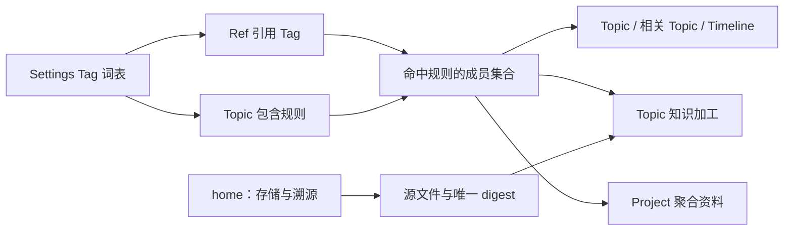
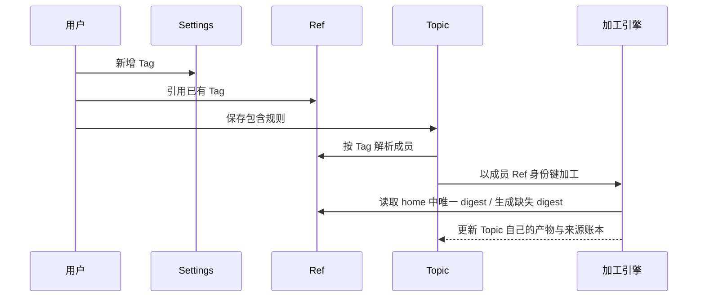

# #252 — Tag 词表与 Topic 成员规则

- Issue: [#252](https://github.com/xforce-io/kairo/issues/252)
- L1: [Approved](https://github.com/xforce-io/kairo/issues/252#issuecomment-5526943722)，[115 备份门禁](https://github.com/xforce-io/kairo/issues/252#issuecomment-5526995754)
- 分支: `feat/252-tag-rule-topic-membership`
- 状态: Approved
- 日期: 2026-09-03

本文件是 #252 的详细设计唯一事实源。Issue 只保留摘要与本链接。

## 1. 背景

[#242](https://github.com/xforce-io/kairo/issues/242) 将 Ref 定义为全局身份、Topic 定义为按 Tag 聚合的知识加工对象，却为历史数据保留了 `include_tags=null` 时按 `home` 收成员的兼容分支。该分支使无 Tag Ref 看似属于 Topic；跨来源 Tag 成员又只能在浏览层出现，不能完整进入该 Topic 的知识加工。

同时，Tag 可由资料入口隐式创建，缺少一个可审核的词表入口。#252 收敛为 Settings 管理 Tag、Ref 与 Topic 引用 Tag、所有 Topic 成员按同一规则被浏览和加工的单一模型。

## 2. 名词解释

Topic、Ref、Tag、包含规则、stream、corpus、digest、fold、Project、Settings 与恢复闭包见 [名词表](../glossary.md)。本设计仅新增下列易混术语：

| 术语 | 本设计中的精确含义 |
|---|---|
| Ref 身份键 | 见 [名词表](../glossary.md)；成员关系和 Topic 加工账本使用它，不以某个 Topic 内的相对 digest 路径作键。 |
| Topic 名称 Tag | 名称与一个现存 Topic 相同、因该 Topic 存在而受删除保护的全局 Tag；它不是 Ref 的目录归属，也不会自动给任何 Ref 打标。 |

## 3. 目标与非目标

### 3.1 目标

1. Settings 是 Tag 的唯一创建和删除入口；Ref 打标、Topic 包含规则、Timeline 筛选只引用词表中的既有 Tag。
2. Topic 成员严格为命中其包含规则任一 Tag 的全局 Ref；`home` 不再是成员条件。
3. 同一成员集合同时用于 Topic 的资料展示、相关 Topic、知识加工和关联 Project 的资料聚合；Ref 与 digest 均只保留一份。
4. 每个 Topic 名称对应一个受保护的 Topic 名称 Tag；被 Ref、Topic 规则或 Topic 名称引用的 Tag 一律不可删除。
5. 历史迁移不为 Ref 推断或补写 Tag；迁移前必须完成并验证 115 备份。

### 3.2 非目标

- 移动 Ref、复制 Ref、按 Topic 复制 digest，或让 Project 直接关联 Ref。
- 隐式新建 Tag、自动从 home 推断 Tag、AND/排除/手工钉住规则。
- Tag 改名、Topic 改名或删除 Topic 后 Tag 的重命名/回收；名称在本期保持稳定。
- 在应用中接入、验证或上传 115 网盘；115 仅是人工迁移发布门禁。

## 4. 能力

### 4.1 UI/UX

| 页面 | 成功 | 空 | 错误 | 不做 |
|---|---|---|---|---|
| Settings / Tag | 列出 Tag、引用计数与 Topic 名称保护；可新增或删除零引用普通 Tag。 | 无 Tag 时引导先新增。 | 重名、空名、或有引用的删除均说明原因且不写入。 | 在 Ref 或 Topic 页面创建 Tag。 |
| Ref | 从现有 Tag 词表添加或移除引用；展示由命中规则得到的相关 Topic。 | 无 Tag 时显示未分类。 | 选择不存在 Tag 或保存失败时原选择保持。 | 用 home 推断相关 Topic。 |
| Topic | 选择一个或多个已存在 Tag 作为包含规则，成员和研究上下文同时刷新。 | 无规则或无命中时显示空成员与调整规则入口。 | 未知 Tag 或保存失败不改变现有规则。 | 手工勾选 Ref、展示 home 为成员理由。 |
| Timeline | 按既有 Tag 查找/筛选 Ref，不创建 Tag。 | 无匹配保留条件并可清除。 | 非法查询不产生写入。 | 将未分类 Ref 伪归入 Topic。 |

Topic 名称 Tag 在 Settings 中显示为受保护；删除按钮不可用并说明对应 Topic。它可被 Ref 和 Topic 规则引用，但不因为同名自动写入 Ref，也不自动成为该 Topic 的包含规则。新建 Topic 前，用户先在 Settings 创建同名 Tag；没有同名 Tag 时 Topic 创建拒绝并给出前往 Settings 的入口。

### 4.2 成员与加工

- 成员解析以 Tag 词表中的精确 Tag 名为准，命中任一包含规则即为成员；无规则和空规则都表示无成员。
- `home` 只定位源文件、manifest 和唯一 digest；它不得影响成员数、相关 Topic、Project 聚合或 UI 文案。
- `stream` 成员已有 digest 时直接作为该 Topic 的 fold 输入；缺 digest 时在该 Ref 的 home 生成唯一 digest，成功后才可 fold。跨来源不会复制文件或 digest。
- `corpus` 成员继续是只读参考层：可被 Topic/Project 看见和按需读取，但不生成 digest，也不进入 fold 增量。
- 每个 Topic target 的折入账本以 Ref 身份键记录来源和 hash。旧的本 Topic `references/<id>/digest.md` 账本键在迁移时可确定地改为本 Topic home 与 id 的 Ref 身份键；跨来源成员从首次命中后开始记账。

## 5. 思路与折衷

选择单一 Tag 规则，而非保留 `home ∪ Tag`：后者可减少短期空成员，却无法解释一个无 Tag Ref 为什么属于 Topic。代价是历史 Topic 在未配置规则时会变为空成员；收益是所有页面和加工读取同一关系。

选择词表先行，而非打标时自由输入：代价是新增分类须先到 Settings，收益是名称可治理、规则不会因拼写漂移失效。选择“零引用才可删除”，放弃级联清除：代价是需先显式解除引用，收益是删除不会静默改变 Topic 成员。

选择跨来源读取唯一 digest，放弃复制和搬家：代价是加工必须通过 Ref 身份键解析物理来源，收益是资料、digest 和溯源只有一个事实。115 备份选择人工发布门禁，放弃假设应用可证明网盘状态。

## 6. 架构

领域层由 Tag 词表、Ref 身份解析和 Topic 成员解析组成；加工层从成员集合取得可读来源；Console、CLI 和 Project 只消费这些结果。物理 workspace 目录仍是实现层，不反向定义用户可见归属。

失败路径：词表、规则和引用的未知 Tag 均 fail-closed 且零写入；成员来源缺失或 digest 生成失败时，该 Ref 不折入、既有 Topic 产物与账本不被半成更新；跨来源源数据不可读时只报告该来源阻塞，不回退为 home 成员。

## 7. 模块

| 模块 | 职责 |
|---|---|
| Tag 词表 | 保存全局 Tag、计算 Ref/规则/Topic 名称引用，提供新增、零引用删除和引用校验。 |
| Topic 配置 | `include_tags` 统一为显式列表；声明包含规则，但不保存 Ref 成员副本。 |
| Ref 解析 | 用 Ref 身份键定位任一 home 的 manifest、源文件与 digest。 |
| 加工与状态 | 基于成员 Ref 身份键构建 digest/fold 输入和 target 账本，保留 source class 约束。 |
| Settings、Timeline、Topic、Project | 分别管理词表、筛选、规则、聚合；均读取同一成员解析结果。 |
| 迁移工具 | 执行预检、备份证据校验、候选验证、原子提交或恢复；不推断 Ref Tag。 |

## 8. API/CLI

### 8.1 Tag 与规则契约

| 接口 | 契约 |
|---|---|
| `GET /api/tags` | 返回 Settings 词表中的 Tag、Ref 引用数、Topic 规则引用数和受保护原因；不返回 Ref 正文。 |
| `POST /api/tags` | 仅在 Settings 创建规范化后未存在的 Tag；重名或空名失败且零写入。 |
| `DELETE /api/tags/{name}` | 仅零引用普通 Tag 成功；任何 Ref、规则或 Topic 名称引用返回冲突及计数，零写入。 |
| Ref Tag 写接口 | 只接受词表已有 Tag；未知 Tag 返回校验错误，不隐式创建。 |
| Topic 包含规则写接口 | 只接受词表已有 Tag；保存后成员由全局 Ref 重算，不持久化成员列表。 |

CLI 保留 `kairo tag add|rm|list` 的引用语义，其中 `add` 对未知 Tag 拒绝；新增词表操作和迁移入口必须与上述写入规则一致。旧 API/CLI 的路由和参数保持可读，但不得绕过词表校验。

### 8.2 迁移契约

迁移为显式的本地运维命令，必须提供经人工核验的 115 备份证据文件；`--dry-run` 只生成预检报告且零写入。真实执行前验证该证据包含 115 快照位置、创建时间、文件清单/校验和与隔离恢复结果。应用不访问 115；证据不合格、缺失或根数据与证据快照不一致时拒绝开始。

## 9. 边界

- Tag 名称比较使用统一规范化规则；词表、引用和包含规则必须使用同一结果，重名 fail-closed。
- Ref 仍只有一个 home、manifest、源文件与 digest；被多个 Topic 命中不新增副本。
- 删除 Tag、保存规则、迁移均不得删除 Ref、digest、Topic、Project、Task、Run 或 Artifact。
- public-read 保持只读，不新增 Tag 管理或迁移入口；可见成员仍受既有公开边界约束。
- #250 的 Timeline 筛选和 #251 的同名 Ref 区分仅消费本设计的词表/成员结果，不定义第二套关系。

## 10. 迁移 / 兼容 / 回滚

### 10.1 前置与预检

操作员先在 115 创建完整恢复闭包快照，核对文件清单和校验和，并恢复到隔离根验证可读。迁移命令只接受该证据；任何预检失败均零写入。

预检读取全部 Topic、Ref、Project 与状态，验证 Topic 名称规范化后唯一、Ref 身份键可解析、已有 Tag 无规范化冲突、所有历史引用可纳入词表。冲突先由用户修正，不自动选取名称。

### 10.2 数据变换

1. 将历史 catalog 的 Tag、Ref 已有 Tag、Topic 现有包含规则和所有 Topic 名称合并为唯一全局词表；这是登记既有明确引用，不是为 Ref 推断新 Tag。
2. 每个 Topic 名称成为受保护 Tag；迁移不会把该 Tag 写入任何 Ref。
3. 将历史 `include_tags=null` 统一为 `[]`；已有显式列表按原值保留并通过新词表校验。因此 home 不再产生成员。
4. 将既有 target 的本 Topic digest 路径账本改为对应 Ref 身份键；不改 digest 文件、不重算内容。无法确定的账本项停止迁移。
5. 在候选副本中重新解析所有成员、Project 聚合和加工输入；验证成功后整体提交。任一写入或验证失败时恢复候选前状态，不留下半迁移数据。

旧路由、`workspace_slugs` 和 Ref home 继续可读；旧实现若读取迁移后数据不得重新启用 home 成员。需要回到旧语义或迁移验收失败时，从已验证的 115 快照恢复完整根目录，而非仅回退代码或单独修改 catalog。

## 11. 测试计划

- **E2E S1**：Settings 新增 Tag，给全局或另一 home 的 stream Ref 打标，Topic 设规则后在 Topic、Ref 详情、Project 和 Topic 产物中看到同一 Ref；digest 数量始终为一。
- **E2E S2**：未打 Tag 的历史 home Ref 不进入任一 Topic 或加工，仍在 Timeline 可发现；为其添加/移除命中 Tag 后四个入口和加工输入同步变化。
- **E2E S3**：尝试删除被 Ref、规则或 Topic 名称引用的 Tag 均失败且状态不变；零引用普通 Tag 可删除。
- **E2E S4**：有/无规则、无成员、缺 digest、阻塞来源和 corpus 成员分别展示可判定状态；窄屏 Settings、Topic、Timeline 不丢失主要操作。
- **Integration**：跨 home 解析、唯一 digest、Ref 身份键账本、Project 成员并集、旧路由与 public-read 边界一致。
- **Unit**：Tag 规范化与引用计数、删除保护、成员匹配、source class、账本键迁移、预检与失败零写入。
- **迁移演练**：在隔离恢复根执行 dry-run、真实迁移和验收；再从 115 快照恢复，断言 Ref、Tag、Topic、Project、forms、产物和成员关系均回到迁移前。

## 12. 开放问题

N/A。本期不提供 Tag/Topic 改名；它们保持稳定，避免在成员规则迁移中引入全局重写。若后续需要改名，应单独定义 Ref 引用、Topic 规则、受保护关系与历史链接的原子联动。

## 13. 关联

- [#252](https://github.com/xforce-io/kairo/issues/252)、[#249](https://github.com/xforce-io/kairo/issues/249)
- [#242 L2](242-global-ref-topic.md)：本设计替换其历史 home 成员兼容与跨来源不折入的限定。
- [#250](https://github.com/xforce-io/kairo/issues/250)、[#251](https://github.com/xforce-io/kairo/issues/251)
- [#154 L2](154-remote-full-backup.md)：恢复闭包与恢复校验的既有契约。
