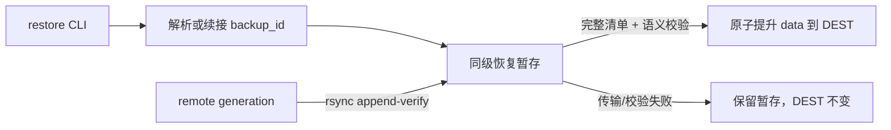

# 【备份】让 generation 恢复可在断流后续传

- Issue: [#253](https://github.com/xforce-io/kairo/issues/253)
- 分支: `feat/253-resumable-backup-restore`
- 状态: Approved
- 最后更新: 2026-09-04
- L1: [Approved](https://github.com/xforce-io/kairo/issues/253#issuecomment-5534688249)

## 1. 背景

既有 `kairo backup restore` 下载到进程临时目录；SSH/rsync 流中断时该目录随进程消失，重试无法复用已下载文件。#253 的远端 generation 已通过隔离恢复验证，问题只在本地恢复传输与失败生命周期。

## 2. 名词解释

新增的[恢复暂存](../glossary.md)是一个绑定恢复输入、但尚未公开为目标 serve root 的同级隐藏目录。

其余 remote、备份 generation、备份清单与恢复闭包沿用 [#154](154-remote-full-backup.md) 和 [名词表](../glossary.md)。

## 3. 目标与非目标

### 3.1 目标

1. 同一 remote、目标路径和 backup_id 的恢复中断后，再次执行可续传已有暂存。
2. 只复用 immutable generation 中经 rsync `--append-verify` 校验的字节；完成后继续执行既有完整性与语义校验。
3. 失败时正式目标保持不存在或为空；成功才原子提升为完整 serve root。

### 3.2 非目标

- 改变 `backup.json`、generation 格式、remote current 或备份提交协议。
- 自动网络重试、跨 remote/目标/backup_id 复用暂存、自动删除失败暂存。
- 为无法保证文件级续传的 tar 流伪造“可恢复”语义。

## 4. 能力

### 4.1 UI/UX

N/A：没有页面。CLI 状态如下：

| 状态 | 用户可判定结果 |
|---|---|
| 首次传输 | 目标仍不存在或为空；同级恢复暂存开始下载。 |
| 断流失败 | 非零退出，安全摘要指向 `transfer`；恢复暂存保留，可再次执行同一命令。 |
| 重试成功 | 输出既有 `restored`、backup_id、目标、文件数和字节数；恢复暂存删除。 |
| 输入冲突 | 目标非空、多个可恢复暂存、或显式 backup_id 与暂存不匹配时 fail-closed。 |

### 4.2 恢复暂存与选择

`restore` 为每个 `(绝对目标路径, remote 名, backup_id)` 在目标父目录下建立确定性的隐藏暂存目录。目录名只含固定前缀和该三元组的摘要；内部元数据 schema 1 记录三元组，以便读取时验证，不能仅信任目录名。

- 显式 `--backup-id` 时，只读取该 key 的暂存。
- 未显式指定时，若该目标和 remote 恰有一个有效未完成暂存，优先恢复其 backup_id；否则读取 remote current。多个未完成暂存必须要求显式 backup_id。
- 元数据损坏、三元组不一致、暂存内有符号链接/特殊文件，或目标已含内容均失败；不得把任何目录当作可续传对象。
- 失败暂存保留，成功提交后删除。暂存永不成为 `kairo list` 的根，也不写入目标目录。

### 4.3 传输、校验与提升

恢复下载必须使用具备文件级续传的 rsync：接收端保留 partial，重试以 `--append-verify` 校验并只补齐缺失尾部。长传输不得因固定短超时而被主动降级为 tar。若本机 rsync 不可用或协议不兼容，命令明确失败，保留已有暂存，不进入 tar 回退。

传输完成后，暂存仍按 #154 对 `backup.json`、所有文件 hash/大小、目录全集及恢复闭包语义做完整验证。仅验证成功后，以目标同级原子 rename 把 `data/` 提升为目标；任何传输或校验失败不得触碰正式目标。

## 5. 思路与折衷

选择持久同级暂存而非 `TemporaryDirectory`，使进程退出后的字节仍可被下一次命令使用。选择调用者再次运行同一命令而非命令内无限重试，避免掩盖持续链路故障。

选择 rsync `--append-verify` 而非仅按 mtime/size 跳过，因为 generation 不可变且必须检测不完整尾部。放弃 tar 回退作为 restore 的成功路径；它可传输但不具备可靠续传语义，保留会违反 S1。push 的既有传输策略不在本期改变。

## 6. 架构



主路径：解析输入 → 选择或创建暂存 → 可续传 rsync → 全量验证 → 原子提升 → 删除暂存。

失败路径：连接/传输失败保留暂存；清单/语义校验失败保留暂存但不提升；输入冲突不开始传输；正式目标始终不暴露半成数据。

## 7. 模块

| 模块 | 责任 |
|---|---|
| `backup` | 暂存身份、选择、可续传下载、验证及原子提升。 |
| `cli` | 保持命令形状与成功输出，映射可判定的安全失败摘要。 |
| 测试 | 断流重试、输入冲突、rsync 能力失败、验证失败及无半成目标。 |

## 8. API/CLI

现有命令不改参数：

```text
kairo backup restore REMOTE DEST [--backup-id ID]
```

成功输出和退出码保持 #154：`0` 是 `restored`；参数/暂存选择冲突为 `2`；连接、传输、校验失败为 `1`。失败摘要可以说明“可再次执行恢复”，但不得泄露 SSH 命令、密钥或源绝对路径。

## 9. 边界

- 只下载 remote 上已提交的 generation；不读取 `.incoming`。
- 暂存仅绑定一个 remote、一个目标和一个 backup_id；不可跨三者复用。
- 目标父目录须支持原子 rename；不支持则失败而不是复制半成目标。
- 暂存占用磁盘空间；本期不自动 prune，管理员可在确认不再重试后手动处理。
- 多个同目标未完成 generation 不猜测最新或最旧，要求显式 backup_id。

## 10. 迁移/兼容/回滚

无需迁移 generation 或备份清单。旧 Kairo 不认识暂存，但不会把隐藏同级目录识别为目标；回滚代码后管理员可删除已确认无用的恢复暂存。现有已完成恢复根不变。

## 11. 测试计划

### E2E

- **S1**：对等 SSH remote 上中断大 generation 首次恢复，再运行同一命令；断言完整文件未重新传输、最终目标通过 `verify_generation` 和 workspace 语义校验，且失败阶段目标不存在或为空。

### Integration

- 暂存选择、显式/隐式 backup_id、多个候选冲突、元数据损坏和 remote/目标不匹配。
- rsync 中断后留 partial、重试附加校验、rsync 不可用/不兼容不回退 tar。
- 传输完成后 hash/语义失败、原子提升失败、成功后暂存清理。

### Unit

- 暂存 key 与 metadata schema 的规范化、路径安全和错误码。
- `restore` 输入矩阵及传输参数构造。

## 12. 开放问题

无。跨主机分段下载、并行恢复、自动重试/清理和远端 generation retention 均不在本期。

## 13. 关联

- [#253](https://github.com/xforce-io/kairo/issues/253)
- [#154](https://github.com/xforce-io/kairo/issues/154)
- [154-remote-full-backup.md](154-remote-full-backup.md)
