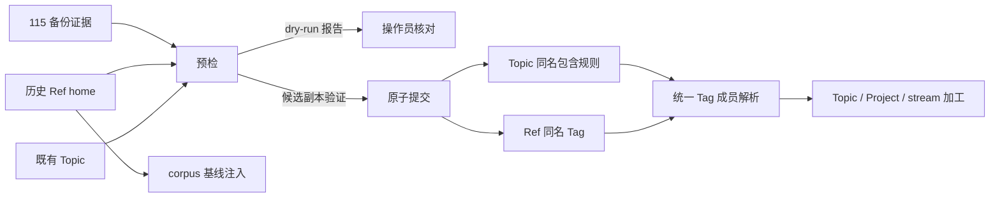

# 【Topic】恢复历史 workspace Ref 的 Topic Tag 成员关系

- Issue: [#258](https://github.com/xforce-io/kairo/issues/258)
- 分支: `feat/258-legacy-home-tag-migration`
- 状态: Approved
- 最后更新: 2026-09-04
- L1: [Approved](https://github.com/xforce-io/kairo/issues/258#issuecomment-5535592623)

## 1. 背景

#252 已切换至严格 Tag 成员模型。生产根的 Topic 名称 Tag 和严格模式已存在，但 19 个既有 Topic 没有有效包含规则，历史 Ref 也未带其 workspace home 对应的同名 Tag，导致 Topic 的动态成员为空。workspace 仍是 Ref 唯一 home；corpus 仍由其 home workspace 在生成 `understanding.md` 时作为只读基线资料注入。

## 2. 名词解释

本设计新增的[历史归属回填](../glossary.md)把一次性迁移与运行时成员关系区分开来。Topic、workspace、Ref、Ref 身份键、Tag、包含规则和 corpus 的定义以[名词表](../glossary.md)为准。

## 3. 目标与非目标

### 3.1 目标

1. 为当前 19 个既有 Topic 写入唯一的同名包含 Tag。
2. 为每条历史 home Ref 追加对应 Topic 名称 Tag，保留它已有的全部其他 Tag。
3. 使 Topic 浏览、相关 Topic、Project 聚合与 stream 的加工成员重回同一 Tag 规则；corpus 仍只读且不生成 digest、不进入 fold。
4. 以备份证据、预检、候选验证和原子提交保护现有根数据。

### 3.2 非目标

- 改变新 Ref 的默认 Tag、用 home 作为运行时成员条件，或为跨 Topic Ref 推断额外 Tag。
- 复制、移动或删除 Ref、digest、Topic、Project、Task、Run、Artifact 或 corpus 原始材料。
- 修改 Tag/Topic 名称、Tag 删除规则、corpus 的基线注入语义，或重算任何 `understanding.md`。

## 4. 能力

### 4.1 UI/UX

不新增页面。已有 Topic 页继续显示其包含 Tag 和由该规则动态命中的 Ref：

| 状态 | 用户可判定结果 |
|---|---|
| 迁移成功 | 既有 Topic 显示唯一同名 Tag，历史 stream/corpus Ref 出现在成员区；同一 Ref 不产生副本。 |
| 空 workspace | 显示零成员空态，不显示错误或猜测成员。 |
| 预检或提交失败 | Topic 页与迁移前一致，命令给出安全错误摘要。 |
| corpus 成员 | 可在 Topic 中查看；生成 `understanding` 时仍作为按需 Read 的基线，不显示为 fold 输入。 |

### 4.2 受控迁移命令

新增一次性运维入口：

```text
kairo tag migrate-home-membership --backup-evidence PATH [--root ROOT] [--dry-run]
```

它读取全量 Topic 和 Ref，生成可审阅报告。`--dry-run` 零写入；真实运行先检查 115 恢复闭包证据，再写入规则与 Tag。重复运行收敛为同一状态，绝不重复 Tag。

## 5. 思路与折衷

选择历史 home 仅作为一次确定性回填来源，而不是恢复运行时 home 成员兼容分支。这样恢复旧体验，同时保持所有消费者只有 Tag 规则一套成员事实源。

选择显式命令而非在打开 Topic 时懒回填：后者会让读取产生写入、无法事前审阅也无法保证原子性。选择同时写规则与 Ref Tag；仅写规则没有命中 Ref，Topic 仍为空。放弃改变 corpus 的 fold 语义：它本来就是按需 Read 的基线层，加入 digest/fold 会改变产物生命周期与成本。

## 6. 架构



主路径：验证备份证据与候选数据 → 为每个 Topic 和其 home Ref 计算目标 Tag → 验证成员、Ref 身份与 corpus/stream 分层 → 原子提交 → 所有成员消费者重算读取。失败路径：任一证据、名称、Ref、候选验证或写入失败即恢复完整快照；不暴露半迁移规则或赋值。

## 7. 模块

| 模块 | 责任 |
|---|---|
| `refs` | 预检、home→Tag 计划、幂等合并、journal 与恢复。 |
| `cli` | 提供显式迁移、dry-run 报告和稳定退出码。 |
| `web` / `rules` | 不新增分支；继续消费同一 Topic 成员与 corpus 分层结果。 |
| 测试 | 覆盖计划、原子性、成员可见性、加工边界和 CLI。 |

## 8. API/CLI

新增上述 `tag migrate-home-membership` 命令；成功退出 0 并输出 Topic、Ref、规则和新增 Tag 数；参数、证据、预检、写入或校验失败均非零退出并给出安全摘要。现有 `tag migrate`、Tag 写接口、Topic 包含规则接口及其参数保持不变。

不新增 HTTP 写接口。已有 Topic API 在迁移后自然返回同名 `include_tags` 及命中的成员。

## 9. 边界

- 只处理 migration 启动时存在的 Topic 与其直接 home Ref；不处理 global home、孤立目录或跨 Topic 推断。
- Topic 名称必须规范化后唯一，且同名 Tag 必须在词表可用；冲突 fail-closed。
- 只追加缺失的同名 Tag，不移除已有 Tag；每条 Ref 仍只有一个 home、manifest 与 digest。
- corpus 可被成员展示和按需读取，但不进入 digest/fold；本期不触发重算。
- 迁移日志和备份证据不含凭据、SSH 命令或原始材料正文。

## 10. 迁移/兼容/回滚

迁移前必须核验 115 远端、backup_id、清单校验和、隔离恢复成功与当前根一致的证据。预检输出 19 个 Topic、总 Ref 数、已有/新增规则与 Tag 数，并验证所有 Ref 身份键可解析。

真实执行先保存所有将改变的 constitution 与 catalog 快照至 journal；在候选状态验证每个 Topic 的同名规则、每个 home Ref 的同名 Tag、成员可解析及 source class 约束后原子提交。进程中断或写入失败时下次读取先恢复 journal。若迁移验收不通过，从经验证的 115 generation 恢复完整 serve root；不以回退代码或手改单文件替代数据回滚。

旧客户端可以读取更新后的 constitution 与 catalog；不会重新获得 home 成员兼容语义。重复执行是幂等的。

## 11. 测试计划

### E2E

- S1：在含 stream、corpus、空 Topic 和已有其他 Tag 的隔离 serve root 上运行 dry-run 和真实迁移，打开 Topic API/页面，断言每个 Topic 规则为同名 Tag，且成员唯一、可见。
- S2：验证每条历史 home Ref 保留原 Tag 并新增同名 Tag；运行计划断言 stream 正常参与成员加工、corpus 不进入 digest/fold 且仍为基线资料。

### Integration

- 备份证据、名称/词表/Ref 冲突、候选验证、重复执行与 journal 中断恢复。
- Topic API、相关 Topic、Project 聚合使用相同成员集合；空 Topic 保持空态。

### Unit

- home→同名 Tag 计划、规范化、去重、计数和退出码。
- catalog/constitution 原子写入与恢复边界。

## 12. 开放问题

N/A：本期只修复当前历史根；新 Ref 是否自动继承 Topic 名称 Tag 属于独立产品规则。

## 13. 关联

- [#258](https://github.com/xforce-io/kairo/issues/258)
- [#252](https://github.com/xforce-io/kairo/issues/252)
- [252-tag-rule-topic-membership.md](252-tag-rule-topic-membership.md)
