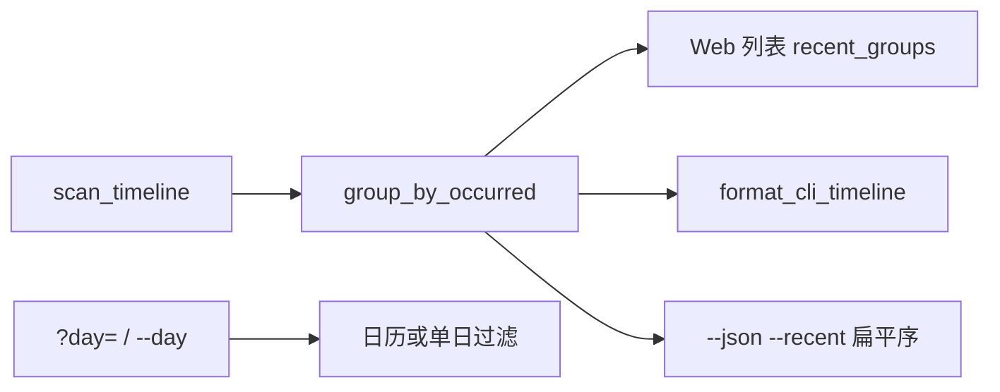

# #287 — 时间轴列表按发生日分组

- Issue: [#287](https://github.com/xforce-io/kairo/issues/287)
- L1: [Approved](https://github.com/xforce-io/kairo/issues/287#issuecomment-5548808967)
- 分支: `feat/287-timeline-list-occurred`
- 状态: Approved
- 日期: 2026-09-05

本文件是 #287 的详细设计唯一事实源。Issue 只保留摘要与本链接。

## 1. 背景

[#287](https://github.com/xforce-io/kairo/issues/287)。[#138](https://github.com/xforce-io/kairo/issues/138) 为补传另开「最近加入」，按录入日分组；[#259](https://github.com/xforce-io/kairo/issues/259) 把 Web 默认切到该视图。名词表与 [#242](https://github.com/xforce-io/kairo/issues/242) 规定 Timeline **按发生日浏览**。发生日 07-28、录入（或 mtime）在 08-31 的 Ref 会被挂在 8.31 日标题下。

## 2. 名词解释

N/A。Ref、Timeline、系统事件、发生时间、录入时间见 [名词表](../glossary.md)。本设计不新增术语。「列表」是 Timeline 的列表呈现，不是新对象。

## 3. 目标与非目标

### 3.1 目标

1. Web 日历与列表、CLI 默认与 `--recent` 人读，分组键都是有效发生日（新→旧）。
2. 列表入口文案为「列表 / List」，不再出现「最近加入 / Recent」。
3. `?mode=recent` 与 `--recent` 仍打开列表/人读时间轴，不当 400、不删旗标。
4. 发生日未知的条目在未知组，不进任何 `YYYY-MM-DD` 组。录入时间只可作行内元数据。

### 3.2 非目标

- 回填或冻结缺失的 `added_at`。
- 删除日历，或改 `?day=` / 区间回顾。
- 改 `effective_occurred`（id 前缀 / `occurred_at`）。
- 另做「刚入库」排序芯片或录入序视图。
- 无 `--recent` 的 `--json` 扫描序（本期不改）。

## 4. 能力

### 4.1 UI/UX

信息架构：工具条两个 mode **日历 | 列表**（英 Calendar | List）。默认 `/timeline` 仍是列表（`view=recent` 查询值保留）。

| 状态 | 列表 | 日历 |
|---|---|---|
| 成 | 按发生日新→旧分组；组标题为 `YYYY-MM-DD`；行可点进 Ref | 月历 + 选中日列表，行为与现网相同 |
| 空 | 「还没有观测。」；无日组 | 空日「这一天没有观测。」 |
| 未知 | 置顶「未知」组，不占任何发生日 | 仍用未知芯片，不占格子 |
| 错 | 非法查询 400 | 同左 |
| 不做 | 录入日分组标题；「最近加入」文案 | 改选日/区间 |

`GET /timeline?mode=recent`：200，选中「列表」。`GET /timeline?day=`：日历，选中「日历」。

行内可保留录入钟点（`tl.added_at`），不得把录入日写成 `<h2>` / `.tl-day-head`。

窄屏：列表仍是单列日组，不改成第二种月历。

## 5. 思路与折衷

选择：一条时间流、一个分组键。列表是日历的流水形态，不是第二条日历。

放弃 A：按录入时间排序、去掉日组标题。排序轴仍是录入时间，补传会和当天真正发生的资料排在一起。

放弃 C：删掉列表。滚动看全部发生日仍需要列表。

`--recent` / `mode=recent` 作别名而不是新 query：旧链接与脚本不 400。人读 `--recent` 与默认相同。`--json --recent` 不再按 `added_at` 排序，改为与人读同一条顺序（未知置顶，发生日新→旧），以便可判定；无旗标的 `--json` 保持扫描序。

## 6. 架构

主路径：扫描 → 按有效发生日分桶（未知单独一桶置顶，已知日新→旧）→ Web 列表或 CLI 人读。

失败路径：非法 `mode` / 互斥 query → 400；CLI `--day` 或 `--from`/`--to` 与 `--recent` 同时出现 → 退出码 1。不写盘。

## 7. 模块

单模块小改：`kairo.timeline` 提供 `group_by_occurred`；`web/views.py` 列表改用它；`cli.py` `--recent` 人读走同一函数，JSON `--recent` 扁平该序。模板与 i18n 只改文案。

## 8. API/CLI

| 入口 | 变更后 |
|---|---|
| `GET /timeline` | 列表，发生日分组；tab「列表 / List」为 on |
| `GET /timeline?mode=recent` | 同上，200 |
| `GET /timeline?day=` | 日历，不变 |
| `kairo timeline` | 发生日分组（未知置顶），不变 |
| `kairo timeline --recent` | 与默认人读同一分组键 |
| `kairo timeline --json --recent` | 不按 `added_at`；未知在前，随后发生日新→旧 |
| `--day` / `--from`--`--to` 与 `--recent` | 仍互斥，退出码 1 |

help：`--recent` 改为「列表（按发生日，兼容别名）」类表述，不再写「按录入时间倒序」。

## 9. 边界

只改 Timeline 列表呈现与 `--recent` 排序/分组。不改 Tag 筛选、回顾、Ref 详情、发生日写入、`added_at` 冻结。

## 10. 迁移/兼容/回滚

无存数迁移。`mode=recent` 与 `--recent` 保留。回滚即恢复录入日分组与旧文案。旧书签不 400。

## 11. 测试计划

| 层 | 对上 | 可判定 |
|---|---|---|
| E2E S1 | 发生 07-28、录入 08-31 的 Ref | 列表 HTML 日组标题为 `2026-07-28`，该行不在 `2026-08-31` 组 |
| E2E S2 | zh/en tab、`?mode=recent` | 文案 列表/List；200；`?day=` 仍为日历 |
| E2E S3 | CLI 默认与 `--recent`、`--json --recent`、互斥 | 分组键同为发生日；JSON 不按 `added_at` 倒序；互斥退出码 1 |
| E2E S4 | 未知发生日 | 在未知组，不在任何 ISO 日组 |
| Integration | `group_by_occurred` 同时喂 Web 与 CLI | 同一输入同一组键 |
| Unit | 分桶 | 新日在前；未知不进日期键；`--recent` 与默认同路径 |

## 12. 开放问题

N/A。方案 B 已拍板。

## 13. 关联

- [#287](https://github.com/xforce-io/kairo/issues/287)
- [#138](https://github.com/xforce-io/kairo/issues/138)
- [#259](https://github.com/xforce-io/kairo/issues/259)
- [#242](https://github.com/xforce-io/kairo/issues/242)
