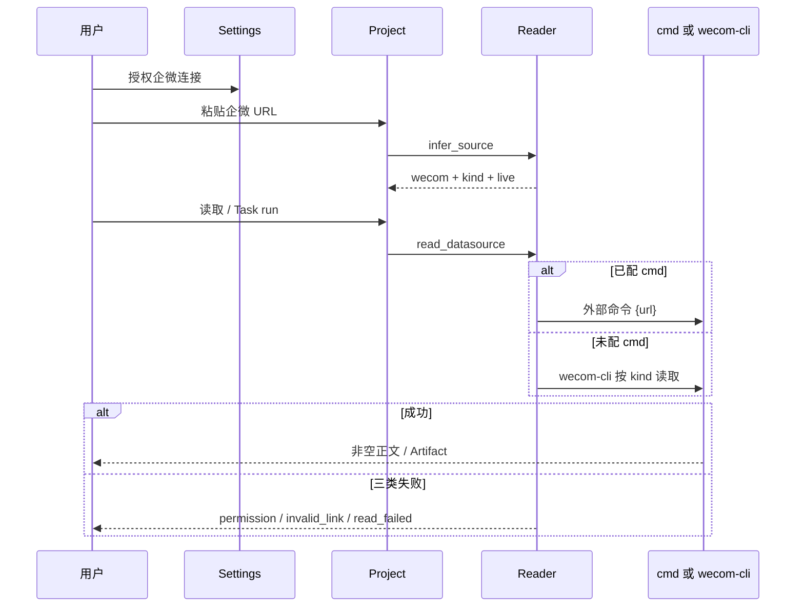

# #294 企微文档 Reader

- Issue: [#294](https://github.com/xforce-io/kairo/issues/294)
- L1: [Approved](https://github.com/xforce-io/kairo/issues/294#issuecomment-5549487965)
- 分支: `feat/294-wecom-docs-reader`
- 状态: Approved
- 日期: 2026-09-05

本文件是详细设计唯一事实源。Issue 只保留摘要与本链接。

## 1. 背景

链 [#294](https://github.com/xforce-io/kairo/issues/294)。#232 把企微做成 Settings 占位：识别 `doc.weixin.qq.com` 后拒绝添加，避免假成功读取。腾讯文档表格/智能表格已走「粘贴 URL → 推断 Reader → 外部命令读取 → Task/Artifact」。用户主路径已碰到企微在线表格链接，需要把占位换成真读，并覆盖企微四种文档形态。

## 2. 名词解释

Project、Settings、连接、Data Source、Reader、Task、Run、Artifact 见 [名词表](../glossary.md)。

本设计新增或易混：

| 规范名 | 一句话定义 | 禁止别称 |
|---|---|---|
| 企微文档 | 企业微信文档平台 Reader，覆盖在线文档、在线表格、智能表格、智能文档。 | 微信文档、企微表格、腾讯文档 |

内部 `kind`（文档 / 表格 / 智能表格 / 智能文档）不出现在添加表单，不是用户可见分类。

## 3. 目标与非目标

### 目标

- Settings 中企微为已接入连接，可授权/撤销，不再显示「本期未接入」。
- 粘贴企微 `/doc/`、`/sheet/`、`/smartsheet/`、`/smartpage/`（含发布态 `page.weixin.qq.com`）均可添加为数据源，显示企微文档 Reader。
- 读取成功得到非空正文；`permission` / `invalid_link` / `read_failed` 与腾讯文档同一套码。
- 成功 Task Run 把该正文冻成 Artifact，消费方式与腾讯文档数据源相同。凭据不进 Project。
- Notion 仍按未接入拒绝。

### 非目标

- Notion 真读、OAuth 或 MCP。
- 向企微写入或改文档；按文档名搜索后再添加。
- Settings 内嵌企微扫码；自建 `WECOM_TOKEN` / OAuth 协议。
- 把智能文档内嵌数据表自动拆成多个数据源。
- 用 LLM 生成 Artifact；改变腾讯文档 Reader 的推断或读取行为。
- public-read 暴露 Project/Settings。

## 4. 能力

### 4.1 UI/UX

Project 数据源仍是一行贴链接 + 可选用途，无 kind 下拉。占位文案同时覆盖腾讯文档与企微文档链接。添加成功后 Reader 标签为「企微文档」，不是内部 id `wecom`。

Settings 连接卡片：腾讯文档、企微可授权/撤销；Notion 仍为「本期未接入」占位。企微未授权时健康为未授权，不是占位。无扫码二维码、无按名搜索。

| 状态 | Project | Settings |
|---|---|---|
| 空 | 无数据源 → 引导贴链接 | 企微未授权可判定；Notion 仍占位 |
| 成 | 四种企微 URL 添加成功，显示企微文档；读取非空；Task → Artifact 含正文 | 企微可授权，live=true |
| 错 | Notion → 未接入；非法企微路径 → 无效链接；未授权/401/403 → 权限失效；其它读失败 → 读取失败 | 无 Task 行 |
| 不做 | spreadsheet 下拉；凭据表；按名搜索 | 企微扫码；Notion 立即读取成功态 |

## 5. 思路与折衷

**选择：沿用腾讯文档的外部命令边界；`infer_source` 将四种企微 URL 标为可添加；`cmd` 未配置时走仓库自带适配器，按 URL 形态调用本机 `wecom-cli`，把结果收成文本。** 凭据只在本机：授权开关启用连接，真读使用已有企微 CLI 扫码会话，不要求 `WECOM_TOKEN`，不把 token 写入 Settings 或 Project。测试注入 stub `cmd`，不打真网。

放弃：只改 live、读取全靠用户自写一条 `{url}` 命令（覆盖不了四种子命令）；Kairo 内部直调 `wecom-cli` 绕过 cmd（与「Reader 只在外部命令边界替换」分叉）；把企微并进腾讯文档 Reader（域名、授权、CLI 均不同）；Settings 做扫码。

代价：未安装或未授权 `wecom-cli`、且未配 stub `cmd` 时真读失败，映射已有失败码，不能假装读到正文。

## 6. 架构

分层：domain（`readers.infer_source` / `read_datasource`、`settings`、`projects`）→ CLI / HTTP JSON / HTML 薄适配。

主路径：Settings 授权企微 → 贴 URL → 添加数据源 → 读取（`cmd` 或自带适配器）→ Task Run → Artifact。

失败路径：未授权或 401/403 → `permission`；链接非法、无法识别或 404 → `invalid_link`；Notion 或未接入 Reader → `unsupported_reader`；其它读失败或空正文 → `read_failed`。失败 Run 写原因，不写 Artifact。凭据不进 Project JSON。

## 7. 模块

| 模块 | 职责 |
|---|---|
| `kairo.readers` | 推断四种企微 URL 为可添加；读取走 cmd 或自带 wecom-cli 适配器；映射三码 |
| `kairo.settings` | 企微 `live=true`；授权开关；无环境 token 时授权即为健康 authorized |
| `kairo.projects` | 添加时认 live 企微；读取与 Task 仍调 `read_datasource` |
| `kairo.web` / `kairo.cli` | 展示企微文档标签；占位文案只留给 Notion；无新公共路由 |

## 8. API/CLI

无新公共路由。既有：

- `POST /projects/{id}/datasources`、`kairo datasource add ID --url`：企微四种 URL 成功；Notion 失败。
- `POST .../datasources/{ds}/read`、`kairo datasource read`：成功返回非空正文；失败 JSON/退出码含既有 `code`。
- `GET /api/settings`、`kairo settings show`：wecom `live=true` 且可授权；notion `live=false`。
- `kairo task run`：成功 Artifact 含数据源 URL 与读出正文。

内部 `DataSource.kind`：`document`（`/doc/`）、`spreadsheet`（`/sheet/`）、`smartsheet`（`/smartsheet/`）、`smartpage`（`/smartpage/`，含发布态）。不出现在表单。`reader` 与 `connection_id` 为 `wecom`，调用方不得覆盖成其它平台。

自带适配器契约：未配 `cmd` 时调用本机 `wecom-cli`；按 kind 取回可阅读正文（文档 markdown、表格 CSV/子表文本、智能表格记录文本、智能文档页面 markdown）。`wecom-cli` 未安装、未授权、非零退出或空结果映射已有失败码。`cmd` 已配置时与腾讯文档相同，用 `{url}` 跑外部命令。

## 9. 边界

- 主机：`doc.weixin.qq.com`、`work.weixin.qq.com`、发布态 `page.weixin.qq.com`。其它企微路径为无效链接，不是静默表格。
- 智能文档只读页面正文，不把内嵌数据表拆成额外 Data Source。发布态只读。
- 移除数据源不删外部文档、不改 Settings 连接。
- 企微连接不要求 `WECOM_TOKEN`；真读凭证是本机 `wecom-cli` 会话。
- public-read 仍无 Project/Settings。腾讯文档推断与读取不变。

## 10. 迁移/兼容/回滚

`live` 来自代码目录，不存 Settings 文件。已有 `connections.wecom` 记录继续有效，升级后变为可授权。已存腾讯文档数据源不变。回滚：还原目录 `live`、推断与读取分发，已添加的企微数据源会再次无法读取。无用户迁移步骤。

## 11. 测试计划

- **E2E S1**：CLI 与 API/Console 对四种企微 URL `datasource add` 成功，reader 为企微；`https://www.notion.so/...` 失败且含未接入/`unsupported_reader`。
- **E2E S2**：stub 成功 `cmd` 时 `datasource read` 正文非空；403 / 无效链接 / 非零退出分别映射 `permission` / `invalid_link` / `read_failed`；Task run 产出 Artifact 含该正文；Project JSON 无 token/secret。
- **E2E S3**：settings 中 wecom `live` 为真且可授权/撤销；notion `live` 为假，卡片仍为占位。
- **Integration**：三入口走同一 `infer_source` / `read_datasource`；未配 `cmd` 时走自带适配器（测试替换 runner，不打真网）。
- **Unit**：四种路径与发布态主机分类；未知企微路径为无效链接；错误 reader/connection 被拒绝。

无 live `wecom-cli` 授权时不打企微真网。

## 12. 开放问题

无。

## 13. 关联

- #294 本 issue；父 #232；既有数据源 #235
- Notion 真读仍后续；不改腾讯文档 Reader 行为
