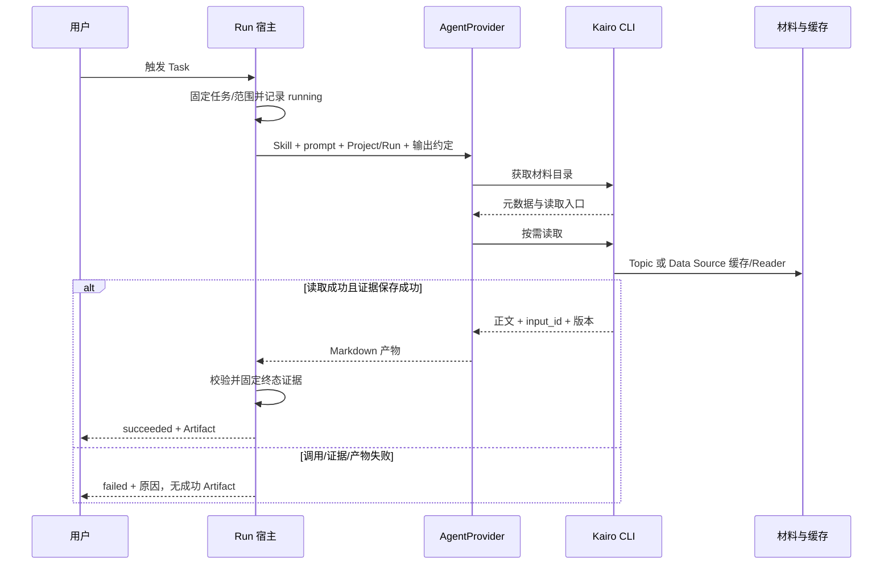

# #299 Project 材料读取与 prompt 型 Task

- Issue：[ #299 ](https://github.com/xforce-io/kairo/issues/299)
- L1：[提案与批准依据](https://github.com/xforce-io/kairo/issues/299#issuecomment-5550695811)；用户于 2026-09-05 回复「go，完成 L2」，L1 Approved。
- 分支：`feat/299-project-context-task`
- 状态：Approved（2026-09-05，用户在交付会话回复「Approved」）
- 日期：2026-09-05

本文件是详细设计唯一事实源。Issue 仅保留不超过 10 行的设计摘要与链接。

## 1. 背景

[#299](https://github.com/xforce-io/kairo/issues/299) S1–S5 要求外部正文持久复用、关联 Topic 可按需读取，以及 Task 复用 coding agent 生成可追溯 Artifact。现有 `projects.py` 中 Task 与 Run 都绑定单一 Data Source，Run 直接读取并保存正文；现有 AgentProvider 已能启动 CLI agent，但没有 Project 运行契约。

本设计承接已批准 L1：业务要求以 prompt 表达；Skill 指引 agent 使用 CLI；不新建通用工具循环。旧 Task 保留原语义。

## 2. 名词解释

已有 Project、Topic、Ref、digest、材料目录、Data Source、Reader、Task、Run、Artifact 以[名词表](../glossary.md)为准。

本设计无新增独立领域对象名称。易混边界：材料目录是元数据，不是正文；读取记录证明 CLI 已向该 Run 返回内容，不证明模型理解或采用了内容；内容版本使用返回正文的 SHA-256，不将 URL 或修改时间单独当版本。这里的 serve root 沿用 CLI 根目录参数，不使用名词表中专指 public-read 的「数据根」代称。

## 3. 目标与非目标

### 3.1 目标

- S1/S4：Data Source 首读成功后正文持久可打开，有效期内复用，失败不覆盖旧内容。
- S2：一个 Project 的动态材料目录及 CLI 读取覆盖关联 Topic 的 understanding、digest 和 Data Source。
- S3：Task 用 prompt 驱动经过能力验证的 AgentProvider，Run 固定任务版本并保留实际返回的输入证据，成功 Artifact 可核对来源。
- S5：旧 Task、历史 Run/Artifact 兼容；新主路径可通过 API、CLI、Web 完成。

### 3.2 非目标

通用工具框架、纯模型 provider 的 agent runtime、Notion 接入、全局检索、Topic 原始音视频读取、自动 digest/fold、整个 Topic 内容复制、定时服务新建、多租户隔离与针对恶意本机 agent 的防篡改审计均不在本期。Project 全面布局调整、统一材料浏览器和高级 prompt 编辑器另立 Issue。

## 4. 能力

### 4.1 UI/UX

保留现有 Project 页面区块次序与导航；窄屏保持同顺序单列。不新增 Settings 配置页。

| 位置 | 内容及交互 | 状态与可判定结果 |
|---|---|---|
| Project / Task | 名称、必填多行 prompt、既有调度字段；保存后显示版本；可编辑与触发 | 无 Task 时显示创建表单；没有 Data Source 仍可创建；空白 prompt 在字段旁报错并保留输入；保存成功回到对应 Task，版本变化可见 |
| 旧 Task | 显示原数据源及「按既有方式读取正文」；沿用名称、调度编辑与运行 | 不呈现自动生成的 prompt，不隐式转换任务类型；数据源已移除时明确失败 |
| Data Source 行 | 链接、用途、缓存状态、最近成功读取时间及过期时间；打开正文与显式刷新 | 无缓存为「尚未读取」；普通 Read 会首读；有效显示「可复用」；过期显示「已过期」；读取中按钮禁重复提交 |
| Data Source 正文页 | `/projects/{id}/datasources/{ds}`；正文、来源、读取时间、有效期、刷新动作 | GET 只展示存量缓存，不拉外部；无缓存显示读取入口；刷新成功替换正文；失败在正文上方显示原因，旧正文保留并标明有效/过期，不能显示为本次刷新成功 |
| Run | 触发后立即显示 Run 标识并进入详情；详情自动更新运行状态 | `running` 显示「运行中」及已运行时长；`succeeded` 可打开 Artifact；`failed` 显示原因与重新运行入口（创建新 Run）；页面刷新不丢记录，不自动重试 |
| Artifact / 来源 | 既有 `/projects/{id}/runs/{rid}` 承载 Run 信息、正文及来源列表；来源项打开本次返回内容 | 显示 Task 版本、来源名称、内容版本、读取时间；不存在/已移除的现源不影响历史证据；无来源时明示「本次未读取项目材料」；不以虚构引用填补 |

空 Project 的材料目录显示空列表；Topic 文件尚未生成显示 unavailable；任务要求的材料不足时 agent 应在结果中明确不足，不触发加工。材料不足本身不等同于系统运行失败；无法完成调用、产物缺失或来源校验失败才使 Run failed。S3 双来源样例必须确实读取两类材料才能验收通过。

Run 详情采用现有页面能力显示状态，不在本 Issue 新建多栏工作台、流式对话、可视化工作流或取消/恢复运行界面。所有正文按现有安全 Markdown 渲染策略展示，不把外部 HTML 当可信页面插入。

## 5. 思路与折衷

### 5.1 Task 与运行输入

新 Task 的业务字段为 `prompt`，非空；`name`、`schedule`、`interval_hours`、`enabled`、`version` 保留。任务类型 `mode` 为 `agent` 或 `source_snapshot`，用于兼容，不在新建 Web 表单暴露选项。

`agent` 不指定单一数据源。每次 Run 冻结完整 Task 定义、选中 provider/model、Skill 内容版本及启动时的 Project 关联范围。Task 或关联关系随后修改仅影响后续 Run；源文件或 Data Source 已删除则读取明确失败，不从其他 Project 替代。材料内容在实际读取时取值，同一 Run 可看到同一来源的多个版本，并分别留证。

系统指引和 Task prompt 分开构造：系统提供 Skill 的 Project 读取规则、根目录、Project/Run 标识、CLI 入口和输出约定；用户 prompt 只表达工作。加载仓库随安装交付的 Skill，不能依赖用户个人目录或 agent 自动发现。对既有 Topic 操作指引使用明确的 Project 运行章节限定本次授权，不让无人值守任务等待交互确认或调用 step 等写操作。

### 5.2 材料目录与读取

目录包含来源稳定标识、标题、用途、类型、可用状态、估计字节数（未知为 null）、已知内容版本与读取参数，不含正文。理解文档使用 `topic:{slug}:understanding`；digest 使用 `topic:{slug}:digest:{home}:{ref_id}`；Data Source 使用 `datasource:{id}`。这些是 CLI 不透明标识，调用者原样回传，不作为可拼接路径。目录依现有 Topic 包含规则解析 Ref 身份键，不能仅扫描 Topic 私有 references 目录而漏掉跨 home 成员。

Topic 的 understanding 未生成仍列为 unavailable；已登记成员的 digest 未生成同样标明 unavailable。目录只查询关联关系、现有成员元数据和文件状态，不重新 digest/fold，也不读取外部平台。读取时重新校验目标存在和路径解析结果，拒绝路径穿越及逃离合法材料位置的符号链接。

选择 CLI 作为业务工具，复用 coding agent 的命令执行，代价是后端须支持非交互命令和所需权限。放弃统一 function calling/MCP 框架与全量 prompt 注入。

### 5.3 缓存

默认有效期固定 **3600 秒**，从完整正文成功持久化时刻算起；UTC 时间 `now < expires_at` 才有效，等于即过期。本期没有用户可调 TTL。版本按规范化后的实际返回 UTF-8 正文计算；相同正文重拉仍可保持内容版本，但刷新读取时间与有效期。

缓存按 Project 内 Data Source 隔离，记录读取配置指纹（URL、Reader、连接引用和 kind）。指纹不匹配视为不可复用；缓存命中前仍检查本机连接未被撤销。撤销连接后普通读取返回 permission；已留存的正文与历史 Artifact 作为本地材料仍可查看，UI 明示连接未授权，不能借缓存声称远端权限有效。

同一 Data Source 的并发拉取串行化，等待者重新检查缓存，避免多个普通首读重复拉取；不同来源不互相阻塞。显式刷新每个获准请求各拉取一次，不引入跨请求自动重试。原子替换正文与元数据；失败不改成功时间、有效期或旧正文。首次失败没有缓存；过期失败不在读取接口返回旧正文作为成功，但正文查看页仍可标记为过期后查看。

选择有界陈旧内容换取低请求量；不做定时预热、不在列目录时刷新、不因页面 GET 自动访问外部平台。

### 5.4 输入证据与输出

带 Run 的成功读取必须先完整保存所返回正文及来源元数据，再向 agent 返回成功；保存失败则 `evidence_failed`，不交付未记账的成功正文。相同来源与内容版本在同一 Run 去重，读取次数累加；不同版本分开保留。该记录是运行可核对证据，不是对不受信任进程的不可伪造审计。

agent 产出 Markdown 正文并使用 CLI 返回的 `input_id` 引用（`[来源](input:INPUT_ID)`）；完成时宿主校验引用都对应本 Run 的成功读取，再解析为历史输入链接。来源列表由宿主根据读取记录生成，未被正文引用的已读取内容也显示为「已读取，正文未引用」。未知 input_id、空产物、错误响应、超时或非零退出均不能变为成功 Artifact。

未读取材料但正常完成的通用 prompt 可以成功，来源列表必须为空并明确说明；需要两类来源的 S3 验收样例不因一般规则而免验。放弃要求 agent 自报“读过哪些材料”，也不复制未读取的整个 Topic。

## 6. 架构

分层：Project/Task/Run 与材料读取领域能力 → CLI、HTTP API、HTML 薄适配；运行宿主调用 AgentProvider；agent 通过 CLI 回到同一材料读取能力；Reader 保留现有外部命令边界。无新增常驻服务。

运行生命周期为 `running → succeeded | failed`，终态不再写入。同步 CLI 创建 running 后等待终态；Web/API 新 agent Task 返回 accepted 后由现有进程内任务设施承担执行，不新增守护进程。进程退出前能捕获的中断写 failed；启动恢复检查遗留 running 的进程存活标记，不存活则置 `status=failed`、`reason=interrupted`，不得自动重跑造成重复费用。已有 source_snapshot 同步响应语义保留。

### 6.1 Provider 与写入边界

AgentProvider 增加独立的 Project CLI 能力声明及每次运行的附加可写目录契约，不能复用 `supports_read_dirs` 判断。仅通过实际非交互验证的后端可声明支持；Codex/Grok/Claude 名称本身不构成证据。显式选择不支持者记录 `status=failed`、`reason=provider_unsupported`；自动选择只从已验证且可用者中选，不回退纯模型或生产 Stub。

agent 工作目录仅为本 Run 临时产物目录；附加可写范围仅为本 Project 缓存目录与本 Run 临时读取记录目录。Topic、project.json、其他 Run 和最终历史输入目录不授写。Codex 可以对上述独立目录授写，不能对整个 serve root 或源 Topic 使用 add-dir。后端不能表达边界时视为不支持，不关闭沙箱绕过。

CLI 读取可能需要 Reader 的本机授权、网络与外部命令权限，须在实际部署环境的非交互验证中一并确认；不可用则返回读取失败，不让 agent 自行修授权或扩大权限。父进程在 agent 退出后校验临时读取记录内容 hash、来源范围和产物引用，再将证据与产物固定进历史目录。Run 元数据及最终状态由宿主写入。

这里沿用受信任本机 coding agent 模型；通用 shell 能力不等于 Project 是操作系统读取隔离。Skill 限定业务操作，CLI 强制本入口关联范围，文件写权限限制保护其他业务内容；不对可恶意改写自身临时产物的进程承诺防篡改。

## 7. 模块

| 模块边界 | 职责与不变量 |
|---|---|
| Project / Task | 关联范围、任务模式及 prompt 版本，不存凭据 |
| 材料读取 | 目录解析、Ref 身份键解析、缓存、正文交付与读取记录；三个用户入口共用 |
| Reader / Settings | 原有外部读和授权判断，不引入新平台与授权机制 |
| Run 宿主 / AgentProvider | 冻结输入、加载 Skill、能力选择、运行状态、输出校验与终态发布 |
| Kairo Skill | 通用 Project CLI 操作和引用规则，不包含具体项目数据 |
| CLI / Web | §8 契约及 §4.1 状态展示，不各自实现缓存逻辑 |

### 7.1 持久数据契约

| 位置/记录 | 关键字段与语义 |
|---|---|
| 既有 `project.json` / Task | 新增 `mode`、`prompt`；旧 `datasource_id` 仅 source_snapshot 使用；agent 不写占位数据源 |
| Project 的 `cache/{ds_id}/` | UTF-8 正文与元数据：配置指纹、version、fetched_at、expires_at、字节数；可重建，不是历史输入事实源 |
| 既有 `runs/{rid}.json` | agent Run 增加 `schema_version=2`、mode、完整 task_snapshot、provider/model、Skill hash、范围快照、started_at/finished_at、status/reason；旧单源字段对 agent 不要求 |
| Project 的 `inputs/{rid}/` | 终态固定的正文及读取记录：input_id、source_id、类型、标题/URL、version、read_at、读取次数与相对正文路径 |
| 既有 `artifacts/{rid}.md` | 成功产物，含宿主来源列表；失败无正式 Artifact |
| 临时 Run 目录 | prompt、Skill、原始输出与未固定的读取记录，不当正式 Artifact；终态后不接受追加读取 |

上述位置均在 `.kairo/projects/{project_id}/` 下，临时产物可放系统临时目录；不把缓存正文塞入 project.json。并发元数据更新不得覆盖其他 Task 或缓存结果。只扫描正式 Run 文件的现有消费者仍能忽略附加目录；未知新版 Run 应明确报版本不支持而非解释成旧记录。

## 8. API/CLI

### 8.1 共通约定

根目录解析沿用 `--root` → `KAIRO_SERVE_ROOT` → cwd。JSON 默认可机读，正文始终为 UTF-8。新增接口错误统一为 `{ok:false,code,error}`，CLI 退出 1；参数用法错误退出 2；成功退出 0。现有旧命令输出保留已有字段，新字段只增不改意义。

目录成功：`{ok:true,project_id,items:[{source_id,title,purpose,type,state,bytes,version,read_args}]}`。type 为 `understanding|digest|datasource`；state 为 `available|unavailable|uncached|fresh|expired`。version 未知时为 null；read_args 是参数数组而非可执行 shell 字符串。

正文成功：`{ok:true,source_id,content,version,fetched_at,expires_at,input_id}`；Topic 时间字段为 null，无 Run 时 input_id 为 null。只返回一次完整正文，本期不新增分页/搜索读取。超过运行可接受体量时明确 `material_too_large`，上限固定为每份 UTF-8 正文 2 MiB，不截断后冒充完整材料；既有 Data Source 普通读取接口不因该 agent 限制改变其旧返回能力。

### 8.2 CLI

以下均为本设计约定，未实现前不可当现有命令调用。

| 命令 | 契约 |
|---|---|
| `kairo project context PROJECT_ID [--run RUN_ID]` | 输出目录；无 Run 用当前关联，有 Run 用本 Run 固定范围；不拉外部 |
| `kairo project read PROJECT_ID SOURCE_ID [--run RUN_ID] [--refresh]` | 返回正文；refresh 仅允许 Data Source；Run 必须属于该 Project 且 running；失败不返回成功正文 |
| `kairo datasource read PROJECT_ID DS_ID [--refresh]` | 沿用旧调用，增加缓存与刷新；保留 ok/content |
| `kairo task create PROJECT_ID --name NAME --prompt-file FILE ...` | 创建 agent Task；也支持 `--prompt TEXT`，二者互斥；空 prompt 拒绝；管理参数沿用 |
| `kairo task edit PROJECT_ID TASK_ID --prompt-file FILE ...` | 仅 agent Task 可更新 prompt；版本增加；与 --prompt 互斥 |
| `kairo task create PROJECT_ID --name NAME --datasource DS_ID ...` | 兼容旧调用，创建 source_snapshot；与 prompt 参数互斥 |
| `kairo task run PROJECT_ID TASK_ID` | 保留同步等待，输出终态 Run，失败退出 1；运行进度走 stderr，不污染 JSON |
| `kairo artifact show PROJECT_ID RUN_ID` | 保留既有结构，并提供 agent Run 来源元数据 |
| `kairo project input PROJECT_ID RUN_ID INPUT_ID` | 只读终态历史正文；不访问当前来源、不拉外部 |

agent 的每次目录/读取必须带当前 Run；宿主注入指引，但不能把未带 Run 的人工读取冒记到任务。CLI 再验证记录与 Project 关系；不存在、终态或错 Project 分别返回明确错误。

### 8.3 HTTP API

| 路由 | 输入 / 输出 |
|---|---|
| `GET /api/projects/{id}/context` | 同 CLI 目录；仅人工当前范围，可选 run_id 读取固定范围 |
| `POST /api/projects/{id}/context/read` | `{source_id,run_id?,refresh?:false}` → 正文成功信封 |
| `GET /api/projects/{id}/datasources/{ds}/content` | 查看现有缓存与状态，无缓存 404 `cache_missing`；绝不拉外部 |
| `POST .../datasources/{ds}/read` | 旧路由；可选 `{refresh:true}`，空 body 按普通读取；保留 ok/content |
| `POST .../tasks` | `{name,prompt,schedule?,interval_hours?}` 新建 agent；旧 datasource_id 请求仍有效；两类字段同时提供 400 |
| `PATCH .../tasks/{tid}` | 更新对应模式允许字段，模式不可通过编辑隐式转换 |
| `POST .../tasks/{tid}/run` | agent 返回 202 `{ok:true,run}`，ok 仅表示接受，run.status=running；旧模式保持同步终态响应 |
| `GET .../runs/{rid}` | 保留 ok/run/artifact，running 或 failed 的 artifact=null，新增 inputs 元数据 |
| `GET .../runs/{rid}/inputs/{iid}` | 终态证据正文与元数据；找不到 404，不降级为当前材料 |

新接口：不存在/不在范围 404 `not_found`；输入非法 400 `invalid_request`；连接未授权 403 `permission`；终态 Run 再读 409 `run_closed`；文件未生成 409 `material_unavailable`；Reader 失败 502 `read_failed`（无效链接保留 `invalid_link`）；证据写入失败 500 `evidence_failed`；过大材料 413 `material_too_large`。旧接口保留已有 HTTP 错误映射，以 code 为跨入口一致判断依据。public-read 对上述所有 Project 入口沿用 404。

## 9. 边界

- 列目录不访问外部平台；CLI 普通读取可能拉取缓存缺失或过期数据，这是 Run 读取授权的一部分；不包含改外部文档或 Topic 加工授权。
- 解除关联与删除来源不删除既有 Run 证据。运行范围在启动时固定，解除关联影响下一轮；实际对象被删除则读取失败。并发关联变化不扩大本轮范围。
- 多来源 Run 不冻结整个 Project 内容；逐次读取的时间与版本如实记录，不能声称所有材料来自同一时刻。
- 空 Topic、空 Project 可以创建 Task；存在材料不代表必须全部读取；业务要求的完成程度通过具体 prompt 样例验收。
- 系统超时沿用 AgentConfig/CLI runner 默认 600 秒及现有覆盖机制。失败重试创建新 Run；没有自动重试、自动替换 provider 或自动运行 Topic。
- 凭据值不进入运行指引和存数；外部正文仅作为数据，不能覆盖系统的 Project 范围与命令约定。
- 源数据移除仅清除其可再生缓存，不清除历史输入；本期不做证据自动过期或垃圾回收。

## 10. 迁移/兼容/回滚

读取缺少 mode 的旧 Task 时判为 source_snapshot，不产生 prompt，不改其数据源。旧 Run 缺少 schema_version 时按旧模式读取，历史 Artifact 原字节保留。旧 Task 的成功结果仍是输入正文，不调用模型；普通读取共用新缓存规则。Task 编辑与序列化不得因新字段默认值误转换类型。

新写入 agent Task 与新版 Run 对旧二进制不透明，**不承诺直接降级可读**。发布前必须停止运行/调度并备份整个 Project 目录；上线检查旧 Task 样例和新 agent Run。回滚时先停止新运行，单独归档升级后的完整 Project 目录，再恢复升级前备份与匹配旧代码；升级后新 Task/Run 不在旧程序中展示，但归档必须保留供重新升级恢复。禁止删除新数据当回滚。Topic 和 Settings 不因本迁移改写。

本文件是设计契约，不是部署授权；实际部署环境、备份路径与恢复验证按项目交付阶段确认，不在本次设计中虚构命令。

## 11. 测试计划

| 层级 / 验收 | 路径与可判定结果 |
|---|---|
| E2E / S1 | Web 首读 → 显示正文 → 刷新页面再打开 → 有效期内 Read：正文相同，共 1 次 Reader 拉取，缓存状态可见 |
| E2E / S2 | 通过随安装 Skill 调用目录与读命令：发现并读取 1 份 Topic 与 1 份 Data Source；列目录零外部请求；未关联 ID 被拒绝；跨 home digest 可读取 |
| E2E / S3 | 创建双来源 prompt Task → running → CLI 实际读两类来源 → succeeded/Artifact；缓存拉取 0 次；更新来源后历史正文与 hash 不变；伪造 input_id 或缺失产物使 failed |
| E2E / S4 | 时间恰到 3600 秒 → 重拉 1 次；未过期刷新失败 → 普通读取 0 次且旧正文保留；过期重拉失败明确失败且旧时间不变；正文页不伪装成功 |
| E2E / S5 | 旧 Task 运行保持正文语义且不调用模型，历史 Artifact 字节不变；API、CLI、Web 各完成新 Task 闭环；无 Data Source 时可创建 prompt Task |
| Integration | 三入口共享缓存；并发首读仅一次拉取；连接撤销不命中成功读取；运行范围固定；进程中断恢复为 failed；证据失败不得交付成功内容；public-read 全部 404 |
| Unit | 有效期临界值、配置指纹、正文 hash、路径与符号链接约束、任务字段互斥、旧模式解析、来源引用、状态转换与终态拒写 |

确定性 E2E 使用执行真实 Kairo 子命令的 agent 替身与可计数 Reader，不能只模拟“读过”声明。Web 主路径使用浏览器验证表单、刷新、运行状态和来源打开；API/CLI 验证机读结构与退出码。

每个拟标为支持的真实 provider 至少完成一次非交互验证：从临时运行目录加载交付 Skill → 执行目录/读取 CLI → 缓存缺失时调用受控 Reader → 写入读取记录 → 返回 Artifact，且源 Topic 与其他 Run 不可写。测试使用临时 Project 和受控正文，不向真实平台重复请求；Grok 等未经验证时标为不支持，不能因单元测试的 runner stub 通过而开放。测试与真实验证结果在实现 PR 记录，本次文档不声称已通过。

## 12. 开放问题

无待拍板的产品契约；本稿待人工评审。真实后端的权限兼容及非交互能力属于实现验证门槛：至少一个生产后端通过方可交付 S3，其余未通过者明确不支持，不扩大权限兜底。生产部署/回滚环境在交付阶段核实，不影响本次 L2 文档完成。

## 13. 关联

- 验收：[ #299 ](https://github.com/xforce-io/kairo/issues/299)；[L1](https://github.com/xforce-io/kairo/issues/299#issuecomment-5550695811)。
- 既有设计：[232-project-loop.md](232-project-loop.md)；仅新 agent Task 的生成与多来源契约由本设计替代，旧模式保持兼容。
- 相关：[#236](https://github.com/xforce-io/kairo/issues/236)、[#294](https://github.com/xforce-io/kairo/issues/294)、[#297](https://github.com/xforce-io/kairo/issues/297)。
- 术语：[glossary.md](../glossary.md)；实现 PR 在创建后补入本节并反链本文件。
