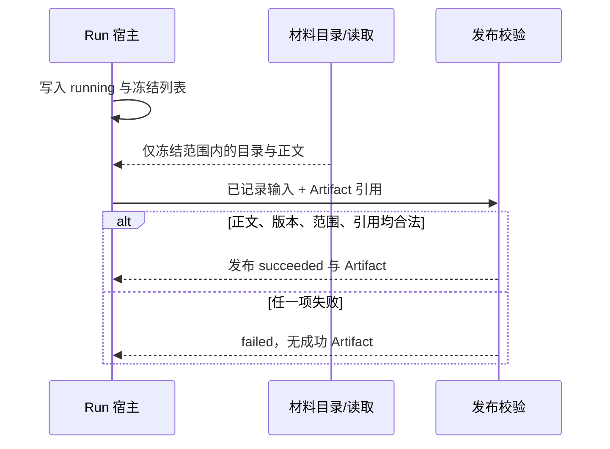

# #304 Run 输入范围与来源证据

- Issue：[#304](https://github.com/xforce-io/kairo/issues/304)
- L1：[提案与批准依据](https://github.com/xforce-io/kairo/issues/304#issuecomment-5552242142)；用户于 2026-09-05 回复「Approved」。
- 分支：`feat/304-project-run-evidence`
- 状态：Approved（2026-09-05）
- 日期：2026-09-05

本文件是详细设计唯一事实源。Issue 仅保留不超过 10 行的设计摘要与链接。

## 1. 背景

[#304](https://github.com/xforce-io/kairo/issues/304) 要求成功 Run 只消费触发时冻结的材料范围，且 Artifact 的已记录输入都有可打开、完整、属于允许范围的历史证据。[#299](./299-project-context-task.md) 已规定 Run 启动时固定关联范围、成功读取先记账再返回、未知 `input_id` 不得成功。当前实现用 Python 真值把冻结空列表当成未冻结，发布时只核对索引里是否出现被引用的 `input_id`，不核对正文文件、内容版本与来源是否仍在冻结范围内。

## 2. 名词解释

Project、Task、Run、Artifact、材料目录、Data Source 以[名词表](../glossary.md)为准。

本设计易混边界：

| 词 | 含义 |
|---|---|
| 冻结范围 | 该 Run 启动时写入的 Topic slug 列表与 Data Source id 列表。空列表表示当时零关联，不是「未记录」。 |
| 缺字段 | 历史 Run 记录没有 `scope_topics` / `scope_datasources` 键。与冻结空列表不同。 |
| 已记录输入 | 该 Run scratch/终态索引中的一条读取记录，含 `input_id`、`source_id`、内容版本与正文文件名。 |
| 历史证据 | 终态目录中与该 `input_id` 对应的当次正文，打开时不访问现源。 |

## 3. 目标与非目标

### 3.1 目标

- S1：带 `run_id` 的目录与读取遵守冻结范围；冻结空集合保持为空；启动后新增关联不可读。
- S2：发布成功前校验每份已记录输入的正文、内容版本、来源范围与产物引用；任一失败则 Run `failed`，无成功 Artifact。
- S3：成功 Run 的已记录输入可按当次内容打开；删除或更新现源不改变历史正文与版本。

### 3.2 非目标

不判定模型业务结论是否正确；不重构 agent 全部文件系统权限或通用沙箱；不新增调度、自动重跑或 Topic 加工；不为缺证据自动补造来源。

## 4. 能力

无独立用户功能面。发布门禁与范围读取对 CLI/API/Web 同一套领域规则。成功 Artifact 页仍打开既有 Run 路由上的历史输入；本 Issue 不重排该页（展示去重归 #306）。

### 4.1 UI/UX

N/A。无新页面。失败 Run 沿用现有详情，不出现成功 Artifact 入口。

## 5. 思路与折衷

用「字段缺失」与「字段存在且为空」区分旧记录和冻结空集合。新 Run 启动时始终写入两个列表（可空）。读取路径：字段为 null/缺省时按当时 Project 当前关联解释（只为兼容旧 running 记录）；字段为列表时原样使用，空即空。放弃用当前关联补齐冻结空集合。

发布前对**全部已记录输入**校验，不只对被正文引用的项：正文文件必须存在、UTF-8 正文的内容版本必须与记录一致、`source_id` 必须落在该 Run 冻结范围内（缺字段的旧记录用兼容后的范围）。产物引用的 `input_id` 必须出现在已记录集合。合法无读取结果仍可成功，来源声明为「本次未读取项目材料」。

放弃「索引有条目即承认证据」。hash 不符已失败的路径保留。不承诺仅靠此校验限制 agent 写磁盘的全部能力。

## 6. 架构

分层：Run 记录与材料范围在领域层解释 → CLI/HTTP 薄适配 → 运行宿主在写终态前调用同一校验。

主路径：触发时记录范围 → 按范围读并记账 → 校验 → 成功。失败路径：越界读取 `not_found`；证据或引用不合法 `evidence_failed` 或既有 `invalid_input_ref` / `empty_artifact`；不把部分索引当成功。

## 7. 模块

`kairo.project_materials` 解释冻结范围并在记账目录上校验正文/版本/范围；`kairo.projects._execute_agent_run` 在标记 succeeded 之前调用该校验，失败写 `failed` 且 `artifact_path` 为空。不新增进程。

## 8. API/CLI

无新路由。既有 `kairo project context|read --run`、`GET /api/projects/{id}/context`、`POST .../context/read` 对空冻结列表返回空目录/拒绝越界读取。成功发布失败码：`evidence_failed`（缺正文、版本不符、来源越界）、`invalid_input_ref`（未知引用）、既有空产物码。HTTP 映射沿用 #299。

## 9. 边界

已记录但正文未引用的输入同样需要有效证据。无读取的合法结果保留「本次未读取项目材料」。现源删除不影响已成功历史证据。不限制 agent 在授权目录外的全部文件系统能力。冻结范围不含后来新增的 Topic/Data Source；已冻结但现源被删时，读取现源失败，已记账历史仍可在终态打开。

## 10. 迁移/兼容/回滚

新写入的 agent Run 必带 `scope_topics` 与 `scope_datasources` 列表。读取旧记录：两字段皆缺时按当前 Project 关联解释目录/读取（兼容升级前 running 记录）；任一字段存在则该侧按列表（含空）解释。成功历史 Artifact 与输入目录字节不改写。回滚即恢复旧代码；新失败码对旧客户端仍是失败信封。禁止把空列表回写成缺字段来「修复」旧数据。

## 11. 测试计划

| 层级 / 验收 | 路径与可判定结果 |
|---|---|
| Integration / S1 | 阻塞运行替身后修改关联：`context`/`read` 对冻结空集合保持为空；冻结非空不纳入启动后新增项；缺字段旧记录仍按当前关联可读 |
| Integration / S2 | 分别构造缺正文、hash 不符、来源越界、未知引用：Run `failed` 且无成功 Artifact；合法证据可 `succeeded` |
| E2E / S3 | 成功 Run 打开 Artifact 与全部历史来源；删除或更新测试现源后历史正文与版本不变 |
| Unit | 空列表 vs 缺字段；范围判定；内容版本比较 |

确定性替身只写索引或越界 `source_id`，驱动 shipped `run_task` / `_execute_agent_run`，不在测试里复制校验函数。

## 12. 开放问题

无。旧客户端全量提交与 Web 展示去重不在本 Issue。

## 13. 关联

- 验收：[#304](https://github.com/xforce-io/kairo/issues/304)
- 前序：[299-project-context-task.md](./299-project-context-task.md)、[232-project-settings-ia.md](./232-project-settings-ia.md)
- 同轮：#303、#305、#306、#307
