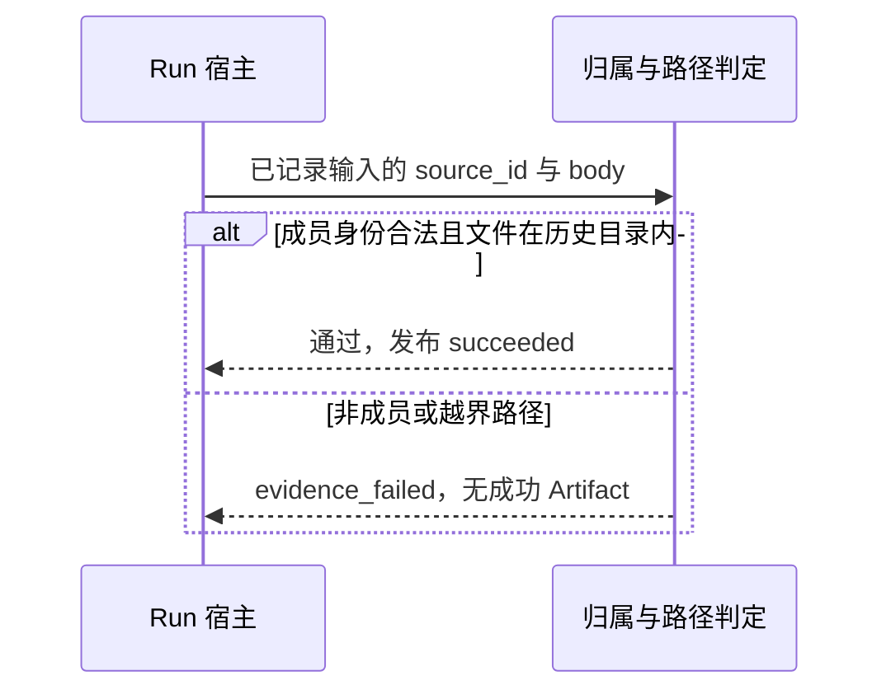

# #315 Run 输入证据的材料身份与路径边界

- Issue：[#315](https://github.com/xforce-io/kairo/issues/315)
- L1：[提案与批准依据](https://github.com/xforce-io/kairo/issues/315#issuecomment-5555867769)；用户于 2026-09-06 在 Issue 回复「Approved」。
- 分支：`feat/315-run-input-evidence-bound`
- 状态：Approved（2026-09-06）
- 日期：2026-09-06

本文件是详细设计唯一事实源。Issue 仅保留不超过 10 行的设计摘要与链接。

## 1. 背景

[#315](https://github.com/xforce-io/kairo/issues/315) 收尾 [#304](https://github.com/xforce-io/kairo/issues/304)。[#304](./304-project-run-evidence.md) 已要求发布前校验已记录输入的正文、内容版本与来源范围。6f76a56 上范围判定对 digest 只比较 Topic slug；证据 `body` 用 `folder / name` 拼接，未限制在该 Run 历史目录内。隔离复现：`topic:allowed:digest:unlinked:non-member` 写入索引后可发布成功；`body=../../cache/review-escape.md` 被接受，删除缓存后历史来源打不开。

## 2. 名词解释

Project、Task、Run、Artifact、Data Source、材料身份见[名词表](../glossary.md)。冻结范围、已记录输入、历史证据见 [#304](./304-project-run-evidence.md)。

本设计易混边界：

| 词 | 含义 |
|---|---|
| 历史目录 | 该 Run 的 scratch（发布前）或 inputs（发布后）目录。打开历史来源只读这里。 |
| 越界路径 | `body` 解析并跟随符号链接后，不落在历史目录内的路径，含相对穿越与绝对路径。 |

## 3. 目标与非目标

### 3.1 目标

- S1：正常读取会拒绝的非成员 digest（slug 命中冻结 Topic，但 home+id 不是该 Topic 成员）写入索引后，shipped 发布 `failed`，`evidence_failed`，无成功 Artifact。
- S2：`body` 为相对穿越、绝对路径或越界符号链接时发布同样失败；成功 Run 的历史来源打开不依赖可变 cache。

### 3.2 非目标

不重构通用沙箱或限制 agent 全部写盘能力；不新增调度；不改 Artifact 展示去重（#317）；不改 context 目录顺序。

## 4. 能力

无独立用户功能面。发布门禁对 CLI/API/Web 同一套领域规则。

### 4.1 UI/UX

N/A。无新页面。失败 Run 沿用现有详情，不出现成功 Artifact 入口。

## 5. 思路与折衷

把「是否该 Topic 真实成员」和「body 解析后是否落在该 Run 历史目录内」做成领域纯判定，发布只调用它。digest 按 home+id 核 `topic_members`；understanding 仅允许冻结 slug 的事实层。`body` 经解析并跟随符号链接后必须仍在历史目录下。放弃只匹配 slug；放弃信任索引里的相对文件名。不承诺堵住授权目录外的一切写盘。

## 6. 架构

分层：领域判定 → 发布宿主在标记 succeeded 前调用 → 历史来源打开复用同一路径解析。

主路径：合法 scratch 内正文 → 发布 → inputs 内打开。失败：非成员 digest 或越界 `body` → `failed`。不把部分索引当成功。

## 7. 模块

`kairo.project_materials`：`_source_in_scope` 核材料身份；证据文件解析限制在历史目录；`validate_recorded_inputs` / `finalize_inputs` / `read_run_input` 共用。`kairo.projects._execute_agent_run` 仍在 succeeded 前调用校验。不新增进程。

## 8. API/CLI

无新路由。失败码仍为 `evidence_failed`（来源越界或证据路径非法）。HTTP 映射沿用 #299/#304。

## 9. 边界

已记录但正文未引用的输入同样要过身份与路径校验。合法无读取仍可成功。冻结范围不含后来新增 Topic；非成员即使 slug 撞名也不得发布。现源或 cache 删除不影响已成功且落在 inputs 内的历史正文。

## 10. 迁移/兼容/回滚

不改 Run JSON 字段。已成功但证据在 cache 的历史记录，打开时若 `body` 越界则按缺失/失败处理，不跟到 cache。回滚即恢复旧判定。无数据迁移。

## 11. 测试计划

| 层级 / 验收 | 路径与可判定结果 |
|---|---|
| Integration / S1 | 确定性 provider 写入 `topic:{冻结slug}:digest:{非成员home}:{非成员id}` 索引，走 shipped `_execute_agent_run`：`failed`，`artifact_path` 为空 |
| Integration / S2 | `body` 为 `../../cache/…`、绝对路径或越界符号链接时同样失败；合法历史目录内正文仍可成功，删 cache 后 `read_run_input` 仍打开 |
| Unit | 成员身份与路径解析的纯判定 |

确定性替身只写索引或越界 `body`/`source_id`，驱动 shipped 发布路径，测试内不复制校验函数。

## 12. 开放问题

无。

## 13. 关联

- 验收：[#315](https://github.com/xforce-io/kairo/issues/315)
- 前序：[304-project-run-evidence.md](./304-project-run-evidence.md)
- 同轮：#316、#317
