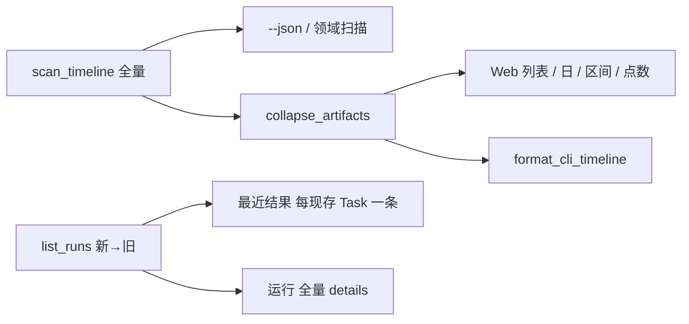

# #335 同一 Task 只展示最新 Artifact

- Issue：[#335](https://github.com/xforce-io/kairo/issues/335)
- L1：[提案](https://github.com/xforce-io/kairo/issues/335#issuecomment-5557476279)；用户于 2026-09-06 会话确认方案 A 并要求开始实现。
- 分支：`feat/335-task-artifact-fold`
- 状态：Approved（2026-09-06）
- 日期：2026-09-06

本文件是详细设计唯一事实源。Issue 仅保留不超过 10 行的设计摘要与链接。

## 1. 背景

[#335](https://github.com/xforce-io/kairo/issues/335)。[#327](https://github.com/xforce-io/kairo/issues/327) 把概览「最近结果」收成全局最新 3 条，同一 Task 连跑仍占满主路径；Timeline 把每次成功 Run 铺成独立 Artifact 行。能源日报一日四次成功后，列表日标题为 `4`，四行标题相同。

## 2. 名词解释

Project、Task、Run、Artifact、Timeline、系统事件以[名词表](../glossary.md)为准。本设计「当前文档」指某 Task 最新成功 Artifact，不是新对象。「折叠组」是同一 `task_id`、同一发生日下除最新外的更早 Artifact 集合，仅展示层存在。

## 3. 目标与非目标

### 3.1 目标

- S1：概览「最近结果」每个仍存在的 Task 一条最新成功 Artifact，带运行时间；「运行」展开后仍为全部 Run。
- S2：Timeline 列表、日历选中日、区间列表默认每个 Task 每个发生日一条最新 Artifact，其余可展开；日标题计数与日历点数按折叠后计。
- S3：`kairo timeline` 人读与 Web 同一折叠；`--json` 仍含每一次成功 Artifact。

### 3.2 非目标

不改 Run/Artifact 存数。不折叠 `--json` 或 `GET /api/projects/{id}` 的 Run 列表。不给 Task 页加 Run 列表。不改区间回顾原料（仍只吃 `kind=ref`）。不动 public-read。不按标题去重。

## 4. 能力

### 4.1 UI/UX

信息架构不变：概览仍是 Task → 最近结果 → 折叠的运行历史；Timeline 仍是日历 | 列表。变的是人读条目的粒度。

| 状态 | 概览最近结果 | Timeline 列表/日历日/区间 |
|---|---|---|
| 成（同 Task 多次成功） | 该 Task 一行，链到最新 Run；标题仍为 Task 名 + 版本 + 时间 | 该发生日一行链到最新；其下 `
` 默认关闭，摘要「还有 N 个更早版本」，展开后每条仍可进对应 Run |
| 成（多 Task） | 每 Task 一行，按最新 Run 时间新→旧，无全局 3 条上限 | 不同 `task_id` 不合并；跨发生日不合并 |
| 空 | 无成功 Artifact 则整块不出现 | 该日无条目仍为空句；无折叠组 |
| 错 | 失败 Run 不进最近结果，走既有 attention/运行 | 非法查询 400 |
| 不做 | 最近结果下再套一层历史 | Artifact 正文页列兄弟版本；Task 页加历史 |

窄屏：折叠组仍单列，摘要可点，不改成第二种月历。

CLI 人读：折叠后一行，若有更早版本在行尾标 `(+N)`；不列出被折 id。`--json` 扁平全量，不含 `folded`。

## 5. 思路与折衷

扫描层保持中立时间流；展示层 `collapse_artifacts` 按 `(task_id, occurred_at)` 取 `added_at` 最新。日历点数与日计数走同一函数，避免列表折了格子仍是 4 点。放弃扫描时丢弃旧事件（历史只能进「运行」）。放弃只折行不折计数。

## 6. 架构

主路径：打开概览或 Timeline → 看见当前文档 → 需要历史则展开「运行」或 Timeline `
`。  
失败路径：非法 Timeline 查询 400；失败 Run 不生成 Artifact 行。不写盘。

## 7. 模块

- `kairo.timeline`：`TimelineItem.task_id` / `folded`；`collapse_artifacts`；扫描写入 `task_id`；人读 CLI 使用折叠结果。
- `kairo.web.views`：概览 `recent_rows` 按现存 Task 去重；Timeline 日条目、分组、未知组、日历计数走 `collapse_artifacts`。
- 模板、CSS、i18n：Timeline 折叠交互。

## 8. API/CLI

| 入口 | 变更后 |
|---|---|
| `GET /projects/{id}` HTML | `#project-recent` 每现存 Task 一条最新成功 Artifact |
| `GET /timeline` 各 mode | 人读折叠；日计数/点数按折叠后 |
| `kairo timeline` 人读 | 同折叠；有更早则 `(+N)` |
| `kairo timeline --json` | 仍全量成功 Artifact，不增加必填字段 |
| `GET /api/projects/{id}` | 仍全量 Run |

## 9. 边界

直达旧 Run URL 仍 200。已删 Task 的成功 Run 不进最近结果，仍在「运行」与 Timeline 折叠组。无 `task_id` 的 Artifact 不互相合并。Tag 筛选仍在折叠前作用于全量扫描结果。

## 10. 迁移/兼容/回滚

无存数迁移。回滚即恢复全局 3 条最近结果与 Timeline 全量铺开。旧书签与 `--json` 形状保持。

## 11. 测试计划

| 层级 / 验收 | 路径与可判定结果 |
|---|---|
| E2E/S1 | TestClient：Task A 4 次成功 + Task B 1 次 → `#project-recent` 两条且为各最新；`#project-run-history` 含 5 条 |
| E2E/S2 | 同 Task 同日 4 Artifact：列表与 `?day=` 默认只含最新 href 为顶层行；`
` 含其余 3 个 href；该日 `.count` 与日历 `.cal-dot` 按折叠后（含其它 kind 时点数=折叠后条数，上限仍 3） |
| E2E/S3 | CLI 人读只有最新 id 作为独立行并含 `(+3)`；`--json` 仍 4 条 |
| Unit | `collapse_artifacts`：同 Task 同日取最新；跨日不合并；不同 Task 不合并；非 artifact 与空 `task_id` 不合并 |
| Integration | Web 列表与 CLI 人读走同一 `collapse_artifacts` |

## 12. 开放问题

无。

## 13. 关联

- 验收：[#335](https://github.com/xforce-io/kairo/issues/335)
- 前序：[327](https://github.com/xforce-io/kairo/issues/327)、[316-project-overview-followup.md](./316-project-overview-followup.md)、[287-timeline-list-occurred.md](./287-timeline-list-occurred.md)
