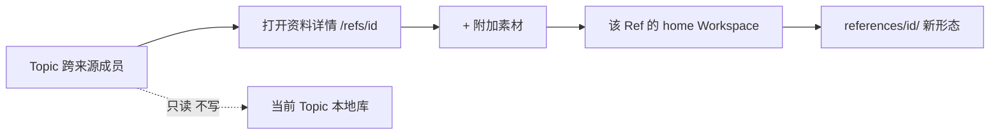

# #357 独立 Ref 详情附加素材

状态：Approved。L1 已获用户 `go，端到端完成`；[批准提案](https://github.com/xforce-io/kairo/issues/357#issuecomment-5601070243)。

## 1 背景

[#357](https://github.com/xforce-io/kairo/issues/357)。[#354](https://github.com/xforce-io/kairo/issues/354) 让 Topic 对跨来源成员只读，管理入口指向独立 Ref 详情；该页没有附加入口，Web attach 仍只写当前 Topic 本地库。

## 2 名词解释

N/A。Topic、Ref、Ref 身份键见 [名词表](../glossary.md)。

## 3 目标与非目标

目标：独立 Ref 详情可附加素材，写入该 Ref 自己的 home；公开只读面不可写。非目标：改 Topic 侧栏跨来源写操作、改 CLI、改 Tag/成员规则、自动 step/digest、改 Timeline。

## 4 能力

Console 打开 `/refs/{id}`（含 `home`）时，来源形态区提供 **+ 附加素材**：本地路径或上传，copy 进该 Ref 目录并追加形态。成功后详情形态列表可见新项。

### 4.1 UI/UX

不新增页面。入口在独立详情的来源形态区，按钮与弹框复用 Topic 本地成员右栏的附加交互。

| 状态 | 判定 |
|---|---|
| 空 | 无来源形态时仍显示 + 附加素材 |
| 成 | 提交后列表出现新形态，文件在该 home 的 `references/{id}/` |
| 错 | 未知 Ref 或公开面 POST 为 404；缺文件/路径或坏路径 400，原形态不变 |
| 不做 | Topic 侧栏不给跨来源成员加按钮；公开只读面无入口 |

窄屏保持单列详情，按钮在形态列表上方。

## 5 思路与折衷

独立详情是这条 Ref 的管理面，home + id 决定写入位置。复用现有 attach 的路径/上传与 copy 进目录，换取与 Topic 本地附加一致。放弃在 Topic 侧栏给跨来源成员开写，避免写请求打到当前 Topic 同 id 材料。放弃只靠 CLI。

## 6 架构

分层：Web 选择层按详情页 home 解析 Ref；写入层调用该 home 的 `Workspace.add(ref_id=…, copy=True)`；模板只在 Console 暴露入口。

主路径：详情 → 提交路径或文件 → 303 回详情 → 列表含新形态。失败路径：公开面或未知身份 → 404 不写；缺参或坏路径 → 400，磁盘与 manifest 不变。

## 7 模块

| 模块 | 变化 |
|---|---|
| `web/views.py` | `POST /refs/{id}/attach`；抽取与 Topic attach 共用的写入 |
| `templates/global_ref.html` | Console 形态区附加弹框 |
| 测试 | 独立详情附加、home 隔离、公开面拒绝 |

加工引擎、CLI、Topic 侧栏契约不变。

## 8 API/CLI

`POST /refs/{ref_id}/attach`

- 表单：`home`（`global` 或 Topic slug，与详情页一致）、`path` 或 `files`（可多文件）、可选 `back`
- Console：路径与上传均 copy 进该 Ref 目录后 `add(ref_id=…)`
- 成功：303 到 `GET /refs/{id}`，保留 home（及既有 timeline `back`）
- 404：未知 Ref、home 与 id 不匹配、公开只读面
- 400：无 path/files、路径无效；不留半成 Ref

CLI N/A。既有 `kairo add --to` 不变。

Topic 本地 `POST /w/{slug}/ref/{id}/attach` 不变，且仍不得用于跨来源成员。

## 9 边界

仅 Console 可写。公开只读面隐藏按钮，POST 由公开面写拦截拒绝。同 id 不同 home 按表单 `home` 写入，不猜测。不得把全局成员的附加写进当前 Topic 本地库。不改成员资格。

## 10 迁移/兼容/回滚

不迁移数据。旧 `/refs/{id}` 阅读地址兼容。部署目标为本机 launchd `com.kairo.web`、8787，加载 `/Users/xupeng/dev/github/kairo/src`，数据根 `/Users/xupeng/kairo`。

发布顺序：本分支测试和评审通过 → PR 检查通过并合并 main → 主仓库快进到合并版本 → `launchctl kickstart -k gui/$(id -u)/com.kairo.web`。部署前记录主仓库 SHA 与 launchd 配置。健康验证：服务状态、独立详情出现附加入口、对一条全局 Ref 附加一次后列表与磁盘一致、Topic 侧栏跨来源仍无附加。失败时将服务加载的代码恢复到记录版本并重启、复验；保留失败提交和用户未跟踪文件，不回滚资料。

## 11 测试计划

E2E/S1：真实浏览器从 Topic 打开全局成员详情，附加一次，核对详情列表、全局目录、Topic 右栏仍无附加。使用既有 ego-browser。

Integration：S2 Topic-home Ref 详情附加只写该 Topic；S3 公开只读无按钮且 POST 404。TestClient 覆盖缺参、坏路径、未知 Ref、同 id 不同 home。

Unit：home=`global` / 空 / slug 解析边界，放在同一测试文件，不增加镜像层。全量 pytest 作回归。

## 12 开放问题

N/A。Issue、L1 与本机部署/失败回退已获用户批准。

## 13 关联

[#357](https://github.com/xforce-io/kairo/issues/357)、[L1](https://github.com/xforce-io/kairo/issues/357#issuecomment-5601070243)、#354。
