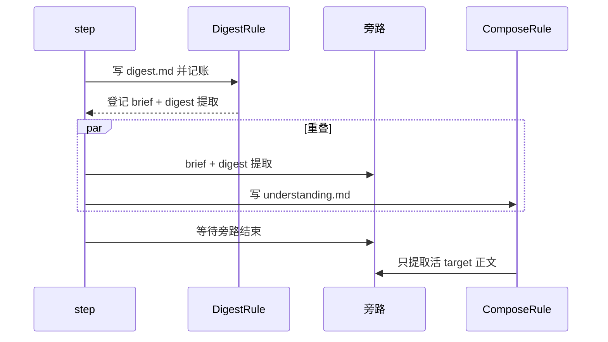

# #378 — 单 Ref 一次推进墙钟下降 ≥40%

- Issue: [#378](https://github.com/xforce-io/kairo/issues/378)
- L1: [提案](https://github.com/xforce-io/kairo/issues/378#issuecomment-5652000557)（Approved）
- 分支: `feat/378-single-ref-runtime`
- 状态: Approved
- 日期: 2026-09-13

本文件是 #378 的详细设计唯一事实源。Issue 只保留摘要与本链接。

## 1. 背景

[#378](https://github.com/xforce-io/kairo/issues/378) 从 [#372](https://github.com/xforce-io/kairo/issues/372) 拆出。漂移已由 [#377](https://github.com/xforce-io/kairo/pull/377) 交付。现网单 Ref 一次推进仍把旁路（brief、知识提取）串在主产物之后；compose 成功后还会对刚提取过的 digest 再抽一次。墙钟约 27 分钟，提取约占一半。

## 2. 名词解释

| 术语 | 定义 |
|---|---|
| **主产物** | 本次推进必须落盘才算成功的正文：`digest.md` 与 constitution 声明的活 target（默认 `understanding.md`）。 |
| **旁路** | digest 成功后的 brief 与知识提取；失败不得改写已落盘主产物，也不得把主产物打成 blocked。 |
| **同文去重** | 一份 digest 正文在一次推进里只提取一次；compose 不再用 `source_kind=compose` 对同一 path 再跑 provider。 |

Ref、digest、brief、提取、Run 见 [名词表](../glossary.md)。

## 3. 目标与非目标

### 3.1 目标

1. 同一条 Ref、与 Web 主按钮等价的一次推进，端到端墙钟 ≤ 变更前基线的 60%。
2. digest 一落盘，compose 即可在同一次 `step` 里跑；不必等 brief / digest 提取结束。
3. brief 与 digest 提取的墙钟与 compose 重叠。
4. 同文去重：compose 成功后只提取活 target 正文（understanding 等），不再提取已处理过的 digest。
5. 旁路失败仍不反噬主产物。

### 3.2 非目标

- 不改漂移判定与 Topic 页一键重算。
- 不把候选并进 digest 同一次 structured output。
- 不加调度器、队列、新进程或二次自动重试。
- 不改 Web 主按钮文案、CLI 表面或人话进度语义。
- 不在现网 `~/kairo` 上取 S1 基线。

## 4. 能力

无新用户能力。一次推进的结果集不变：主产物 + 至多一次 digest 提取 + 一次活 target 提取 + brief。

### 4.1 UI/UX

N/A。无新页面、无新按钮、无单独「提取中」态。主按钮成功/空/错与现网一致：成功则 digest 与 understanding 按原契约出现；空则无待办立刻结束；digest/compose provider-failed 仍挡主按钮，提取失败不挡。

## 5. 思路与折衷

选定三条一起做，否则从「票面 4 次调用」只能去掉 1 次，降幅到不了 40%。

1. **主路径先返回**：DigestRule 写完 digest 并记账后即结束，brief 与 digest 提取登记为旁路。
2. **旁路与下一段主产物重叠**：同一次 `step` 迭代里，旁路在 compose 期间执行。
3. **同文去重**：删掉 compose 后对 delta digest 的提取循环。

放弃 A：候选并进 digest 同一次调用。改 digest persona 与解析契约，失败会污染主产物。

放弃 B：后台 job / 新依赖。一次推进的完成语义变模糊，且 S1 计的是这次推进的墙钟。

放弃 C：只去重、不重叠。6 次调用变 5 次，墙钟降幅不够。

放弃 D：`step` 不等待旁路。主产物是快了，但 Knowledge 候选与 brief 会在 `kairo run` 返回后才出现，S2 无法在同一次命令里断言。

## 6. 架构

主路径仍在调和循环里串行：Transform → Normalize → Digest → ReviewFold → Compose。旁路不得参与 `is_stale`，不得写 `state.products` / `state.targets`。

失败路径：

- digest / compose provider-failed：与现网相同，旁路不跑（主产物没成功）。
- brief / 提取抛错：吞掉，只留 stderr 或 Knowledge 错误；主产物保持。
- 多 Ref 同时提取：知识审核落盘互斥，避免 `knowledge_review.yaml` 互踩；不因此把旁路拉回主路径。

## 7. 模块

| 模块 | 契约变化 |
|---|---|
| `engine.step` | 一次迭代内启动已登记旁路，并在进入下一迭代 / 返回前等待结束。 |
| `DigestRule` | 成功后只登记旁路，不再内联等待 brief / 提取。 |
| `ComposeRule` | 不再对 delta digest 提取；活 target 提取发生在旁路汇合之后。 |
| 知识提取 | 并发写入审核 YAML 时互斥；对外函数签名不变。 |

## 8. API/CLI

N/A。不新增 flag、子命令或 HTTP 路由。`kairo run` / Web 主按钮仍是一次推进。

## 9. 边界

- 旁路只在对应主产物已经成功落盘之后登记。
- 提取失败不得把 digest / understanding 标 blocked。
- 不引入新进程模型；并行只发生在同一次 `step` 内。
- journal 的 ReviewFold 仍在 Digest 与 Compose 之间，行为不因旁路改变。

## 10. 迁移/兼容/回滚

N/A。无存数形态变化。回滚即复原串行调用，已落盘产物不需要迁移。

## 11. 测试计划

- E2E / S1：scratch serve root 一条需走 digest + digest 提取 + compose + 活 target 提取的 Ref；对与主按钮等价的 `kairo run` 计时，墙钟 ≤ 同 fixture 在本变更前基线的 60%；digest.md 与 understanding.md 仍按契约出现。
- E2E / S2：PR 验收表给出 scratch fixture、计时命令、before/after 秒数。
- Integration：digest 成功后 compose 的开始不晚于 digest 提取结束；一次推进里同一 digest path 只提取一次；提取抛错不改已写 digest/understanding。
- Unit：旁路登记/汇合；同文去重的判定。

计时允许用可注入、带固定休眠的 provider 在 scratch 上复现降幅；不得用现网 grok 当唯一证据。

## 12. 开放问题

无。L1 已拍板不把候选并进 digest。

## 13. 关联

- [#378](https://github.com/xforce-io/kairo/issues/378)
- [#372](https://github.com/xforce-io/kairo/issues/372)
- [#377](https://github.com/xforce-io/kairo/pull/377)
- [#362](https://github.com/xforce-io/kairo/issues/362) brief 旁路
