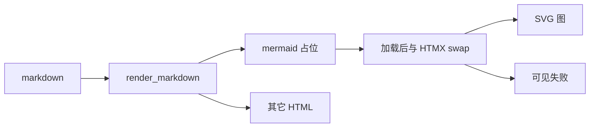

# #380 — 预览中 mermaid 画成图

- Issue: [#380](https://github.com/xforce-io/kairo/issues/380)
- L1: [提案](https://github.com/xforce-io/kairo/issues/380#issuecomment-5659782103)（Draft）
- 分支: `bugfix/380-preview-mermaid-diagram`
- 状态: Draft
- 日期: 2026-09-14

本文件是 #380 的详细设计唯一事实源。Issue 只保留摘要与本链接。不自批。

## 1. 背景

[#380](https://github.com/xforce-io/kairo/issues/380)。Console 预览用 `render_markdown` 把 markdown 收成 HTML。`MarkdownIt` 无 fence 语言分支，` ```mermaid ` 与其它代码块一样落成 `<pre><code>`，再被 `.doc pre` 涂成黑底源码。Topic 活 target、Ref 文本 form、Artifact 都进这条路径。现有脚本没有 mermaid。`html: False` 禁止靠作者 HTML 绕过。

## 2. 名词解释

沿用[名词表](../glossary.md)的 Topic、Ref、digest、Artifact。本设计不新增产品术语。

| 用语 | 本票含义 |
|---|---|
| mermaid fence | info 恰好为 `mermaid` 的 markdown 围栏代码块 |
| 占位 | 服务端为该 fence 吐出的专用块，供浏览器画图，不是普通代码块 |
| 可见失败 | 该占位被替换成恰好一处带 `role="alert"` 的错误，不再以指令源码为主展示 |

## 3. 目标与非目标

### 3.1 目标

1. Topic 活 target 预览：合法 mermaid 出图，主展示不是 `flowchart` 等指令源码。
2. 同一篇里一个非法 mermaid：不白屏，恰好一处可见失败，其余标题/段落仍在。
3. Ref digest 与 Artifact 预览同样出图。
4. 其它语言 fence、#107 注入门禁、现有引用改写保持不变。

### 3.2 非目标

- 不改模型如何写 mermaid。
- 不把 public-read 列入本票验收。
- 不加新 HTTP 路由、配置项或 CLI。
- 不在服务端引入 Node / mermaid-cli。
- 不开放 markdown 原始 HTML。

## 4. 能力

无新页面、无新按钮。打开已有预览即生效。

### 4.1 UI/UX

成功：该块是图（SVG 节点/边可见）。源码不作为主展示。

失败：该块是一处可见错误（人话，中英随 Console 语言）。前后标题/段落仍在。空 fence 视为失败。

其它代码块外观不变。打印 PDF 印当时阅读区 DOM。

## 5. 思路与折衷

选定：`render_markdown` 识别 mermaid fence → 转义后的占位；钉死版本的本地 mermaid 按需加载，在初次进入阅读区以及 HTMX 换 `#reader` 之后画 SVG。

放弃 A：服务端出 SVG。本仓没有 Node 渲染链，不为这一票加。

放弃 B：`html: True` 或作者手写 `<div class="mermaid">`。顶掉 #107。

放弃 C：只改 Topic 模板。S3 要求 Ref / Artifact，它们已经共用 `render_markdown`。

## 6. 架构



服务端：只做识别、转义、占位。不解析 mermaid 语义。

浏览器：发现占位才加载 `/static/mermaid.min.js`；`securityLevel: strict`；`startOnLoad: false`；用占位里的 `textContent` 调用 mermaid；成功插入其 SVG，失败换成错误节点。异常文本转义，不当 HTML。

三条面：

- Topic：`_preview_html` / `doc_view` → `#reader`（含 HTMX OOB）
- Ref：`_render_doc` / `_form_preview_html` → `#reader`
- Artifact：`artifact_page` → `artifact.html` 的 `.doc`（整页加载）

失败路径：单块 mermaid 失败不影响其它块、不影响其余 markdown。JS 抛错不得拆掉 `#reader` 外壳。

## 7. 模块

| 模块 | 契约 |
|---|---|
| `render_markdown` | mermaid fence → 占位；源码 HTML 转义；其它 fence / 锚点 / 引用改写不变 |
| 静态 mermaid | 钉死文件 `src/kairo/web/static/mermaid.min.js`，不走 CDN |
| 画图钩子 | 初次 load + `htmx:afterSwap`（阅读区被换时）对根节点内未完成占位画图 |
| `app.css` | 图与可见失败的阅读区样式 |
| i18n | 一条失败文案（en / zh） |
| `base.html` | 引入钩子；mermaid 本体按需加载 |

## 8. API/CLI

N/A。无新路由、flag、事件。对外契约是预览 HTML 片段：

成功前占位（语义，不规定实现函数名）：

- 容器 class 含 `doc-mermaid`
- 源码在子节点中，以文本而非活 HTML 存在
- 源码若含 `<script>` / `</pre>`，页面上不得出现活 script

成功后：该容器内是 mermaid 给出的 SVG，指令源码不是主展示。

失败后：原占位不在；出现恰好一个 `role="alert"` 的失败节点（class 含 `doc-mermaid-error`）。

## 9. 边界

- 仅 info 恰好为 `mermaid`（允许首尾空白）。`mermaid.json` 等不是 mermaid fence。
- `securityLevel: strict`：无 click、标签内 HTML 不执行。
- 不把 mermaid 异常、源码或 SVG 以外的字符串当未转义 HTML 插入。
- public-read 若共用 `render_markdown` 会带上占位；本票不验收、不因此改 public 壳。
- 不改 digest / compose / Artifact 的生成。

## 10. 迁移/兼容/回滚

无存数变化。回滚即去掉占位转换与 mermaid 静态文件；已有 markdown 文件不用迁。静态 URL 带 cache-bust，避免旧钩子缓存。

## 11. 测试计划

- Unit：合法 mermaid → 占位且源码转义；其它 fence 仍是代码块；源码内 `<script>` 不是活标签；空 fence 仍是占位（失败由浏览器兑现）。
- Integration：Topic / Ref digest / Artifact 预览 HTML 含占位，不是黑底指令主展示。
- E2E / S1–S3：按 Issue 验收，scratch serve root + 真浏览器。不碰 `~/kairo`，不触发 provider Run。

## 12. 开放问题

无。mermaid 具体补丁版本在实现时钉死，不另开产品选择。

## 13. 关联

- [#380](https://github.com/xforce-io/kairo/issues/380)
- [L1](https://github.com/xforce-io/kairo/issues/380#issuecomment-5659782103)
- [#107](https://github.com/xforce-io/kairo/issues/107)
