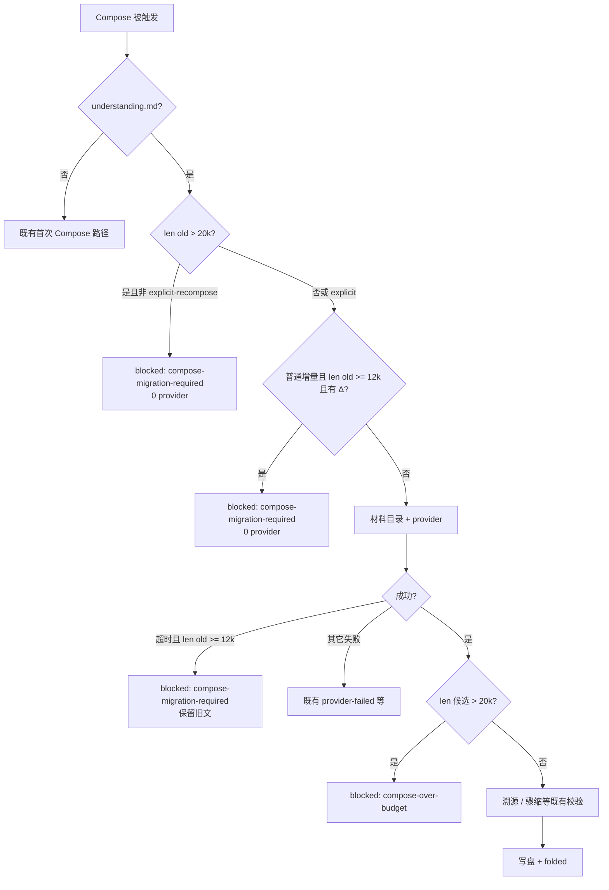

# #386 — 近 20k 上限增量 Compose 超时与可恢复门禁

- Issue: [#386](https://github.com/xforce-io/kairo/issues/386)
- L1: [提案](https://github.com/xforce-io/kairo/issues/386#issuecomment-5673260112)（Draft）
- 分支: `bugfix/386-compose-near-limit-timeout`
- 状态: Draft / 待 L1 审批
- 日期: 2026-09-15

本文件是 #386 的详细设计唯一事实源。Issue 只保留摘要与本链接。不自批。

## 1. 背景

[#386](https://github.com/xforce-io/kairo/issues/386)。现场 Topic「能源梳理」的 `understanding.md` 为 **19,999** Unicode 字符。#161 硬门禁是 `len > 20_000`，故 **恰好 20,000 合法**，19,999 未拦。普通 `kairo run` 仍发起增量 Compose；Δdigest 约 8.5k，剩余 headroom 仅 1 字符，模型在满 `[agent] timeout_s`（现场 1800s）后以 `provider-failed` 结束。`engine.clear_provider_failed_targets` 使下一次普通 run 再次重试同一路径，再次空耗满超时。转写 / digest / 旧 understanding 未毁，但不可恢复地浪费墙钟，且恢复路径仍是「再烧一次 timeout」。

既有机制（keel-how，契约边界引用）：

- `src/kairo/rules.py`：`UNDERSTANDING_MAX_CHARS=20000`；`ComposeRule` 前置 `>20k` → `compose-migration-required`（0 provider）；后置超预算 → `compose-over-budget`；超时等 provider 异常 → `provider-failed` 且保留文件 / folded。
- `src/kairo/engine.py`：`clear_provider_failed_targets` 在普通 run 重试时清除可重试的 `provider-failed`，从而再次调度 Compose。
- `src/kairo/provider.py`：`resolve_cli_timeout` / CLI 超时文案。
- 已批设计：#161（有界 understanding）；#105（超时 → `provider-failed`）；#176（超长 leftover `compose-degraded` 仅观察面升迁为迁移门禁）。

## 2. 名词

沿用 [名词表](../glossary.md) 的 Topic、digest、fold、活 target、`understanding.md`。本设计新增或钉死的产品用语：

| 用语 | 本票含义 |
|---|---|
| 近上限带（near-limit band） | 已存在的 `understanding.md` 满足 `len(old) >= UNDERSTANDING_NEAR_LIMIT` 且 `len(old) <= UNDERSTANDING_MAX_CHARS` |
| 普通增量 Compose | 非 `explicit-recompose`（即非用户确认的 `kairo re-step understanding.md` / 等价显式全量重综合） |
| Δ digest | 相对当前 folded 账本未折入的 stream digest（≥1） |
| 近上限迁移门禁 | 在近上限带上对普通增量 Compose **provider 调用前**给出的 `blocked:compose-migration-required` |

常量提案（待 L1 拍板，本 Draft 选用具体值）：

| 常量 | 提案值 | 说明 |
|---|---:|---|
| `UNDERSTANDING_MAX_CHARS` | `20_000` | **不变**（#161） |
| `UNDERSTANDING_NEAR_LIMIT` | `12_000` | 近上限带下沿；见 §5（peng 评审：需足够余量，不得剩 1k 才拦） |
| `COMPOSE_NEAR_LIMIT_TIMEOUT_S` | `120` | 近上限仍可能调 provider 的边沿路径超时帽；见 §4.3 |

计数一律 Python `len(content)`（Unicode code point），与 #161 一致。

## 3. 目标与非目标

### 3.1 目标

1. **S1**：近上限 Topic 上普通 `kairo run` 折入新 digest 时，要么在时限内成功 fold 且 `understanding.md ≤ 20_000`，要么在跑满配置的 `[agent] timeout_s` **之前**进入可观察 blocked，并给出恢复入口。
2. **S2**：失败路径不破坏已完成的 transcript / digest / 旧 `understanding.md`（逐字节保留）。
3. **S3**：恢复后要么该 digest 进入 folded，要么 reason 为 `compose-migration-required` / `compose-over-budget` 且本次 **Compose provider 调用次数为 0**；不得再次仅以满 timeout 的 `provider-failed` 结束。

### 3.2 非目标

- 不改 ASR / digest 质量。
- 不把 20,000 改为可配置。
- 不对真实「能源梳理」静默压缩 live `understanding.md`。
- 不恢复或改 `assessment.md`。
- **不改默认 `[agent] timeout_s` 配置键本身**（可在近上限边沿路径用更短的有效 CLI timeout，但不新增/改写用户配置语义）。
- **不把硬门禁从 `>` 改成 `>=`**（#161：恰好 20,000 合法）。

## 4. 能力

无新页面、无新 CLI 子命令。契约落在 Compose 触发前的门禁、超时分类、status / 退出码与既有恢复入口。

### 4.1 UI / CLI / status

#### 普通增量 · 近上限 + 有 Δ

当同时满足：

1. 路径恰为 `understanding.md`；
2. 触发语义为普通增量（非 `explicit-recompose`）；
3. 旧正文已存在且 `len(old) >= UNDERSTANDING_NEAR_LIMIT`；
4. 存在 ≥1 条未 fold 的 Δ digest；

则：

- **0 次** Compose provider 调用；
- target → `blocked:compose-migration-required`；
- 旧 `understanding.md` / folded / digests / transcripts **不变**；
- CLI 非零退出；`kairo status` 显示 non-retryable blocked，并提示 `kairo re-step understanding.md`；
- Web 沿用 #161 attention / 重新生成确认框（压缩历史正文；失败保留旧版）。

#### 普通增量 · 近上限但无 Δ

不因近上限 alone 调用 Compose；行为与既有「无 Δ 不 compose」一致。

#### 显式全量重综合

`kairo re-step understanding.md`（`explicit-recompose`）**不受**近上限前置门禁拦阻（与 #161 超长迁移一致）。成功：fold Δ，正文 ≤20k。失败：保留旧字节与 folded。

#### 硬 20k 门禁（不变）

- 前置：`len(old) > 20_000` 且非显式 recompose → 既有 `compose-migration-required`。
- 后置：候选 `len > 20_000` → 既有 `compose-over-budget`。
- **不**改为 `>=`。

### 4.2 超时分类安全网

若 Compose provider **仍然**超时（或等价 CLI timeout），且当时 `len(old) >= UNDERSTANDING_NEAR_LIMIT`：

- 持久化 reason 为 **`compose-migration-required`**（non-retryable），**不是**可重试的 `provider-failed`；
- 因此普通 `kairo run` **不会**再经 `clear_provider_failed_targets` 二次空耗满 timeout；
- 仍保留旧 understanding / folded / digests / transcripts；
- diagnostic 可保留超时摘要供人读，但不改变 reason 闭集归属。

非近上限带上的 Compose 超时仍按 #105 → `provider-failed`（可重试）。

### 4.3 可选近上限 Compose 超时帽

不改 `[agent] timeout_s` 配置键。当近上限带上**仍会**调用 Compose provider 的边沿路径（见 §5：若前置门禁已覆盖全部「近上限 + Δ」普通增量，则本帽仅为 belt-and-suspenders）：

- 有效 CLI timeout = `min(resolve_cli_timeout(...), COMPOSE_NEAR_LIMIT_TIMEOUT_S)`；
- 提案 `COMPOSE_NEAR_LIMIT_TIMEOUT_S = 120`，保证墙钟远小于现场 1800s 的 agent timeout。

显式 recompose **不**强制套此短帽（全量重综合允许用完整 `resolve_cli_timeout`）；若实现选择对显式路径也套帽，须在开放问题中另批——本 Draft **默认不对显式 recompose 套短帽**。

### 4.4 Reason 闭集与重试性

| 原因码 | 触发（本票相关） | provider | 文件/folded | 普通 Run 自动重试 | 恢复 |
|---|---|---:|---|---|---|
| `compose-migration-required` | 近上限前置门禁（有 Δ）；或近上限带上 Compose 超时安全网；或既有 `>20k` 前置；或 #176 观察升迁 | 0 / 已超时 | 不变 | **否** | `kairo re-step understanding.md` |
| `compose-over-budget` | 候选 `>20k`（#161） | 已发生 | 不变 | 否 | 同上 |
| `provider-failed` | 非近上限带的 provider/超时失败（#105） | 已发生 | 不变 | 是（clear 后） | 普通 Run / re-step |
| `explicit-recompose` | 用户确认的全量重综合标记（#161） | 按规则 | 成功才替换 | — | — |

`workspace_run_plan`：`compose-migration-required` 计入 `blocked_count`，**不**计入 `retryable_blocked_count`；仅剩该类 blocked 时 mode 为 `attention`。

### 4.5 恢复契约（同 #161）

1. 用户执行 `kairo re-step understanding.md`（或 Web 等价确认）。
2. 成功：Δ 进入 folded，`understanding.md ≤ 20_000`，状态收敛。
3. 失败（provider / over-budget / provenance / degraded 等）：旧文件与 folded 逐字节保留；不得静默截断。

## 5. 思路与折衷

**选定 A（主路径）— 近上限前置门禁。**  
在 `len(old) >= 12_000` 且有 Δ 时，普通增量不再赌「模型能在不足一条大 digest 的 headroom 内硬折入」。直接 `compose-migration-required`、0 provider。覆盖现场 19,999 + ~8.5k Δ：属于近上限带，墙钟接近 0，满足 S1/S3。

**为何 `12_000`（约 8k 余量）：**  
- 现场 19,999 只剩 1 字符 headroom，任何真实 Δ 都不可能合法 fold；若下沿贴在 19_000，也只剩约 1k，仍远小于典型会议 digest（~8.5k），等于「快撞墙才拦」。  
- peng 评审要求：近上限线要有**足够空间**，不能剩 1k 才开始考虑。  
- `12_000` → 最多约 8,000 字符余量，与现场大 Δ 同量级：余量不够装下一条典型大 digest 时，请显式全量压缩，而不是空耗 timeout。  
- 数值是 L1 产品旋钮；实现不得静默改写。
**选定 B — 超时安全网改分类。**  
前置门禁漏网或竞态（读长与调用间文件变长等）时，近上限超时不得再写成可重试 `provider-failed`，否则 S3 失败。写入 `compose-migration-required` 与 #161 迁移语义对齐。

**选定 C — 短超时帽作安全带。**  
若实现上仍存在「近上限却调 provider」的边沿（例如未来放宽前置条件、或显式路径配置），用 `min(..., 120)` 限制墙钟，且**不**改用户配置键。

**放弃：**

- 把硬门禁改为 `>= 20_000`：打破 #161「20000 合法」。  
- 普通 run 静默截断 / 静默全量压缩：违反 #161「无静默 migrate」。  
- 调高默认 `timeout_s`：不解决可恢复性，只拉长空耗。  
- 新 reason 码：优先复用 `compose-migration-required`，避免 status/skill/闭集膨胀。

## 6. 架构

分层（契约，非实现 TODO）：

- Compose 规则层：近上限前置门禁；近上限超时 → 迁移 reason；硬 20k 前后门禁不变。
- engine / plan：`compose-migration-required` 非 retryable；`clear_provider_failed_targets` 不得清掉它。
- provider 边界：近上限边沿路径可套 `COMPOSE_NEAR_LIMIT_TIMEOUT_S`；不改配置键默认值。
- CLI / Web / skill：沿用 #161 恢复文案与 attention。

## 7. 与 #161 / #105 / #176 的关系

| 既有 | 关系 |
|---|---|
| **#161** | 本票是其「有界 + 显式迁移」在 **≤20k 但无可增量 headroom** 区间的延伸。复用 `compose-migration-required` / `compose-over-budget` / `re-step`。不修改「20000 合法 / 外壳不截断 / 普通 run 不静默 migrate」。 |
| **#105** | 非近上限超时仍 → `provider-failed`。近上限超时从「可重试 provider-failed」收窄为「非重试迁移门禁」，避免 clear-and-retry 空耗。 |
| **#176** | 只处理超长 leftover `compose-degraded` 的观察升迁。本票处理 **尚未超过 20k** 的近上限增量超时；二者不互相替代。 |

## 8. 验收映射 S1–S3

| Story | 设计兑现 |
|---|---|
| **S1** | 19,999 + ≥8k Δ 的普通 run：走 §4.1 前置门禁 → 墙钟 ≪ `[agent] timeout_s`，blocked 可观察；或（实现错误漏网时）§4.2/§4.3 保证仍达不到满 timeout 的可重试空耗。成功路径仅可能来自显式 recompose，且结果 ≤20k。 |
| **S2** | 所有失败 / 门禁路径禁止写坏旧 understanding；不删 transcript/digest；CLI 非零；status blocked。 |
| **S3** | 恢复：`re-step understanding.md` 成功则 folded；或仍为 `compose-migration-required` / `compose-over-budget` 且 **Compose provider 调用 0**。禁止再次「仅满 timeout 的 `provider-failed`」。 |

## 9. 开放问题

1. **`UNDERSTANDING_NEAR_LIMIT` 最终值**：经 peng 评审修订为 **`12_000`**（约 8k headroom）。若还需微调，改本文件常量表，不另开票。
2. **`COMPOSE_NEAR_LIMIT_TIMEOUT_S`**：提案 `120`。若前置门禁被确认为完备覆盖「近上限 + Δ」普通增量，实现可将该帽标为仅测/边沿；数值仍建议保留在代码常量中便于回归。
3. **显式 recompose 是否套短帽**：本 Draft 默认否。若全量重综合也需防 1800s 空耗，另批。

## 10. 关联

- Issue [#386](https://github.com/xforce-io/kairo/issues/386)
- [#161 设计](161-bounded-understanding.md)（Approved）
- #105 · #176
