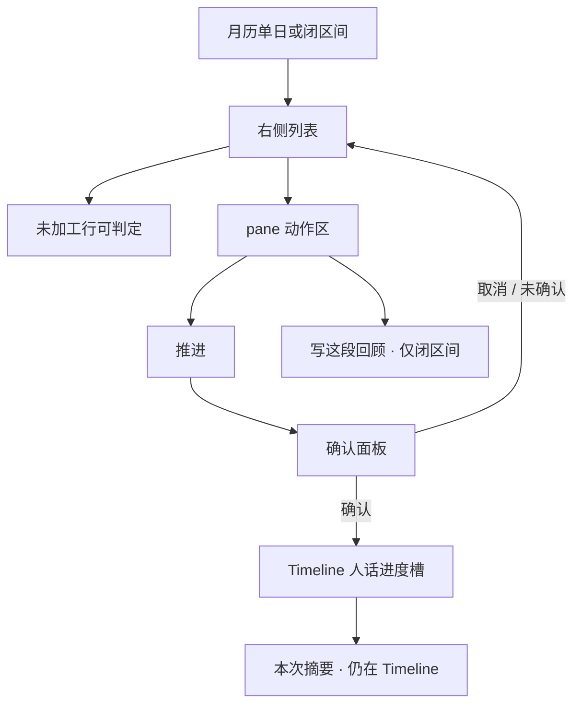
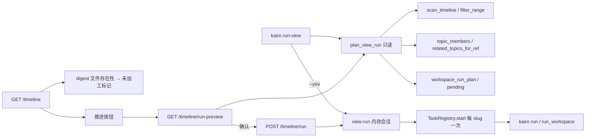

# #396 — Timeline 当前视图一次确认推进

- Issue: [#396](https://github.com/xforce-io/kairo/issues/396)
- 分支: `feat/396-timeline-view-run`
- 状态: Draft（L1 已 Approved；本 L2 待工程/测试签）
- 日期: 2026-09-18
- L1: Approved（Freeman 2026-09-18；炼丹房 `2a7a91d6…`）

本文件是 #396 的详细设计唯一事实源。Issue 只保留摘要与本链接。编排策略已在 L1，此处不回议。

## 1. 背景

[#396](https://github.com/xforce-io/kairo/issues/396)。Freeman 锁：人不该逐个进入 Topic 点「运行」，才能把时间线上的观测推完。

现网（keel-how，对照 `main` `0a45455`）：

- 加工入口只在 Topic 页主按钮 / `POST /w/{slug}/run` / CLI `kairo run`（#75，`engine.run_workspace` / `workspace_run_plan`）。
- Timeline 日历单日与闭区间（#138 / #144）是发现面：`scan_timeline` + `filter_range`；行不区分 digest 是否落盘；闭区间底部只有「写这段回顾」`POST /timeline/review`。
- `kairo timeline` 只读；`kairo run --all`（#373，`_run_all_topics`）对全库非 clean Topic 顺序各跑一次。本期禁止把它当入口。
- digest 路径已有 `refs.timeline_digest_path`；回顾旁注已算 `digest_n` / `no_digest_n`，但未加工不画在行上。
- 人话进度在 Topic `#step-area`（#157）；`TaskRegistry` 按 slug 串行锁，无跨 Topic 会话。
- 成员资格走包含规则（`related_topics_for_ref` / `topic_members`），home 只定位源与唯一 digest。

缺口：人已在看的日历视图不能确认推进。

## 2. 名词解释

沿用 [名词表](../glossary.md) 的 Topic、Ref、Timeline、stream、digest、brief、Artifact、人话进度、运行健康、原始运行日志。本设计新增两项已写入该表；此处只划易混，不抄长表。

| 用语 | 本票含义 |
|---|---|
| 当前视图 | Console 日历正在看的单日（`?day=`）或已选闭区间（`?from=&to=`）。不含最近加入、未知发生日。若当前有 Tag 筛选，入集只认筛选后的列表。 |
| 未加工 | 当前视图内 `kind=ref` 且 fold=true 的 stream，其 digest 文件不存在。缺 brief 不是未加工。 |
| 入集 Topic | 至少一条当前视图未加工 stream 是其成员（包含规则命中，不限 home），且 `workspace_run_plan` 不是 `attention` / `clean`。 |
| 可推进项 | 入集 Topic 一次普通 `kairo run` 会动到的 **Ref 级** 项：`pending()` 中指向 reference 的项 ∪ 该 Topic 可重试 blocked Ref。含同 Topic、当前视图外的 pending。不含 `understanding.md` 等活 target 本身。 |
| 确认数字 | 确认面板 / CLI 预览上的 Topic 数与 Ref 数。必须等于入集 Topic 集合及其可推进项，**可以大于**当前视图可见未加工行。 |

禁止把确认 Ref 数叫成「这一屏未加工数」。禁止把入集 Topic 叫成「行上 home 芯片的去重」。

## 3. 目标与非目标

### 3.1 目标

1. 日历单日与闭区间列表能判定未加工 stream，不必进 Topic / Ref 详情（S1）。
2. 一次确认后，对入集 Topic 串行各一次完整 #75 `run`；人留在 Timeline；确认数字 = 实际跑到的集合（S2，含视图外 pending 夹具）。
3. 确认前零转写 / 模型；预览已含全量数字时停住，产物不变（S3）。
4. 缺 brief、终态 blocked Topic、Artifact 不当待加工；视图外这三类仍不算 pending（S4）。
5. Web 与 CLI 对同一日历范围有显式确认入口；CLI 不是 `kairo run --all`。

### 3.2 非目标

- 自动后台推进、登记后自动 step、定时任务、新队列、落盘子任务、跨 Topic 并行。
- 把 `kairo run --all` 当本期入口；按单条 Ref 裁剪 pending；新单 Ref 运行时。
- 最近加入 / 未知发生日 / Ref 详情加推进入口。
- 改 brief 契约、brief 失败进待办或占位、存量 `kairo brief` 漏补。
- Artifact 产 brief；Topic 推进当作 Project Task Run。
- 把 Timeline 改成 Inbox；改 #144 写回顾；废止 Topic 页主按钮。
- 日历点色表示未加工（发现面不做待办热图）。
- 新存数 / 新文档类型。若实现发现必须新存数，停在本 L2 评审，不先落盘。
- 改 live Topic 数据；改 9/18 脉搏与画布。

## 4. 能力

人在 Timeline 日历单日或闭区间：看见未加工行 → 点「推进」→ 确认面板给出 Topic/Ref 数 → 确认 → 人话进度留在 Timeline → 结束仍在 Timeline。

### 4.1 UI/UX

#### 信息架构

只改日历右侧 pane。最近加入、未知发生日、Ref 详情、Topic 页、public-read 不加入口。



pane 动作区与 #144 回顾并排、各用独立 form，互不提交。单日没有回顾，只出现推进。

#### 布局与交互

**列表（S1）**

- 未加工 stream 行加一处不占第二行的标记（行类名 + 短标签即可，例如「未加工」/ `Undigested`）。已有 digest 的行不加标记、不留空位。
- 缺 brief 不加标记、不占位（与 #362 一致）。
- corpus、`kind=project` / `kind=artifact`、journal 回顾原料规则不用于本标记；journal 的 stream 若无 digest，仍算未加工。
- 折起的较早行若仍是未加工 stream，展开后同样可判定。
- 日历格子点色与点数保持现网（按条数最多 3 点），**不**用点色表示未加工。

**动作区**

| 视图 | 推进 | 写回顾 |
|---|---|---|
| 单日，有 ≥1 条未加工 stream，非 public-read | 可见 | 无（现网如此） |
| 闭区间，同上 | 可见，与回顾并排 | 现网规则不变 |
| 当前视图 0 条未加工 | 不出现 | 现网规则 |
| public-read | 不出现 | 现网只读提示 |
| 最近加入 / 未知发生日 | 不出现 | 不出现 |

推进主按钮文案：中「推进」/ 英 `Process`。不复用 Topic 页「▶ 运行」，以免看成跳进 Topic。旁注只报 **S1 可见未加工行数**（`n 条未加工`），禁止把 S2 的 Ref 数写在按钮旁。

**确认面板**

点推进弹出与现网同款 `<dialog>`（参照 Topic 加 Ref），**不**在点按钮当下开跑。

面板必有：

1. 将运行的 Topic 数、Ref 数（S2 确认数字）。
2. 入集 Topic 名称列表（slug / topic 名）。不逐条列出 Ref。
3. 一句说明：Ref 数按这些 Topic 一次完整 `run` 计，可能大于这一屏未加工行（含同 Topic 其它日期）。
4. 若确认 Ref 数 > 可见未加工行，必须能读出这个差，不得把两数画等号。
5. 主按钮「确认推进」/ `Confirm`；次按钮关闭面板。

确认前只读：`scan_timeline`、digest 文件存在性、`related_topics_for_ref` / `topic_members`、`workspace_run_plan` / `pending()`。零 ASR/LLM。

**进行时**

确认后对话框关闭。pane 内出现 `#tl-run-area`（不跳 `/w/{slug}`）：

- 复用 #157 三层：人话进度 → 运行健康 → 原始运行日志（默认折叠）→ 取消在折叠外。
- 人话主句 = `{当前 Topic 名} · {#157 对象句} · 本次确认起算的时长`。时长不因换 Topic 归零。
- 序号可附「第 i / N 个 Topic」，不替代对象句。
- 健康槽语义与 #157 相同；禁止运行中红字 Run failed。
- 取消：取消**当前** Topic 的既有 cancel；**不再启动**后续 Topic。已完成的 Topic 保持已完成。

**结束后**

`#tl-run-area` 换成本次摘要，人仍在 Timeline。摘要只报本次确认会话，不复用 Topic `#step-area` 的单 Topic run-summary 顶替整页。

#### 全状态

| 状态 | 列表 | 推进 | 确认面板 | 进度槽 | 判定一句 |
|---|---|---|---|---|---|
| 空 | 无未加工标记 | 不出现 | — | — | 不是失败 |
| 有未加工、未点 | 未加工行可判定 | 可见 | 未开 | 无 | 未确认不算推完 |
| 预览可推进 | 同上 | 可见 | Topic/Ref 数 = 将跑集合 | 无 | 零消耗 |
| 预览但 Ref=0 | 可见未加工（成员 Topic 全是 attention） | 可见，确认禁用 | 说明普通推进清不掉 | 无 | S4；零消耗 |
| 运行中 | 保持该视图 | 禁用 | 已关 | 人话 + 可选健康 | 人在 Timeline |
| 部分失败 | 已 digest 的行去掉未加工标记 | 可再次出现（若仍有可推进） | — | 摘要：完成 / 失败 / 跳过 / 取消未跑 | 不中止已启动之后的串行；失败 Topic 具名 |
| 全成功 | 入集可推进项已 digest | 按空态消失或不可提交 | — | 摘要完成 | 人未进 Topic 页 |
| 传输不稳 | 同上 | 禁用 | — | 健康槽明示未结束 | 不是 Run failed |
| 不做 | 缺 brief 占位、Artifact 当未加工、点色待办热图、自动跳 Topic | 与回顾同一 form | 只报屏幕行数 | 默认展开 agent 日志 | 不算成 |

窄屏（既有 ≤880px 单栏）：动作区、确认面板、进度槽仍在列表上方/同一 pane；不改到顶栏。

无障碍：确认数字在 dialog 内以文本可读；进度槽 `role="status"` / `aria-live="polite"`（沿 #157）。

### 4.2 部分失败呈现

串行；一 Topic 失败不中止后续（对齐 `_run_all_topics`）。

摘要四数：

- 完成：本次 `run` 后该 Topic 不再是可推进（或已 ran 且无 provider-failed）
- 失败：子进程非零 / provider-failed / 启动异常
- 跳过：预览时即为 `attention`，未跑
- 取消未跑：取消发生后尚未 start 的入集 Topic

失败 Topic 列出名称，可链到 `/w/{slug}`，**不**自动打开。不在 Timeline 上提供「只重试失败项」新按钮；人可再点推进（入集按当时视图重算）或进 Topic 页主按钮。

### 4.3 CLI

新命令，**不**给 `kairo run` 加 `--day`，**不**走 `--all`。`kairo timeline` 保持只读。`kairo run` / `kairo run --topic` 单 Topic 不变。

```
kairo run-view --day YYYY-MM-DD [--yes] [--json]
kairo run-view --from YYYY-MM-DD --to YYYY-MM-DD [--yes] [--json]
```

根目录位置参数与 `kairo timeline` 相同（默认 `KAIRO_SERVE_ROOT` / cwd）。

| 规则 | 契约 |
|---|---|
| 范围 | `--day` 与成对 `--from/--to` 互斥；缺日期、非法日、只给一端 → 退出 2，零消耗 |
| 预览 | 任何执行前先打印 Topic 数、Ref 数、入集 slug 列表。`--json` 预览键见 §8 |
| 确认 | 无 `--yes`：TTY 问一句（默认 N）；非 TTY 打印预览后退出 2。都不调用 ASR/LLM |
| `--yes` | 打印同一预览后立刻串行 `run` |
| 空集 | 无可推进 Topic：预览 Topic=0、Ref=0，不跑，退出 0 |
| 退出码 | 0 预览放弃 / 空集 / 全部完成且无失败；1 有失败或仍有 attention（与 `--all` 同类）；2 用法错误 |
| 禁止 | `kairo run --all` 作本入口；无日期的 `run-view`；把 Tag 筛选项做成 CLI 必填（Console Tag 筛选只作用于 Web 当前视图） |

## 5. 思路与折衷

选择：日历视图只决定 **Topic 入集**；执行复用每 Topic 一次 `run`（与 `--all` 同循环、收窄入集）。确认面板与 `kairo run-view` 共用同一只读计划函数。进度挂 Timeline 内存会话，不新造队列。

放弃：

- **给 `kairo run` 加 `--day`**：和 `--all` / `--topic` 挤在同一动词上，误用面大。
- **确认数字 = 屏幕未加工行**：数字撒谎（L1 已否）。
- **按视图裁 pending**：等于新造按 Ref 运行时（L1 已否）。
- **日历点色当未加工**：把 Timeline 做成待办热图，违 #249。
- **Web 进度跳进 Topic 页**：主路径失败。
- **落盘 view-run job**：新存数；现网 Topic run 本来也不落盘。
- **31 日上限套用到推进**：那是 #144 回顾 LLM 输入封顶。推进范围 = 人选出的当前视图，不再另加封顶。

代价（L1 已锁，此处只落实呈现）：入集 Topic 的视图外 pending 会被吃掉，必须出现在确认数字里。

## 6. 架构

### 6.1 分层



- `plan_view_run`：纯函数，Web 预览与 CLI 预览共用。零 provider。
- 执行：按入集 slug 稳定序（与 `scan_topic_identities` 同类，按 slug）依次 `TaskRegistry.start` + 等到结束。某 slug 已在跑 → #114 附着，不第二 job，等它结束再计本会话结果、再开下一个。
- 会话对象只在进程内存（与 `TaskRegistry` 同寿命）。进程重启则进行中的视图推进丢失，与现网单 Topic run 相同。**不写** `state.json`、不写新清单文件。

### 6.2 主路径

1. 解析当前视图 `day` 或 `from/to`（非法 → 400 / CLI 2）。
2. 视图 Ref = `filter_range`（单日则该日）中 `kind=ref` 且 fold=true。
3. 未加工 = digest 文件不存在。
4. 入集 Topic = 这些未加工 Ref 经包含规则得到的 Topic，去掉 `attention` 与 `clean`。
5. 可推进项 = 各入集 Topic 的 Ref 级 pending ∪ 可重试 blocked Ref，**不去**按视图裁 id。
6. 预览返回 Topic 数、Ref 数、slug 列表。
7. 确认后按 slug 串行 `run`。失败记录后继续。
8. 人话进度始终写 Timeline `#tl-run-area`。

### 6.3 失败路径

- public-read：无按钮；POST 403；CLI 非本面。
- 预览 Ref=0：确认禁用；CLI 无 `--yes` 也只打印空集。
- 单 Topic `run` 失败：记失败，开下一个。
- 取消：当前 Topic cancel，余下入集标「取消未跑」。
- provider / ASR 失败口径沿 #75 / #97 / #157，不在 Timeline 另造终态机。

## 7. 模块

| 模块 | 契约 |
|---|---|
| `plan_view_run(root, start, end)` | 只读；返回入集 slugs、Topic 数、Ref 数、跳过的 attention slugs、可见未加工数。不调 provider。 |
| Timeline 列表渲染 | 未加工标记只看 digest 文件；不在 GET `/timeline` 上为每个 Topic 跑 `run`。 |
| `GET /timeline/run-preview` | 确认面板数据；与 CLI 预览同一计划。 |
| `POST /timeline/run` | 开视图会话；与 `POST /timeline/review` 互不提交。 |
| view-run 会话 | 内存；持有 slug 序、当前下标、每 slug task_id、起始时刻。 |
| `#tl-run-area` | #157 语义挂在 Timeline；SSE 跟当前 slug。 |
| CLI `run-view` | §4.3。 |

不改 `run_workspace` / `workspace_run_plan` 的 Topic 语义。不改 `POST /w/{slug}/run`。

## 8. API/CLI

### 8.1 预览

`GET /timeline/run-preview`

查询：与 Timeline 相同的 `day` 或 `from`+`to`（互斥规则同 #144）。可带 Tag 筛选，与当前页一致。

成功 JSON（HTML dialog 也必须能读出同样数字）：

```json
{
  "topic_count": 2,
  "ref_count": 5,
  "visible_undigested": 3,
  "topics": [{"slug": "a", "title": "…"}],
  "skipped_attention": [{"slug": "b", "title": "…"}]
}
```

`ref_count` 是可推进项，**不是** `visible_undigested`。零消耗。非法查询 400。public-read 403。

### 8.2 确认执行

`POST /timeline/run`

form：`day` 或 `from`+`to`（与预览同一范围）。成功：200，pane 换成进度槽（HTMX 目标 `#tl-run-area`），不 303 到 Topic。进行中再 POST 同一视图：不第二会话；可附着当前会话。范围与当前会话不一致：400。public-read 403。

取消：复用既有 `POST /w/{slug}/step/{task_id}/cancel` 取消当前 slug，并停止会话余下 slugs。

进度事件：可复用 `/w/{slug}/step/{task_id}/stream`；Timeline 页负责在 slug 切换时改 sse-connect。不新造跨 Topic SSE 协议。

### 8.3 CLI

见 §4.3。`--json` 预览字段与 §8.1 同名。`--yes` 跑完后 JSON 另加 `ran` / `failed` / `skipped_attention` / `cancelled` 列表。人读预览至少一行：`N topics, M refs`。

## 9. 边界

1. 一次确认 = 清单内 Topic 各一次完整 `kairo run`；视图外 pending 一并吃掉且计入确认 Ref 数。
2. 未入选 Topic 不得被跑到。
3. 一条未加工 Ref 命中多个 Topic：这些 Topic 都入集（fold 属于 Topic）；人不用拆。
4. home=`global` 且无包含规则命中：行可标未加工（S1），入集为空，确认不可提交。
5. 终态 blocked Topic（`digest-degraded` / `compose-over-budget` / `compose-migration-required` 等）不入集；普通推进清不掉。可重试 blocked 随 #75 先清再 step。
6. 与 #144 回顾并排、互不提交。回顾 31 日上限不套到推进。
7. public-read 无推进入口。
8. Console Tag 筛选收窄当前视图，因而收窄入集；CLI `run-view` 不带 Tag（与 `kairo timeline --tag` 分开，避免静默少跑）。
9. 不改 live 数据根作为交付手段。

## 10. 迁移/兼容/回滚

无存数变更。回滚代码后：Timeline 失去推进与未加工标记；已写出的 digest / 活 target 保留。`kairo run`、`--all`、回顾、Topic 主按钮行为不变。旧 `?day=` / `?from=&to=` 链不变。

## 11. 测试计划

对上 S1–S4。合入走隔离 stub；真语音转写/模型无复现入口前不作为合入门。

- **E2E / S1**：单日或闭区间有未 digest 音频，不进 Topic / Ref 详情即可判定每一条未加工 stream。缺 brief 行无标记无占位。
- **E2E / S2**：同一视图 ≥2 个 Topic 各有可推进未加工 stream，其中至少 1 个 Topic 另有当前视图外 pending。打开确认：Topic 数 = 入集数，Ref 数 = 全量可推进（可大于可见未加工行）。确认 1 次后各完整 `run`，人仍在 Timeline。切到视图外那条的发生日（不进 Topic / Ref 详情）可见 digest。未入选 Topic 不被跑到。确认数字只报屏幕行、按视图裁 pending、或漏掉视图外 pending → 不过。
- **E2E / S3**：预览已含全量数字时停住，ASR/LLM 调用次数 = 0，digest / 活 target 不变。
- **E2E / S4**：缺 brief / 终态 blocked Topic / Artifact 不进待加工；视图外这三类仍不算 pending。终态 blocked 的 Topic 确认数字不含它，普通推进后仍 blocked。
- **E2E / CLI**：`kairo run-view --day` 无 `--yes` 于非 TTY 退出 2 且零消耗；`--yes` 与 Web 同范围同数字。不是 `kairo run --all`。
- **E2E / 部分失败**：两 Topic，第一失败，第二仍跑；摘要具名失败；人在 Timeline。
- **Integration**：`plan_view_run` 与 `workspace_run_plan` / `run` 门禁一致；`POST /timeline/run` 与 `POST /timeline/review` 互不提交；public-read 无入口。
- **Unit**：未加工判定不含 brief 缺失、不含 Artifact、不含 corpus；确认 Ref 数含视图外 pending；attention Topic 不入集。

## 12. 开放问题

N/A。L1 已锁编排；本 L2 锁确认面板、部分失败、CLI 名、进度槽。无新存数。不把日历点色、31 日上限、`kairo run --day` 留作未决。

## 13. 关联

- [Issue #396](https://github.com/xforce-io/kairo/issues/396)
- L1 Approved：Freeman 2026-09-18；可见面 [issuecomment-5724351120](https://github.com/xforce-io/kairo/issues/396#issuecomment-5724351120)；修订 [issuecomment-5723502849](https://github.com/xforce-io/kairo/issues/396#issuecomment-5723502849)
- #75 单一主按钮 · #114 附着 · #144 回顾 · #157 人话进度 · #249 Timeline 非 Inbox · #340 终态 blocked · #362 brief · #373 `--all` 只作编排先例
