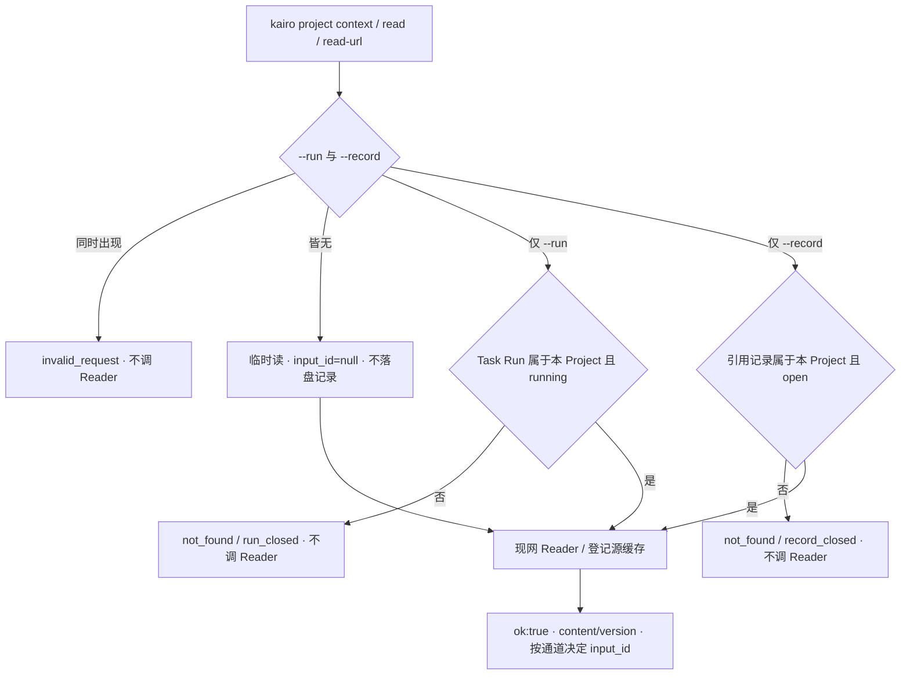

# #400 — 交互式读取 Project 登记源及一跳外链

- Issue: [#400](https://github.com/xforce-io/kairo/issues/400)
- 分支: `feat/400-interactive-project-read`
- 状态: Draft（L2 · 待批准 · 不自批）
- L1: [Approved](https://github.com/xforce-io/kairo/issues/400#issuecomment-5742840845)（苏晴 2026-09-19）
- 本文件是 #400 的 **L2 事实源**。Issue 只保留摘要与本链接。未获 L2 批准前不实现产品代码。

## 1. 背景

[#400](https://github.com/xforce-io/kairo/issues/400) 补齐普通对话里的 Project 读取闭环，不取消 [#392](https://github.com/xforce-io/kairo/issues/392) 已有「进行中 Task Run 冻结输入」契约。

现网（`origin/main` `d8e082f`）：`kairo project context` / `project read` 的 `--run` 可选，无 Run 可读登记源但不记账；`project read-url` 的 `--run` 必填且要求 `status=running`。coding-agent 在无 Task Run 时跟读失败，随后转向内部目录或私有 Reader。这是 #392 有意约束。本票另开临时读与引用记录，不拆无人值守 Task 的证据链。

L1 已锁定：双通道（临时读 / 引用记录）+ 保全 #392；临时读不发可核对 `input_id`；S3 用户可见口径为失败响应不得返回该外链正文、不得分配新 `input_id`；「外部 Reader 调用次数为 0」只作 Integration 断言。

## 2. 名词解释

沿用 [docs/glossary.md](../glossary.md) 的 Project、Data Source、Reader、连接、Task、Run、Artifact、材料身份。本票新增：

| 用语 | 本票含义 |
|---|---|
| 临时读 | 不带 `--run`、不带 `--record` 的 `context` / `read` / `read-url`：只取正文、来源、版本，`input_id` 为 JSON `null`，不写任何 Run 或引用记录存数 |
| 引用记录 | 见名词表。`rec-` + 12 位小写十六进制；可创建、中断恢复、结束、查询；不启动 Task、不产生 Artifact |
| 一跳 | 只跟读**已读登记源**（及若已读的 Topic 材料）正文中的链接；不跟读 `type=url` 材料里的再链（沿用 #392） |

禁止把引用记录称为「临时 Run」「假 Run」。Task Run 标识仍为现网 `run-` 前缀，与 `rec-` 互不冒充。

## 3. 目标与非目标

### 3.1 目标

1. **S1**：无预先 Task Run、无引用记录时，正式 CLI 取得 1 个登记源和 1 个受支持一跳外链的正文、来源、版本；额外模型任务 0；`input_id` 为 `null`。
2. **S2**：正式 CLI 完成引用记录的创建、恢复、结束与查询；中断 1 次后用同一 `record_id` 恢复，已记录输入仍可追溯；不编造标识、不借用历史 Task Run；进行中 Task Run 的冻结输入仍有效。
3. **S3**：不存在 / 已结束 / 不属于当前 Project 的 Run 或引用记录标识，返回可判别 `code`、`retryable`、`next`；失败响应无该外链正文、无新 `input_id`；按 `next` 能走通 S1 或 S2。帮助与 Skill 覆盖三类场景。

### 3.2 非目标

- 取消或放宽 #392：`--run` 指向进行中 Task Run 时行为不变。
- 二跳递归、批量跟读调度。
- 自动 `step` / `run` / `re-step` / `accept`，或为读材料拉起 Task agent。
- 新增 Reader、自动 `add_datasource`、修改外部文档。
- Buzz 鉴权、超时及重放修复。
- 临时读返回可核对 `input_id`。
- 把引用记录做成无模型 Task Run（无 Artifact、不走 `finalize_inputs` / 发布门）。
- 新 Console 页面、新 HTTP API。

## 4. 能力

### 4.1 UI/UX

N/A。本票无 Console 页面。用户可见面为正式 CLI JSON 与打包 Skill 原文。空 / 错 / 成功判定见 §8 与 §1 主路径（L1 已写，此处不重复视觉稿）。

### 4.2 三通道（互斥）

| 通道 | 标志 | 记账 | 启动模型 |
|---|---|---|---|
| 临时读 | 无 `--run`、无 `--record` | 不写 `input_id`，不写 `runs/` 与 `records/` | 否 |
| 引用记录 | `--record RECORD_ID`（`rec-`） | 写入该引用记录的 inputs，分配 `inp-` | 否（`record create` 亦不启动） |
| Task Run | `--run RUN_ID`（`run-`） | 写入该 Run scratch（#392） | 否（读取本身不启动；Task 运行是既有通道） |

`--run` 与 `--record` 同时出现 → `invalid_request`，不读外链。

## 5. 思路与折衷

选择：**临时读把 `read-url` 的 `--run` 改为可选；引用记录用独立对象与独立标志；Task Run 原样保全。**

| 选择 | 放弃 |
|---|---|
| `--record` 与 `--run` 分旗 | 放弃把 `rec-` 塞进 `--run`（agent 会继续借用历史 Run） |
| 临时读 `input_id=null` | 放弃无容器却发 `input:`（会诱使伪造 Run） |
| 引用记录独立存数 | 放弃「再开一次无模型 Task」（会缠上 Artifact / `finalize_inputs`） |
| 创建时冻结范围 | 放弃「始终跟目录最新成员」，换可追溯 |
| Skill 三类场景分节 | 放弃只改一句「`--run` 可选」（无人值守段必须继续强制 `--run`） |
| S3 先校验标识再调 Reader | 放弃先拉外链再报错（违反已锁口径） |

代价：agent 必须先 `record create` 才能引用。可接受：S1 不需要引用；S2 本就要合法标识。

## 6. 架构

分层：CLI（`kairo project …`）→ 材料层（范围、标识解析、记账）→ 现网 Reader。不经 Topic `step`，不经 Task 发布门（引用记录通道）。



**主路径：** S1 皆无标志 → 读登记源 → `read-url` 一跳 → 两份正文。S2 `record create` → `--record` 读 → 中断 → `record resume` 同一 id → `record end` → `record show`。

**失败路径：** 标识非法 / 不存在 / 错 Project / 已结束 → 在 Reader 之前失败；JSON 无 `content`、无新 `input_id`；`retryable` + `next` 指向省略标志（S1）或 `record create`（S2）。

## 7. 模块

| 面 | 变化方向 |
|---|---|
| `kairo project read-url` / `read` / `context` | `--run` 可选；新增互斥 `--record` |
| `kairo project record …` | 新子命令组：create / resume / end / show / input |
| 材料层 | 引用记录存数与冻结范围；S3 先校验标识 |
| `src/kairo/data/SKILL.md` | 三类场景原文见 §8.4；无人值守段保持 `--run` 必填语义 |
| `_execute_agent_run` 注入 prompt | **不改**为临时读；Task agent 仍走 #392 |
| Console / HTTP API / Reader 本体 / `add_datasource` | 不改 |

## 8. API/CLI

无新 HTTP API（N/A 路由表）。根目录解析沿用 `--root` → `KAIRO_SERVE_ROOT` → cwd。JSON 默认；成功退出 0，业务失败退出 1。

### 8.1 标识格式（钉死）

| 对象 | 正则 | 例子 |
|---|---|---|
| Task Run | `^run-[0-9a-f]{12}$` | `run-a1b2c3d4e5f6` |
| 引用记录 | `^rec-[0-9a-f]{12}$` | `rec-a1b2c3d4e5f6` |
| 已记录输入 | `^inp-[0-9a-f]{12}$` | 沿用现网，作用域为**该** Run 或**该**引用记录 |

`--run` 收到 `rec-…`，或 `--record` 收到 `run-…` → `invalid_request`（`retryable=true`），不查另一张表、不调 Reader。格式不匹配上述正则 → `not_found`，不调 Reader。

### 8.2 失败 JSON（钉死）

失败闭集字段：

```json
{"ok": false, "code": "not_found", "error": "…", "retryable": true, "next": "…"}
```

| 字段 | 类型 | 规则 |
|---|---|---|
| `ok` | bool | 恒 `false` |
| `code` | string | 见下表 |
| `error` | string | 人读原因，不含成功正文 |
| `retryable` | bool | 同一命令换合法前置后是否值得再试 |
| `next` | string | 非空。只允许指向正式 CLI：省略标志做临时读，或 `kairo project record create` |

失败响应**禁止**出现：外链正文（`content` / `numbered_content`）、新 `input_id`（非 `null` 的 `inp-`）。旧成功字段不得在失败体里冒充成功。

本票命令（`context` / `read` / `read-url` / `record *`）的失败体均含 `retryable` 与 `next`。其它既有命令不强制改（只增不改意义）。

| 情形 | `code` | `retryable` | `next` 要点 |
|---|---|---|---|
| `--run` 与 `--record` 同时出现 | `invalid_request` | true | 只保留一个标志 |
| `--run` 收到 `rec-` 前缀（或反之） | `invalid_request` | true | 改用对应标志 |
| 标识不存在 / 不属于当前 Project | `not_found` | true | 只需正文则省略 `--run`/`--record`；需引用则 `record create` |
| Task Run 已结束 | `run_closed` | false | 不要再用该 `--run`；临时读省略标志，或 `record create` |
| 引用记录已结束后再 `read` / `read-url` / `resume` | `record_closed` | false | 查询用 `record show`；再记账则 `record create` |
| 缺 `--run` 且缺 `--record` 时的其它非法参数 | `invalid_request` | true | 按帮助纠正 |
| 无 Reader / 无法识别 | `invalid_link` 或 `unsupported_reader` | false | 跳过该 URL（#392 同） |
| 未授权 | `permission` | true | 检查连接授权；不扫内部目录 |

S3 定量 Integration：上表前五类在调用 Reader 之前返回；外部 Reader 调用次数为 0。CLI 不输出该计数。

### 8.3 子命令字面量（钉死）

禁止并行别名。帮助文本须写明三类场景。

**引用记录生命周期**

| 命令 | 契约 |
|---|---|
| `kairo project record create PROJECT_ID` | 新建 `status=open` 的引用记录。冻结当时 Project 的 `topics` 与 Data Source id 列表。不启动模型、不产生 Artifact、不出现在 Task Run 列表。成功：`{ok:true,record_id,project_id,status:"open",scope_topics,scope_datasources,created_at}` |
| `kairo project record resume PROJECT_ID RECORD_ID` | `open`：返回与 create 同形（同一 `record_id`，不重新冻结）。`closed`：`record_closed`。不存在 / 错 Project：`not_found` |
| `kairo project record end PROJECT_ID RECORD_ID` | `open`→`closed`。已 `closed`：仍 `ok:true,status:"closed"`（幂等）。成功后不可再经 `--record` 记账 |
| `kairo project record show PROJECT_ID RECORD_ID` | `open` 或 `closed` 均可。返回元数据与 `inputs` 列表（`input_id,source_id,type,title,version,url`），**不含**全文、**不调** Reader。尚未读取时 `inputs` 为 `[]`，不编造条目 |
| `kairo project record input PROJECT_ID RECORD_ID INPUT_ID` | 返回该条已记录正文；只读磁盘；`open`/`closed` 均可。不存在 → `not_found`。不调 Reader |

**读取（沿用字面量，改标志）**

| 命令 | 契约 |
|---|---|
| `kairo project context PROJECT_ID [--run RUN_ID \| --record RECORD_ID]` | 目录。无标志：当前 Project 成员。`--run`：该 Task Run 冻结范围（#299/#392）。`--record`：该引用记录冻结范围 |
| `kairo project read PROJECT_ID SOURCE_ID [--run RUN_ID \| --record RECORD_ID] [--refresh]` | 登记源正文。无标志：`input_id` 为 `null`，无 `numbered_content`。`--run`：#392。`--record`：记账到该引用记录，有 `input_id` 与 `numbered_content` |
| `kairo project read-url PROJECT_ID URL [--run RUN_ID \| --record RECORD_ID]` | 一跳外链。`--run` **改为可选**。无标志：成功 `{ok:true,title,source_id,type,url,reader,kind,content,version,fetched_at,input_id:null}`，不写 scratch/records。`--record`：记账，`input_id` 为 `inp-…`，附 `numbered_content`/`line_count`。`--run`：#392 不变。URL 规则、Reader 白名单、禁止 `add_datasource`、禁止写 `cache/{ds_id}` 均沿用 #392 |

`project read` 仍禁止把裸 URL 当 `SOURCE_ID`。引擎单次 `read-url` 不展开返回正文中的再链。

### 8.4 冻结范围

`record create` 时写入：

- `scope_topics`：当时 `project.topics` 的完整列表副本
- `scope_datasources`：当时各 Data Source `id` 列表副本

之后该记录的 `context` / `read` / `read-url` **只**用这份冻结范围。创建后新关联的 Topic / 新 Data Source 不进入该记录。范围内对象被删除 → 读取 `not_found`，已记录 inputs 仍可 `show` / `input`。`resume` 不重新冻结。范围只缩小解释、不扩大。

Task Run 冻结规则不改。临时读无冻结快照，用调用当时的 Project 成员。

### 8.5 存数形态

引用记录落在 `.kairo/projects/{project_id}/records/{record_id}/`（manifest + inputs 索引与正文）。**不**写入 `runs/`，**不**出现在 Task Run 列表，**不**走 `finalize_inputs`。inputs 字段形状与 #392 URL 材料一致（`type=url` 时 `source_id=url:`+原文 URL）。同一记录内 `source_id`+`version` 去重，返回已有 `input_id`。

### 8.6 Skill 三类场景（原文须进入 `src/kairo/data/SKILL.md`）

以下三节语义必须同时存在；禁止把无人值守段改成「`--run` 可省」。帮助（`kairo project read-url --help` 等）须能区分这三类。

**A. 临时读（普通对话，不需要 `input:` 引用）**

无预先 Task Run、用户只要正文时：

```
kairo project context PROJECT_ID --root SERVE_ROOT
kairo project read PROJECT_ID SOURCE_ID --root SERVE_ROOT
kairo project read-url PROJECT_ID --root SERVE_ROOT URL
```

不要传 `--run` 或 `--record`。成功 JSON 的 `input_id` 为 `null`，禁止写成 `[标题](input:…)`。不要调用 `step` / `run` / `re-step`。不要扫内部目录或调用私有 Reader。不要为了读材料去 `record create`（那是场景 B）。

**B. 引用记录（需要可核对引用）**

用户要求可追溯引用时，先取得合法标识，再读：

```
kairo project record create PROJECT_ID --root SERVE_ROOT
kairo project read PROJECT_ID SOURCE_ID --record RECORD_ID --root SERVE_ROOT
kairo project read-url PROJECT_ID --record RECORD_ID --root SERVE_ROOT URL
```

`record_id` 以 `rec-` 开头。中断后用同一标识恢复：

```
kairo project record resume PROJECT_ID RECORD_ID --root SERVE_ROOT
```

完成后结束并查询：

```
kairo project record end PROJECT_ID RECORD_ID --root SERVE_ROOT
kairo project record show PROJECT_ID RECORD_ID --root SERVE_ROOT
```

禁止借用历史 Task Run。禁止把 `rec-` 传给 `--run`。禁止编造 `input_id`。

**C. 已有 Task Run（无人值守 Project 运行）**

当运行输入已给出 Project、serve root **与 Task Run 标识**时，保持现网「Project 运行」整节：`context` / `read` / `read-url` **必须**带 `--run RUN_ID`；Run 须为 `running`；跟读写入该 Run；冻结输入约束有效。不要改用引用记录替代该 Task Run。不要省略 `--run`。不要 `step` / `run` / `re-step`。

一跳、无 Reader 跳过、单条 `read-url` 失败不放弃整篇：场景 B 与 C 均沿用 #392。场景 A 无 Artifact，失败只使该次 CLI 失败。

## 9. 边界

- In：交互式读取闭环；引用记录生命周期；错误与恢复提示；CLI 帮助及 operator Skill（打包 `SKILL.md`）同步。
- Out：见 §3.2。另：不改 Task 发布 / Artifact 校验；不改 Console；不新增 HTTP API；不改无人值守 prompt 去教临时读。
- 授权与 Reader 复用现网；`live=False` 仍只挡永久 `add_datasource`。
- 凭据不写入引用记录 manifest 或 inputs 元数据。

## 10. 迁移 / 兼容 / 回滚

- 既有 `read-url --run`（进行中 Task Run）字节级语义不变。
- 新行为：`read-url` 允许无 `--run`；新增 `record` 子命令与 `--record`。旧脚本只要仍传 `--run` 不受影响。
- 回滚：去掉本票提交后，无标志的 `read-url` 恢复为必填 `--run`；磁盘上遗留的 `records/` 目录旧代码不解释、不删除。禁止把删除 `records/` 当作回滚手段。
- 无数据迁移。无生产运行身份变更（本票不是发版授权）。

## 11. 测试计划

用户可见 S1–S3 为 CLI，不对 Console Drive。功能地图：`.agents/skills/verify-kairo-web/features/interactive-project-read.md`（及 README 一行）。E2E 入口为该文件「路径 → 可判定结果」；实现后由 `tests/test_project_interactive_read.py`（名称可同义）承载，并回归 `tests/test_project_read_url.py`、`tests/test_skill_kairo.py`。

| 层级 / 验收 | 路径 | 可判定结果 |
|---|---|---|
| E2E S1 | 无 `--run`/`--record`：`context` → `read` 1 个登记源 → `read-url` 1 个受支持一跳外链 | 两份 `ok` 且有 `content`/`version`；`input_id` 为 `null`；Task Run 列表不增加；无 `step`/`run`/`re-step` |
| E2E S2 | `record create` → `--record` 读取 → 中断 → `resume` 同一 id → `end` → `show`；另取一条进行中 Task Run 对照 `read-url --run` | 已记录 `input_id` 可追溯；不借用历史 Task Run；该 Task Run 冻结输入仍有效 |
| E2E S3 | 分别传不存在、已结束、错 Project 的 `--run` / `--record` | `code` 可判别；有 `retryable` 与 `next`；无 `content`、无新 `input_id`；按 `next` 能走通 S1 或 S2 |
| Integration | S3 前五类失败；#392 `read-url --run` 回归 | S3 外部 Reader 调用次数为 0；Task Run 路径与 #392 一致 |
| Unit | 标志互斥、前缀错用、正则、`record_closed` 幂等 end、冻结范围不扩大 | 不启动网络 |

verify-kairo-web：本票 **skip Console**。禁止为证 S1–S3 去现网 root 或触发 LLM Run。

## 12. 开放问题

无。命令字面量、标识格式、失败字段、冻结范围、Skill 三类场景均已钉死。L1 已 Approved；本 L2 待产品经理批准后实现。

## 13. 关联

- Issue [#400](https://github.com/xforce-io/kairo/issues/400)；L1 [Approved](https://github.com/xforce-io/kairo/issues/400#issuecomment-5742840845)
- [#392](392-project-read-url.md) 一跳跟读与 Task Run 冻结输入（保全）
- [#299](299-project-context-task.md) Project 按需读取
- [#315](315-run-input-evidence-bound.md) 证据边界（引用记录不走 Task 发布门）
- [#343](343-artifact-input-location.md) `numbered_content` 仅记账通道
- 名词表 [docs/glossary.md](../glossary.md)
