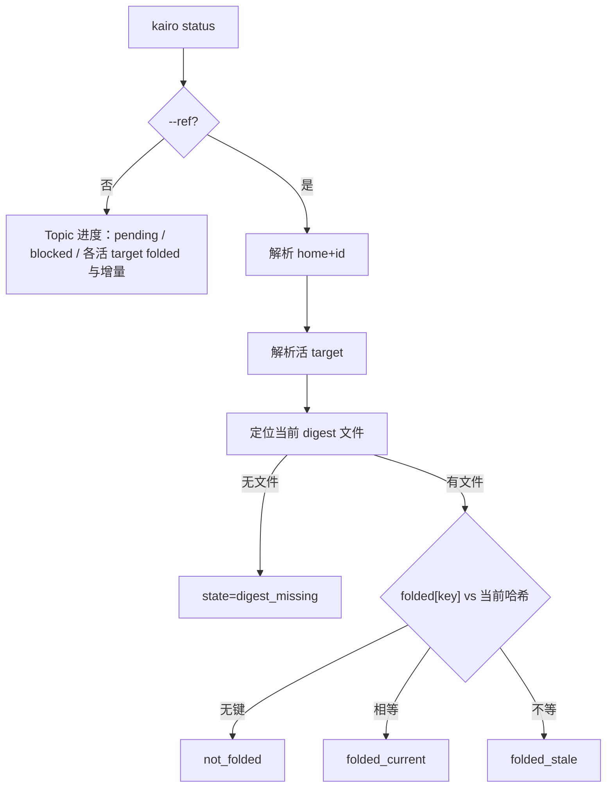

# #401 — 准确表达综合进度与单条材料融入状态

- Issue: [#401](https://github.com/xforce-io/kairo/issues/401)
- 分支: `feat/401-status-fold-progress`
- 状态: Draft（L2 · 待批准 · 不自批）
- L1: [Approved](https://github.com/xforce-io/kairo/issues/401#issuecomment-5747248628)（苏晴 2026-09-20）
- 本文件是 #401 的 **L2 事实源**。Issue 只保留摘要与本链接。未获 L2 批准前不实现产品代码。实现不得与 #402 同时改 CLI 主路径。

## 1. 背景

[#401](https://github.com/xforce-io/kairo/issues/401)。现网 `kairo status` 打印 `stale=` 与 `距上次 A 已 D 条`。`D = len(folded) - len(last_major_folded)` 是上次**全量重综合**之后已经增量融入的条数（`rules.py` 在 `full_recompose` 时刷新 `last_major_folded`），不是待处理。调用者把 4 读成落后。本票只改对外口径与 S3 核条出口，不改 fold。

## 2. 名词解释

沿用 [docs/glossary.md](../glossary.md) 的 Topic、Ref、Ref 身份键、fold、活 target、digest。本票新增（已写入名词表）：待处理、已融入、全量综合后已增量融入。

S3 `state` 闭集（仅本票 CLI，不进名词表）：`folded_current` / `not_folded` / `folded_stale` / `digest_missing`。

禁止对外把增量差叫「距上次 A」「落后」「stale」。内部代码可保留 `last_major_folded` 与注释「A」。

## 3. 目标与非目标

### 3.1 目标

与 L1 锁定一致：人读三句同时可判；`--json` 独立字段覆盖 clean / 待处理 / blocked；`--ref` 四态核当前 digest。

### 3.2 非目标

不改 fold 算法或触发条件；不自动加工；不重生成历史文档；不删 `last_major_folded` 存数；不改 Task Run；Web 不全面改版。#402 检索/读正文不在本票。

## 4. 能力

### 4.1 UI/UX

N/A。无 Console 新页。用户可见面为 CLI 人读与 JSON。

人读（无 `--ref`）须含字面量：`待处理 {n}`、`blocked {n}`；每个已生成活 target 行含 `已融入 {n}`、`全量综合后已增量融入 {n}`。未生成：`target {path}: (未生成)`。禁止未解释的 `A`。S1 样例 Topic 一次输出同时含 `已融入 6`、`全量综合后已增量融入 4`、`待处理 0`。

S3 人读恰好一句四态字面量，见 §8。

### 4.2 计数

| 对外 | 算法 | 禁止 |
|---|---|---|
| 待处理 / `pending` | `workspace_run_plan()["pending_count"]` | 用增量差冒充 |
| blocked / `blocked` | `blocked_count` | — |
| 已融入 / `folded` | `len(ts.folded)` | — |
| 全量综合后已增量融入 / `incremental_after_full_compose` | `max(0, len(ts.folded) - len(ts.last_major_folded))` | 称为欠账 |

`plan` 仍来自现网 `workspace_run_plan()["mode"]`（clean / 其它）。clean 判定对外：`pending==0` 且 `blocked==0`。

## 5. 思路与折衷

只改 CLI 出口与 Skill。放弃第二套账本、放弃 Web 改版、放弃继续印「A」。

S3 复用 compose 的 digest 键：本 Topic home 且未开 `strict_membership` 时为 `references/{id}/digest.md`；跨 home 用 Ref 身份键（与 `_all_digests` 一致）。当前文件内容哈希与 `folded[key]` 比较；无文件 → `digest_missing`，不论字典里是否残留旧键。

## 6. 架构



主路径：无 `--ref` 打印全 Topic；有 `--ref` 只核一条。  
失败路径：身份/target 无法唯一确定 → `invalid_request` 或 `not_found`，不输出成功进度字段。

## 7. 模块

| 面 | 变化 |
|---|---|
| `kairo status` | 人读措辞；`--json`；`--ref/--home/--target` |
| Skill § 输出解读 | 删除「距上次 A」；教增量≠待处理；S3 四态 |
| `tests/test_cli.py` | 不再断言「距上次 A」 |
| 功能地图 | `status-fold-progress.md` |
| compose / `folded` 写入 | **不改** |

## 8. API/CLI

无新 HTTP。根目录 / Topic 解析沿用 `--topic` 与 cwd。

### 8.1 命令

```
kairo status [--topic SLUG] [--json]
kairo status --ref ID [--home HOME] [--target PATH] [--topic SLUG] [--json]
```

规则与 L1 锁定相同：`--ref` 则不打印全表；`--home` 省略则 id 须唯一；`--home global` = global home；`--target` 省略当且仅当活 target 恰好 1 个。

### 8.2 无 `--ref` 的 JSON

字段名闭集见 L1：`ok, topic, name, pending, blocked, plan, blocked_reasons, targets[]`。`targets[]`：`path, folded, incremental_after_full_compose, status, blocked_reason`。

`blocked_reasons[]`：`scope` 为 `ref` 或 `target`；`ref` 时 `id` 为 Ref id、`path` 为 null；`target` 时 `path` 为活 target 路径、`id` 为 null；`reason` 为人读 `⚠ blocked:` 所用同一闭集字符串。

人读数字与 JSON 同义字段必须相等。人读不再出现 `stale=`。JSON **不**输出 `stale` 键。

### 8.3 `--ref` 的 JSON 与四态

```json
{"ok": true, "home": "", "id": "<ref-id>", "target": "understanding.md", "state": "folded_current"}
```

`home`：global 恒 `""`，否则 Topic slug。

| `state` | 人读字面量 | 判定 |
|---|---|---|
| `folded_current` | `当前 digest 已融入` | 文件存在且当前哈希 == `folded[key]` |
| `not_folded` | `尚未融入` | 文件存在且键不在 `folded` |
| `folded_stale` | `更新后未再融入` | 文件存在且键在 `folded` 但哈希不等 |
| `digest_missing` | `digest 未生成` | 文件不存在 |

corpus / 不参与 fold 的 class：若无 digest 键可核，按无文件 → `digest_missing`（不把「不该 fold」报成已融入）。本票不扩展第五态。

### 8.4 失败

`{"ok":false,"code":"…","error":"…"}`。成功进度字段不得出现。

| 情形 | `code` |
|---|---|
| Topic / Ref 不存在 | `not_found` |
| id 不唯一且未给 `--home`；活 target 0 或多个且未给 `--target`；`--home` 非法 | `invalid_request` |
| `--target` 不是该 Topic 活 target | `not_found` |

退出 0/1。无 `--json` 的失败走 stderr 文本 + 退出 1。

## 9. 边界

In/Out 同 issue。Skill 与 `--help` 必须同步。不改 Web status 文案（Out）。

## 10. 迁移 / 兼容 / 回滚

人读破坏性变更：删除 `stale=` 与 `距上次 A`。依赖旧字符串的脚本会失败，以本票测试替换为准。JSON 为新出口。回滚即还原本票提交。无数据迁移。不是发版授权。

## 11. 测试计划

功能地图：`.agents/skills/verify-kairo-web/features/status-fold-progress.md`。无 Console Drive。

| 层级 / 验收 | 路径 | 可判定结果 |
|---|---|---|
| E2E S1 | 已融入 6、增量 4、待处理 0 | 人读同时含「已融入 6」「全量综合后已增量融入 4」「待处理 0」；无「A」；4 不在待处理位置 |
| E2E S2 | clean / 待处理>0 / blocked>0 各 `--json` | 字段与人读一致；blocked 时 `blocked_reasons` 非空 |
| E2E S3 | 同一 Ref×活 target 四态 | `state` 与人读 1:1；`folded_stale` ≠ `folded_current` |
| Integration | Skill、`--help`、`tests/test_cli.py` | 无「距上次 A」；说明增量≠待处理 |
| Unit | 差值公式；无文件不得 `folded_current` | 不跑网络 |

## 12. 开放问题

无。L1 已锁定措辞、字段、命令、四态、身份。

## 13. 关联

- Issue [#401](https://github.com/xforce-io/kairo/issues/401)
- [#352](352-cli-title-status-members.md)
- #402 让路：本票合入或明确停手后才改 `ref find/read`
