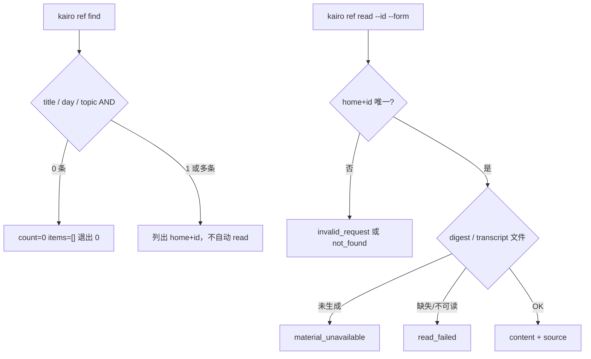

# #402 — 按标题／发生日／Topic 检索并直接读 digest 或 transcript

- Issue: [#402](https://github.com/xforce-io/kairo/issues/402)
- 分支: `feat/402-ref-find-read`
- 状态: Approved（L2 · 苏晴 2026-09-20）
- L1: [Approved](https://github.com/xforce-io/kairo/issues/402#issuecomment-5747248811)（苏晴 2026-09-20）
- 本文件是 #402 的 **L2 事实源**。#401 已合入 origin/main。本文件为实现事实源。

## 1. 背景

[#402](https://github.com/xforce-io/kairo/issues/402)。现网 `kairo timeline --day/--json` 能列 Ref（JSON 已有 `id`、`home`），但没有按标题、发生日、Topic 成员的统一检索，也没有按 home+id 读 digest/transcript 的正式入口。调用者随后 `find`/`ls` 扫盘。id 跨 home 可不唯一。

## 2. 名词解释

沿用 [docs/glossary.md](../glossary.md) 的 Ref、Ref 身份键、Topic、包含规则、Timeline、digest、transcript。本票不新增名词表条目。

CLI `--home global` 与 JSON `home=""` 表示同一 global home。禁止把 `global` 写入 JSON `home` 字段。

## 3. 目标与非目标

### 3.1 目标

与 L1 锁定：三类筛选；0/1/多条均明确；不静默取第一条；home+id 直接读 digest 或 transcript；≤3 次 CLI；失败可判别且不编造。

### 3.2 非目标

向量/语义搜索；新索引服务；自动 ASR/digest/fold；批量加工；Project 外链读取；改变 Ref 存储布局。

## 4. 能力

### 4.1 UI/UX

N/A。无 Console 新页。用户可见面为 CLI。

人读 `ref find`：一行一条 `home id title occurred_at`（global home 人读印 `global`）；零命中印 `count 0`。  
人读 `ref read`：成功打印正文；失败 stderr + 退出 1，无正文。

### 4.2 检索与读取

`ref find`：AND 过滤。标题包含匹配、区分大小写。`--day` 精确等于 occurred 日（`YYYY-MM-DD`）。`--topic` 为该 slug 的**成员**（含 global-home 打 Tag 进入者），不是 home 等于 slug。至少指定 `--title`、`--day`、`--topic` 之一。

`ref read`：按 `--id` + 可选 `--home` 定位；`--form digest|transcript`。成功 JSON 含 `content` 与 `source`（出处，不含仓库内部路径）。

## 5. 思路与折衷

新子命令组 `kairo ref`，不把 `--title/--topic` 塞进 `timeline`。数据来自现网 catalog / `topic_members` / 已登记 form 文件，不扫内部 `.kairo/state.json` 当入口。放弃：id 全局唯一、多命中取第一条、失败时用另一 form 顶替。

## 6. 架构



主路径：find（可选）→ read。失败路径不返回 `content`，不调用 step/run/re-step。

## 7. 模块

| 面 | 变化 |
|---|---|
| `kairo ref find` / `kairo ref read` | 新命令 |
| Skill | 发现材料走 find/read；禁止 find/ls 扫盘 |
| 功能地图 | `ref-find-read.md` |
| timeline 命令 | **不改**筛选语义 |
| digest/fold 引擎 | **不改** |

## 8. API/CLI

无新 HTTP。`--root` 沿用 serve root。

### 8.1 命令

```
kairo ref find [--title TEXT] [--day YYYY-MM-DD] [--topic SLUG] [--json] [--root PATH]
kairo ref read --id ID [--home HOME] --form digest|transcript [--json] [--root PATH]
```

规则同 L1：find 至少一筛；read 必填 `--id` 与 `--form`；`--home` 省略则 id 须唯一；`--home global` = global home。

### 8.2 JSON

find 成功：`ok, count, items[]`（`home,id,title,occurred_at,topics`）。`occurred_at` 未知为 `null`。`count == len(items)`。0/1/多条均退出 0。

read 成功：`ok, home, id, title, occurred_at, form, content, source{home,id,form,title,occurred_at}`。

失败：`{"ok":false,"code":"…","error":"…"}`，禁止 `content`。

| 情形 | `code` |
|---|---|
| 无筛选；`--form` 非法；id 不唯一且未给 `--home` | `invalid_request` |
| 对不上任何 Ref | `not_found` |
| 所请求 form 尚未生成 | `material_unavailable` |
| 文件缺失或不可读 | `read_failed` |

### 8.3 禁令

不把 transcript 填进 `--form digest`（反之亦然）。实现与测试中 `step`/`run`/`re-step` 次数为 0。帮助与 Skill 不写 `find`/`ls` 扫盘。

## 9. 边界

In/Out 同 issue。不改 Timeline Web。不改 #401 status。

## 10. 迁移 / 兼容 / 回滚

纯新增命令。回滚即去掉本票提交。不是发版。

## 11. 测试计划

功能地图：`.agents/skills/verify-kairo-web/features/ref-find-read.md`。无 Console Drive。

| 层级 / 验收 | 路径 | 可判定结果 |
|---|---|---|
| E2E S1 | `--title`、`--day`、`--topic` 各至少一次；0 / 1 / 多条 | 筛选生效；多条 `count>1` 且不自动 read |
| E2E S2 | 唯一命中 ≤3 次 CLI 取 digest 或 transcript | 含 `content` 与 `source`；覆盖 global 与 Topic home |
| E2E S3 | 不存在 / 未生成 / 缺失 / 不可读 | `code` 如上；无 `content`；形态不替换 |
| Integration | 上述路径 | step/run/re-step = 0 |
| Unit | AND；`--home global` ↔ `home=""` | 不跑网络 |

## 12. 开放问题

无。L1 已锁定命令、身份、字段、失败码。

## 13. 关联

- Issue [#402](https://github.com/xforce-io/kairo/issues/402)
- #401 status（让路，不混提交）
- #269 / #352；现网 `timeline --json` 的 `home`
