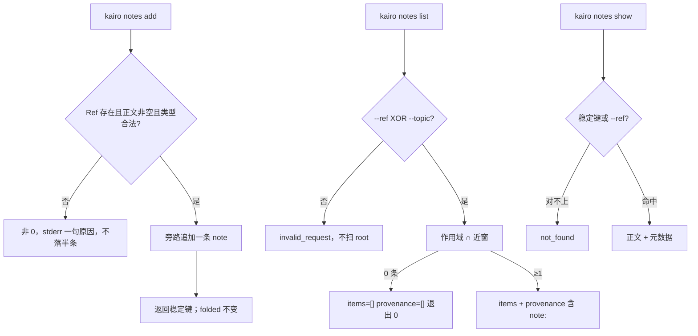

# #410 — Ref markdown notes 盖楼（洞察层）+ CLI

- Issue: [#410](https://github.com/xforce-io/kairo/issues/410)
- 分支: `feat/410-ref-markdown-notes`
- 状态: Approved（L2 · 苏晴 LGTM、周衡宣布设计通过 2026-09-21）
- L1: [Approved](https://github.com/xforce-io/kairo/issues/410)（issue `## 设计`，2026-09-21）
- 本文件是 #410 的 **L2 事实源**。Issue 只保留摘要与本链接。未获 L2 批准前不写功能代码。不混 #401 / #402 / #404。

## 1. 背景

[#410](https://github.com/xforce-io/kairo/issues/410)。Ref 已有 transcript / digest / 可选 brief，缺少人读后留下的洞察层。2026-09-21 能源线 digest 已在、understanding 未折，下游只看到 fold 计数。L1 锁定：本票只交付 Ref 级 markdown 盖楼与 CLI；Console 只读入口归 [#411](https://github.com/xforce-io/kairo/issues/411)。

## 2. 名词解释

沿用 [docs/glossary.md](../glossary.md) 的 Ref、Ref 身份键、Topic、包含规则、digest、brief、fold、已融入。

本票新增（同步写入名词表）：

| 规范名 | 一句话定义 | 禁止别称 |
|---|---|---|
| notes | 挂在 Ref 上的人写 markdown 洞察盖楼，可追加；不是 digest、不是 brief、不是 fold 产物。 | 纪要、洞察 digest、已 fold 批注 |

稳定键（仅本票 CLI / provenance，不进名词表）：`note:<ref_key>/<note_id>`。`ref_key` 与现网 Ref 身份键相同（Topic home 为 `{home}/{id}`，global home 为 `global/{id}`）。`note_id` 在该 Ref 内唯一、追加时赋予、不含 `/`。解析：去掉 `note:` 前缀后按最后一个 `/` 切开。

## 3. 目标与非目标

### 3.1 目标

与 L1 锁定：每个 Ref 可盖楼追加 markdown notes（作者、时间、类型闭集）；CLI `list` / `add` / `show`；近 48h 可列出并给出稳定键；provenance 可观察地引用 `note:` 稳定键；glossary 关系写清。

### 3.2 非目标

不替代 digest 生成；notes 不等于已 fold；追加不改变已融入计数、不自动 `step` / `compose`；本票无 Console / 富文本（见 #411）；不做编辑 / 删除 / 重排；不做全 serve root 扫描；不跑真实 compose 改写 `understanding.md`；不由 buzz-team 交付。

## 4. 能力

### 4.1 UI/UX

N/A。本票无 Console 页面。界面只读列表 / 详情 / 空态见 [#411](https://github.com/xforce-io/kairo/issues/411)。用户可见面为 CLI。

人读：

- `add` 成功：可见稳定键，随后 `list` 条数 +1。
- `list`：一行一条；零命中打印空列表且退出 0（合法范围内无 notes）。
- `show`：打印正文与作者、时间、类型、稳定键。

### 4.2 盖楼与发现

对已有 Ref（可无 digest）追加一条。类型闭集：`insight` / `decision` / `open-question` / `correction`；省略则为 `insight`。作者取本机用户名，写入时固化。时间为追加时刻（UTC，可序列化为 RFC3339）。

`list` 作用域必须是 `--ref` 或 `--topic` 之一：`--ref` 为该 Ref；`--topic` 为该 slug 的**成员** Ref（含规则，与 `ref find --topic` 同口径），不是 home 等于 slug。近窗默认相对调用时刻 48 小时，只在该作用域内过滤；`--since` 覆盖。全楼（含窗外）走 `show --ref`，不把「全部」做成 `list` 默认。

### 4.3 provenance 样例

有窗内 notes 时，只读 JSON 给出至少 1 条 `kind=note` 且 `id` 为稳定键的 provenance 条目。无 notes 时该数组为空，且任何字段都不含 `note:` 前缀引用。本票不把该条目写入 `understanding.md`，不调用 `step` / `run` / `re-step`。

## 5. 思路与折衷

洞察层独立于加工流水线：notes 是人写盖楼，digest 是机器纪要。compose 将来可以把 note 当作高于 digest 的可选输入，本票只把稳定键写进可观察的 provenance 结构，不跑综合。

CLI 组新建 `kairo notes`，不塞进 `kairo ref`（`ref` 已用于 find/read digest 与 transcript）。存数挂 Ref 旁路集合，不改 `digest.md`、不改 folded 记账。

放弃：编辑删除、富文本 GUI、有 notes 即自动 fold、全 root 扫描、本票真实 compose 端到端。近窗只做 `list` 过滤，不做搜索引擎。

## 6. 架构



主路径：`add` → `list` 条数 +1 → `show` 核对；`list --json` 读 provenance 样例。失败路径不写半条、不调用加工命令、不改已融入。

## 7. 模块

| 面 | 变化 |
|---|---|
| `kairo notes` | 新命令组 list / add / show |
| Ref 旁路存数 | 该 Ref 下独立 notes 集合；不写入 digest 文件 |
| provenance 样例 | list JSON 可观察 `note:` 条目；不跑 compose |
| `docs/glossary.md` | 新增 notes |
| 功能地图 | `ref-markdown-notes.md` |
| digest / fold / status 计数 | **不改**算法；add 后已融入不变 |
| Console | **不改**（#411） |
| `kairo ref find/read` | **不改** |

## 8. API/CLI

无新 HTTP。`--root` 沿用 serve root。

### 8.1 命令

```
kairo notes add <ref_id> --content - [--type insight|decision|open-question|correction] [--home HOME] [--json] [--root PATH]
kairo notes list (--ref REF_ID | --topic SLUG) [--home HOME] [--since RFC3339|HOURS] [--json] [--root PATH]
kairo notes show <note_stable_id> [--json] [--root PATH]
kairo notes show --ref REF_ID [--home HOME] [--json] [--root PATH]
```

规则：

- `add` / `list --ref` / `show --ref`：id 跨 home 不唯一时必须 `--home`（`--home global` = global home，JSON `home` 仍为 `""`，与 #402 一致）。
- `list` 必须恰好一个作用域：`--ref` 或 `--topic`。同时给出或皆缺 → `invalid_request`，不扫描 serve root。
- `list --topic` 不使用 `--home`。
- `--since` 省略 = 近 48 小时。纯十进制整数 = 相对调用时刻的小时数。RFC3339 = 绝对起点。非法值 → `invalid_request`。
- `show` 必须稳定键或 `--ref` 之一；`show --ref` 列出该 Ref **全部** notes（不受近窗限制）。
- `--content -` 从 stdin 读正文；空白（去首尾空白后空）拒绝。
- 三条子命令均有 `--help`。失败不写半条 note。

### 8.2 JSON

`add` 成功：`ok, stable_id, home, ref_id, type, author, created_at`。

`list` 成功：`ok, count, items[], provenance[]`。`count == len(items)`。`items[]` 含 `stable_id, home, ref_id, type, author, created_at`（可含短摘录，不含内部路径当唯一标识）。`provenance[]` 元素为 `{kind:"note", id:"<stable_id>"}`，与 `items` 一一对应；零命中两者皆 `[]`，退出 0。

`show` 单条成功：`ok, stable_id, home, ref_id, type, author, created_at, content`。`show --ref` 成功：`ok, count, items[]`（含 `content`），零命中 `count=0 items=[]` 退出 0。

失败：`{"ok":false,"code":"…","error":"…"}`，禁止当成功写入。人读失败：stderr 一句原因，非 0。

| 情形 | `code` |
|---|---|
| 缺作用域；`--ref` 与 `--topic` 同时给；空正文；非法类型；非法 `--since`；`show` 无目标；id 不唯一且未给 `--home` | `invalid_request` |
| Ref / Topic / 稳定键对不上 | `not_found` |

### 8.3 禁令

不把 notes 计入已融入。实现与测试中 `step` / `run` / `re-step` 次数为 0。不把易变路径当稳定键。不把 `list` 默认做成全历史或全 root。

## 9. 边界

In/Out 同 issue `## 设计`。无 digest 的 Ref 仍可 `add`。#411 只读 Console 依赖本票数据层，本窗口不并行实现界面。

## 10. 迁移 / 兼容 / 回滚

既有 Ref 视为零 notes：`list` / `show --ref` 成功空。无历史资料迁移。回滚即去掉本票提交；旁路集合随提交消失，digest 与 folded 不受影响。不是发版。

## 11. 测试计划

功能地图：`.agents/skills/verify-kairo-web/features/ref-markdown-notes.md`。无 Console Drive。不碰现网 serve root。

| 层级 / 验收 | 路径 | 可判定结果 |
|---|---|---|
| E2E S1 | 已有 Ref（可无 digest）`notes add`，再 `list --ref` / `show` | list 条数 +1；show 正文、作者、时间、类型、稳定键与写入一致；未给类型则为 insight |
| E2E S2 | 三子命令 `--help` 与成功路径；失败走真实子命令 | 均有帮助；空 notes 的合法 Ref：list 成功空；错：Ref 不存在 / 空正文 / 非法类型 / 缺作用域 → 非 0、一句原因、不落半条 |
| E2E S3 | 刚写入后 `list --ref --since` 显式近窗；无 notes 的 Ref 再 list | 有则至少 1 个稳定键；无则成功空 |
| E2E S3 默认窗 | 省略 `--since`（固定时钟：窗内 / 窗外各一条） | 只列出近 48h 内 |
| E2E S4 | add 前后 `kairo status` 已融入计数；读 `list --json` 的 `provenance`；无 notes 再读一次 | 已融入不变；有 note 时 `provenance` 含 `note:`；无则不含；未自动综合 |
| Integration | `--topic` list 只含该 Topic 成员 Ref 的 notes；`--ref` 与 `--topic` 同时给 | 成员过滤成立；同时给为 `invalid_request` |
| Unit | 类型闭集；稳定键解析（含 global home）；notes 不修改 folded | 不跑网络、不跑 compose |

S3 用显式 `--since` 即可判；省略 `--since` 的 48h 默认另用固定时钟覆盖一条。

## 12. 开放问题

无。L1 已锁定作用域、近窗、失败态、S4 只验 provenance。本文件钉死稳定键形态、JSON 字段与 `show --ref` = 全楼。

## 13. 关联

- Issue [#410](https://github.com/xforce-io/kairo/issues/410)
- Console [#411](https://github.com/xforce-io/kairo/issues/411)
- 身份键口径同 [#402](https://github.com/xforce-io/kairo/issues/402)
- 勿混 #401 / #404
