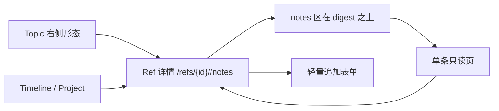
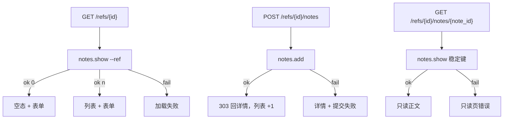

# #411 — Console：Ref markdown notes 只读入口与盖楼展示

- Issue: [#411](https://github.com/xforce-io/kairo/issues/411)
- 分支: `feat/411-console-ref-notes`
- 状态: Draft（L2 · 生产交互驳回后修订，待负责人再审）
- L1: [Approved](https://github.com/xforce-io/kairo/issues/411)（issue `## 设计`，2026-09-21；验收已按驳回三条增补）
- 本文件是 #411 的 **L2 事实源**。Issue 只保留摘要与本链接。数据与稳定键认 [#410](https://github.com/xforce-io/kairo/issues/410) / `docs/design/410-ref-markdown-notes.md`。53f312e 的交互批准已被生产驳回，以本修订为准。

## 1. 背景

[#411](https://github.com/xforce-io/kairo/issues/411)。#410 已合入 `kairo notes` 与旁路存数。Console 现有 Ref 详情（`/refs/{id}?home=`）展示 digest / Tag / 相关 Topic / 来源形态，没有 notes 盖楼。本票只补该页的可见路径与轻量追加。

## 2. 名词解释

沿用 [docs/glossary.md](../glossary.md) 的 Ref、Ref 身份键、notes、digest、fold。本票不新增名词。

页面用语：

| 用语 | 含义 |
|---|---|
| Ref 详情 | 现网 `/refs/{id}?home=` |
| 单条只读页 | 从列表点进的一条 note，无追加入口 |
| 轻量追加表单 | 纯文本/markdown 源 + 类型四选一，非富文本编辑器 |

## 3. 目标与非目标

### 3.1 目标

与 L1 / 票面：Ref 详情看见列表；点开只读正文；空/错可判；同页追加一条后列表 +1。Topic 右侧「形态」的洞察 notes 与转写/音频同一套可点行，进入该 Ref 的 notes 区后可写会话能追加。左侧点选 Ref 后右侧须有该 Ref 详情入口。notes 区密度与同页 digest 一档。数据、稳定键、add 语义认 #410。

### 3.2 非目标

完整富文本编辑器、在 Topic 页展开 note 全文、Topic 页追加表单、附件、协作光标、编辑/删除已有 note、登录身份、「点按钮的人」、替代 digest/fold、重做 CLI。public-read 不开放写入。不开新票。

## 4. 能力

### 4.1 UI/UX

**信息架构**



- 盖楼与追加只在 Ref 详情。不新增顶栏。
- notes 区在标题/元数据之后、**digest 之上**。标题「洞察 notes」。
- 列表行：类型、作者、时间、首行；点击进入单条只读页。
- 单条只读页：无表单。
- 追加入口：仅 Ref 详情。public-read 不出现。
- Topic 页：当前选中 Ref 的右侧「形态」表增加「洞察 notes」行。交互与同列「转写 / 音频」一致：整行可点（含预览），进入该 Ref 详情 `#notes`。不在 Topic 展开全文，不加表单。
- Topic 左侧点选某 Ref 后，右侧边栏必须出现该 Ref 的详情相关入口：形态预览跟随选中项；须能进该 Ref 详情页，以及进 notes 区（可与形态 notes 行合一）。不得出现「已选中 Ref 但右侧找不到进详情的链接」。

**入口线框（审查面）**

Topic 页右侧边栏「形态」（当前选中 Ref）：

```
形态
  摘要      digest.md          预览     ← 整行可点（现网）
  音频      …….m4a             预览     ← 整行可点（现网）
  转写      transcript.md      预览     ← 整行可点（现网）
  洞察 notes  3 · 最近首行……    预览     ← 须同样整行可点，进 Ref 详情 #notes
  洞察 notes  尚无洞察 notes    预览     ← 空态仍整行可点，进该 Ref notes 区；不造 Ref
```

禁止：只有「预览」文字链可点、绿框/整行点击无响应。public-read 同样可见该行，无追加。

右侧边栏在选中 Ref 后还须有进该 Ref 详情的入口（标题/身份链或等价「打开详情」），不得只剩形态文件列表而找不到详情页。

Ref 详情，从上到下（密度对齐同页 digest，禁止堆砌大框）：

```
[ 返回 ]
[ Ref 标题 / 元数据 ]

洞察 notes
  尚无洞察 notes                         ← 空态一行，不是卡片
  insight  作者  时间  首行摘要……         ← 紧凑行，点击进只读页
  decision 作者  时间  另一条……

  类型 [insight ▼]  正文 [单行/短多行输入]  [追加]   ← 一行或两行短表，按钮随内容宽度
                                                     禁止通栏厚按钮、禁止漂浮空矩形

[ digest …… ]                            ← notes 与 digest 字号/行距/边距同一档
```

空态：标题下是「洞察 notes」+「尚无洞察 notes」+ 短表，再下面才是 digest。无「去 CLI」。可写会话该页必须能追加。

单条只读页：类型 / 作者 / 时间 / 正文。无表单。

**全状态**

| 状态 | 用户看见 | 判定 |
|---|---|---|
| 列表 | notes 区列出该 Ref 全部 notes | 条数 = `kairo notes show --ref --json` 的 `count`；顺序与之相同 |
| 空 | 「尚无洞察 notes」+ 追加入口 | 不出现 digest 空文案、不出现 fold 未融入文案、无假行 |
| 只读 | 单条正文与元数据 | 与 `kairo notes show <stable_id>` 一致 |
| 加载失败 | notes 区错误，不是空态 | 与「尚无洞察 notes」可分 |
| 表单默认 | textarea 空；类型未选，提交按 insight | 四选项可见 |
| 提交中 | 按钮不可用，可见进行中 | 连点不产生第二条 |
| 追加成功 | 仍在该 Ref 详情，列表 +1，新条可见 | 可与 CLI list/show 对上 |
| 追加失败 | 留在表单；错误可判；列表条数不变 | 空正文、非法类型、请求失败分得开；不落半条 |
| public-read | 列表/空/只读可见；无表单 | POST 被拒绝 |
| Topic 预览有 | 形态区「洞察 notes」显示条数或最近首行 | 整行可点，进入该 Ref 详情 notes 区；Topic 无表单 |
| Topic 预览无 | 形态区入口仍在，文案可判尚无 | 整行仍可点进该 Ref notes 区；不造 Ref；Topic 无表单 |
| Topic 选中 Ref | 右侧出现该 Ref 详情相关入口 | 形态跟随选中；有进详情与进 notes 的链接 |
| notes 观感 | 列表与追加分区清楚 | 无堆砌大框、无通栏廉价主按钮、无漂浮空矩形；密度与同页 digest 一档 |

**布局与交互**

- 列表在上、追加在下（空态：空文案在上、短表在下）。分区用标题/间距，不用套大卡片。
- 追加：类型四选一（insight / decision / open-question / correction），未选提交为 insight；正文为 markdown 源，无工具栏、无预览；提交控件随内容宽度，禁止通栏厚按钮。输入框高度随一行到数行，禁止页面中央漂浮空矩形。
- 空正文：前端拦截 + 服务端再拒（#410 `invalid_request`）。列表不变。
- 成功：PRG 回到同一 Ref 详情，不进单条页。
- 单条页失败：note 不存在或不可读 → 错误态，不是空列表。
- Topic 形态 notes 行：整行可点，与转写/音频同一交互；只跳转、不展开全文、不在 Topic 提交。
- 不做：WYSIWYG、拖放上传、在只读页追加、把用户送去 CLI。

### 4.2 数据

只调用 #410 `list_notes` / `show_notes` / `add_note`。作者为 Console 运行进程本机用户。不新增存数。

列表展示 **全楼**（`show --ref`），不是 CLI `list` 默认近 48h。近窗发现仍走 CLI。

## 5. 思路与折衷

采纳：notes 放在 digest 之上。Topic 形态 notes 与转写/音频同一套整行可点，落地仍是 Ref 详情；追加只在 Ref 详情。观感跟 digest，不跟独立后台表单。

放弃：Topic 页展开全文或追加表单；只有「预览」文字链可点；堆砌卡片 + 通栏按钮；入口只提示 CLI；富文本编辑器；把 Console 列表做成近 48h 切片。放弃为本票引入登录用户。

## 6. 架构



主路径：Topic 形态入口 → Ref 详情 notes（在 digest 之上）→ 填表提交 → 仍在详情且 +1 → 点开一条只读。失败路径不写半条。不调用 `step` / `compose`。

## 7. 模块

| 面 | 变化 |
|---|---|
| Ref 详情模板 | notes 区在 digest 之上；含列表与表单 |
| Topic 右侧形态 | 增加「洞察 notes」预览入口（只读跳转） |
| 单条只读页 | 新页，无表单 |
| web 路由 | GET 详情带 notes；GET 单条；POST 追加 |
| `kairo.notes` | **不改契约**；页面调用现有函数 |
| public-read | 隐藏表单、拒绝 POST |
| CLI / 存数 / digest / fold | **不改** |

## 8. API/CLI

无新 CLI。无新公共 HTTP JSON。页面路由：

```
GET  /refs/{ref_id}?home=
GET  /refs/{ref_id}/notes/{note_id}?home=
POST /refs/{ref_id}/notes    字段：home, content, type（可空→insight）
```

POST 成功 303 至该 Ref 详情。失败 200 再渲染详情并带提交错误（或 4xx 后回到表单）。public-read 或校验失败不写盘。`home` 语义与现网 Ref 详情相同（`global` → 空字符串）。

## 9. 边界

In/Out 同 issue `## 设计`。无 digest 的 Ref 仍可追加。#410 近 48h 过滤不进本页列表。本窗口不发版。

## 10. 迁移 / 兼容 / 回滚

无存数迁移。回滚即去掉本票页面与路由；notes 文件仍由 #410 保留。public-read 行为与现网其它写入口一致。

## 11. 测试计划

功能地图：`.agents/skills/verify-kairo-web/features/console-ref-notes.md`。Drive **Console 真实页面**。不碰现网 serve root。不跑 step/compose。

| 层级 / 验收 | 路径 | 可判定结果 |
|---|---|---|
| E2E S1 | 有 notes 的 Ref 打开 `/refs/{id}` | 列表可见；条数/顺序 = `notes show --ref --json`；同页有轻量表单；无富文本工具栏 |
| E2E S2 | 从列表点进一条 | 正文与元数据 = `notes show`；该页无表单、无保存 |
| E2E S3 | 无 notes 的 Ref 详情 | 「尚无洞察 notes」；无假行；同页有表单；与 digest 空文案不同 |
| E2E S4 | 详情提交非空正文 | 提交中按钮不可用；成功后仍本页、列表 +1；CLI 对得上；作者为进程用户；未选类型为 insight |
| E2E S4 失败 | 空正文 / 非法类型 / 请求失败 | 错误可判；条数不变；无新 `notes.jsonl` 行 |
| E2E S5 | Topic 形态「洞察 notes」行（有/无楼） | 整行可点，与转写/音频同一交互；进该 Ref `#notes`；可写会话该页能追加；空态仍可点、不造 Ref；Topic 无表单 |
| E2E S6 | Ref 详情 notes 区对照同页 digest | 列表与追加分区清楚；无堆砌大框、无通栏厚按钮、无漂浮空矩形；密度与 digest 一档 |
| E2E S7 | Topic 左侧点选某 Ref | 右侧形态跟随该 Ref；有进该 Ref 详情的链接；有进 notes 区的链接 |
| Integration | public-read 打开同一 Ref | 可见列表或空；无表单；POST 不落盘 |
| Unit | 空态文案键不与 digest/fold 共用；类型闭集 | 不跑网络 |

## 12. 开放问题

生产交互驳回三条已写入 §4.1 与票面 S5–S7。本修订待负责人再审观感；项目经理已令同一分支继续改，不另开票。

## 13. 关联

- [#411](https://github.com/xforce-io/kairo/issues/411)
- [#410](https://github.com/xforce-io/kairo/issues/410) / `docs/design/410-ref-markdown-notes.md`
- 现网 Ref 详情 `/refs/{id}`
