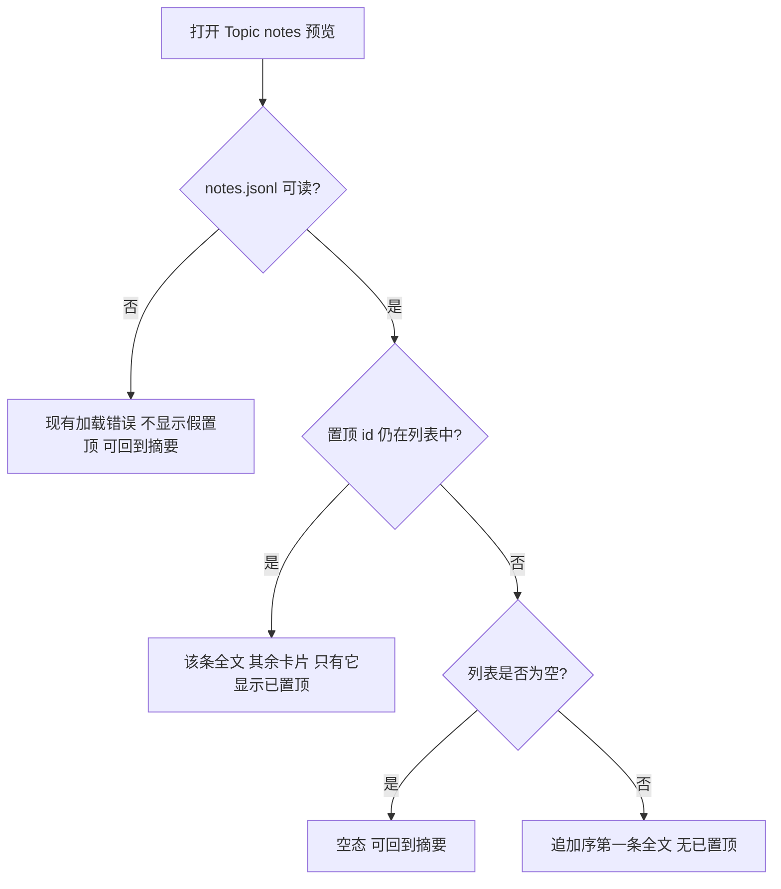
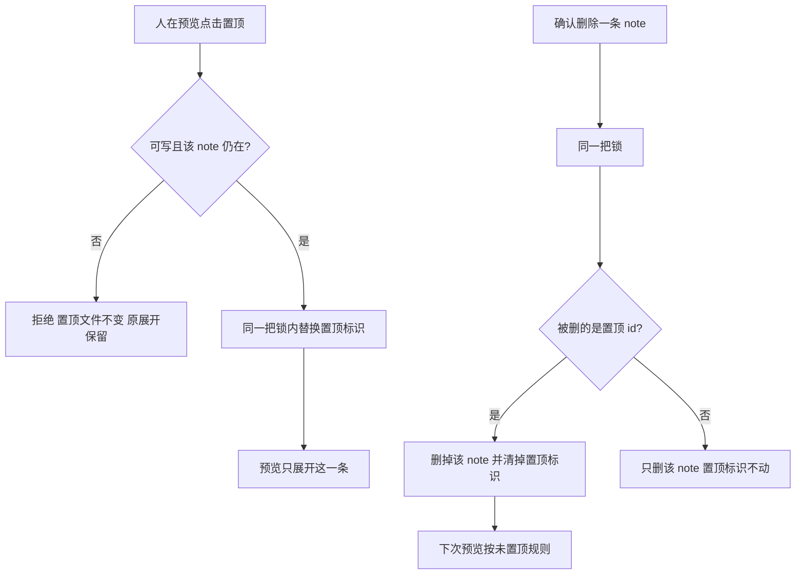

# #431 一条参考只保留一条由人设置的置顶

- Issue: [#431](https://github.com/xforce-io/kairo/issues/431)
- 分支: `feat/431-pin-one-note-preview`
- 状态: Approved（2026-09-24，苏晴「设计通过」；不需要单独的取消置顶）
- L1: Approved（2026-09-24，[评论](https://github.com/xforce-io/kairo/issues/431#issuecomment-5806551180)，已写入 Issue `## 设计`）
- 本文件是 #431 的 L2 事实源。与实现同一分支，不单独合入设计。

## 1. 背景

[#431](https://github.com/xforce-io/kairo/issues/431)。一条参考的 note 只追加在该参考目录的 `notes.jsonl`，`show --ref` 的顺序就是追加序。预览是 Topic 阅读画布 `#reader` 中的 notes 画布（`GET /w/{slug}/ref/{ref_id}/notes`）。现在每条都是约六行的卡片，没有置顶存数。没有 note 时，画布里没有回到摘要的入口。

L1 已锁定：一条参考同时最多一条由人设置的置顶；未置顶或置顶失效时展开追加序第一条；机器再生成不改置顶；删掉被置顶的那条后回到未置顶；展开项用 Markdown 全文，其余仍是卡片；没有 note 时有空态，且能回到摘要。

## 2. 名词解释

沿用 [名词表](../glossary.md) 的 Ref、note、generated、digest。本设计新增：

| 规范名 | 一句话定义 | 禁止别称 |
|---|---|---|
| 置顶 | 一条参考上由人指定、至多一条、用来决定预览默认展开哪条 note 的标识。 | 钉住、收藏、星标 |

「最早写入」不是新术语：指该参考 `notes.jsonl` 里仍存在的追加序第一条，与 `show --ref` 的顺序一致，不用 `created_at` 最小值。

## 3. 目标与非目标

### 3.1 目标

人在 Topic 的 notes 预览里显式设置至多一条置顶后，预览按 Issue 的 S1–S6 展开；未置顶、删掉置顶、没有 note 时都能单独判定。

### 3.2 非目标

- 不做票 B（主题页左侧点击参考后的默认落点）。
- 不新建预览页，不重做预览页是否可用。
- 不改 Ref 详情 `/refs/{id}` 和单条详情的卡片与六行预览，这两处不加置顶控件。
- 不加 CLI 置顶命令，不改 `kairo notes` 的输出字段与退出契约。
- 人工追加和机器生成都不自动成为置顶。
- 不改列表顺序，不把置顶那条挪到第一。
- 不增加「取消置顶」。置顶只因替换或删除该条而消失。
- 不改现有确认删除的页面流程。

## 4. 能力

### 4.1 UI/UX

只改 Topic 阅读画布里的 notes 预览。信息架构不变：形态表仍有「洞察 notes」行，点入 `#reader`；摘要仍是该参考的主预览，有 digest 时就是 digest。

预览从上到下仍是区头、可写时的短追加表、然后列表。列表保持追加序。

应展开的那一条留在原位置，正文用现有 Markdown 渲染全文，不限高，不出现「更多 / 收起」。其余每条保持现有卡片：约六行、溢出才有「更多 / 收起」、底部保留「查看详情」。展开的那一条也保留「查看详情」。

置顶标识有效时，只有这一条显示「已置顶」，且不提供再次置顶。其余每条在可写时提供「置顶」。未置顶时，包括正在展开的最早一条，可写时都提供「置顶」，任何一条都不显示「已置顶」。

public-read 不提供「置顶」。有效置顶仍显示「已置顶」，展开规则相同。

没有 note 且加载成功：保留现有「尚无洞察 notes」，并提供「回到摘要」。加载失败：保留现有错误，不显示假置顶，同样提供「回到摘要」。有 note 时不新增这个入口，回到摘要仍走形态表里已有的主预览行。

「回到摘要」把 `#reader` 换成该参考当前主预览，选择顺序与形态表现有的主预览相同：digest、transcript、source_text、prose、attachment，然后是其余可预览且不是音频的形态。有 digest 时阅读区就是 digest。没有任何可预览形态时，阅读区回到现有的空阅读区，不新造摘要文件。入口在空态和加载失败时可见、可聚焦，激活后 notes 空态或错误不再占据阅读区。激活失败时，空态或错误仍在，并可见失败，置顶文件不变。

英文界面用 Pin、Pinned、Back to summary。设置一条已不存在的 note 时，可见错误为「这条 note 已不在，置顶未改变。」英文为 “This note is gone. The pin was not changed.”

明确不做的界面：详情页置顶、取消置顶、拖拽排序、同时多条「已置顶」、主题页点击后的默认落点。

## 5. 思路与折衷

一条参考在 `notes.jsonl` 旁只保存一个置顶标识，指向一条 note 的 id。人改置顶时，在与追加、删除同一把锁里整份替换这个标识，所以同时最多一条。预览读取时：标识指向的 note 还在，就展开它；否则当作未置顶，展开追加序第一条。读路径不改文件。

放弃：

- 在每条 note 上打标记。两次写入可能留下两条标记。
- 用 `created_at` 最小值当最早写入。同一秒可以有多条，而且 `list --since` 的排序不是这个预览的顺序。
- 置顶后把该条插到列表顶部。验收只要求展开哪一条。
- 预览里每条都默认全文，或取消其余卡片的「更多」。验收要求其余仍是卡片。
- 在 Ref 详情加置顶。L1 已把设置面收在 Topic 预览。
- 新增 CLI，或在 `kairo notes show` 里增加字段。置顶只服务这块预览。
- 提供取消置顶。验收没有这条路径；替换和删除已经能离开当前置顶。

## 6. 架构

分层：置顶标识与 note 列表一起放在该参考目录，由同一把 `notes.lock` 串行化写入。Web 预览只负责选择展开项和接受人的设置。机器 note 仍只追加 `notes.jsonl`，不打开置顶文件。

设置与删除：

失败路径：

- 对不存在的 note 设置置顶：不写文件，预览保持设置前的展开，并显示 §4.1 的错误。
- public-read 或跨 Topic 的写入：拒绝，文件不变。
- 置顶文件缺失、读不出、不是对象、或 `note_id` 为空：当作未置顶。读的时候不删、不改这个文件。
- 标识指向已删除的 note：当作未置顶，预览展开追加序第一条。
- 「回到摘要」失败：阅读区仍留在空态或加载错误，并可见失败。
- 机器追加失败：沿用现有行为，不写半条 note，也不碰置顶文件。

## 7. 模块

| 模块 | 契约 |
|---|---|
| 参考目录 | 新增置顶文件，与 `notes.jsonl` 同级。追加与删除 note 的锁覆盖对这个文件的替换和清除。 |
| Topic notes 预览 | 只在这块画布做展开选择、置顶按钮和回到摘要。 |
| 机器 note | `append_generated_note` 不读取、不写入置顶文件。 |
| Ref 详情与单条详情 | 不读置顶来改变版式，不加置顶控件。 |
| CLI `kairo notes` | 输出与子命令不变。 |

## 8. API/CLI

CLI：N/A。不新增子命令，不改 `kairo notes` 的人读输出和 JSON 字段。

Web 只增加一个写动作，挂在现有预览上：

`POST /w/{slug}/ref/{ref_id}/notes/{note_id}/pin`

- 查询参数 `home` 与现有预览 GET 相同。
- 可写条件与在该预览追加 note 相同：不是 public-read，且这条参考属于当前 Topic。
- 成功：同一把锁内把置顶文件替换为只含这个 `note_id` 的对象；`#reader` 换成本次预览，只有这一条全文展开并显示「已置顶」。
- note 不在当前列表：置顶文件字节不变；`#reader` 仍是预览，展开保持设置前的选择，并显示 §4.1 的错误。
- 不可写：拒绝，置顶文件不变，不出现新的置顶标记。

已有的确认删除在删除成功时多一个同锁副作用：被删 id 等于置顶 id 时，置顶文件被移除；不相等时置顶文件不动。删除失败时置顶文件不动。不新增删除路径。

## 9. 边界

- 置顶文件路径：`<参考目录>/note-pin.json`。
- 成功写入的内容只有一个 JSON 对象：`{"note_id":"<id>"}`。`note_id` 是该参考 `notes.jsonl` 里一条现有 note 的 id。其它键读的时候忽略。
- 文件缺失、空文件、非法 JSON、顶层不是对象、`note_id` 缺失或空白：当作未置顶。
- 读预览不回写置顶文件，包括标识已悬空的情况。下一次成功的置顶会整份覆盖。
- 替换和清除都在 `notes.lock` 内完成，用临时文件替换，避免读到半份 JSON。临时文件名 `note-pin.json.tmp` 不参与读取。
- 两个预览同时设置时，后拿到锁的那次覆盖前一次，结束后仍只有一条置顶。
- 人工 `add_note` 与机器 `append_generated_note` 都不打开这个文件。
- 置顶不改变 note 正文、类型、作者、`created_at`，也不改变 Markdown 渲染器。原始 HTML 不执行。
- public-read 只按已有标识展示。
- 名词只用「置顶」。禁止钉住、收藏、星标。

## 10. 迁移/兼容/回滚

无数据迁移。已有参考没有 `note-pin.json`，预览按未置顶展开追加序第一条。`notes.jsonl` 的格式不变。

`kairo notes` 的输出不变。Ref 详情和单条详情的版式不变，因此 #411 在这两处的「不做置顶」仍然成立。本票只覆盖 Topic notes 预览。

回滚代码后，残留的 `note-pin.json` 被旧版本忽略，不删除 note，也不必随回滚删除该文件。

## 11. 测试计划

实现时新增 `.agents/skills/verify-kairo-web/features/pin-one-note-preview.md`，并在 `.agents/skills/verify-kairo-web/features/README.md` 加一行。E2E 只走 Topic 的 notes 预览，与 Issue S1–S6 一一对应。不改 `console-ref-notes.md` 的 S 编号。

| 验收 | 路径 | 可判定结果 |
|---|---|---|
| S1 | 两条 note 的预览上先后点击「置顶」，然后刷新 | 只有后一条显示「已置顶」并全文展开；前一条回到卡片 |
| S2 | 多条 note、无 `note-pin.json`，打开预览 | 全文展开的是 `notes.jsonl` 追加序第一条，没有任何「已置顶」 |
| S3 | 已置顶后，机器再追加一条 generated note，再打开预览 | 置顶文件的 `note_id` 不变；新 note 是卡片；原置顶仍全文展开 |
| S4 | 确认删除当前被置顶的 note，再打开预览 | 置顶文件不存在；展开剩余 note 里的追加序第一条；没有「已置顶」 |
| S5 | 打开已确定展开项的预览 | 展开项是 Markdown 全文，无「更多 / 收起」；其余是卡片，长文仍有「更多 / 收起」 |
| S6 | 零条 note 时打开预览，再点「回到摘要」 | 可见「尚无洞察 notes」和「回到摘要」；有 digest 时阅读区变为 digest；无 digest 时变为现有主预览，且不新造摘要文件 |

另两条保全：Ref 详情仍全部是卡片，没有「置顶」。public-read 预览没有「置顶」按钮；已有置顶时仍按该条展开并显示「已置顶」。

Integration：替换置顶后文件里只有新 id；删除被置顶 note 后文件消失，删除其它 note 后文件不变；`append_generated_note` 与 `add_note` 不改变置顶文件；悬空 id 在读取时被当成未置顶且文件仍在。

Unit：选择规则覆盖有效 id、悬空 id、非法文件、空列表。

## 12. 开放问题

N/A。L1 已锁定最早写入的口径、置顶只在 Topic 预览、以及没有 digest 时回到现有主预览。

## 13. 关联

- Issue [#431](https://github.com/xforce-io/kairo/issues/431)
- L1 评论：https://github.com/xforce-io/kairo/issues/431#issuecomment-5806551180
- 卡片预览沿用 [411-notes-markdown-preview.md](411-notes-markdown-preview.md)，只约束本预览里未展开的其余 note
- 机器 note 沿用 [423-run-ref-generated-note.md](423-run-ref-generated-note.md)，本票不改它的生成契约
- 票 B 不在本票
