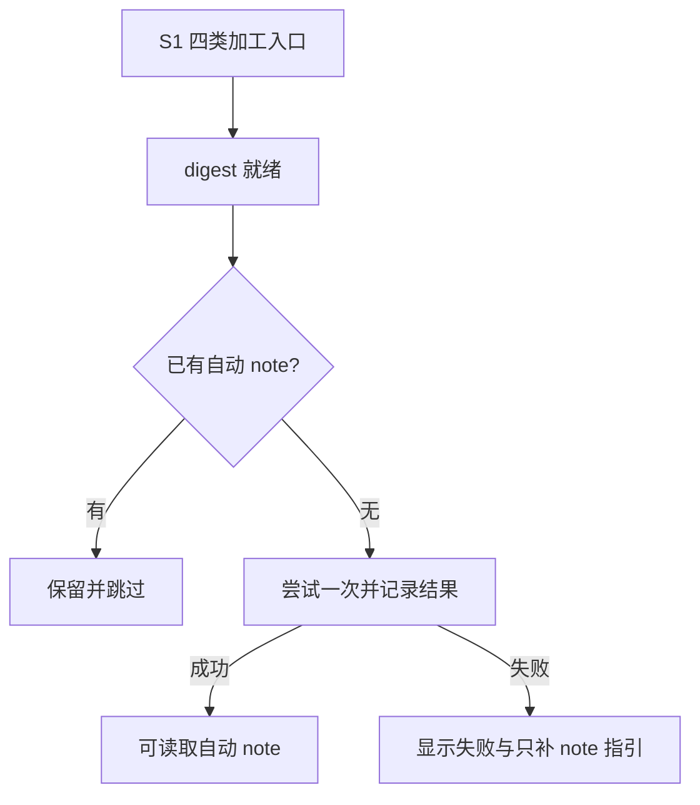
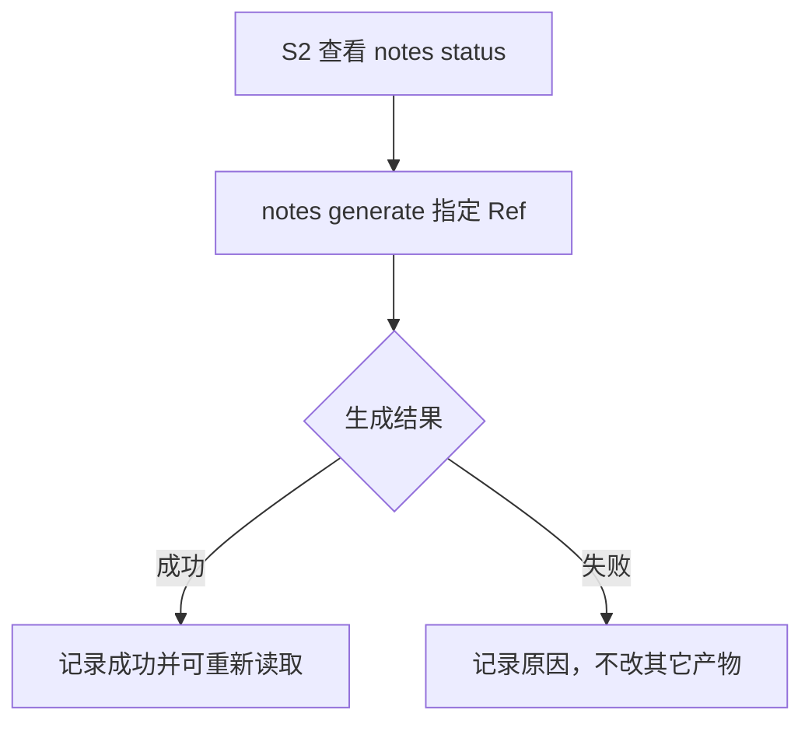
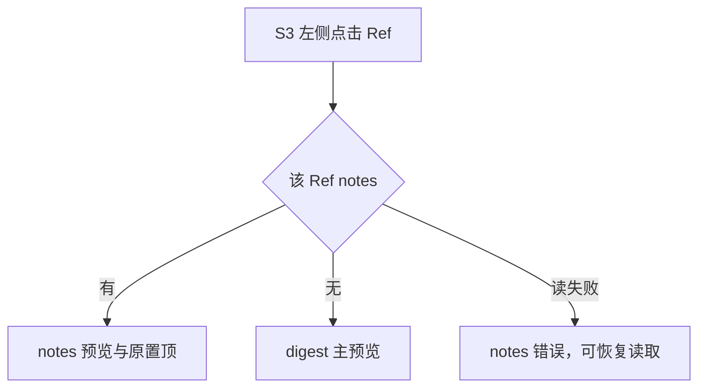
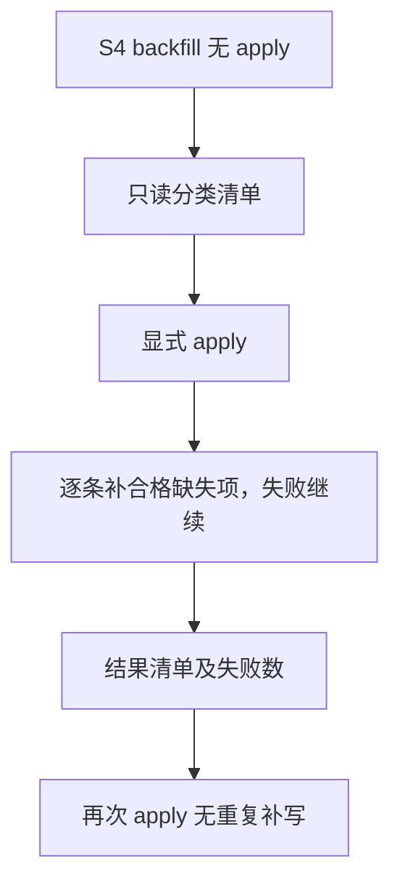

# #436 统一自动 note · L2 v1

## 1 背景

[Issue #436](https://github.com/xforce-io/kairo/issues/436)。机制依据：`engine._build_rules/step` 调和 Transform→Normalize→Digest→ReviewFold→Compose；跨 home 通过 `rules._bind_home_state` 回写实际来源。`cli.run_cmd` 另挂 note，页面 `workspace_run` 和材料重试没有该钩子。旧 `generated_note` 只读本地路径，失败只打印警告。

L1 产品基线：2026-10-01 本会话用户回答「按此范围新建 Issue，继续端到端」。确认范围：四类入口确保自动 note、保留旧 notes、逐 Ref 缺 note 默认读 digest、失败可定位和单独重试。L1 按用户 AGENTS 作为 Issue comment 提案；本文件遵守其 13 节 L2 格式，补充产品交互和验收映射，不重复详细设计到 Issue。L1: write（沿用真实会话确认）；L2: write（存储、故障恢复、公开 CLI 和跨模块责任改变）。

## 2 名词解释

沿用 [名词表](../glossary.md) 的 Ref、Ref 身份键、digest、notes、generated、置顶。新增「note 生成状态」：实际 Ref 目录内独立于 digest 与 notes 的生成尝试结果。

## 3 目标与非目标

S1–S4 保证跨入口自动 note、诊断和只补 note、逐 Ref 阅读落点、预览与显式补齐。S5–S7 发布后统一版本并恢复能源梳理数据。

不整体搬迁 Ref，不改/删已有 notes，不改变人工 note 类型、置顶、Grok low/120 秒/800 字符上限，不实现 #435 底部追加区域。已有自动 note 不因 digest 变化自动覆盖或再追加。

## 4 能力

### 4.1 UI/UX

Topic 左侧点击：该 Ref 有 notes → 原 notes 预览及有效置顶展开；没有 notes → 当前 digest 主预览（没有 digest 时沿用正文/空态）。读取 notes 失败不能伪装成无 notes，仍展示读取错误。显式 notes URL 保持空态与人工追加能力。Ref 详情和预览右栏显示 note 生成失败、进行中或未尝试；只处理 note 的公开入口是 CLI，不增加 Web 写路由。公开只读不展示生成诊断中内部信息或写入口。

CLI：`notes status --ref/--topic` 只读状态；`notes generate REF --home --root` 只确保该 Ref 的自动 note；`notes backfill --topic --root` 默认只读清单，`--apply` 显式补齐且继续其它失败项。成功输出 written/already-generated，失败非零并可读持久化原因。不得显示原始凭据错误。

交互图（每条分别映射 S1.A1–S4.A1）：

S5–S7 为既有发布和数据恢复路径，没有新增产品入口；按 §10 运维序列执行。

## 5 思路与折衷

在统一 engine 规则序列中增加 GeneratedNoteRule，复用 Ref home 绑定和公开 notes 写入；不继续在 CLI/Web 各挂回调。选择独立 `generated-note.json` 状态，避免把 notes 失败变成 digest 失败、或让重试删掉 notes。失败在同 digest 上终止自动重试，由只补 note 命令恢复；digest 变化可再尝试。取消/崩溃留下 running 状态，下次取得独占锁后可恢复。放弃自动覆盖与每次重复追加，以保全历史和避免重复费用。

## 6 架构

CLI/Web → engine 调和 → DigestRule → GeneratedNoteRule → generation 服务 → 实际 home 的 notes 与状态。批量补齐和单条只补走同一 generation 服务。Topic 仅计算成员，写入发生在 Ref 实际 home。

主路径：有效 stream digest、缺 generated → Ref 生成锁 → 再查 notes → 写 running → 1 次 Grok → 验证非空且 ≤800 → 原子追加 notes → 原子写 succeeded。

失败路径：材料 blocked/缺失/corpus → 分类跳过；模型、输出或写入失败 → failed 安全诊断；同 hash 不自动循环；命令非零退出。中断后 running 可见，恢复重新加锁；若 notes 已落盘而状态未写成功，以 notes 为事实恢复，无重复写入。不同 Ref 可正常加工，不因单项 note 失败丢失其它结果。

## 7 模块

`generated_note` 负责解析、资格、锁、模型和状态；`rules` 负责调和发现；`cli` 负责只补/清单/失败退出；`web.views/templates` 负责逐 Ref 预览与安全状态显示；`notes` 继续负责原子追加与置顶，格式不变。

## 8 API/CLI

无新 HTTP 写接口。新增 notes 子命令如 §4.1。`status` 选择恰好一个 ref/topic；Ref id 不唯一须 home；Topic 选择只来自成员规则。backfill 默认不调 provider、不写文件；apply 只有合格缺 generated 的 stream 才调用模型。JSON 含 home/ref_id/title/status/reason/generation，执行另含结果计数。诊断短文本脱敏。不提供隐式 force 覆盖。

## 9 边界

生成以 actual home+id 隔离，corpus、不成功 digest、空 digest 不生成。人工 notes 不算 generated，但必须保留。Ref 独立生成锁防止并发重复；notes 追加使用已有 notes 锁，模型等待不锁人工追加。生成失败和已有未尝试都能通过只补入口恢复；多次成功最多补一条自动 note。只综合 `--understanding-only` 不生成 notes。原有材料重新处理可重做 digest，但保留 notes 与状态文件。

## 10 迁移/兼容/回滚

无需物理搬迁。旧 notes.jsonl 不改，旧状态缺失即未尝试，已有 generated 跳过。新状态附加文件旧程序忽略。清派生产物不得删除 notes、置顶或生成状态。发布授权前保存能源梳理及 global-home 的相关文档、state、notes、生成状态和 catalog；对照哈希保全已存在产物。

发布：审查 PASS → 当前候选人审批准（公开 CLI 必需）→ CI/check → 合入 → `scripts/serve deploy` 更新 kairo-prod → `uv tool install --force` 同一生产 checkout → 120 秒内核对实际版本、模块路径、首页和 Topic、Ref 页面。失败按现有 scripts/serve 的 KAIRO_DEPLOY_REF 切回记录 SHA并同步 CLI，保留用户数据。部署需最终明确授权。

数据：能源梳理 backfill 先只读分类、保存清单，再 apply；逐项核对旧 notes 前缀未改和新 generated ≤800。运行残留先核实 PID 已死和现有 run 锁可独占再清元数据，不打断活进程。综合恢复留存旧 understanding/state，使用现有 re-step understanding.md；验证 provenance、folded 和未融入数量，失败保留旧正文。历史刚总那次若无完整日志，明确记为原因无法唯一恢复，不编造超时结论。

## 11 测试计划与 L1.8 验收

主要功能文件：`.agents/skills/verify-kairo-web/features/unified-generated-notes.md`；S3 同时保全 pin-one-note-preview 和 console-ref-notes。以下均必需；S5–S7 必须真实发布/数据验证，不能用 mock 替代。

| ID / Story | 前置与真实入口 | 可判定结果及异常/禁止结果 | 证据与依赖 |
|---|---|---|---|
| S1.A1 / S1 | scratch 本地+global stream；正式 run --ref、step、run-view --yes、retry-ref | 四类成功各补1条≤800；再次加工0条；旧notes/置顶不变 | E2E CLI原始输出和持久化哈希；确定性模型证明入口契约 |
| S2.A1 / S2 | scratch 模型失败/超时/空/801字；notes status、generate | 失败非零、状态持久化、无半条；只补恢复，其它文件哈希相同 | Integration/CLI输出、状态与哈希；模型替身可注入失败 |
| S2.A2 / S2 | 同Ref并发、running中断；重复 generate | 成功最多1条；中断可识别并恢复；敏感诊断脱敏 | Integration进程/线程与状态 |
| S3.A1 / S3 | scratch 本地/global无note，同Topic其它Ref有note；真实浏览器左侧点击 | 默认digest；有note默认预览与pin；notes读错不伪装空；公开只读无写 | 浏览器before/after截图和snapshot；HTTP仅辅助 |
| S4.A1 / S4 | scratch 混合类型；正式 backfill默认、apply、再次apply | 预览0写0模型；仅合格缺失补写；失败继续且非零；再次0条 | CLI清单、输出和哈希；模型替身 |
| S5.A1 / S5 | 合入+最终部署批准；runbook部署及版本核验 | 页面和CLI同一SHA；120秒内页面健康 | 实际模块路径/哈希、SHA、GET和浏览器证据；需真实部署 |
| S6.A1 / S6 | 能源梳理真实数据；backfill及刚总页面 | 合格缺失0、失败0；旧notes不变；残留记录安全处理 | 前后清单与哈希、页面读取、PID和锁证据；需真实模型 |
| S7.A1 / S7 | 真实能源理解文档；re-step understanding.md | 溯源有效、无阻塞、合格未融入0；失败不覆盖旧正文 | 备份、CLI status、provenance校验及fold账本；需真实模型 |

Unit：资格/状态/输出长度；Integration：并发、恢复、home解析、数据保全、Web权限；E2E：正式命令和浏览器路径。冻结候选完整项目 pytest；再次修改重跑受影响证据。真实供应商只在发布后数据恢复，验证手册禁止真实 LLM。

## 12 开放问题

产品范围已由用户确认。当前候选人审及部署授权待独立审查后取得，不由开发授权替代。外部模型失败需保留进度和诊断后继续恢复。

## 13 关联

[#436](https://github.com/xforce-io/kairo/issues/436)、#423、#433、#435。分支 `feat/436-unified-generated-notes`。S5–S7 发布记录与候选验收在 PR 及外部证据目录，设计不写执行 pass。
