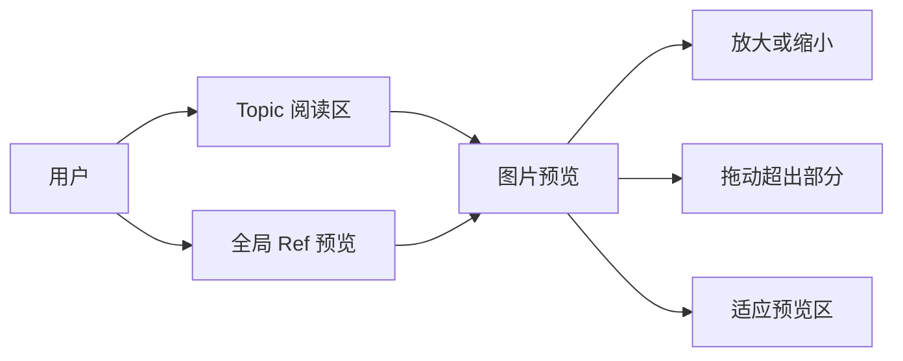
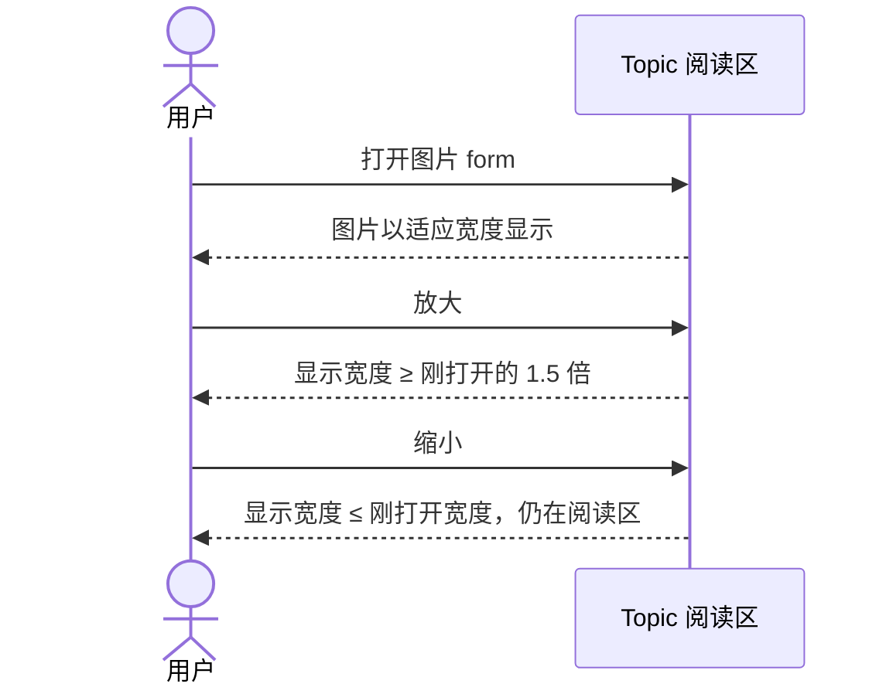
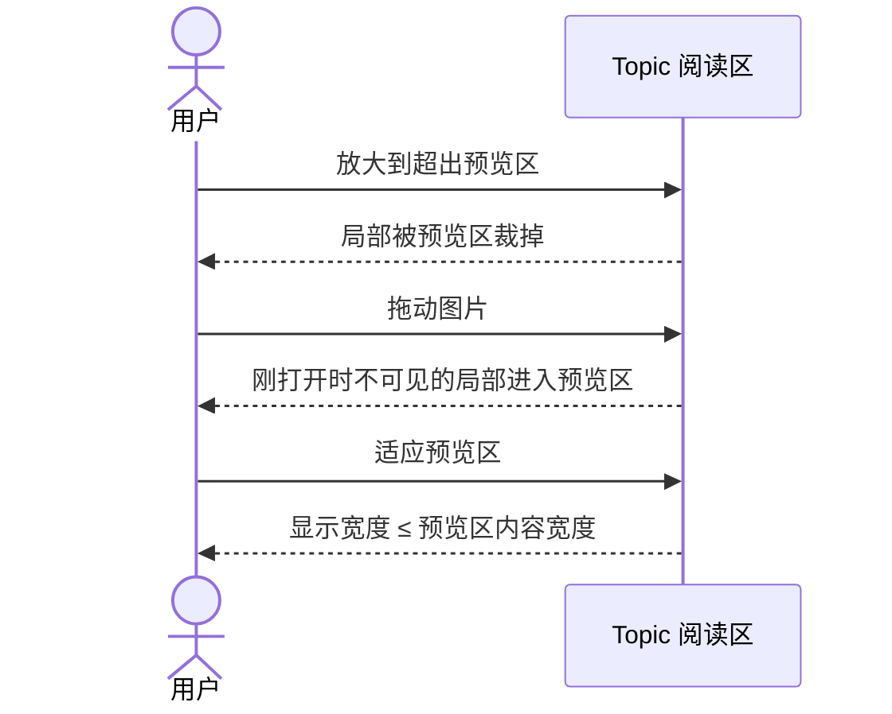

# #442 图片 form 预览可缩放并查看局部

- Issue: [#442](https://github.com/xforce-io/kairo/issues/442)
- 版本: `442-l1-v1`
- 状态: 已按确认规则采用，不自批 Approved
- 日期: 2026-10-08
- L1: write
- L2: skip

确认来源：2026-10-08 用户会话「提个 issue，图片类型的 form 在预览时（topic 中等等）提供图片预览功能，包括缩放等」，落成 [#442](https://github.com/xforce-io/kairo/issues/442) S1–S3。本次端到端目标的验收 1–3 原样采用这三条。

与用户 AGENTS 的冲突：AGENTS 把 L1 写成 issue comment 半页摘要，把 L2 写成 `docs/design/{issue}-{slug}.md`。设计合同要求完整产品设计，且 L1 不是半页摘要。本次不改 AGENTS。完整 L1 在本文件；issue `## 设计` 只留摘要和链接。没有新的接口、存储、权限或故障契约，因此不另写 L2。

名词沿用 [名词表](../../glossary.md) 的 Topic、Ref、form。不新增术语。

## 1. 背景与目标

图片 form 今天可以在控制台里打开，但只是一张按预览区宽度缩小的图片。Topic 阅读区（`/w/{slug}/ref/{ref_id}` 与 `/form/{key}`，宿主 `#reader`）和全局 Ref 的 form 预览（`/refs/{ref_id}/form/{key}`，宿主 `#form-preview`）都走 `src/kairo/web/views.py` 的 `_form_preview_html` / `_form_preview_response`，输出 ``。样式 `.doc-img { max-width: 100% }`（`src/kairo/web/static/app.css`）没有放大、缩小、平移或回到适应。可预览后缀是 png、jpg、jpeg、webp、gif、heic（`_IMAGE_SUFFIXES`）。

目标：在这两处预览里看到图片本身，并能放大、缩小、把超出预览区的局部移入视野、再回到适应预览区。画面留在原预览区，不变成听读。

## 2. 范围与非目标

In：现有可预览图片 form，在 Topic 阅读区与全局 Ref form 预览中提供放大、缩小、拖动查看超出区域、适应预览区。

前置：该 form 已是可预览图片（现有后缀，文件可被预览端点读到）。没有图片 form 时保持现有空态，不出现本控件。

非目标：

- 不新增图片格式，不为 heic 增加解码。
- 不提供裁剪、标注、滤镜、画廊或幻灯片。
- 不改变文本 form、音频听读、digest、form role 或图片加工。
- 不把公开页的原始图片字节响应改成控制台预览。公开阅读若已走同一 form 预览 HTML，会带上同一控件；那不是本票验收面。

## 3. 用户与产品概念

用户在 Web 控制台查看自己的 Topic 或全局 Ref。图片 form 是这条 Ref 上的一种可预览形态。预览区是阅读区或全局 Ref 抽屉里包住这张图的视口，不是整个浏览器窗口。

## 4. 产品交互总览

总览对应 S1、S2、S3。各 Story 的逐步交互见第 6 节，不能只用本图代替。

## 5. 信息架构与入口

不新增页面、菜单或路由。

- Topic：打开 `/w/{slug}`，选中含图片 form 的 Ref。阅读区 `#reader` 若当前不是这张图，在右侧形态列表点这张图片 form，预览换入 `#reader`。
- 全局 Ref：打开 `/refs/{ref_id}`，在形态列表点这张图片 form 的预览。抽屉 `#form-preview` 打开，不离开该页。
- 返回：Topic 仍用左侧列表换条目；全局 Ref 用抽屉关闭。缩放不导航。

没有图片 form 时，阅读区仍是现有空态或文本/听读，不出现放大、缩小、适应。

## 6. Stories 与完整交互

### S1. Topic 阅读区缩放图片

- 角色：用户
- 前置：Topic 中某 Ref 有一张可预览图片 form
- 入口：Topic 阅读区中该图片 form
- 操作：打开预览，按放大，再按缩小
- 成功：预览区显示该图片；放大后显示宽度不小于刚打开时的 1.5 倍；缩小后不大于刚打开时；留在 `#reader`，不是听读
- 异常：图片字节无法显示时，控件仍在，预览区不跳转、不变成听读；缺失文件仍是现有找不到该 form 的结果

刚打开的显示宽度是适应宽度：`min(图片像素宽, 预览区内容宽度)`，高度按比例，不把小图拉大。放大一步把当前显示宽度乘 1.5，从刚打开状态起至少达到 1.5 倍；上限是刚打开宽度的 8 倍，到顶后保持该宽度。缩小一步除以 1.5，但不小于刚打开宽度，并把平移归零。

对应 S1.A1。

### S2. 放大后查看局部并回到适应预览区

- 角色：用户
- 前置：S1 的图片像素高或宽大于预览区，放大后会超出预览区。验收用一张像素高大于预览区的图，使刚打开时下沿就在预览区外
- 入口：同一 Topic 阅读区
- 操作：放大到超出预览区，在视口内按住图片拖动，直到刚才在预览区外的局部进入预览区，再按适应预览区
- 成功：拖动后能看到拖动前不在预览区内、且刚打开时也不可见的局部；适应后显示宽度不超过预览区内容宽度，平移归零；不刷新页面
- 异常：图片没有超出预览区时，拖动不把画面拖出空白；适应仍回到刚打开宽度

对应 S2.A1。

### S3. 全局 Ref 的 form 预览同样可缩放

- 角色：用户
- 前置：同一张图片 form 出现在全局 Ref 页
- 入口：`/refs/{ref_id}` 的形态预览，进入抽屉
- 操作：与 S1 相同的放大、再缩小
- 成功：同一张图片；放大至少 1.5 倍，缩小后不大于刚打开宽度；不是听读
- 异常：与 S1 相同，宿主换成抽屉

S3 的缩放步骤与 S1 的序列图相同，宿主改为全局 Ref 抽屉。单步分支不再另画一张重复图。对应 S3.A1。

## 7. 产品规则与边界

- R1. 缩放、拖动、适应都留在当前预览宿主，不打开新页面，不使用听读界面。
- R2. 刚打开与适应后的显示宽度 = `min(图片像素宽, 预览区内容宽度)`，高度按比例。
- R3. 放大乘 1.5，上限为刚打开宽度的 8 倍。缩小除以 1.5，下限为刚打开宽度；缩回到该宽度时平移归零。
- R4. 拖动只在图片超出预览区时移动可视区域，不露出无图片的空白，不刷新页面。
- R5. 文本 form 与音频听读的预览不变。
- R6. heic 仍按现有后缀可预览；浏览器不能解码时不新增解码，控件可以在，画面由浏览器决定。

## 8. 验收与效果验证

功能文件：`.agents/skills/verify-kairo-web/features/image-form-zoom.md`。三条 Story 的主要文件都是这一份。

| ID / 关联 | 前置 | 路径 | 结果与禁止行为 | 证据 / 执行 / 属性 |
|---|---|---|---|---|
| S1.A1 / S1 / R1 R3 | Topic 内有一张可预览图片 form；控制台已打开该 Topic | Topic 阅读区打开该图片 form → 放大 → 缩小 | 看到图片本身；放大后显示宽度 ≥ 刚打开宽度的 1.5 倍；缩小后 ≤ 刚打开宽度；仍在原阅读区；页面不是听读 | 放大前后与缩小后的阅读区截图，并记下三个显示宽度。agent 在 scratch 控制台执行。必需 |
| S2.A1 / S2 / R2 R4 | 同一张图像素高大于预览区 | 在 S1 的阅读区放大到超出 → 拖动到刚打开时不可见的局部 → 适应预览区 | 拖动后该局部进入预览区；适应后显示宽度 ≤ 预览区内容宽度；不刷新 | 拖动前后与适应后的截图，记下适应宽度和预览区宽度。agent 在 scratch 控制台执行。必需 |
| S3.A1 / S3 / R1 R3 | 同一图片 form 可从全局 Ref 打开 | 全局 Ref 页打开该 form 预览 → 放大 → 缩小 | 同一张图；放大 ≥ 1.5 倍；缩小后 ≤ 刚打开宽度；不是听读 | 抽屉内放大前后截图与宽度。agent 在 scratch 控制台执行。必需 |

无后续效果观察项。

## 9. 折衷与开放问题

选择把刚打开的尺寸定为按预览区宽度适应，而不是按原始像素铺开。现有预览已经是缩小看全宽，放大是在此之上看细节。

选择拖动而不是多图画廊。本票只服务一张图里被裁掉的局部。

选择 8 倍上限，避免无限放大。S1 只要求至少一档 1.5 倍，上限不改变该结果。

放弃只改 Topic、不改全局 Ref。S3 要求两处一致，它们已经共用同一预览输出。

无未决产品问题。
