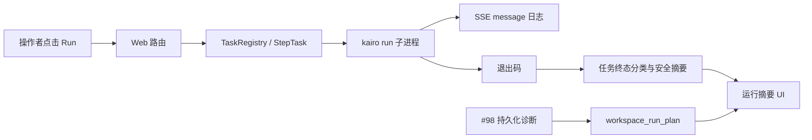
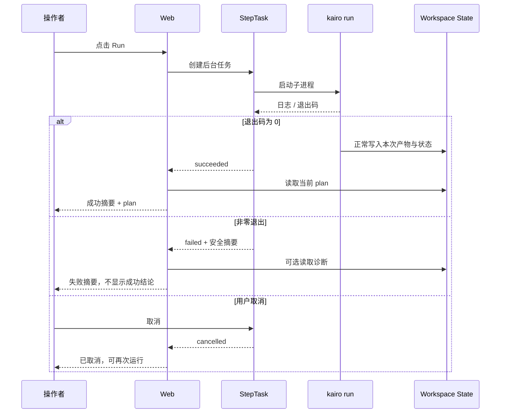

# 【Web】Run 失败时展示真实执行结果

- Issue: [#97](https://github.com/xforce-io/kairo/issues/97)
- 状态: Draft（自检已完成，待评审）
- 最后更新: 2026-07-26

## 1. 背景

Web Console 的 Run 通过后台子进程执行 `kairo run`，SSE 已携带子进程退出码。但现有结束事件无论退出码为何，都会请求同一个 `run-summary`；该摘要只依据刷新后的 workspace plan 判断是否还有 blocked。provider 或进程错误若没有已写入的 blocked state，页面便会显示“运行结束 / 无剩余阻塞”，与本次执行实际失败相矛盾。

本设计只定义 Web 会话内一次 Run 的真实终态和安全错误摘要。可跨刷新、CLI 与 Web 共用的 provider 失败诊断由 [#98](https://github.com/xforce-io/kairo/issues/98) 定义；本设计不以即时结果替代 workspace 的持久化事实。

## 2. 名词解释

| 术语 | 定义 |
|---|---|
| **任务终态** | 某个 `StepTask` 子进程结束后，对本次执行结果作出的成功、失败或取消分类。 |
| **安全错误摘要** | 从本次任务已捕获输出中提炼、脱敏并截断的可行动说明；不等同于完整 stderr 或 provider 原始响应。 |
| **运行摘要** | 任务终态与当前 workspace plan 共同构成的页面结果区域，不把后者误当成前者。 |

## 3. 设计目标与非目标

- **目标**：
  - Web 对退出码 `0`、非 `0` 和用户取消展示互斥、真实的任务终态。
  - 非零退出时保留安全错误摘要，且绝不渲染成功结论或“无剩余阻塞”。
  - 任务结束后释放运行锁、刷新 Run 按钮，操作者无需刷新页面即可再次发起允许的运行。
  - 成功结果仍可呈现当前 workspace 的 blocked/pending 信息；与 #98 的持久化诊断并列而不冲突。
- **非目标**：
  - 不将任务输出、完整异常或 SSE 日志持久化到 workspace。
  - 不负责 provider 失败的归属、持久化、自动重试或降级；这些属于 #98 或既有 Core 行为。
  - 不改变单 workspace 串行运行约束、子进程启动方式或 CLI 的退出码约定。

## 4. 能力与功能设计

### 4.1 UI / UX

Run 结果区按本次任务终态渲染：

| 终态 | 触发条件 | 必须显示 | 禁止显示 |
|---|---|---|---|
| 成功 | 子进程退出码为 `0` | “运行完成”及当前 plan 的待办/blocked 摘要 | 失败或取消结论 |
| 失败 | 退出码非 `0`，且不是用户发起的取消 | “运行失败”、安全错误摘要、退出码，以及可再次运行的入口 | “无剩余阻塞”或任何成功结论 |
| 取消 | 用户触发取消且子进程已终止 | “已取消”、可再次运行的入口 | 成功结论；不得将取消伪装为 provider 失败 |

运行日志仍按现有 SSE `message` 事件逐行显示。结果区域只消费 `done` 事件携带的终态数据；其内容不得依赖浏览器按日志文本猜测成功与否。失败摘要位于结果区域，刷新当前页面前保留，下一次 Run 的结果可替换它。

### 4.2 结果优先级

本次任务终态优先于刷新后 workspace plan：

1. `failed` 或 `cancelled`：先呈现该终态和摘要；可附带当前 plan 作为补充，但不输出成功措辞。
2. `succeeded`：才依据当前 plan 显示已完成、仍有 blocked 或新增待办等收敛结果。
3. task 不存在或结果尚未就绪：保持运行态或给出可辨识的任务不可用提示，不能回退为成功。

## 5. 设计思路与折衷

### 5.1 选择退出码作为即时任务事实源

选择在 `StepTask` 收集到子进程结束后，用退出码和取消意图归类本次任务。退出码是这次 Web 发起的进程唯一完整的终态信号，能够覆盖 state 写入前崩溃、provider 异常与 CLI 启动后的非零退出。

放弃仅从 `workspace_run_plan()` 推断结果。它描述的是刷新时 workspace 的待办/阻塞，不表示刚刚执行的进程是否正常结束；失败未能写 state 时会造成成功假象。

### 5.2 选择有限摘要而非原样暴露日志

选择由服务端从已缓冲的最后有效错误行提取、单行化、脱敏、长度受限的摘要。完整日志继续只作为本次页面的运行日志，不能被当作稳定错误 API。

放弃将 stderr、URL、环境变量或 provider 原始报文直接嵌入结果区。它们可能包含凭证、请求上下文或敏感材料，且既不稳定也不适合操作决策。

### 5.3 选择任务结果与持久化诊断分层

选择 #97 处理“这次点击是否失败”，#98 处理“哪个工作项在刷新后仍可诊断”。两者可以在一个结果区同时出现，但不相互写入或相互推断。

放弃把 `StepTask` 扩展为失败状态的持久化来源。其生命周期仅在 Web 服务内存中，服务重启和 CLI 入口均不可见。

## 6. 架构设计

### 6.1 逻辑分层

- **任务层**：持有取消意图、退出码和受限日志缓冲；它只表达一次任务的事实。
- **摘要层**：根据任务终态决定成功/失败/取消文案，再选择性读取 workspace plan；不得反向覆盖任务结果。
- **Core 状态层**：继续提供 plan 和 #98 的诊断；不依赖 Web task 或 SSE。

### 6.2 核心业务流程

## 7. 模块设计

| 模块 | 职责与边界 |
|---|---|
| `web/tasks.py` | 记录退出码、取消意图和受限日志；生成包含结构化终态的 done 事件或可查询任务结果。 |
| `web/templates/_step.html` | 在 done 后请求对应 task 的结果摘要；不把任意 done 事件视为成功。 |
| `web/views.py` | 将任务终态、摘要和 workspace plan 合成为结果 HTML；失败和取消优先。 |
| `web/i18n.py` / CSS | 提供成功、失败、取消和错误摘要的双语可访问文案与区分样式。 |
| Core / #98 | 仅提供 plan 与持久化诊断，不读取或写入 `StepTask`。 |

## 8. API / CLI 设计

不新增公开 CLI 命令或外部 HTTP 资源。现有 Web 协议在任务内部扩展：

| 入口 | 变更后的契约 |
|---|---|
| `GET .../stream` 的 `done` 事件 | 传递能区分成功、失败和取消的结果标识；不得只让客户端把任意完成事件当成功。 |
| `GET .../run-summary` | 接收或按 task id 查询本次已结束任务；输出与该任务匹配的摘要，而非只读 workspace plan。 |
| `POST .../cancel` | 标记用户发起的取消；待子进程真正结束后显示取消终态。 |

安全摘要的逻辑字段为 `kind`、`message` 与可选 `exit_code`；它们只用于本次页面呈现，既不承诺原始日志保真，也不写入 `.kairo/state.json`。

## 9. 边界考虑

- **错误**：进程无法启动、非零退出、SSE 断连与任务查询缺失都必须显示非成功结果。浏览器 SSE 断连不应改变服务端任务的真实终态。
- **取消**：只有服务端确认由用户取消的任务才归为取消；外部信号或异常终止仍按失败处理，并保留退出码。
- **并发**：既有每 workspace 一个运行任务不变；只有任务确认结束后按钮才恢复可用。
- **安全**：摘要须去除 Authorization、API key、环境变量值、完整 prompt/正文和 provider 原始 JSON；日志缓冲保持现有上限。
- **兼容**：退出码为 `0` 的既有成功路径继续显示 plan；没有 #98 实现时，失败页面仍能如实显示即时失败。
- **性能**：不增加子进程、provider 调用或持久化写入；摘要只处理已有的受限日志缓冲。

## 10. 迁移 / 兼容 / 回滚

- **迁移**：无 workspace 数据迁移；任务结果是服务进程内短暂状态。
- **兼容**：旧页面若未携带 task id 或旧任务已被回收，显示明确不可用提示，不能渲染成功摘要。
- **回滚**：回退 Web 代码不会破坏 workspace；仅失去更准确的即时呈现，#98 的持久化状态仍可独立读取。

## 11. 测试计划

- **E2E**：
  - 令 `kairo run` 非零退出且不写 blocked state；页面最终显示失败和安全摘要，绝不显示“无剩余阻塞”，Run 按钮可再次触发。
  - 成功运行后显示成功摘要；若 state 中仍有 blocked，显示其数量而不误称完全成功。
  - 用户取消长运行任务后显示取消，并可再次启动任务。
- **Integration**：SSE done 的成功、失败和取消分别驱动对应摘要；#98 已写入诊断时，失败结果同时可见即时摘要和持久化工作项信息。
- **Unit**：退出码/取消意图到终态的映射；错误摘要的选行、脱敏、截断；`run-summary` 对任务缺失、失败、成功的渲染分支。

## 12. 开放问题 / 决策记录

- **决策**：退出码是本次运行成功与否的唯一判定依据；plan 仅为收敛后的补充状态。
- **决策**：取消采用“用户请求 + 子进程已结束”的双条件，避免把仍在退出中的任务提前标为终态。
- **开放问题**：安全摘要的具体脱敏模式需结合各 provider 的错误样本用单元测试固化；原始错误不得作为兼容回退。

## 13. 关联

- Issue: [#97](https://github.com/xforce-io/kairo/issues/97)
- 持久化 provider 诊断：[#98](https://github.com/xforce-io/kairo/issues/98)
- 相关模块：`src/kairo/web/tasks.py`、`src/kairo/web/views.py`、`src/kairo/web/templates/_step.html`、`src/kairo/web/i18n.py`
