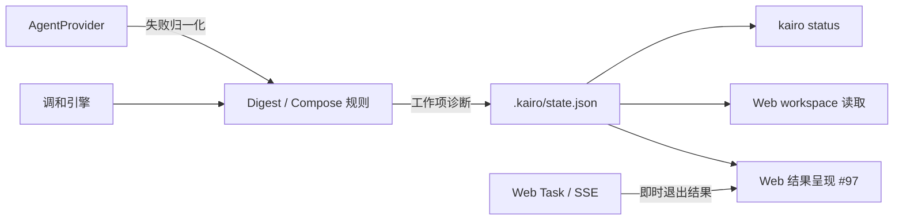
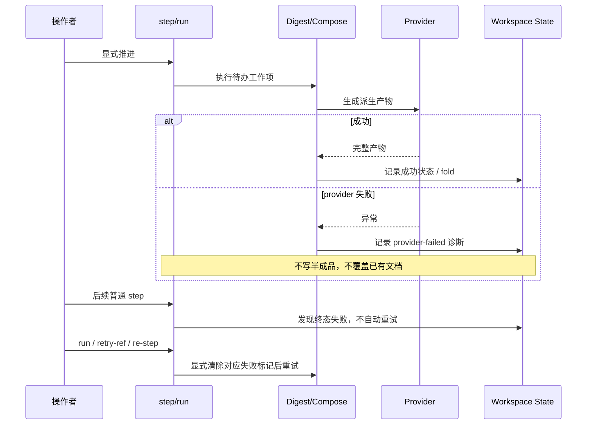

# 【Core】持久化 LLM provider 失败并支持诊断

- Issue: [#98](https://github.com/xforce-io/kairo/issues/98)
- 状态: Draft
- 最后更新: 2026-07-26

## 1. 背景

Kairo 的 Digest 与 Compose 依赖可替换的 LLM provider。provider 在请求、响应解析或产物读取阶段失败时，当前调和循环以异常退出；本次 Web 任务可在 SSE 中短暂输出报错，但 `.kairo/state.json` 不留下失败归属。刷新 Web 或执行 `kairo status` 后，操作者只能看到 stale，无法判断失败发生在何处、是否能安全重试。

本设计为可归属到 Digest 或 Compose 工作项的 provider 失败定义持久化诊断与恢复语义。即时任务退出码和页面错误呈现由 [#97](https://github.com/xforce-io/kairo/issues/97) 负责；本设计不以 Web 会话内存作为事实源。

## 2. 名词解释

| 术语 | 定义 |
|---|---|
| **工作项** | 调和循环发现并执行的最小派生单元；本设计涉及某条 reference 的 Digest，或某个 target 的 Compose。 |
| **provider 失败** | provider 请求、响应解析、或约定产物读取未成功完成而无法产出本次工作项结果的异常。 |
| **持久化诊断** | 写入 workspace state 的、可跨 CLI/Web/服务重启读取的失败阶段、对象、provider 与安全摘要。 |
| **安全摘要** | 面向操作者的有限诊断信息；不包含密钥、完整 prompt、原始响应、文件正文或未处理的异常文本。 |

## 3. 设计目标与非目标

- **目标**：
  - Digest / Compose provider 失败后，state 能定位失败对象、阶段、provider 与安全摘要。
  - `kairo status` 与 Web 刷新后从同一 state 解释失败，不依赖一次性 stderr 或 SSE 缓冲。
  - 普通 `step` 不重复调用已记录的 provider 失败；用户显式运行既有恢复入口后才重试。
  - 重试成功后清除对应失败诊断并正常 fold；失败时更新诊断但不损坏已有产物。
- **非目标**：
  - 不定义 provider 自动切换、退避重试或配额恢复策略。
  - 不保存完整 provider 原始错误、请求上下文或调用审计。
  - 不处理无法归属到工作项的进程启动、Web 任务或 CLI 自身失败；这些由 #97 的即时任务结果处理。
  - 不改变 ASR / doc2text 已有的 `no-asr`、`asr-failed`、`convert-failed` 等失败语义。

## 4. 能力与功能设计

Core 向所有读取 workspace 的入口提供以下能力：

1. 当 Digest 失败时，显示该 reference 的 `digest` 阶段失败；当 Compose 失败时，显示对应 target 的 `compose` 阶段失败。
2. 诊断信息跨刷新、Web 服务重启和 CLI 重开持续存在。
3. 用户可通过已有的显式恢复入口推进：reference 失败可重试该 reference 或运行 workspace；target 失败可运行 workspace 或重算该 target。恢复成功后对应诊断消失。
4. 无失败的既有 workspace 与调用方式维持当前行为。

### 4.1 UI / UX

N/A。本 issue 不定义 Web 的即时运行结果组件、SSE 呈现或页面交互；它只提供供 CLI 和 Web 读取的 Core 状态。即时失败呈现见 #97。

## 5. 设计思路与折衷

### 5.1 选择工作项级 state，而非 Web 任务内存

选择将失败绑定到 Digest product 或 Compose target 并写入 workspace state。失败对象是调和模型的一部分，只有该位置能在不同入口、不同进程间稳定定位并决定重试范围。

放弃仅保存 Web `StepTask` 的 stdout/退出码：任务是进程内短期对象，服务重启、刷新页面或 CLI 调用后即丢失，且不能说明哪个 pipeline 工作项未完成。

### 5.2 选择规范化安全摘要，而非原始异常持久化

选择持久化阶段、provider 标识和经过规范化、截断、脱敏后的摘要。摘要应说明可判别的类别（例如传输请求失败、provider 返回错误、未得到约定产物），但不能成为原始异常或请求内容的镜像。

放弃原样写入 provider 错误：provider 报文、URL、请求上下文或异常文本可能携带凭证、用户数据或提示词，且不同 provider 格式不稳定。

### 5.3 选择显式恢复，而非普通 step 自动重试

选择把 `provider-failed` 视为终态：普通 `step` 保持收敛，不反复消耗 LLM 调用；用户显式执行 `run`、`retry-ref` 或 `re-step` 才会重试。

放弃在每次 `step` 自动重试：短暂网络或上游故障会造成无边界调用、页面看似持续运行，并掩盖应由操作者处理的 provider 问题。

### 5.4 前后端边界

Core 只定义并写入诊断状态，不引用 Web、SSE、HTML 或某个 provider 的私有错误结构。Web/CLI 只读取规范化状态，不需要解析异常文本或判断 provider 类型。#97 仍以任务退出结果呈现“本次运行是否失败”；两者通过 workspace state 的只读契约协作，而非相互调用。

## 6. 架构设计

### 6.1 逻辑分层

- **Provider 层**：保持“成功返回约定产物 / 失败抛出”的通用边界；不负责持久化。
- **规则层**：将可归属的 provider 异常映射为工作项级诊断；不得写入半成品或覆盖既有成功产物。
- **引擎与状态层**：将失败后的 state 正常落盘，确保失败工作项在普通 `step` 中不被立即重复执行。
- **消费者层**：CLI 与 Web 读取同一诊断；Web task 结果只是本次调用的补充信息。

### 6.2 核心业务流程

关键失败路径是 provider 在产物落盘前失败：state 必须仍能保存诊断；本次工作项不产出 digest 或新 target 内容；其它无依赖的待办可按既有调和顺序继续处理，但不得把失败工作项视为已成功。

## 7. 模块设计

| 模块 | 职责与边界 |
|---|---|
| `provider` | 输出可归类的失败信息给调用者；不写 workspace state，不暴露 provider 私有原文为持久化契约。 |
| `rules` | 在 Digest/Compose 工作项边界捕获 provider 失败，生成规范化诊断，保持既有成功产物不变。 |
| `models` / `workspace` | 承载并序列化 product/target 的失败诊断；旧 state 缺失该字段时兼容读取。 |
| `engine` | 识别 `provider-failed` 为终态；在显式恢复入口下按对象范围解除失败标记并调和。 |
| `cli` / `web` | 只读展示诊断与既有恢复入口，不解析 provider 原始错误，不向 Core 传递 UI 状态。 |

## 8. API / CLI 设计

不新增外部 HTTP API 或 CLI 命令。既有命令的状态契约扩展如下：

| 入口 | 契约 |
|---|---|
| `kairo status` | 对失败 reference 或 target 输出 `provider-failed`、阶段、provider 与安全摘要；不再只以 stale 表达该对象。 |
| `kairo step` | 遇到已记录的 `provider-failed` 时不自动重试；其它可推进工作保持既有规则。 |
| `kairo run` | 作为显式全工作区恢复入口，重试可恢复的 provider 失败，并保留已有文档直到对应工作项成功。 |
| `kairo retry-ref <id>` | 作为 reference 级恢复入口，重新生成该 reference 的派生产物及后续可推进内容。 |
| `kairo re-step <target>` | 作为 target 级显式重算入口，适用于 Compose 失败后的目标文档。 |

### 8.1 持久化状态契约

产品或目标的失败状态应包含以下逻辑字段：

| 字段 | 语义 |
|---|---|
| `status` | `blocked`，表示该工作项未完成且普通 `step` 不自动重试。 |
| `reason` | `provider-failed`，用于稳定的程序与人读分类。 |
| `diagnostic.stage` | `digest` 或 `compose`。 |
| `diagnostic.provider` | 参与本次失败调用的 provider 标识。 |
| `diagnostic.summary` | 已脱敏、单行、长度受限的安全摘要。 |

诊断字段为可选，以兼容历史 state 和既有失败 reason。`summary` 不承诺 provider 原始错误逐字保真；它是面向恢复决策的稳定人读信息。

## 9. 边界考虑

- **幂等与并发**：同一 workspace 的运行继续由现有串行任务约束；同一失败工作项在未显式恢复前不得在一个 `step` 循环中重复调用 provider。
- **部分失败**：失败不写 digest 或新 target 内容，不生成成功快照；已有 `understanding.md` / `assessment.md` 必须保留。依赖失败 target 的下游 target 不得基于半成品推进。
- **错误处理**：只在能归属到 Digest/Compose 的 provider 失败时记录本设计状态。不可归属的进程级错误维持非零退出，由 #97 呈现。
- **安全**：state、CLI 和 Web 都只输出安全摘要；禁止保存 API key、Authorization、完整 prompt、原始 provider JSON、用户健康正文或文件路径之外的敏感上下文。
- **性能**：失败记录不得触发额外 provider 调用；状态读写仅增加小型元数据。
- **兼容**：保留既有 ASR/转换失败 reason；不将历史 stale 推断为 provider-failed。

## 10. 迁移 / 兼容 / 回滚

- **迁移**：state 诊断字段为可选，历史 workspace 无需迁移；首次发生新失败时按新契约写入。
- **兼容**：读旧 state 时缺失诊断按“无 provider 诊断”处理；现有成功状态和既有 blocked reason 行为不变。
- **回滚**：移除新版本后，旧版本应忽略未知可选诊断字段；已经失败的 workspace 仍可通过现有 `retry-ref` / `re-step` 恢复。若旧版本不能识别 `provider-failed`，应以状态无法自动推进而非静默覆盖的方式保守处理。

## 11. 测试计划

- **E2E**：
  - 模拟 Digest provider 失败后，刷新 Web 和执行 `kairo status` 均显示 reference、`digest`、`provider-failed` 与安全摘要；普通 `step` 不再次调用 provider。
  - 模拟 Compose provider 失败后，原 target 内容保持不变；显式恢复成功后该 target fold 新 digest 且诊断消失。
  - 对已记录 provider 失败执行 `run` / 对 reference 执行 `retry-ref` / 对 target 执行 `re-step`，分别验证其规定范围的恢复结果。
- **Integration**：对 Grok、OpenAI-compatible、Claude Code、Codex 等 provider 的异常入口使用同一 Core 诊断契约；CLI 与 Web 从同一 state 得到一致的阶段和摘要。
- **Unit**：诊断序列化兼容旧 state；异常到 `provider-failed` 的归一化；摘要脱敏、单行化与长度限制；失败→显式重试→成功的状态转换。

## 12. 开放问题 / 决策记录

- **决策**：本期只覆盖 Digest 与 Compose。Normalize/prose 及进程级任务失败不纳入本状态契约，避免把不同生命周期和恢复范围混为一类。
- **决策**：`run` 是工作区级显式恢复入口；不引入自动 provider fallback。
- **开放问题**：安全摘要允许暴露到何种 provider/网络错误类别，需在实现前以测试样例固化脱敏规则；不得以保存原始异常作为兜底。

## 13. 关联

- Issue: [#98](https://github.com/xforce-io/kairo/issues/98)
- 即时 Web 任务结果：[#97](https://github.com/xforce-io/kairo/issues/97)
- 相关模块：`src/kairo/provider.py`、`src/kairo/rules.py`、`src/kairo/engine.py`、`src/kairo/models.py`、`src/kairo/cli.py`
