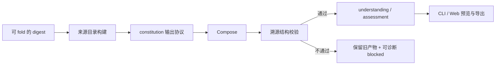
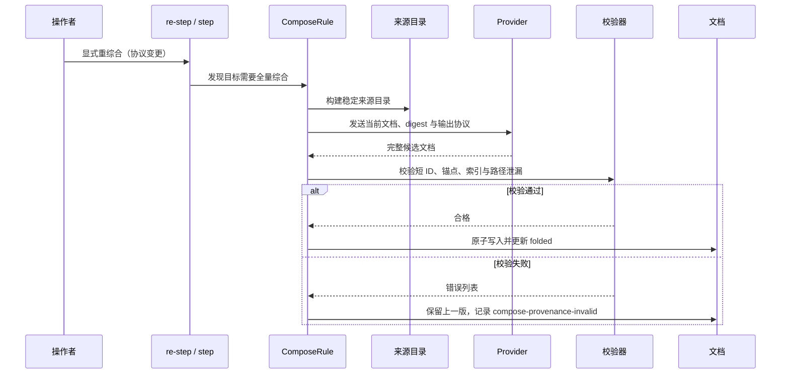

# 【文档输出】优化事实与判断文档的溯源呈现

- Issue: [#99](https://github.com/xforce-io/kairo/issues/99)
- 状态: Draft（自检已完成，待评审）
- 最后更新: 2026-07-26

## 1. 背景

Kairo 目前把每个 digest 的完整相对路径写为正文内的 `[来源:references/<ref>/digest.md]`。这使来源最直接，但在多来源的 `understanding.md` 与 `assessment.md` 中反复出现长路径，连续阅读被打断；判断层也重复承受事实层的原始溯源负担。

本设计在不丢失对具体 digest 的可追溯性的前提下，定义紧凑、可验证的文档溯源协议。它改变的是 Compose 生成的长期用户可读输出，而非原始 reference、transcript、digest 或 provider 行为。

## 2. 名词解释

| 术语 | 定义 |
|---|---|
| **来源短 ID** | 由 workspace 中稳定 reference id 确定的文档内标识，例如 `S-a1b2c3`；它在同一 workspace 内可重复生成，并在来源索引映射到唯一 digest。 |
| **章节证据范围** | 一个章节整体依赖的去重来源短 ID 集合，放在章节开头而非每段重复路径。 |
| **关键声明** | 数字、单源事实、待核专名、冲突信息，或承载判断依据的事实；它需要句末短标识或事实锚点。 |
| **事实锚点** | `understanding.md` 中为关键事实设置的稳定标识，例如 `F-a1b2c3-01`，供 `assessment.md` 的判断引用。 |
| **来源索引** | 文档末尾由短 ID 到 reference 标题与具体 `digest.md` 的链接映射；它是完整路径的唯一常规展示位置。 |

## 3. 设计目标与非目标

- **目标**：
  - 多来源章节以章节证据范围和必要的短标识表达溯源，正文不反复展示完整 digest 路径。
  - 任一关键结论可从短 ID 或事实锚点跳转至来源索引，并定位到具体 digest。
  - `assessment.md` 优先引用 `understanding.md` 的事实锚点，避免重复堆叠原始来源。
  - 来源 ID、索引和正文引用可由 Compose 输入确定性生成，并在写入前校验；协议变更通过重综合更新，而不是手工替换历史正文。
- **非目标**：
  - 不删除 digest、reference 或原始材料，不建设独立证据数据库。
  - 不声称来源能证明超出 digest 内容的事实，也不自动解决材料间的事实冲突。
  - 不改变 digest 的生成、reference id、provider 选择或调和引擎的增量调度语义。
  - 不为每一句普通归纳强制制造伪精确引用。

## 4. 能力与功能设计

### 4.1 UI / UX

`understanding.md` 与 `assessment.md` 是主要界面；Web 的 Markdown 预览和导出沿用这些文档内容，无需新增页面。输出遵循以下结构：

```markdown
## 订单履约

证据范围：〔S-71af02〕〔S-c82d9e〕

当前流程由……构成。关键时限为 24 小时〔S-71af02〕。
单一来源称某接口已下线，待核〔S-c82d9e〕。

<a id="F-71af02-01"></a>履约时限为 24 小时〔S-71af02〕。

## 来源索引

| ID | 材料 | 可核对来源 |
|---|---|---|
| S-71af02 | 访谈 A | [digest](references/2026-07-01-interview-a/digest.md) |
| S-c82d9e | 需求说明 | [digest](references/2026-07-02-requirements/digest.md) |
```

- 章节只有在引用了 digest 时才出现“证据范围”；范围按短 ID 去重且按 ID 排序。
- 关键声明使用 `〔S-…〕`；普通、由本章节范围共同支持的叙述不逐句标记。
- 待核项和冲突项必须带短 ID；数字与单源事实也必须带短 ID。
- `assessment.md` 的判断以 `〔依据：F-…〕` 链接到 `understanding.md` 的事实锚点；只有无法经过事实层表达的例外证据才直接使用 `S-…`，并在索引中说明原因。

### 4.2 来源目录与 ID

Compose 在每次生成前构建只读来源目录。每条可 fold 的 digest 产生一个来源记录：

| 字段 | 语义 |
|---|---|
| `source_id` | `S-` 加由 reference id 计算的短哈希；发生碰撞时固定增加哈希位数，不能按本次列表序号重排。 |
| `ref_id` | workspace 的稳定 reference 主键。 |
| `title` | manifest 当前显示标题；仅作人读说明，不参与 ID。 |
| `digest_path` | 相对 workspace 的唯一 digest 路径；只在索引中链接展示。 |
| `digest_hash` | 本次 Compose 读取的内容版本，用于现有 fold 记账和验证。 |

来源目录随本次输入传入输出协议；模型不得自行发明 `S-…`。新增 reference 只新增 ID，不重编号既有来源；标题变化只更新索引显示名。

### 4.3 事实层与判断层协议

| 文档 | 主体引用规则 | 索引规则 |
|---|---|---|
| `understanding.md` | 章节范围 + 必要的 `S-…`；可供判断引用的关键事实加 `F-…` 锚点。 | 输出完整来源索引。 |
| `assessment.md` | 每项判断优先用 `F-…` 链接到事实层；直接 `S-…` 仅用于无法经事实层表达的例外，并标明原因。 | 输出“依据事实索引”，把 `F-…` 映射到事实层锚点和其 `S-…`；若有直接来源，再输出本地来源索引。 |

事实锚点从“短 ID + 该来源下的出现序号”派生；同一次全量重综合中，相同关键事实必须复用同一锚点。锚点的稳定性面向文档内导航而非跨内容语义去重：材料或表述实质变化后允许由重综合产生新的锚点。

## 5. 设计思路与折衷

### 5.1 选择稳定短 ID + 末尾索引，而非每段完整路径

选择将“正文中的阅读标记”与“可打开的具体路径”分离。短 ID 让正文在视觉上保持连续，索引让评审者仍能一跳到达 digest。

放弃保留每段的完整文件路径。路径直接但属于存储实现细节，重复出现时既降低可读性，也让判断层重复事实层的同一信息。

### 5.2 选择内容派生 ID，而非动态编号

选择从稳定 reference id 派生短 ID，并以确定性扩展处理碰撞。新增、删除或排序来源时，既有来源仍保留相同标识。

放弃 `S1`、`S2` 等按本次来源列表编号的方案。它更短，但一次新增或删除就会使已有阅读链接与审阅记录失效。

### 5.3 选择判断层引用事实层，而非双层复制原始来源

选择 `assessment.md` 用事实锚点表达判断依据，读者可沿“判断 → 事实 → digest”回溯。这样保留判断与证据的区别，也避免两篇文档同时堆叠相同路径。

放弃让 assessment 对每个判断重复所有原始 digest。它把两层的职责混在一起，增加噪声，且判断变化时易与事实层的来源演进不一致。

### 5.4 选择协议校验 + 显式重综合，而非手工替换

选择由 Compose 生成完整文档并在写盘前验证 ID、索引、锚点与路径泄漏。协议不合格时保持上一版文档，标记可恢复的 Compose 输出问题，并由显式重综合重新生成。

放弃对旧文档执行正则批量替换。旧路径缺少章节、关键声明和判断依据的语义，自动替换会制造无法审计的伪引用。

## 6. 架构设计

### 6.1 逻辑分层



- **来源目录构建**：从现有 digest、manifest 与稳定 ref id 生成，只提供数据，不改材料。
- **constitution 输出协议**：向 Compose 声明章节范围、短 ID、事实锚点、索引和禁止正文路径的规则。
- **校验器**：验证结构性可追溯性，不判断业务事实真假或语言质量。
- **消费者**：CLI、Web 和导出都读取同一生成文档，不维护第二份溯源索引。

### 6.2 核心业务流程



## 7. 模块设计

| 模块 | 职责与边界 |
|---|---|
| `models` / `workspace` | 提供来源目录所需的 manifest/ref id/digest 元数据；不新增独立证据库。 |
| `rules.ComposeRule` | 构建来源目录、将协议加入 Compose persona/context、在写入目标前调用校验器。 |
| provenance 校验器 | 校验 ID 格式、引用可解析、索引覆盖、事实锚点与正文路径泄漏；不解析或评价 LLM 的业务结论。 |
| constitution 默认协议 | 声明两层文档的引用格式和关键声明规则；配置哈希变化应触发现有全量重综合路径。 |
| `engine` / `cli` / `web` | 复用现有 `re-step`、状态展示和 Markdown 渲染；不实现手工批量迁移。 |

## 8. API / CLI 设计

不新增外部 HTTP API 或 CLI 命令。既有入口的契约变化如下：

| 入口 | 契约 |
|---|---|
| `constitution.targets[].fold_protocol` | 默认协议增加来源目录、章节范围、关键声明、事实锚点和索引规则。 |
| `kairo re-step <target>` | 是旧文档升级到该协议的显式全量重综合入口；不得用文本替换模拟升级。 |
| `kairo status` / Web | 当候选输出未通过校验时显示 `compose-provenance-invalid` 及安全、可行动的摘要；不覆盖上一版。 |

校验必须满足：

1. 每个 `S-…` 都在本次来源目录和文末索引中存在，索引链接指向同一 digest。
2. 每个章节证据范围只包含本章节实际使用或声明的来源，且去重排序。
3. 数字、待核、单源与冲突关键声明均有 `S-…`；`assessment.md` 的判断有可解析 `F-…`，或明确标注直接来源例外。
4. `F-…` 在事实层存在并可追至至少一个 `S-…`。
5. 除来源索引链接外，正文不含 `references/.../digest.md` 完整路径。

## 9. 边界考虑

- **可追溯性**：短 ID 只在当前 workspace 文档集合内有意义；复制单个 Markdown 文件时需连同来源索引和事实层一并保留。
- **冲突与待核**：短 ID 不消除不确定性；冲突双方、待核声明均必须显式标明各自来源。
- **兼容**：历史文档继续可读；只有显式重综合或配置变更触发的全量重综合才采用新协议。旧状态不得被猜测性改写。
- **失败与回滚**：校验失败不覆盖现有文档，保留旧的 `folded` / 输出哈希；用户修正协议或 provider 后显式 `re-step`。回滚恢复的历史文档也保持原格式，下一次显式重综合才迁移。
- **性能**：来源目录和校验均只遍历本次 Compose 已读取的 digest 与生成文档；不增加 provider 调用或独立存储扫描。
- **安全**：索引只链接 workspace 相对 digest 路径；不写外部绝对路径、原始材料位置、凭证或 provider 交互内容。

## 10. 迁移 / 兼容 / 回滚

- **迁移**：升级 constitution 默认输出协议后，操作者对 `understanding.md`、`assessment.md` 显式执行 `re-step`，每次均从当前完整 digest 集生成；不对已有正文批量修改。
- **兼容**：读取旧 workspace 时允许旧路径格式继续存在；新校验只作用于宣告使用新协议的目标。来源 ID 由 ref id 派生，因此重综合后可稳定复现。
- **回滚**：使用既有 history 回滚文档与 target state；若回到旧协议，旧文档照常展示。任何新协议校验失败都不会破坏最后一版有效文档。

## 11. 测试计划

- **E2E**：
  - 对含多条 digest 的 workspace 重综合两层文档；正文不重复出现完整 digest 路径，章节范围和来源索引可定位每个关键数字、待核项和冲突来源。
  - 在 assessment 中从一个判断跳至 `F-…`，再从 understanding 的索引打开对应 digest。
  - 新增 reference 后重综合，既有短 ID 保持不变，新来源增加唯一 ID；删除后不存在悬空引用。
  - provider 输出缺少索引或捏造来源 ID 时，旧文档不被覆盖，状态给出可重试的校验错误。
- **Integration**：Compose context 中的来源目录与 `folded` digest 集一致；Web Markdown 预览与导出保留锚点和相对链接；配置协议变更走全量重综合。
- **Unit**：ref id 到短 ID 的稳定性及碰撞扩展；来源目录排序/去重；关键声明与章节范围的结构校验；`F-…` 到事实层和 `S-…` 的解析；正文路径泄漏检测。

## 12. 开放问题 / 决策记录

- **决策**：短 ID 从 stable ref id 派生而非按列表编号；标题不影响 ID。
- **决策**：判断层的默认溯源入口是事实锚点，直接原始来源仅是明确标注的例外。
- **决策**：本期以结构校验保障“可到达”，不以程序判断自然语言主张是否真的被该 digest 支持。
- **开放问题**：事实锚点的语义去重与跨版本永久稳定性不在本期承诺；需要真实工作区样本验证后，才决定是否扩展为独立的事实模型。

## 13. 关联

- Issue: [#99](https://github.com/xforce-io/kairo/issues/99)
- 相关模块：`src/kairo/rules.py`、`src/kairo/models.py`、`src/kairo/workspace.py`、`src/kairo/engine.py`、`src/kairo/web/views.py`
- 相关输出：`constitution.yaml`、`understanding.md`、`assessment.md`
